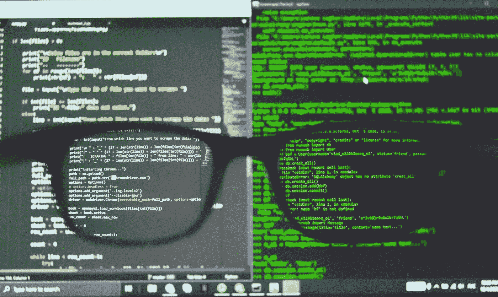

# 数据科学职业转换:硕士值得吗？(第二部分)

> 原文：<https://towardsdatascience.com/data-science-career-switch-is-masters-degree-worth-it-part-2-1110c3440e4b>

## 意见

## 在计划职业转换之前要学习的编程语言和要问的三个问题

亚历克斯·丘马克在 [Unsplash](https://unsplash.com?utm_source=medium&utm_medium=referral) 上的照片

这是我上一篇文章的延续，上一篇文章主要关注我的背景、数据科学宣传以及对学习模式的回顾。如果你还没有，就去看看吧。

 [## 数据科学职业转换:硕士值得吗？

### 第 1 部分:学习模式(在线与物理)

towardsdatascience.com](/data-science-career-switch-is-masters-degree-worth-it-d2d23e87b3de) 

在这篇文章中，我将讲述:

1.  要学习的编程语言
2.  转行从事数据科学之前要问的三个问题

# 应该学什么编程语言？

当我在 2020-2021 年攻读企业商业分析硕士学位时，教授的主要语言是 R，尽管同样的课程也是使用 Python 进行的。事实上，这两种语言非常适合数据争论，并且有许多用于机器学习的库。对我来说，学习它们并不太难，因为我在本科学习时上过一些编程课(C 和 C++)。Python 和 R 的语法并不难学。

然而，当我在新加坡找工作时，绝大多数数据科学家的职位都要求精通 Python，而不是 R 编程。所以我觉得对于一个学习时间有限，又想快速转行到数据科学的人来说，最好的选择就是学习 Python。不要忽视 R(我认为它对于快速和良好的可视化非常有用，并且有许多很好的统计库)，但是业界似乎更倾向于采用 Python。

说了这么多，我觉得最需要学习的语言不是 Python 或者 r，是 SQL。

是的，SQL。可惜我报的课根本没教 SQL。SQL 对于从数据库中获取数据是必不可少的，它是将表转换成正确格式的一种非常好的快速方法。它不花哨，但却必不可少。使用 SQL 可以最有效地完成大量的描述性分析、报告和数据争论。

# 我应该如何转行到数据科学？

做这件事有许多方法。这也取决于很多因素，比如你想多快改变，你能负担多少钱，甚至你愿意付出多少努力。

在决定读全日制硕士的前一年，我参加了 DataCamp 的在线课程。这是由 20 门课程组成的[数据科学家课程](https://app.datacamp.com/learn/career-tracks/data-scientist-with-python?version=2)，我只完成了一半。我学了一点 SQL 和 Python，但看起来还是很基础的。然而，它帮助我确认了我对数据科学的兴趣，这也是我决定注册硕士学位课程的因素之一。

硕士课程包括数据可视化/讲故事、数据辩论、机器学习、大数据和 NLP 课程，其中有几个动手小组项目。然后，我成功地转换了职业，毕业后找到了一份数据分析师的工作。

但是，这只是一条路径，不一定推荐给所有人。还有许多其他方式，如参加为期 3 个月的密集数据科学训练营(如[大会](https://generalassemb.ly/))，在非全日制基础上攻读硕士学位，甚至只是从在线课程中自学，然后在你足够自信时申请工作。

如果我必须给考虑转行的人提建议，我会问以下问题:

## 你的目标是什么？

如果你的目标只是进入数据科学领域，或许是做一名数据分析师，我认为没有必要攻读硕士学位。还有其他更实惠、更有针对性的学习方式。可能也不需要机器学习概念，拥有实用的 SQL 和 Python 技能就足够了。

然而，如果你想获得数据科学家或机器学习工程师的职位，我强烈建议你攻读硕士甚至博士学位。不管怎么说，很多工作也把它列为要求。

## 你想多快达到目标？

如果你想尽快改变，也许参加训练营是最好的选择。三个月，你可能会实现你的目标。然而，如果你想保持缓慢，参加非全日制学位或在线课程将是理想的。

## 你愿意牺牲什么？

我们不可能拥有一切，一如既往，有些东西是需要牺牲的。在这种情况下，它类似于从三个选项中选择两个:金钱、时间和技能。

如果你选择金钱和时间，牺牲技能，那么训练营将是一个不错的选择。(这是一个合乎逻辑的相对比较，并不怀疑任何训练营)。

如果你选择金钱和技能，牺牲时间，那么非全日制硕士学位将是一条出路。你不会放弃薪水，你会有一个良好的基础和实践技能，但你会在大约 2 年的时间里忙于工作和学习。

如果你选择时间和技能，牺牲金钱，那么全日制硕士学位将是一条出路。放弃薪水，你可以在获得扎实技能的同时快速毕业。

## 那么，值得吗？

我选择了时间和技能。我想让我的职业转换更快。然而，我也想从工作中抽出一点时间，做些其他我没有时间做的事情。最大的缺点是财务上的机会成本。放弃一年的薪水，再加上学费，无疑会带来沉重的经济负担。但是，钱不是万能的，对吗？

 [## 通过我的推荐链接加入 Medium-Nathan Timothy Handoko

### 作为一个媒体会员，你的会员费的一部分会给你阅读的作家，你可以完全接触到每一个故事…

nathanthandoko.medium.com](https://nathanthandoko.medium.com/membership) 

查看我的其他文章:

 [## 每个人都必须知道的 7 个数据可视化最佳实践

### 以更有效的方式传达你的故事

towardsdatascience.com](/7-data-visualization-best-practices-everyone-must-know-b68ebe329b1e)  [## 文字云中的圣经

### 只需点击几下鼠标，即可获得圣经的主题概述

medium.com](https://medium.com/illumination/the-bible-in-word-clouds-6a7dc3bb38ab) 

加入我的电子邮件列表，每当我发布新帖子时都会收到通知！
[https://nathanthandoko.medium.com/subscribe](https://nathanthandoko.medium.com/subscribe)