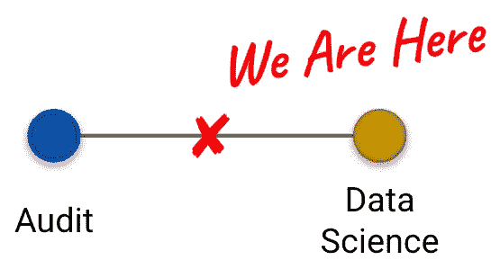

# 数据科学从审计抽样中获得更多见解

> 原文：<https://towardsdatascience.com/data-science-draws-more-insights-from-sampling-2d9b95a7d6a9>

## 增强审计样本的有用性

作者图片

作为审计人员，我们都面临的一个经常性问题是，通过审计一个通常来自更大人群的事件样本(“控制属性抽样”)，得出控制措施有效性的结论。如果这让你想起神秘的采样表，比如控制频率和扩展的采样标准，你并不孤单。幸运的是，我们今天不会谈论这些。相反，我想重点讨论如何将数据科学应用于审计问题，以显著提高审计中控制属性抽样的决策质量、规模和影响。

## 目录

*   [达成共识](#b29c)(定义)
*   [质量更好的意见](#2682)(统计推断)
*   [自动化&秤审核员判断](#251e)(监督机器学习)
*   [诊断&修复审核员判断错误](#5297)(描述性统计&多名评审员注释)

# 达成共识

一个简短的题外话:术语。因为我们正在将更多定量学科与审计学科之间的流合并，我们需要对事物的定义保持清晰，因为同一个词在每个领域可能有不同的含义，其他的可能完全陌生。我们将尽最大努力规范这些词的更精确的形式，原因将随着我们的继续而变得清楚。请随意跳过细节，只需根据需要返回这里。

在本讨论中,**控制**是一种自动、手动或混合机制，旨在预防、检测或监控业务流程中的一些风险事件。相比之下，在数据科学&统计中，控制是一个基线，我们可以用它来比较过程中某些干预的结果。

一个**观察**是你正在测量(“测试”)的事物的一个单一事件。用审计术语来说，这可能是一项交易或一个事件。令人困惑的是，美国审计师有时也把观察结果称为“样本”，而它们是样本的一部分(见下文)。我们也可以称不符合我们测试标准的交易为“观察”。

一个**总体**是每个观测值的集合。

**样本**是从总体中抽取的观察值的一部分(或一个百分比)。这不是(见上文)从一个样本的单一观察。事实上，如果你告诉你的数据科学朋友你提取了 25 个“样本”，他们可能会认为你提取了 25 组 *n* 观察值。

一个**参数**是关于整个群体的一个可测量的事实。例如，如果你在一个电子表格中有一个账户的每一个日记账条目，你就可以计算出各个成本中心过账的数量。然而，在许多情况下，我们不能直接测量总体参数，这就是为什么我们从总体中抽取一个样本来计算…

一个**的统计**。基于证据和推理的关于总体的结论。

**不确定性**就是不确定地知道。每次我们产生一个统计数据(见上文)，我们都在不确定的情况下操作，因为我们不可能 100%确定仅仅基于一个样本的感兴趣的总体参数的真实值。在统计学领域，我们试图通过各种方法来量化这种不确定性，其中一些我们将在以后详细讨论。

一个**标签**是一个观察的注释。通常用于阐明我们感兴趣的重要类别或类型区别。例如，审计员可能会标记样本中的每个观察结果，以指示它是否通过了基于他们的过程的 _testing(真或假),或者内容审查员可能会将图像样本中的每个图像标记为 has_cat 或 not。

一个**多标签**问题是每个观察值有不止一个可能的标签可以应用于它。这通常也是我们希望能够预测新观察的每个标签的值。在这里，将每个属性结论看作是它自己的标签(而不仅仅是整个观察的通过/失败的集合)是有帮助的。

**另一方面，多类**问题是一个标签可以采用多个固定类别值中的任何一个。同样，有能力预测一个新的观察可能有什么价值。与其说是通过/失败，不如想象一个标签(称为一致性)来描述订单与其相关合同的一致性程度。合理的值可能包括完全符合、部分符合或不符合。有趣的是，你可能会发现许多问题最初被框定为多标签、多类别。一般遇到这些首先要做的是 1。恐慌和 2。将它们重组为更简单的问题(通常更符合你感兴趣的实际风险)。

**分类**是将观察结果归类到一个标签内的几个标签或类别中的一个的过程。例如，[该视频](https://www.youtube.com/watch?v=uwmeH6Rnj2E)可以使用值为 1(真)的标签 is_cat 进行分类。

**回归**包括预测连续变量的值(例如:序列中下一个对等事务的值)。这个术语的定义过于一般化。在统计学中，回归指的是更具体的东西。在机器学习中，它经常被用来指预测一个数字的实践(相对于预测一个标签的值)。

# 更高质量的意见

我们将统计应用于控制属性抽样的最直接的好处是能够产生描述控制有效性的统计，同时清楚我们意见的不确定性和误差范围。换句话说，对于给定的控制，我们可以对总体中的最大或估计的可能异常率做出统计上有效的结论。它也有一个很好的特点，如果 5 个审计人员可以在一组假设上达成一致，他们应该能够基于对 5 个不同样本的观察独立地得出关于控制有效性的相同结论。

> **真实(审计员)对话:**这就是“控制似乎没有有效运行”与“控制的估计最大总体错误率在 95%的置信水平下为 16%，这超过了我们 10%的审计容差；因此，这种控制似乎没有有效运作”。希望这很清楚为什么我们希望能够发布后一种观点而不是前一种观点。

为了产生在理想条件下有用的足够窄的估计值，样本量通常符合 AICPA 指南(见下文)。基于不同样本大小估计总体误差 rate⁵上限的快速 simulation⁶显示，需要大约 35 次通过观察才能得出总体误差不超过 10%的结论。我们也看到在 100 次左右的观察后，回报迅速减少。

当然，这在现实世界中是可以改变的，在现实世界中，我们可能会遇到一些异常。如果我们在 35 次观察中发现了 3 个例外，我们的总体误差估计上限将是 23%。如果我们将样本扩大到 85 个观察值，并且没有发现更多的例外，那么我们的估计值将下降到 10%。

鉴于我们能够提供这种程度的透明度和对结论的信任，它可能会回避这样一个问题:如果专业人员在历史上根据我们在没有所有 Statistics⁴的样本中观察到的情况得出了关于控制有效性的结论，为什么还要麻烦呢？在这里，我们可以讨论 80 年代末企业采用自动化的变化，以及 90 年代会计监管环境的相应变化，高级分析技术和工具的民主化，大数据的爆炸，大专科学和工程人才库的稳定增长，或者温赖特在 1908 年对 T 型车提出类似的问题。

相反，我会注意到，如果你在做重要的决定，而你希望这些决定基于证据和推理，你可能应该使用统计学，毕竟统计学是改变你想法的科学。这样做，我们可以增压控制属性抽样，以提高审计意见的质量和精度。

# 自动化和规模化审计判断

虽然能够做出更好的控制属性结论本身是令人信服的，但事实证明，审计团队在样本测试期间生成的标记数据还有许多其他用途。其中一个更吸引人的中心是在有监督的机器学习应用中使用这些标签；使我们不仅可以根据样本观察值和总体误差的上限得出结论，还可以根据总体中的每个观察值得出结论。实际上，自动化控制属性测试。

根据美国注册会计师协会的审计指南(以及我自己对公共会计专业人士的非正式调查，不管有没有价值)，对于超过 250 个观察点的人口，审计样本量通常在 25 到 60+之间。虽然在高端，即使这些样本大小也可能对审计构成后勤挑战——特别是如果一次审计需要几个样本的话——但它们仍然远远不能满足在其他领域产生高性能机器学习模型的需要。尽管如此，在自动化控制测试的影响不成比例的情况下(例如:更高的风险控制)我们可以采用一些策略来产生足够的标记观察值，以开始变得有用。具体来说:

*   将测试目标从多类、多标签分类问题重新构建为二元分类(或回归)问题。这减少了每个类/标签需要的例子数量。
*   使用数据分析和试探法来部分自动化测试，减少审计时间，或者更有用的是，腾出更多时间来:
*   扩大样本量。
*   应用上采样、下采样和合成数据生成来平衡类别并生成更具普遍性的示例。
*   使用主动学习来得出对分班模型最有用的观察结果。
*   样品高效测试和验证的交叉验证。
*   关注正确的绩效指标。准确性很少对任何实际问题有用，因此了解控制测试的背景以及失败在现实世界中的真正含义对于选择正确的指标进行优化至关重要。

我们可以看到，这实际上是在合成数据集上运行另一个 simulation⁶，该数据集具有包含不平衡二进制类的单个感兴趣标注。换句话说，我们试图在一个虚构的数据集上预测一个通过/失败(真/假)的结论，其中只有 15%的样本观察是例外。使用逻辑回归模型和交叉验证，我们可以看到，当我们将样本量扩大到 200 个观察值时，平均模型精度稳定在 90%左右。

在这里，我将再次警告不要盲目地使用准确性来评估模型的有效性。用一个常见的比喻来说:如果美国运输安全管理局简单地拒绝任何人登机，他们就会 100%准确地防止飞行中的争吵。相反，我们应该让控制的性质和未能识别异常的具体后果来决定我们优化哪些指标。基于问题、模型架构和任务，监督机器学习的适当样本大小也可能有很大不同，因此在这里，您将进行实验，并建立如何处理各种上下文的直觉。

# 诊断和修复审计人员的判断错误

我们还可以重新利用审计样本进行反思，以更好地了解我们的团队如何得出结论(从而发现错误、改进机会或更有效的方法来得出所述结论)，或者可测量地提高基于共识的结论的质量。

为了理解我们的审计团队的决策过程，我们可以将控制测试结论(或单个属性级别的结论)建模为测试时团队可用的所有输入的函数。我们甚至可以选择包括大量的额外输入，这些输入可能是为我们的样本观察记录的，但是在过程的走查中可能不是人类可读的或判断有用的。这让我们可以问这样的问题:

*   哪些观察特征对预测我们的最终结论最有用？
*   我们的结论中有多少可变性可以用我们在模型中包含的输入来解释？
*   哪些观察特征对我们的结论最敏感(即它们的值的变化与预测结论的变化非常一致)？
*   我们的结论只是一些其他输入的代理吗(可能是一个最初没有被审计团队评估的输入，因为它不透明)？

在其他时候，我们可能希望对我们的结论进行更高级别的审查，这可能是由于控制的风险或敏感性。在这里，我们可以采用一种更正式的策略，称为多评分者注释，以及一套伴随的评估方法，广泛称为评分者之间的可靠性/一致性度量。在英语中:我们有一组 *n* 审核员(评分员),每个人在[盲法研究](https://www.cancer.gov/publications/dictionaries/cancer-terms/def/single-blind-study)中使用相同的标准(培训/演练知识、属性&证据)独立审核一个样本。然后，我们使用各种评分者之间的可靠性指标(例如。:Fleiss' kappa)来了解小组结论的稳定性和一致性。这让我们能够识别出在我们的审计团队中更容易产生分歧的观察结果的属性或特征。:模糊的属性，过于主观的标准，误解等。).反过来，我们可以使用这些结果来调整我们的测试程序，以产生更一致、更高质量的审计结论。

# 概括一下

我们看到，在将数据科学工具与控制属性抽样的问题和机会相匹配时，我们可以(1)极大地提高量化和审计决策的质量，(2)自动化审计判断以在整个群体中进行扩展，(3)更好地理解、调整和解释我们自己的观点。除了控制属性抽样之外，这些方法中的许多在测量固有或剩余风险方面也是有用的，这反过来可以推动审计范围。

# 脚注

1.  我们在这里使用审计术语来抽象出更多的技术概念，如置信区间、误差幅度和样本均值。我们将在未来深入研究现代审计抽样时讨论这些问题。
2.  关于分布、独立性和我最喜欢的拼字单词:异方差的统计假设。
3.  受制于不确定性和中心极限定理的怪异结果。
4.  基于我自己从事这个职业的亲身经历的轶事。不过，基于实际研究，这也大致属实。虽然这个话题值得单独写一篇文章，但让我承认我的克星抽样表实际上*有非常合理的统计数据作为基础，来吊起你的胃口。*
5.  *出于各种原因，我们使用 Clopper-Pearson 方法来估计二项式比例的置信区间的上限。不去探究*为什么*这是控制属性测试的合理方法，我要指出的是，在实践中，我们通常可以用 Jeffreys Bayesian 区间方法代替，它产生一个*近似*置信水平，而不是 Clopper-Pearson 下的精确置信水平，并且通常会产生较小的样本量。这种替代的适当性在很大程度上取决于控制的背景和风险，以及单个%点在观察的绝对数量方面意味着什么(以及与单次失败相关的风险)。*
6.  *模拟和图表背后的代码可以在[这个 Colab 笔记本](https://colab.research.google.com/drive/1p0weAyRlIIMcDfD79ghLm1CljaBcdfmY?usp=sharing)中找到。*