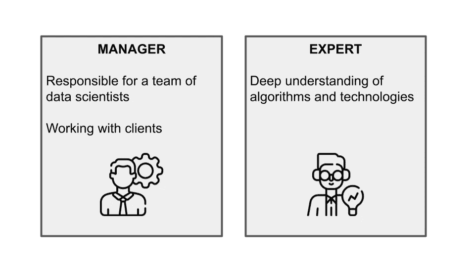
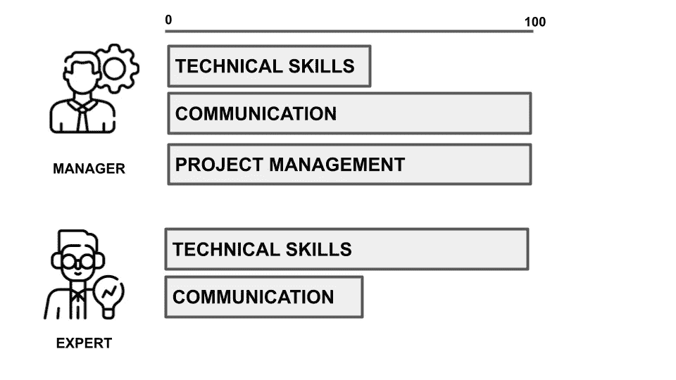

# 数据科学经理 vs 数据科学专家

> 原文：<https://towardsdatascience.com/data-science-manager-vs-data-science-expert-2784d3740a75>

## 数据科学

## 您的公司需要哪种配置文件？两种角色的比较:技能、职责以及他们在团队中的角色。

由 [Unsplash](https://unsplash.com?utm_source=medium&utm_medium=referral) 上的 [krakenimages](https://unsplash.com/@krakenimages?utm_source=medium&utm_medium=referral) 拍摄的照片

关于数据科学经理和数据科学专家谁对组织更有价值，科技界有很多争论。一些人认为管理者更有能力制定和实施战略，而另一些人则认为专家更擅长处理数据。

那么，到底是哪个？在本文中，我们将探讨每个选项的优缺点，以帮助您为您的组织做出决策。

文章组织如下:

*   经理和专家的角色
*   你需要经理还是专家？
*   技能
*   责任
*   在团队中工作
*   你需要经理还是专家？

# 经理和专家的角色

专家的角色不同于经理的角色，因为**专家需要对他们拥有多年经验的领域的算法和技术有非常深刻的理解，而经理只是对这个主题有一个大概的了解。**很多时候，一个专家不仅要有很好的技术知识，还要有领域知识。

数据科学经理负责数据科学家团队，并确保项目在预算内按时完成。他们还与客户合作，了解他们的需求，并确保团队满足他们的期望。

数据科学专家负责根据数据分析提供见解和建议。他们还开发和测试模型，以改善决策并帮助企业解决复杂的问题。

作者图片

# 技能

**数据科学经理需要了解许多技术和非技术方面的要求。在技术方面，他们需要很好地理解各种可用的数据科学工具和技术，以及如何有效地使用它们。**他们还需要能够理解和解释数据科学实验的结果，并向团队提供反馈。

**对数据科学经理的非技术要求包括良好的沟通和人际交往能力，以及项目管理经验。他们需要能够与组织内的不同团队合作，并且能够同时管理多个项目。**

作为一名数据科学经理，具备专业技能也很重要。理解它是如何工作的很重要，但是是在高层次上。这可以让你更好地理解你的团队正在做的工作，并提供更有效的指导。此外，技术技能可以帮助您在团队中建立信誉，并提高您解决问题的能力。

**数据科学专家通常是在特定领域拥有深厚知识的高技术人员。**虽然这种专业知识非常宝贵，但对数据科学经理来说并不总是必要的。在许多情况下，一般管理技能和对数据科学原理的理解就足够了。

作者图片

# 责任

数据科学经理的职责包括:

*   领导和协调数据科学家团队
*   制定数据科学战略
*   从头到尾监督项目
*   指导每个团队成员的个人发展。

**管理者对数据科学项目有一个整体的方法。**他们不仅知道并使用技术和模型，还与利益相关者和业务用户交流。他们非常了解机器学习模型的所有要求，以及商业用户将如何使用它们。通过这种整体方法，他们应该能够发现在各个业务领域利用数据科学的新机会。

作为一名数据科学经理，你将负责发展和管理一个数据科学家团队。除了监督你团队的工作，你还将参与**的业务开发和销售**。这意味着你需要有很强的沟通和表达能力。你还需要能够与客户和合作伙伴谈判交易。

**另一方面，数据科学专家负责执行数据科学项目。**他们拥有深入的算法和统计技术知识，能够处理大型数据集。他们还具有很强的沟通技巧，这对于与数据科学团队的其他成员协作至关重要。

作为一名数据科学专家，您将负责开展研究，开发新的数据分析技术和方法。你也将参与这些技术在项目中的实施。除了你的技术专长，你还需要有很强的沟通和表达能力。

# 在团队中工作

作为数据科学经理，您的主要职责之一是发展和管理数据科学家团队。这包括雇佣有才能的人，为他们提供有效完成工作所需的资源，并设定明确的期望。此外，你需要确保你的团队和谐有效地为共同的目标而工作。

作为数据科学经理，能够检查团队的工作并确保他们在正确的轨道上是很重要的。这意味着能够理解他们正在做的数据和分析。如果你不能做到这一点，那么就很难管理团队并确保他们富有成效。数据科学经理还应该告诉每个成员他或她应该采取的方向，并告诉他们今年或本月的目标是什么。

数据科学专家通常能够提供见解和建议，帮助改进数据科学团队的工作。此外，数据科学专家通常能够建立强大的团队，因为他们对该领域有着深刻的理解。他们知道什么样的技能和知识是成功所必需的，并且能够识别有才华的人。另一方面，数据科学经理可能不具备同等水平的专业知识。虽然他们可能能够识别潜在的团队成员，但他们可能没有能力全面评估他们的技能和知识。

# 你需要经理还是专家？

这个问题的答案可能取决于项目的规模和范围。

如果您有一个包含许多活动部分的大型项目，那么您可能需要一个数据科学经理来保持一切井然有序。经理也有助于协调具有不同技能的团队成员。

另一方面，如果您的项目更有针对性，并且您对想要实现的目标有一个清晰的想法，那么您可能会更好地与数据科学专家合作。专家可以帮助你微调你的项目并确保成功。

最终，决定与经理还是专家一起工作取决于你的具体需求和目标。如果你不确定，向这两种类型的专业人士咨询可能会有所帮助，以了解什么最适合你的项目。

无论如何，你应该记住**如果你首先雇佣一个数据科学经理，那么这个经理基本上会建立一个数据科学团队**。

# 摘要

恭喜你！您刚刚了解了数据科学经理和数据科学专家之间的区别！

数据科学经理负责领导数据科学家团队，并确保项目在预算内按时完成。他们还需要具备一般的技术技能，并能够有效地将结果传达给非技术风险承担者。另一方面，数据科学专家负责实际做数据分析和建模的工作。他们需要对统计和机器学习有深刻的理解，并能够有效地向技术和非技术受众传达他们的发现。

那么，哪个角色适合你呢？如果你觉得自己具备管理数据科学家团队所需的领导技能，那么数据科学经理可能是正确的选择。如果你更愿意专注于数据科学的实际工作，那么数据科学专家可能会更合适。

最终，由你来决定哪个角色最适合你的工作！

本文内容的灵感来自于 DataTalks.Club 上 Barbara Sobkowiak 的播客插曲  [数据科学经理 vs 数据科学专家](https://datatalks.club/podcast/s06e03-manager-vs-expert.html#data-science-managers-in-startups)

*原贴于* [*DataTalks。*](https://datatalks.club/blog/data-science-manager-vs-data-science-expert.html) *俱乐部。*