# 要避免的数据科学错误:数据泄漏

> 原文：<https://towardsdatascience.com/data-science-mistakes-to-avoid-data-leakage-e447f88aae1c>

## 这个无声的错误可能会毁掉你的机器学习项目


在 [Unsplash](https://unsplash.com?utm_source=medium&utm_medium=referral) 上由 [Sasikan Ulevik](https://unsplash.com/@ulevik?utm_source=medium&utm_medium=referral) 拍摄的照片

数据科学家一直被评为 21 世纪最性感的工作，难怪许多人都在通过大学学位课程或在线训练营学习 Python、数学和机器学习等技能。这些程序可以很好地学习基础知识，但往往与行业中实现机器学习的最佳实践和现实脱节。这些程序通常缺乏的一个主题是数据泄漏，即当你的机器学习模型知道得太多时。数据泄漏非常容易意外地引入到您的机器学习项目中，并可能产生严重的后果。

在本文中，我们将介绍

*   *什么是数据泄露？*
*   *机器学习模型如何学习？*
*   *数据泄露的例子以及如何防止数据泄露*
*   *防止数据泄露的最佳实践*

# 什么是数据泄露？

想象一下下面的场景。你花了几周时间建立了一个精确度和召回率极高的机器学习模型。您非常兴奋，所以您将您的模型部署到生产中，并让它开始根据实时数据进行预测，结果却发现您的模型做出了所有错误的预测！这最终会导致沮丧的用户和愤怒的老板来敲你的门。你不知道的是，数据泄露可能是你的模型在生产中表现不佳的罪魁祸首。

在机器学习领域，数据泄漏，也称为目标泄漏，可能发生在两种不同的情况下:

1.  您的训练数据包括有关测试集的信息
2.  您的模型是根据投入生产时无法获得的信息进行训练的

在我们浏览几个数据泄漏的例子之前，让我们先了解一下机器学习模型如何学习的基础知识。

# 机器学习模型是如何学习的？

如果你多年来一直在练习机器学习，你可以跳过这一节。但是对于机器学习的新手来说，要训练一个模型，你需要将所有可用的数据分成两组——训练集和测试集。

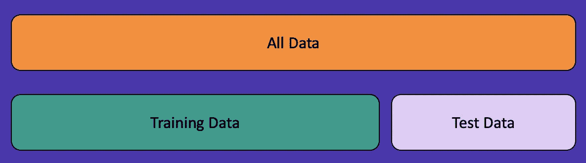

图 1:将数据分成两组——训练和测试。图片作者。

您将在训练集上训练模型，然后在测试集上验证结果。有许多方法可以将您的数据分成这两组，但是最流行的方法之一叫做随机训练/测试分割。这通常是您在学术界使用的方法，但是我们将通过几个例子来说明这种方法会导致数据泄漏。

让我们看一个随机训练/测试分割的例子。


图 2:带有流派的示例电影数据。图片作者。

这里我们有一些电影名称及其类型的示例数据。如果我们想对这些数据进行随机的训练/测试分割，我们首先要决定在我们的训练和测试集中需要多少数据。有许多方法可以做到这一点，但假设我们选择 60/40 分割，这意味着 60%的数据在我们的训练集中，40%的数据在我们的测试集中。


图 3:电影数据的 60/40 随机训练/测试分割。训练数据是深绿色的，测试数据是浅紫色的。图片作者。

在图 3 中，您会看到我们为训练集随机选择了六个数据点，用深绿色表示，为测试集选择了四个数据点，用紫色表示。

# 例 1——不要随机分割时间序列数据

现在我们知道了机器学习模型如何学习，以及什么是随机训练/测试分裂，让我们来看看我们的第一个数据泄漏示例。

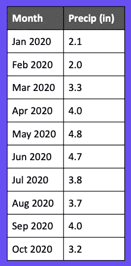

图 4:2020 年 1 月至 10 月的降雨量(单位:英寸)。图片作者。

这是 2020 年几个月的降雨量。假设我们已经准备好训练一个模型来预测某个月会有多少英寸的降水。您可能会尝试使用我们上面提到的随机训练/测试分割，但是那会导致数据泄漏！我们来看看为什么。

如果我们使用 60/40 的训练/测试分割随机分割我们的数据，它可能看起来像这样。

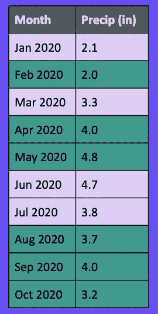

图 5:降水数据的 60/40 随机训练/测试分割。训练数据是深绿色的，测试数据是浅紫色的。图片作者。

假设我们想预测 7 月份的降雨量是多少英寸。当我们进行预测时，我们已经根据 8 月、9 月和 10 月的降水量训练了模型，因此模型知道未来几个月会发生什么！

我们希望使用滑动窗口，而不是使用随机的训练/测试分割。在时间序列数据中使用滑动窗口有几种不同的方法，但我们在这里只讨论一个例子。

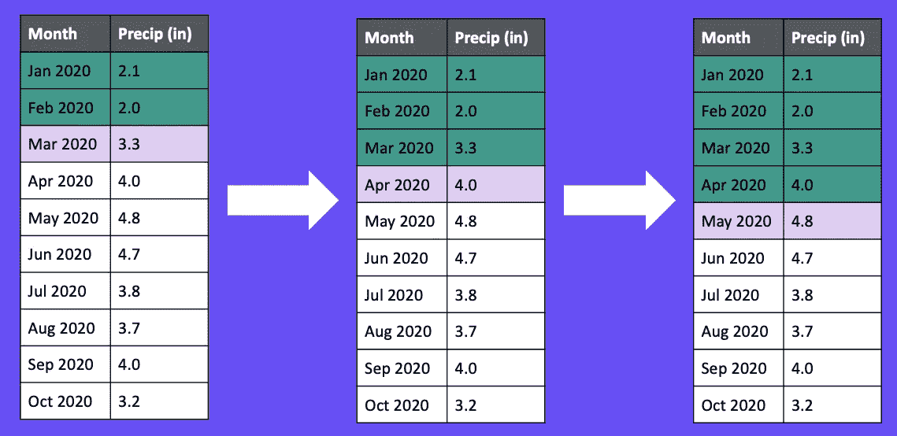

图 6:一个滑动窗口的例子。首先，该模型根据 1 月和 2 月的数据进行训练，并根据 3 月的数据进行测试。然后，根据 1 月、2 月和 3 月的数据对模型进行训练，并根据 4 月的数据进行测试。该循环根据需要重复多次。图片作者。

在图 6 中，我们首先根据一月和二月的数据训练我们的模型，然后使用这些数据预测三月。在下一次迭代中，我们将把三月添加到我们的训练集中，并使用一月、二月和三月来预测四月。我们重复这个循环进行一定次数的迭代，然后最终将每次迭代的误差汇总成一个单一的误差度量。

专业提示:总是使用滑动窗口分割时间序列数据！

# 例 2 —不要包括未来的数据

让我们通过添加更多的数据来扩展前面的例子，尝试并改进我们的模型。在图 7 中，我们添加了每个月的高温。

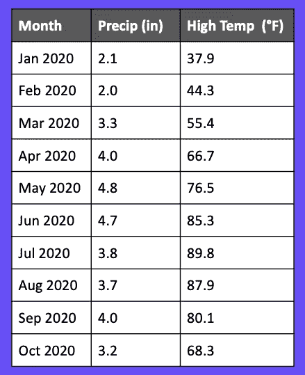

图 7:每个月的高温已经加入到我们的降水数据中。图片作者。

这看起来很简单，但是如果我们将它包含在我们的模型中，它就是数据泄漏的来源。如果我们试图在月初进行预测，我们的模型不会有该月的高温，因为该月尚未完成！

为了防止这种情况发生，我们建议您将与数据相关的事件映射到时间线上。

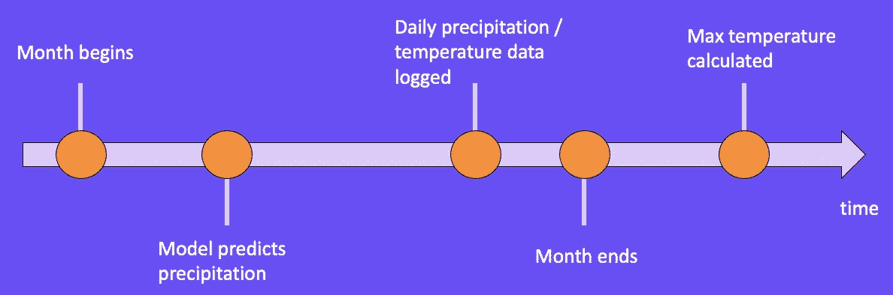

图 8:与我们的降水数据相关的重要事件的时间轴表示。图片作者。

图 8 我们例子中的时间线可能是什么样子。在 1 月 1 日，我们的模型预测了这个月的降水量。在整个月中，我们收集每天的降水和温度数据，直到 1 月 31 日月底。只有当一个月*结束*时，我们才能计算出一月份的最高温度。

当将相关事件映射到时间线上时，注意模型在哪里做出预测是很重要的。一旦我们找到了那个点，我们只想包含在那个点的之前**发生的信息。**

# 例子 3——不要随意分组

现在我们已经看到了一些时间序列数据的例子，让我们来看看图 9 所示的数据分类问题。对于这个例子，我们有学生，文章，和他们每篇文章的分数。假设我们想要建立一个模型，根据学生的文章内容来预测他们的文章分数。


图 9:包含学生、论文和成绩的样本数据集。图片作者。

那些不熟悉数据泄漏的人可以从创建 60/40 的训练/测试分割开始，就像我们在前面的例子中所做的那样。您可以在图 10 中看到，学生 1、2 和 3 分别在训练**和**测试集中。


图 10:我们的学生论文分数数据集的 60/40 随机训练/测试分割。图片作者。

当我们以这种方式分割数据时，我们的模型可能会无意中学习特定学生的写作行为和模式。这可以使我们的模型在我们的测试集上表现得非常好，因为它已经看到了这些学生的写作，但当它看到新学生的写作时，表现就差得多。

我们希望每个学生只在训练集或测试集中，而不是随机分割我们的数据。在图 11 中，您可以看到学生 1 和 2 只在训练集中，学生 3 和 4 只在测试集中。


图 11:按学生编号划分的训练/测试。学生 1 和 2 只出现在训练集中，而学生 3 和 4 只出现在测试集中。图片作者。

Python 库 scikit-learn 通过一个名为 [GroupShuffleSplit](https://scikit-learn.org/stable/modules/generated/sklearn.model_selection.GroupShuffleSplit.html) 的函数使这一点变得简单。在这个函数中，您指定要用作拆分数据的指示器的列(对我们来说是学号)，然后它会处理其余的事情。如果您的数据有某种自然分组，我们强烈建议使用此函数。

# 示例 4 —不要忘记您的数据是快照

在学术界，你经常会得到一个不变的数据集；然而，在工业中，你的数据集是不断变化的。对于下一个例子，假设我们有一个带有点击预测模型的网站，该模型可以预测用户是否会点击广告。这个模型的输出可以用来预测向用户显示哪些广告。


图 12:21 年 5 月 16 日和 21 年 5 月 31 日的数据快照。图片作者。

在图 12 中，我们有一个用户，他在 2021 年 5 月 16 日第一次访问我们的站点。因为这是他们第一次上我们的网站，他们以前没有点击过任何广告。假设我们给他们一个广告，他们点击了它。几周过去了，当我们查询我们的数据集时，我们注意到用户 1 现在已经点击了之前的两个广告以及我们向他们展示的当前广告。

如果我们将以前的广告点击作为一个特征包含在我们的模型中，我们就将用户未来的行为泄露到了我们的训练集中。当我们训练我们的模型时，我们知道用户一将点击两个广告。如果我们把数据放在时间轴上，这可能更有意义。

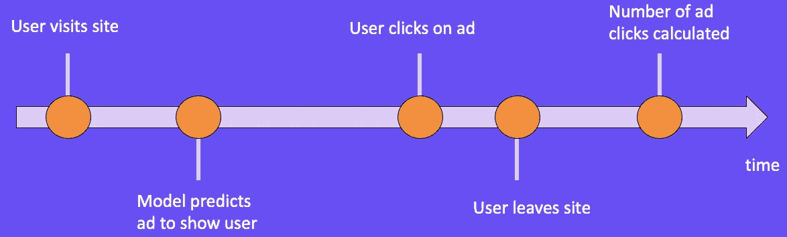

图 13:与我们的广告点击数据相关的重要事件的时间轴表示。图片作者。

当用户访问我们的网站时，我们向他们展示广告，我们的模型预测用户是否会点击广告。用户可能会点击广告，然后离开网站。然后我们就可以最终计算出他们在网站上点击的广告数量。与示例 2 类似，我们希望记录我们的模型做出预测的位置，然后只包括在该预测之前发生的模型中的信息。

# 示例 5 —重新训练时不要随意分割数据

到目前为止，我们只讨论了当你**训练**你的模型时发生的数据泄漏。如果你来自学术界，你可能只训练过一个模型，没有部署过。在行业中，一旦您训练了一个模型并将其部署到生产中，您最终将需要重新训练您的模型，因为您的模型看到的数据与它被训练时看到的数据有很大不同。我们将通过一个例子来说明在重新训练过程中哪里会发生数据泄漏。

对于图 14 所示的例子，假设我们在 6/15/21 使用 60/40 随机训练/测试分割来训练一个模型。我们的模型是在数据点 1、2、4、5、6 和 10 上训练的。在数据点 3、7、8 和 9 进行了测试。


图 14:生产模型的 60/40 随机训练/测试分割。图片作者。

部署到生产环境后，几个月过去了，我们的模型性能逐渐下降，所以是时候重新培训了。在 8/30/21，我们训练了一个新模型(挑战者),打算取代当前的生产模型。在我们的 challenger 模型的训练中，我们使用了 60/40 随机训练/测试分割。这包括生产模型训练的所有 10 个数据点，以及我们在部署生产模型后收集的 5 个数据点(11、12、13、14、15)。

为了比较这些模型，我们想让我们的生产模型和挑战者模型都在**挑战者模型的测试集**上进行预测。然而，当我们进行预测时，我们会发现生产模型已经在挑战者模型的测试集(1、2 和 10)中的数据点上进行了训练，这给了生产模型不公平的优势。

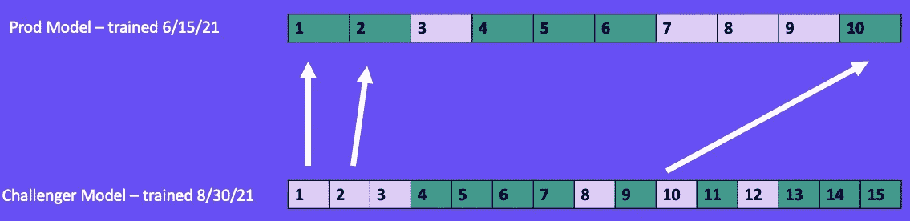

图 15:比较用于生产模型和挑战者模型的训练和测试集。challenger 模型的测试集中的三个数据点(1、2 和 10)用于训练生产模型。这使得生产模式在比较两种模式时具有不公平的优势。图片作者。

为了进一步说明这一点，让我们来看看我们的产品和 challenger 模型在 challenger 模型的测试集上的预测结果，如图 16 所示。我们知道生产模型已经在数据点 1、2 和 10 上进行了训练，因此您可以在下面看到它正确地预测了它们。然而，挑战者模型以前没有见过这些数据点，所以它错误地预测了它们。数据点 3、8 和 12 没有被任何一个模型看到，因此存在正确和不正确预测的混合。

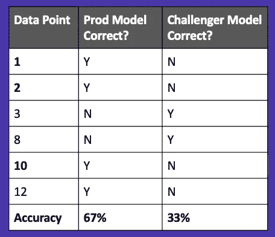

图 16:挑战者模型测试集上生产和挑战者模型预测的结果。图片作者。

当我们计算我们的准确性时，生产模型的得分为 67%，而挑战者的得分为 33%。看着这些结果，我们可能会保持目前的生产模式，并尝试其他挑战者模式。然而，如果我们仔细观察，我们会发现我们已经将数据泄漏引入到我们的生产模型中，并且它人工地看起来比挑战者模型更好！

为了防止这种情况下的数据泄漏，我们必须保存所有的训练集和测试集。假设我们为生产模型保持相同的随机训练/测试分割。当我们训练我们的 challenger 模型时，我们希望加载我们用于生产模型的训练集和测试集，并将这些集用于我们的 challenger 模型。然后，我们将在训练集和测试集之间平均分配我们的新数据点(11，12，13，14，15)。这将确保生产模型不会意外地知道比它应该知道的更多。

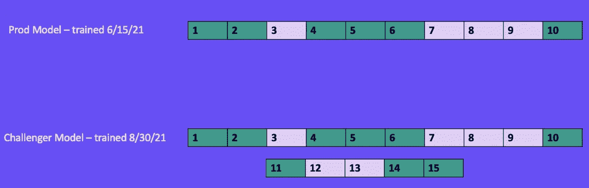

图 17:为了创建 challenger 模型训练/测试分割，我们首先加载生产模型使用的训练和测试集，并在训练和测试集之间平均分配新数据。图片作者。

为了进一步说明这一点，让我们在挑战者模型的测试集上比较我们的生产和挑战者模型预测。在图 128 中，我们有一个平等的竞争环境，因为没有生产模型已经看到的数据点。

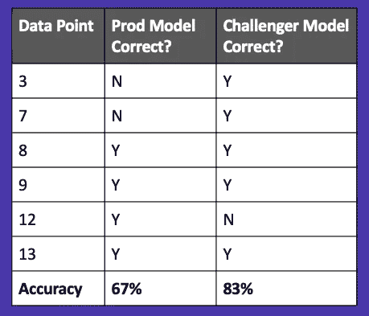

图 18:挑战者模型测试集上生产和挑战者模型预测的结果。图片作者。

现在当我们计算每个模型的准确性时，我们发现挑战者模型优于生产模型。

# 最佳实践#1—立即分割数据

现在，您已经看到了一些可能发生数据泄漏的示例，让我们来看看您应该在每个机器学习项目中遵循的一些最佳实践，以防止数据泄漏。

对于这个例子，我们有几个 YouTube 视频的浏览量。要将视图用作机器学习模型中的一个功能，我们需要将数据标准化，以调整异常值。一种方法是通过最小-最大归一化。这将获取数据集的最小值和最大值，并使用它们在 0 和 1 之间转换值。

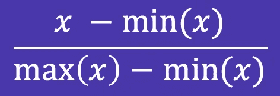

图 19:作者的最小-最大归一化公式图像。

一个容易犯的简单错误是在规范化或其他转换后拆分数据。在图 20 中，在标准化我们的数据之后，我们完成了 60/40 随机训练/测试分割**。您会注意到，标准化的最小值和最大值(0 和 1)在训练集和测试集中是分开的。为了防止数据泄漏，训练集和测试集的最小值都应该为 0，最大值都应该为 1。**

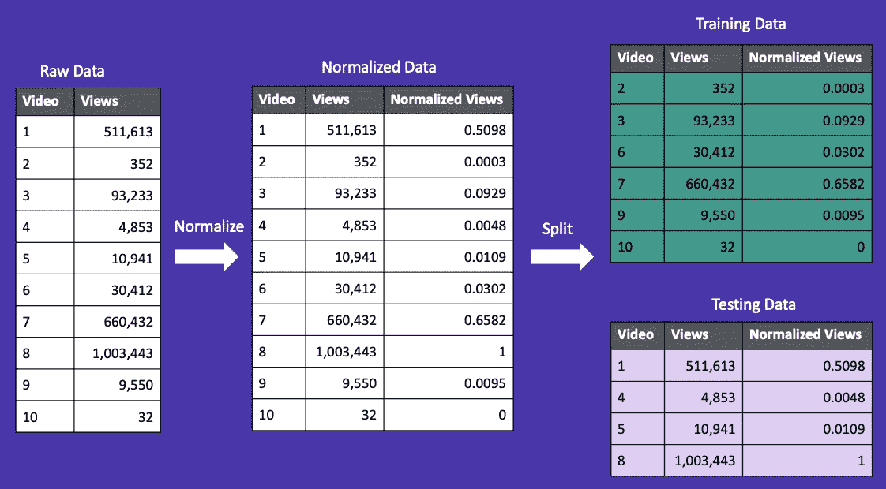

图 20:首先规范化您的数据，然后将其分成训练集和测试集的不正确过程。图片作者。

我们想做的是首先拆分我们的数据，然后归一化。您可以在图 21 中看到，训练集和测试集的最小值都是 0，最大值都是 1。

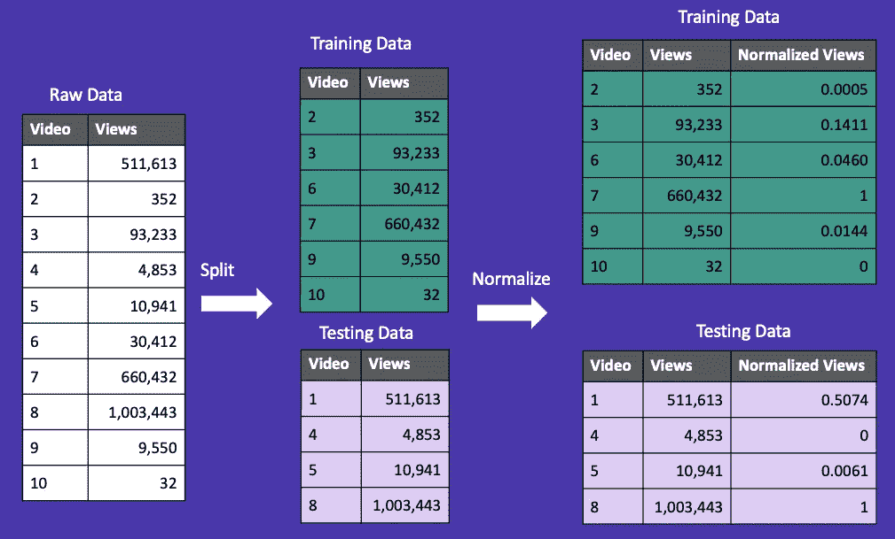

图 21:首先分割数据，然后将其规范化的正确过程。图片作者。

# 最佳实践#2 —使用交叉验证

在本文中，我们将数据分为两组:训练和测试。在这里，我们将介绍第三组验证，它有助于防止数据泄漏。

我们首先将数据集分成训练集和测试集。接下来，我们将训练集分成 k 个折叠。对于这个例子，假设 k=3。这将把我们的训练集分成三个不同的部分(折叠)。其中两部分将用于训练，一部分将用于验证。我们通过改变用于训练和验证的部分来重复这个过程。在整个过程中，我们找到模型的最佳参数，然后在原始测试集上对它们进行评估，原始测试集包含模型以前没有见过的数据。

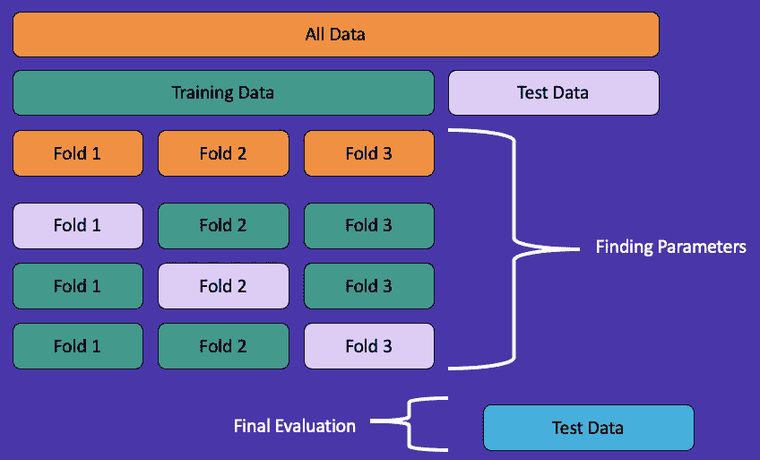

图 22:一个三重交叉验证的例子。图片作者。

虽然这个过程乍一看似乎很复杂，但是 scikit-learn 有一个简单的实现，您可以在一行代码中调用它。我们强烈建议使用交叉验证来防止数据泄漏。

# 最佳实践# 3——对高绩效持怀疑态度

当您的模型达到 99%的精确度、召回率或任何其他指标时，没有什么比这更好的了。不幸的是，如果这听起来好得令人难以置信，那么它很可能就是真的。您的模型很有可能会有数据泄漏，并且无法对看不见的数据产生相同的结果。

在两种不同的情况下，高模型性能可能是数据泄漏的迹象。第一种情况是，您的训练集和测试集表现良好，但是您的验证集表现得比这两个集都好。如果您在结果中看到这种情况，您可能需要对您的项目设置进行批判性的思考，并对其进行数据泄漏分析。

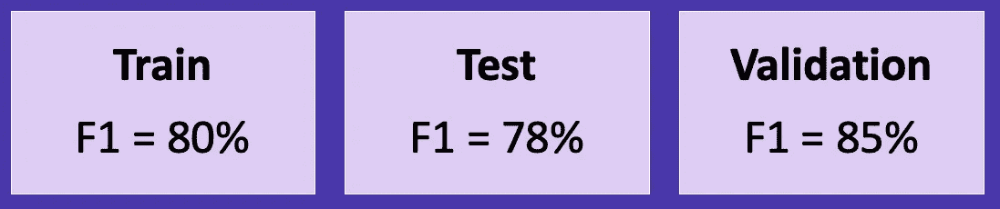

图 23:一个比训练集和测试集表现更好的验证集的例子。F1 分数是精确度和召回率的调和平均值。图片作者。

第二个场景可能是数据泄漏的一个指标，当您的训练、测试和验证集**都表现得非常好。在图 24 中，三个集合的得分都是 99%。您的第一反应可能是庆祝，但是您可能应该在部署到产品之前检查您的项目是否有数据泄漏。**

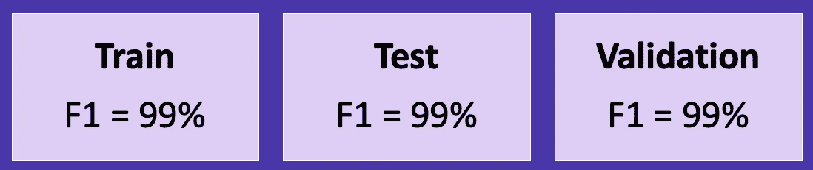

图 24:训练、测试和验证集中的高性能示例。图片作者。

# 最佳实践#4 —使用 scikit-learn 管道

我们在本文中多次提到 scikit-learn 是有原因的——该库为机器学习项目提供了大量强大的功能！我们推荐使用库中的一个工具，叫做管道。管道在防止数据泄漏方面非常出色，因为它们以一定的顺序应用一组步骤，并一起交叉验证它们。

以下说明管道使用的示例来自 [scikit-learn 的文档](https://scikit-learn.org/stable/modules/generated/sklearn.pipeline.Pipeline.html)。他们首先将数据分成训练集和测试集，然后创建一个管道来扩展数据，并应用支持向量分类器进行预测。

```
**from** **sklearn.svm** **import** SVC
**from** **sklearn.preprocessing** **import** StandardScaler
**from** **sklearn.datasets** **import** make_classification
**from** **sklearn.model_selection** **import** train_test_split
**from** **sklearn.pipeline** **import** PipelineX, y = make_classification(random_state=0)
X_train, X_test, y_train, y_test = train_test_split(X, y,
                                                 random_state=0)pipe = Pipeline([('scaler', StandardScaler()), ('svc', SVC())])
pipe.fit(X_train, y_train)
pipe.score(X_test, y_test)
```

# 最佳实践#5 —检查与目标相关的功能

我们最后的最佳实践是检查您的任何特征是否与您试图预测的变量(目标)相关。在图 25 中，我们有一些医疗保健数据，我们希望预测某人是否会感染流感。我们可能会决定将“服用抗生素”列作为输入包含到我们的模型中。

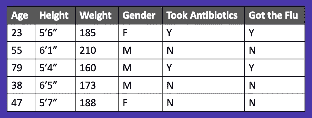

图 25:样本医疗保健数据。图片作者。

然而，当我们看到那个变量与我们试图预测的变量高度相关(“得了流感”)时，我们可能应该三思。这可能是数据泄露的迹象。

另一种思考方式是将我们的数据放在时间轴上，就像我们之前学过的那样。你会注意到，一旦我们这样做了，我们意识到你不会服用抗生素，直到你得了流感后的 T4。如果我们在模型中包括“服用抗生素”,我们将会把未来的数据泄露到我们的模型中。

# 概述

总之，当您的模型知道太多信息时，就会发生数据泄漏，而且很难发现。我们已经介绍了几种识别和防止数据泄漏的不同方法，以及机器学习项目的一些最佳实践。

如果你喜欢这篇文章，我们也在 Skillshare 上教授数据科学课程。您可以查看我们关于数据泄露的课程，并使用我们的推荐链接[这里](https://skl.sh/3rEoZgW)获得 Skillshare 的免费试用。

# 参考

1.  [https://sci kit-learn . org/stable/modules/generated/sk learn . pipeline . pipeline . html](https://scikit-learn.org/stable/modules/generated/sklearn.pipeline.Pipeline.html)
2.  E.阿梅森，构建机器学习驱动的应用(2020)，[https://www . oreilly . com/library/view/Building-Machine-Learning/9781492045106/](https://www.oreilly.com/library/view/building-machine-learning/9781492045106/)
3.  [https://www . skillshare . com/classes/Data-Science-errors-to-Avoid-Data-Leakage/1955732280](https://www.skillshare.com/classes/Data-Science-Mistakes-to-Avoid-Data-Leakage/1955732280)