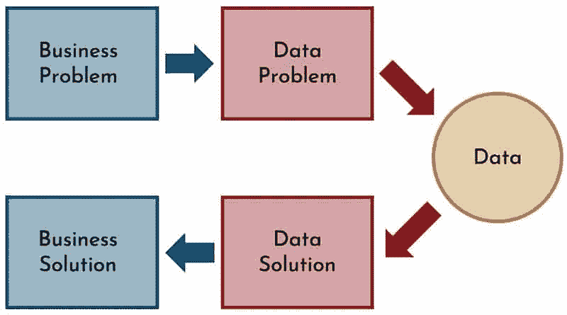
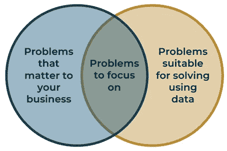

# 当数据科学解决了这两个问题时，它就成功了

> 原文：<https://towardsdatascience.com/data-science-succeeds-when-it-solves-these-two-problems-7451e7b1caa2>

## 意见

## 伟大的数据科学家会考虑这两者

塞巴斯蒂安·斯塔姆在 [Unsplash](https://unsplash.com?utm_source=medium&utm_medium=referral) 上的照片

数据科学项目并不像它们第一次出现时那样。

许多数据科学家认为，数据科学就是利用统计数据和模型解决问题。但是这些数据科学家的项目[可能永远不会投入生产](https://venturebeat.com/ai/why-do-87-of-data-science-projects-never-make-it-into-production/)。

因为如果你是一个从事项目的数据科学家，在创建了一个数据解决方案后停下来，你只完成了一半。当一个项目做了一半就停下来，就像从烤箱里拿出一个只做了一半的蛋糕。它可能在外面看起来很棒，但是你不能用它做任何事情——除了把它放回烤箱。

我的整个职业生涯都在用数据解决问题，并且看到了数据科学能够带来的价值。但是要创造这种价值，你需要改变你对数据科学的看法。

# 每个成功的数据科学项目都会解决两个问题

交付业务价值的数据科学项目解决了两个相互关联的问题:业务问题和数据问题。

业务问题是企业面临的任何挑战或问题。比如寻找客户，增加利润或者建立品牌知名度。不是每个商业问题都可以用数据来解决。

数据问题是你在 Kaggle 或数据科学课程中遇到的各种问题。数据问题包括以下内容:

*   根据当前数据预测未来结果；
*   自动化围绕数据的重复流程；和
*   识别和解释数据集中的模式和趋势。

解决数据问题是大多数人最初进入数据科学的原因。

考虑数据问题本身在教育环境中是好的，但在商业中会导致浪费。当组织雇佣数据科学家并告诉他们“去做数据科学”时，就会发生这种情况。

成功的数据科学项目始于对业务问题的识别。这个业务问题又引出了一个数据问题。获取相关数据。然后，使用这些数据创建一个数据解决方案，该方案也解决了业务问题。

下图对此进行了说明。

作者图片

解决数据问题*和*业务问题的数据科学项目更有可能投入生产。然而，许多数据科学家仍然只关注数据问题。

这里有两个原因。

# 团队孤岛造成知识差距

数据孤岛不利于数据科学。它们使得连接不同的数据集变得困难。

当数据科学刚刚起步时，数据孤岛是成功的最大障碍之一。如果没有必要的数据架构，数据科学家能够提供的东西就会受到限制。企业认识到了自己的错误。现在，数据整合被视为构建企业数据能力的必要第一步。

然而，数据孤岛并不是阻碍有效数据科学的唯一孤岛。团队筒仓也一样糟糕。尽管大多数组织认识到团队孤岛的危险，但许多组织尚未解决这些问题。

当一个团队与业务的其他部分脱节时，就会出现团队孤岛。对于一些团队来说，这可能不是问题。但是，当数据专业人员与业务脱节时，就会出现知识缺口。

Danny Samson、Alon Ellis 和 Stuart Black 在《商业模式转型:人工智能&云技术革命 》中描述了这种知识差距的后果，以人工智能(AI)为背景:

> *“产品负责人可能希望人工智能做一些事情，但他们不知道什么是可能的。主题专家 AI 分析师想做点什么，但是他们不理解客户问题。所以你只有这两个轮子在旋转，它们之间的界面只是纯粹的僵局。”*

当数据科学家和业务之间存在知识差距时，数据问题和业务问题不可避免地会脱节。

# 闪亮的新玩具综合症没有帮助

数据科学仍然被许多组织视为闪亮的新玩具。尤其是涉及到前沿技术的时候，比如深度学习。

作为数据科学教育家，Amanda Aitken 在我的播客 [*中表示，价值驱动的数据科学*](https://www.genevievehayes.com/podcast/ep1/) :

> *“有时候，当简单的线性回归或 GLM 可能一样好的时候，我们会被最新的东西弄得有点晕头转向。”*

数据科学家和商业领袖都是如此。

数据科学家想要尝试最新的技术。这是雇主吸引人才的最大法宝之一。但是许多商业领袖也喜欢谈论他们生意中使用的新技术。

这会导致“锤子找钉子”的情况。通过积极地寻找使用特定技术的方法，数据科学家和业务领导者以业务问题为代价，过度关注数据问题。

即使数据问题和业务问题有关联，这种思维模式也会导致不必要的复杂数据解决方案。这可能导致业务问题的次优解决方案。

因此，为了提高数据科学项目的成功率，组织应该专注于解决数据科学家和业务之间存在的任何知识差距，并将任何数据科学项目的重点首先放在解决业务问题上。

# 弥合领导力和数据科学之间的知识差距

为了弥合数据科学家和业务之间的知识差距，数据科学家需要变得更懂业务。但是商业领袖也需要变得更懂技术。

为了变得更懂业务，数据科学家需要与业务互动。在业务部门中安插数据科学家会有所帮助。但不管怎样，*所有的*数据科学家都需要定期与他们的最终用户交谈。他们需要理解自己的痛苦。

我见过的一些最有效的数据科学家都是从技术终端用户开始的。他们了解最终用户的需求，因为这些需求曾经是他们自己的。能够设身处地为最终用户着想的数据科学家通常会提供更好的解决方案。

然而，桥梁是双向延伸的。企业领导需要能够与数据专业人员交流，并在技术领域做出明智而有效的战略决策。这需要技术素养。

技术素养的含义因组织而异。然而，它应该包括对数据解决方案的构建块的高层次理解，以及任何相关技术的优点和缺点。正如数据科学家需要与业务互动一样，业务领导也需要定期与数据科学家交流。

企业领导者不需要能够产生数据解决方案，就像数据科学家不需要能够运营企业一样。但是每一方都需要对对方的专业领域有一个基本的了解。

一旦弥合了知识差距，企业领导人和数据科学家就可以共同努力，确定适合使用数据科学解决的业务问题。这可以通过使用数据科学项目发现来完成。

# 什么是数据科学项目发现？

数据科学项目发现包括识别和理解最重要的业务问题，然后考虑这些问题的数据科学解决方案的可行性。

我在[的免费指南中详细概述了这个过程，你可以在这里下载](https://www.genevievehayes.com/discovery-guide/)。

概括地说，该流程包括四个步骤:

## 1.识别关键业务问题

评估您当前的业务状况，并确定您当前面临的主要问题。

例如，企业当前可能面临的三个问题是:

*   降低基于相关性手动分类文档时的错误率；
*   处理不利媒体报道后的声誉损害；和
*   预测企业及其竞争对手股票价格的未来走势。

## 2.确定数据科学的适用性

以步骤 1 中确定的问题为例，评估它们是否适合使用数据科学来解决。在这一步忽略可行性。

其目的是识别那些(a)对业务重要的问题和(b)适合使用数据解决的问题的交集。如下图所示。

作者图片

## 3.评估可行性和重要性

用三分制(即高、中、低)对步骤 2 中确定的问题的可行性和重要性进行评级。然后使用这些评级对发现的问题进行排序。

问题的可行性越大，对企业的重要性越大，成功的可能性就越大。所以，它的排名应该更高。

例如，虽然使用数据预测股票价格是可能的，但以高精度这样做是非常具有挑战性的。这通常需要专业的金融知识。所以这个问题可能会被给予较低的可行性评级。

另一方面，如果文档的相关性基于简单的规则集，那么通过自动化来减少分类错误是非常可行的。

## 4.定义你对成功的愿景

从业务而非技术的角度定义一个成功的解决方案。这包括了解以下项目:

*   要达到的业务目标；
*   衡量成功的标准；
*   解决问题对业务的价值；和
*   存在的任何风险或业务限制。

数据科学项目发现流程导致创建数据科学项目，这些项目关注对业务最重要的内容。

定义成功的愿景可以减少闪亮的新玩具综合症，因为它为解决方案设定了参数。如果数据科学家与业务领导者一起完成这一过程，团队孤岛也会减少。

# 数据科学不解决问题，而是由人来解决问题

数据、技术和数据科学本身并不能解决问题。它们使人们能够解决问题。数据科学项目最终是为了解决对业务重要的问题。

如果数据科学家像孤岛一样存在于一个组织中，他们就毫无价值。为了让数据科学取得成功，需要在数据科学家和其他业务部门之间搭建桥梁。*数据科学家*和商业领袖*和*都对此负责。

随着我们进入数据时代，数据科学大有可为。它只是用来解决正确的问题。

> 附言:如果你想了解更多关于数据科学项目发现过程的信息，你可以在这里获得我的免费指南→【https://www.genevievehayes.com/discovery-guide/ 

*Genevieve Hayes 博士是数据科学家、教育家和人工智能及分析专家，拥有*[*Genevieve Hayes Consulting*](https://www.genevievehayes.com/)*。你可以在*[*LinkedIn*](https://www.linkedin.com/in/gkhayes/)*或者*[*Twitter*](https://twitter.com/genevievekhayes)*上关注她。她还是* [*价值驱动数据科学*](https://www.genevievehayes.com/episodes/) *的主持人，这是一个每月两次的播客，面向希望最大化其数据和数据团队价值的企业。*