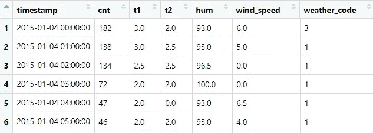

# 数据科学教程:在 R 中训练随机森林

> 原文：<https://towardsdatascience.com/data-science-tutorials-training-a-random-forest-in-r-a883cc1bacd1>

## 了解如何使用 R 语言训练随机森林


*【这是我在数据科学教程系列中的第一篇帖子——请继续关注，了解更多关于如何用 R 或 Python 训练不同算法的信息！]*

R 随机森林是机器学习中使用最广泛的算法之一。由于它们处理非线性模式的能力和可解释性，它们比其他模型有几个优点。

尽管它们正受到其他基于树的模型(如 boosting 算法)的挑战，但在构建数据科学项目时，它们仍然是值得考虑的有效选项，而且这种范式预计不会在不久的将来发生变化。

而在过去，你有两种选择:等待你的软件提供商(如 SAS 或 IBM)发布新版本，或者自己编写原始算法。幸运的是，随着开源语言及其库的广泛采用，您现在可以顺利地用 Python 或 r 训练随机森林。您可以随意使用多个*API*或函数，它们可以用一行代码训练其中一个模型。

在这篇文章中，我将做一个关于如何使用两个库( *randomForest* 和 *ranger* )在 *R* 中训练随机森林的教程——在这个教程中，我们还将讨论为什么我们应该在这个训练过程中依靠 *ranger* 库，以及我们这样做的标准。

# 加载数据

对于我们的随机森林用例，我们将使用[伦敦自行车共享数据集](https://www.kaggle.com/hmavrodiev/london-bike-sharing-dataset)-该数据集包含伦敦自行车共享的自行车需求信息-我们有每天和每小时的汇总数据:



伦敦自行车共享数据集的第一行

列 *cnt* 包含新自行车份额的计数。预览中显示的其他变量与天气数据相关，包括温度、湿度、风速等。

在我们的用例中，我们希望使用当天的大气数据和元数据来预测骑自行车的次数——例如，如果特定的一天是假日或周末。为了简单起见，我们不会在这个过程中执行任何特性工程。

以下命令使我们能够使用 R 读取 csv 文件:

```
london_bike <- read.csv(‘./london_merged.csv’)
```

此外，我们将加载本教程所需的所有库:

```
library(dplyr)
library(randomForest) 
library(ranger)
library(Metrics)
```

# 分为训练和测试

之后，我们将使用一个函数来拆分数据训练和测试样本，留下 20%的数据作为性能评估的维持集:

```
# Splitting into train and testtrain_test_split <- function(data, percentage) {

 data_with_row_id <- data %>% 
 mutate(id = row_number())

 set.seed(1234)
 training_data <- data_with_row_id %>%
 sample_frac(percentage)
 test_data <- anti_join(
 data_with_row_id,
 training_data,
 by=’id’
 )

 training_data$id <- NULL
 test_data$id <- NULL

 return (list(training_data, test_data))
}# Keeping 80% for the training settraining_data <- train_test_split(london_bike, 0.8)[[1]]
test_data <- train_test_split(london_bike, 0.8)[[2]]
```

我们剩下 13.931 个时间位置(正如我们在预览中看到的，每行代表特定小时的数据)用于训练。如果您愿意，也可以使用超时保持集。不要随机分割数据，而是使用一个连续的时间段(数据集的最后几天)作为测试集——如果我们将这个问题视为时间序列问题，这将更有意义。

为了测试我们算法的目的(评估量化性能)，我们将使用 3483 个时间位置来测试我们的随机森林。请记住，我们将以两种方式评估我们的算法:

*   使用均方根误差-这将映射出算法的预期误差。
*   执行时间——对于每个库，我们将对其执行进行计时，并了解库之间的差异。

我们还可以从数据集中提取要素和目标的子集-请记住，在本教程中我们不会进行要素工程，而是按原样使用变量:

```
training_data <- training_data[,c('t1','t2','hum',
                                  'wind_speed','weather_code',
                                  'is_holiday','is_weekend',
                                  'season', 'cnt')]
test_data <- test_data[,c('t1','t2','hum',
                          'wind_speed','weather_code',
                          'is_holiday','is_weekend',
                          'season', 'cnt')]
```

如问题公式中所述，我们将希望预测在特定的小时和天将使用多少辆自行车—这意味着我们的目标将是包含相同值的列"*CNT*"—这是上面子集中的最后一列。

准备好数据后，让我们在 R 中实现两个不同的随机森林— *ranger* 和 *randomForest。*

# 使用 randomForest 库

首先，我们将使用[*randomForest*](https://cran.r-project.org/web/packages/randomForest/randomForest.pdf)*库。这是最初的 [Leo Breiman 的](https://www.stat.berkeley.edu/~breiman/randomforest2001.pdf)论文的第一批开源实现之一。*

*我们需要任何复杂的命令来训练我们的算法吗？不要！我们可以使用(几乎)一行代码训练一个随机森林:*

```
*set.seed(1234)
rf <- randomForest(formula = cnt ~ ., 
                   data = training_data,
                   ntree = 100)*
```

*我正在使用*种子* 1234 使这些结果可复制。函数 *randomForest* 接受一些参数:*

*   **公式*，带目标和特征的参数，用于训练过程。" *cnt ~ "*意味着我们希望使用数据帧中的所有其他列来预测变量 *cnt* 。如果我们只想使用特定的变量作为特征，我们需要明确地命名它们，例如:*“CNT ~ var 1+var 2”。**
*   **数据*，我们希望在训练过程中使用的数据帧。*
*   **Ntree，*随机森林中训练的树的数量。*

*使用上面的代码，我们正在训练大约 100 棵树—让我们记录这次运行的执行时间:*

```
*system.time(
 randomForest(cnt ~ ., data = training_data,
 ntree = 100))*
```

*这个随机森林在我的系统上花了大约 12.87 秒。这是我在比较库和不同实现时喜欢做的分析之一。在小规模上，执行时间的差异可能看起来不明显，但是当训练大规模模型时，人们希望使用最有效的库。*

*我们只使用了随机森林库中的一些参数。在我们的培训过程中，我们还可以使用其他的[超参数](https://medium.com/@ammubharatram/hyperparameter-tuning-of-random-forest-in-both-r-and-python-747b06b568db)。*

*要在我们的训练过程中使用更多的超参数，只需向函数添加额外的参数，例如添加最小节点大小 10:*

```
*rf_2 <- randomForest(formula = cnt ~ ., 
                     data = training_data,
                     ntree = 100, 
                     nodesize = 10)*
```

*您可以使用*查看该函数的完整参数列表？r 中的 randomForest* 。*

*最后，我想评估我们的树的测试集性能—让我们使用度量库来完成:*

```
*rmse(test_data$cnt, predict(rf, test_data))*
```

*我们使用我们的 *rf —* 训练好的随机森林模型 *—* 来预测测试集的例子。我们将这些值与 *cnt，*的真实值进行比较，并获得 RMSE 的值(均方根误差)。*

*我们的 *rf* 的 RMSE 不是很大，大约为 882.72——为了客观地看待这个数字，每小时共享自行车的平均值大约为 1123 辆。这也是意料之中的，因为这是一个普通版本的随机森林，几乎没有超参数调整和功能工程。*

*概括一下，用 *randomForest，*我们实现了 *:**

*   *12.87 秒的执行时间；*
*   *882.72 的 RMSE。*

*现在让我们将这些值与 *ranger* 库进行比较！*

# *使用游侠图书馆*

*我们可以在 R 中使用的另一个实现是<https://cran.r-project.org/web/packages/ranger/ranger.pdf>**实现。这个库也实现了随机森林，但是以一种更快的方式——当你的维度(行或列)增长时，这将产生巨大的差异。***

***这里是和以前完全一样的随机森林:***

```
***set.seed(1234)
rf_ranger <- ranger(
  formula = cnt ~ ., 
  data = training_data, 
  num.trees=100)***
```

***论点完全相同，除了 *ntree，*现在写成 *num.trees* 。***

**测量执行时间:**

```
**system.time(rf_ranger <- ranger(
              formula = cnt ~ ., 
              data = training_data, 
              num.trees=100))**
```

**ranger 实现的执行时间大约为 1.84 秒——比 *randomForest* 实现快 11 秒。**

**添加新的超参数也很简单，只需向函数添加新的参数:**

```
**rf_ranger_2 <- ranger(formula = cnt ~ ., 
 data = training_data, 
 num.trees=100,
 min.node.size = 10)**
```

**现在让我们来评估我们的 ranger 实现的性能。这段代码略有不同，因为*预测*函数的行为与使用 *ranger* 或 *randomForest* 训练的对象不同。**

**这里，我们需要使用 *$predictions* 从*预测*的返回对象中获取数据:**

```
**rmse(
  test_data$cnt, 
  predict(rf_ranger, test_data)$predictions
  )**
```

***游侠*实现的 RMSE 在 883.38 左右。这是意料之中的，因为我们使用了一组相似的超参数和特征，而树的不同之处仅在于使用不同库所涉及的自然随机性。**

**这两种实现的主要区别在于 *ranger* 比 *randomForest* 实现*快得多。***

**概括一下，有了 *ranger，*我们实现了 *:***

*   **1.84 秒的执行时间；**
*   **883.38 的 RMSE。**

**基于这些值，在训练和部署随机森林时， *ranger* 库应该是您的选择。**

**感谢你花时间阅读这篇文章！我将在未来分享更多的教程，比较其他算法的不同库——我还在 [Udemy](https://www.udemy.com/course/r-for-data-science-first-step-data-scientist/?referralCode=MEDIUMREADERS) 上开设了一门课程，从头开始学习数据科学概念，我希望有你在身边。**

**以下是一个小要点，您可以通过更改输入数据和要素将其用于您的项目:**

***本文中使用的数据集受开放政府许可条款和条件约束，可从*[*https://www . ka ggle . com/hmavrodiev/London-bike-sharing-dataset*](https://www.kaggle.com/hmavrodiev/london-bike-sharing-dataset)获得**