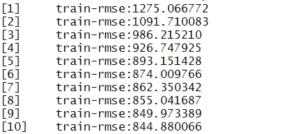
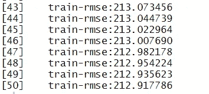
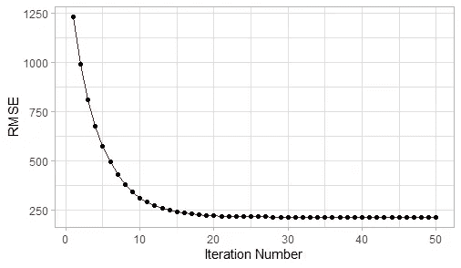
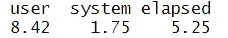

# 数据科学教程:使用 R 训练 XGBoost

> 原文：<https://towardsdatascience.com/data-science-tutorials-training-an-xgboost-using-r-cf3c00b1425>

## 了解如何使用 R 语言训练最强大的基于树的模型之一(XGBoost)


照片由 J. Kelly Brito @unsplash.com 拍摄

在我的数据科学教程的上一篇文章中，我已经展示了[如何使用 R](/data-science-tutorials-training-a-random-forest-in-r-a883cc1bacd1?sk=20e3776b9cde63314d7aa1ad12e7e4de) 训练一个随机森林。虽然随机森林是非常强大的模型，但它们受到了 boosting 算法的挑战，成为“基于树的模型的冠军”。

**一般来说，boosting 模型试图通过处理它们的错误来改进以前的树** —这种机制试图通过创建改进的学习器来减少偏差，这些学习器将试图用过去错误的子集来概括模式。boosting 算法有几种实现，比如 LightGBM 或 XGBoost。在本文中，我们将关注 XGBoost — **梯度增强算法的具体实现。**

XGBoost，或极端梯度增强，可用于回归或分类——在本文中，我们将使用回归示例。

就像我的其他数据科学教程系列一样，我们将使用[伦敦自行车共享数据集](https://www.kaggle.com/hmavrodiev/london-bike-sharing-dataset)-该数据集包含伦敦自行车共享计划的共享自行车需求信息-我们有每天和每小时的汇总数据:


伦敦自行车共享数据集的第一行

列 *cnt* 包含新自行车份额的计数。预览中显示的其他变量与天气数据相关，包括温度、湿度、风速等。

在我们的用例中，我们希望使用当天的大气数据和元数据来预测骑自行车的次数，例如，特定的一天是假日还是周末。为了简单起见，我们不会在 post 期间执行任何功能工程。

以下命令使我们能够使用 R 读取 csv 文件:

```
london_bike <- read.csv(‘./london_merged.csv’)
```

此外，我们将加载本教程所需的所有库:

```
library(dplyr)
library(xgboost) 
library(Metrics)
library(ggplot2)
```

# 分为训练和测试

让我们使用一个简单的函数来拆分数据训练和测试样本，留下 20%的数据作为性能评估的维持集:

```
# Splitting into train and test
train_test_split <- function(data, percentage) {

 data_with_row_id <- data %>% 
 mutate(id = row_number())

 set.seed(1234)
 training_data <- data_with_row_id %>%
 sample_frac(percentage)
 test_data <- anti_join(
 data_with_row_id,
 training_data,
 by=’id’
 )

 training_data$id <- NULL
 test_data$id <- NULL

 return (list(training_data, test_data))
}# Keeping 80% for the training set
training_data <- train_test_split(london_bike, 0.8)[[1]]
test_data <- train_test_split(london_bike, 0.8)[[2]]
```

我们剩下 13.931 个时间位置**(正如我们在预览中看到的，每行代表特定小时的数据)**用于训练。

如果需要，还可以使用超时维持集，而不是随机拆分数据，使用连续时间段(数据集的最后几天)作为测试集。

为了测试我们算法的目的(评估量化性能)，我们将使用 3.483 个时间位置。请记住，我们将使用均方根误差来评估我们的算法。

只剩下一步了——隔离特性和目标列。从特性开始——记住我们在本教程中不做特性工程，而是按原样使用变量*:*

```
*# Defining the features in X_train and X_testX_train <- training_data[,c('t1','t2','hum',
                                  'wind_speed','weather_code',
                                  'is_holiday','is_weekend',
                                  'season')]
X_test <- test_data[,c('t1','t2','hum',
                          'wind_speed','weather_code',
                          'is_holiday','is_weekend',
                          'season')]*
```

*正如问题陈述中所提到的，我们将希望预测在特定的小时和天将使用多少辆自行车—这意味着我们的目标将是包含相同值的列“ *cnt* ”:*

```
*# Defining the Target
y_train <- training_data$cnty_test <- test_data$cnt*
```

*设置好一切之后，让我们使用 R 来训练 XGBoost 模型！*

# *培训 XGBoost*

*我们将使用 R *中的 *xgboost* 库来训练模型。*在本例中，我们将在模型中使用 10 轮(该参数与随机森林模型中的*树数*有点“类似”):*

```
*set.seed(1234)
xgb <- xgboost(data = as.matrix(X_train),
               label = y_train,
               nround = 10)*
```

*请注意一些有趣的事情——虽然在 R 的大多数库中使用格式为 *y ~ x1 + x2 + … + xn，*的公式的概念，但是对于 *xgboost* 库却不是这样。在*数据*参数中，我们陈述特性(X ),在*标签*中，我们陈述目标(y)——这是我们创建四个不同对象的主要原因，类似于 Python 的 *sklearn* 中的一个对象。此外，XGBoost 期望数据标签上有一个矩阵，所以我们需要显式地转换我们的对象——我们可以在数据管道或函数本身中这样做。*

*使用默认参数， *xgboost* 函数输出每次迭代的 RMSE *(均方根误差)*度量(用于回归)的历史:*

**

*XGBoost 迭代结果。*

*请注意，在 10 次迭代之后，我们的 RMSE 仍然在下降——使用更高的 *nround* 参数可能是个好主意，但是我们马上就要这么做。*

*让我们也为 XGBoost 模型的执行计时:*

```
*# Timing the execution
system.time(
            xgboost(data = as.matrix(X_train),
            label = y_train,
            nround = 10)
)*
```

*这个模型在 0.41 秒左右运行——比大多数装袋模型(如随机森林)快得多。众所周知，助推模型通常比装袋模型训练起来更快。*

*我们知道，我们的 RMSE 是大约 845 辆自行车。拒绝合作的人呢？我们可以借助来自 *Metrics* 包的 *rmse* 函数，在测试集上评估我们的 XGBoost:*

```
*# Assessing performance on the test set
rmse(
 y_test, 
 predict(xgb, as.matrix(X_test))
)*
```

*这段代码将计算 *y_test —* **测试集示例** —和 *predict(xgb，as.matrix(X_test)) —* **之间的 RMSE，我们将基于 XGBoost 模型生成预测。***

*请注意，我们还将 X_test 数据帧转换为 matrix —如果删除此转换，将会出现错误，因为 XGBoost 实现需要 matrix 数据类型。*

*我们的测试集的 RMSE 是 891 bikes，类似于训练集。我们可以通过调整 *xgboost* 的一些参数来改善这一点吗？也许吧！我们来测试一下！*

# *扩展 XGBoost 超参数*

*目前，我的树只下降了 6 层——这是 *xgboost* 函数的默认参数。让我们稍微调整一下，并增加更多的迭代。*

*要向 XGBoost 模型添加一个新的超参数，只需在函数中给出一个新的参数，例如:*

```
*# Adding more hyperparameters to the XGBoost model
xgb_ext <- xgboost(data = as.matrix(X_train),
               label = y_train,
               nround = 50,
               max_depth=20)*
```

*超级简单！我们刚刚给我们的助推模型增加了一个新参数 *max_depth* 。您可以使用*为这个模型调整大量参数。xgboost* 命令在 R 中，你可以看到它们全部，包括它们的描述。**调整这些参数是提高性能和稳定性的关键。***

*正如我们在第一个*xgb boost*模型中所看到的，我们在性能方面仍有一些改进的空间——这一点似乎从我们的 *xgb_ext* 模型的输出中得到*的证实:**

**

*XGB_EXT 性能*

*注意，这最后 8 次迭代的 RMSE 比第一次 *xgb_model* 低得多。更好的是，让我们在每次迭代中可视化 RMSE:*

**

*XGBoost 迭代中的 RMSE*

*在第 20 *次*执行之后，我们的 RMSE 变平了——这种稳定是增强模型的正常行为，可能意味着您已经找到了这组特定超参数的误差**的全局最小值。***

*如果我们增加了迭代次数，那会如何影响执行时间？让我们看看。*

```
*system.time(xgboost(data = as.matrix(X_train),
                    label = y_train,
                    nround = 50,
                    max_depth=20))*
```

**

*扩展 XGBoost 的执行时间*

*这个 *xgboost* 的执行时间比前一个多一点——大约 8.42 秒。这是正常的，因为我们正在构建更复杂的树(更深的树)和更多的迭代。*

*好的，我们有一个较低的 RMSE 但是..在训练集中有一个好的结果可能是一种"*数据科学安慰剂"-*我们在看不见的数据上表现如何？*

*作为最后一项测试，让我们了解一下我们在维持集上的性能:*

```
*# Assessing Performance of Extended XGBoost
rmse(
 y_test, 
 predict(xgb_ext, as.matrix(X_test))
)*
```

*测试集的 RMSE 是 1008 辆自行车！就像在经济学中一样，在数据科学中没有免费的午餐— **我们能够在训练集中改进我们的算法，但我们最终进入了过度适应的领域，创建了一个高方差模型。***

***发生这种情况是因为我们创建了更复杂的树** —记住，基于树的模型在搜索纯节点时是贪婪的，我们越是让它们变得复杂，它们就越有可能过度拟合。 [*(如果你对我刚刚说的话感到极度困惑，可以看看这篇帖子！)*](/classification-decision-trees-easily-explained-f1064dde175e?sk=ccd305c31950f2e8c843377186e5e75f)*

*或许，我们现在应该尝试更低的最大深度参数，并保持 50 次迭代，以尝试在训练和测试误差之间取得更好的平衡— **作为一个挑战，亲自尝试一下吧！***

*感谢你花时间阅读这篇文章！如果你想看的话，我还写了一篇关于如何在 R 中训练装袋模型(随机森林)的教程:*

*[](/data-science-tutorials-training-a-random-forest-in-r-a883cc1bacd1)  

我还在 [Udemy](https://www.udemy.com/course/r-for-data-science-first-step-data-scientist/?referralCode=MEDIUMREADERS) 上开设了一门课程，从零开始学习数据科学的概念，我希望你能在我身边！

以下是一个小要点，您可以通过更改输入数据和要素将其用于您的项目:

*本文中使用的数据集受开放政府许可条款和条件的约束，可从 https://www . ka ggle . com/hmavrodiev/London-bike-sharing-dataset*获得*