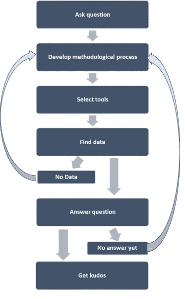

# 数据科学工作流程:它不像你想象的那样是线性的

> 原文：<https://towardsdatascience.com/data-science-workflow-its-not-as-linear-as-you-might-think-5bb163dc5b67>

伯明翰博物馆信托基金会在 [Unsplash](https://unsplash.com?utm_source=medium&utm_medium=referral) 上拍摄的照片

# 数据科学工作流程:它不像你想象的那样是线性的

## 数据科学项目中迭代过程的综合

对于数据科学领域的新手、正在参加在线课程或参加训练营的人来说，以下场景可能听起来很熟悉。

首先，你学习一种算法及其背后的理论和数学。然后给你一个带回家的案例研究来练习，比如写一个算法来对最有可能流失的客户进行分类。为了解决这个问题，您还需要一个数据集(通常是干净的)来应用算法。

回到您的计算机上，您遵循一个标准的数据争论和建模模板，该模板大致如下:数据清理、探索性数据分析、特征工程、数据预处理、模型构建和模型评估。从开始到结束是一个非常线性的过程。

这个线性过程有什么问题吗？实际上没什么错，这就是人们学习算法和发展解决问题技能的方式。唯一的问题是——现实世界中并不是这样。

的确，没有一种标准的数据科学方法，每个组织都采用不同的工作流程。但是，工作流不像我们在学习时习惯的线性问题解决任务，这也是事实。

让我们看看这个过程或多或少是如何工作的，以及它的哪一部分是迭代的。

# 发现问题

作为组织中的数据科学家，你不会因为有锤子就去搜一个钉子。大多数数据科学项目都有几个标准起点。

大多数项目都是从一个业务问题开始的——要么是已知的，要么是你必须弄清楚。一些团队手头会有定义明确的问题，比如——如何细分客户以使电子邮件营销更具成本效益？如何用机器学习(ML)改进信贷审批流程？或者如何识别客户交易中的欺诈行为？

一旦你发现了问题，你就开始考虑解决方案。

有时，企业在生产中已经有了数据科学/ML 解决方案(例如生产中的欺诈检测算法)。在这些情况下，您的责任是维护系统并监控可能的偏差，或者引入新的解决方案来改进现有的解决方案(例如，更高的准确率)。

第二个可能的起点是给定的数据集。组织通常会产生大量从未被使用过的信息。因此，作为组织中的一名数据科学家，您可以进行数据挖掘，找出您可以发现的可行见解。这些听起来像是入门级的分析问题，但企业通常会从这种见解中受益匪浅。

数据科学工作流程(来源:作者)

# 正在解决这个问题

既然你有问题要解决，自然，下一步就是找出*如何*去解决它。

你总是可以把问题分解成更小的部分。例如，如果你试图预测下一年的收入，你不会立即安装[脸书预言家](https://facebook.github.io/prophet/)并开始预测。

相反，你搜索相关信息来了解销售的历史模式；目前的销售趋势如何；市场需求趋势如何；其他竞争对手在做什么；等等。

你从不同的来源收集尽可能多的背景信息，从不同的角度理解问题——先缩小再放大。一个好的数据科学家会在进入 Jupyter 笔记本之前分配很大一部分时间做后台工作。

# 通过方法论思考

一旦你对背景研究做了尽职调查，你就*还没有*考虑模型、工具、可视化技术。

你正在思考一个方法过程，它将引导你回答这个问题。您需要列出所需的数据集，确定在哪里可以找到它们，以及如何获取数据。把别人电脑上的数据拿到你的电脑上比你想象的要难！

在头脑中有一个整体的过程或者写在纸上很有帮助。这有点类似于在学术环境中，你在实际执行研究之前写下你的研究提案；事情可能会发生变化，但你从一开始就有一个大的蓝图。

# 需要什么工具？

在这一步，你要思考哪些工具可以帮助回答这个问题。如果是预测问题，时间序列预测模型应该起作用吗？还是反而是线性回归问题？需要 GIS 技术吗？有没有好的 R 或 Python 包可以依赖？

一旦您探索了所有可用的选项并决定了一组特定的工具，您现在就可以开始搜寻数据了。您需要的数据可以是一个数百万行的数据集，也可以是一百个数据点，这取决于您的问题和您选择的模型。

你找到所选模型所需的数据了吗？如果是的话，你就可以开始构建你的模型了。但是如果你没有所有需要的输入，你应该在这里停下来，回到步骤 2 中的方法过程。也许还有其他不需要时间序列数据的工具/方法？不需要大型数据集的[系统动态模型](https://mabalam.github.io//system-dynamics/)怎么样？

照片由[猎人哈利](https://unsplash.com/@hnhmarketing?utm_source=medium&utm_medium=referral)在 [Unsplash](https://unsplash.com?utm_source=medium&utm_medium=referral) 拍摄

# 建模

如果你以前没听过，准备好震惊吧。建模是数据科学工作流程中最简单的部分。众所周知，在一个项目中，80%(或多或少)的时间花在了数据清理、特性工程等方面。

大多数模型构建和模型测试过程都是相当标准化的。例如，如果您正在实现一个分类问题:

*   首先，定义自变量和因变量，然后将数据分成训练集、验证集和测试集
*   然后运行一个基线模型(如逻辑回归)，将其他模型的性能与基线进行比较
*   接下来，运行其他几个模型——SVM、决策树、随机森林、Bagging、AdaBoost、XGBoost，数量不限——所有模型都有默认的超参数。
*   选择一个或两个性能最好的模型进行超参数调整(您能猜出为什么没有使用所有模型进行超参数调整吗？稍后我会回答)。
*   最后，您使用不同的超参数组合运行模型的几个版本，这些超参数组合是手动选择的或者通过 GridSearch 过程选择的。

上面的过程，经过一些迭代，给了你你正在寻找的性能最好的模型。现在，您可以将您的模型移交给工程团队进行生产了。

# 制作和后期制作

您可能会使用 Jupyter notebook 或类似的环境进行模型实验，但这不会投入生产。大中型组织将有独立的工程团队，他们负责将您的代码转换成更有效的产品质量代码，并将其投入生产。

这里我应该注意的重要一点。根据您的实验，性能最好的模型可能无法投入生产。最终的选择取决于几个因素，比如模型的可解释性、复杂性和维护代码库的难度。

# 数据科学项目不是线性的

现在谈谈我要说的第二点。

从上面的描述来看，数据科学项目似乎是以线性方式进行的——从问题识别和数据准备到模型构建并将其投入生产。但事实上，这与现实相去甚远。

数据科学是一个迭代的过程。你必须在项目的各个部分之间来回切换。例如，您的模型性能显示出有希望的结果，但您意识到不同的特征工程技术可能提供更好的精度。

你还需要得到利益相关者的认同，包括你的同事。他们会有你不能忽视的重要建议和推荐。这个咨询过程贯穿整个项目，甚至在你认为已经完成的时候。

一旦模型投入生产，这并不是过程的结束。你继续监控模型性能。您需要注意几件事情——模型对样本外数据的表现是否也一样？否则，您可能需要使用新的和额外的数据重新训练模型，或者更改超参数。

你要注意的另一件事是模型漂移。模型漂移是指模型性能的任何偏差(逐渐或突然)或意外行为。这可能是由于基础数据的变化(例如客户群的变化)或模型假设(想想在 COVID 之前建立的预测模型，以及在 COVID 期间它有多有用)而导致的。

# 最后的想法

对于数据科学项目，没有一刀切的做法。每个组织，无论大小，都有其构建和部署模型的标准操作程序。

但有一件事是真的——它从来都不是一个单向的线性过程。数据科学是一个迭代过程，永无止境。即使一个模型今天运行良好，你也不知道几个星期后你是否必须让它退役。

在我结束之前，我将回答我之前提出的问题—为什么选择超参数调优的模型子集？答案是，模特培训可能是资源密集型和高成本的。训练一个模型可能需要很长时间和很大的硬件能力。如果这些是组织的约束因素，最好选择较少的建模选项进行实验，特别是如果您非常确信剩余的选项都不好的话。

感谢您的阅读。请随意[订阅](https://mab-datasc.medium.com/subscribe)以获得我即将发表的文章的通知，或者通过或 [LinkedIn](https://www.linkedin.com/in/mab-alam/) 与我联系。