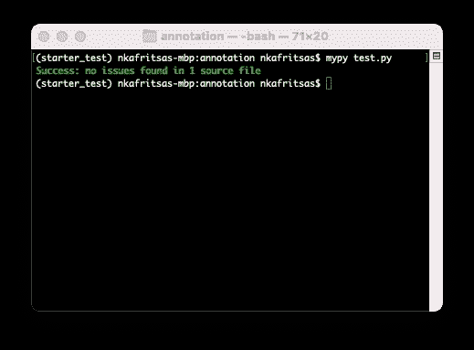
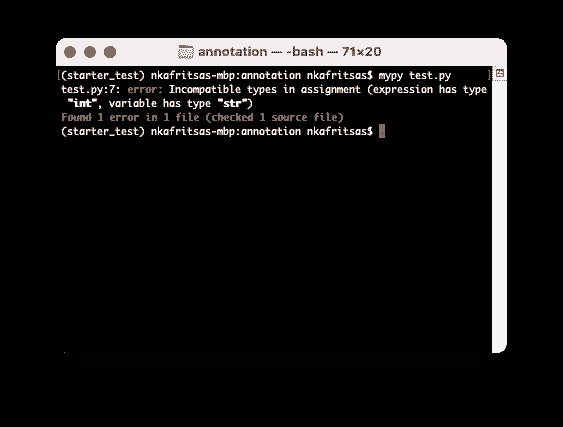
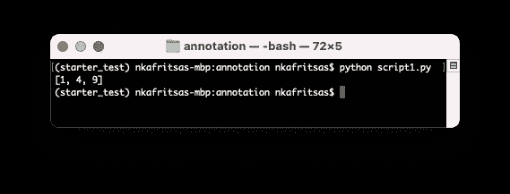
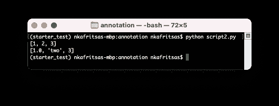
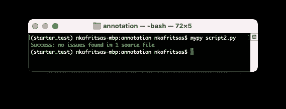
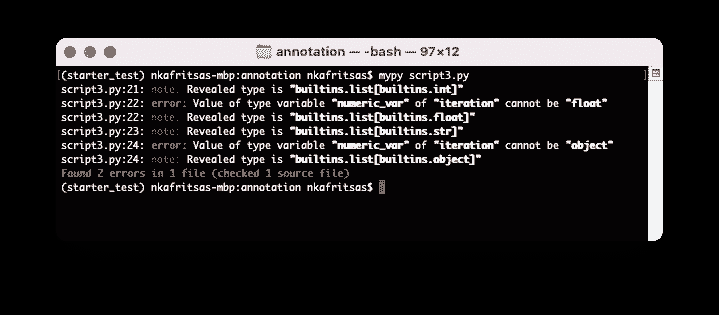
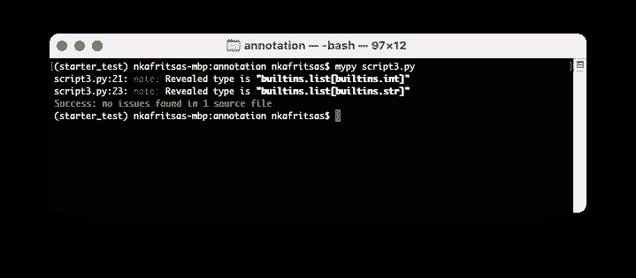

# 数据科学:用静态类型编写健壮的 Python

> 原文：<https://towardsdatascience.com/data-science-write-robust-python-with-static-typing-c71b9c9c8044>

针对 Python 3.10 进行了更新


[翁贝托](https://unsplash.com/@umby?utm_source=medium&utm_medium=referral)在 [Unsplash](https://unsplash.com?utm_source=medium&utm_medium=referral) 上的照片

编程语言有两种:**静态类型**和**动态类型**语言。

Python 是一种动态类型语言。您不必显式指定变量的数据类型。函数也是如此:您不必指定参数的类型或函数的返回类型。

换句话说，没有代码编译—**Python 解释器在运行时执行类型检查—** 在代码执行期间。

另一方面，在静态类型语言中(比如 **Java** )，必须声明每个变量的数据类型。因此，类型检查在编译时完成。这就是为什么静态类型语言通常更快，但更冗长。

有了 **PEP 3107** 和 **PEP 484** ，我们就可以使用 Python 中的 ***类型注释*** 来注释数据类型。然而，Python 仍将是一种动态语言。类型提示的作用是帮助您编写干净和健壮的代码。

有两种主要类型的注释:

*   **变量注释**
*   **功能注释**

但是首先，让我们演示一个案例，说明为什么类型注释是有益的。

# **迷你示例**

假设我们有一个简单的*熊猫*数据框架和电影评论。我们希望执行一些基本的预处理，然后将结果存储在一个新的变量中:

`reviews_cleaned`变量现在是一个*系列*而不是一个*数据帧。因为`reviews` *数据帧*只有一列，所以很容易忽略这一点。*

让我们看看是否可以使用类型注释来提高 Python 代码的可读性。

# 可变注释

我们在声明变量时使用它们。在变量后，添加一个分号，后跟一个空格( **PEP** standard)和变量的类型:例如:

我们还可以注释**非原语**变量，比如 ***列表*** 、 ***元组、*** 和 ***字典*** :

当然，我们可以标注**数据科学相关的**模块如 ***熊猫*** 和****NumPy****:**

***注:**如果导入别名不是`pd`和`np`的*熊猫*和 *numpy* ，则相应更改注释。*

# *函数注释*

*我们还可以注释函数/方法参数及其返回类型。让我们看一个例子:*

*函数`sum_2_numbers`计算两个数的和。然而，因为`+`操作符是重载的，所以它的行为有所不同:对于整数/浮点数，该函数计算它们的总和。对于字符串，函数`sum_2_numbers`输出它们的连接。*

*我们可以通过为参数和返回值添加*类型注释*来使函数`sum_2_numbers`更加清晰。我们使用以下格式(**粗体**显示我们添加的注释):*

*`*function_name (argument_name***: argument_type***)* **-> return_type:**`*

*使用注释，函数`sum_2_numbers`就变成了:*

*该函数接受两个整数作为输入，并输出一个整数。*

> ***注意:**用户仍然可以传递 float 和 string 数据类型——注释只是提示而不是要求。*

*但是，我们可以使用一个工具来强制进行类型检查。*

# *输入 Mypy:在运行时强制类型检查*

*2012 年，当时的博士生 Jukka Lehtosalo 开始了一个被称为 ***Mypy* 的兼职项目。***

*Mypy 最初被设想为 Python 的一个变种，具有无缝的动态和静态类型。最初，它是作为一门独立的语言开始的。然后，它被重写为一个外部库，与 Python 兼容。*

*首先，安装库:*

```
*$ pip install mypy*
```

*然后，我们编写以下脚本来演示 *Mypy* 如何工作:*

*最后，使用 *Mypy* 运行脚本。您应该会看到以下输出:*

**

*让我们故意创建一个错误来检查 *Mypy 的行为。*将变量`age` 的类型从 **int** 改为 **str** 并运行脚本。您应该看到以下内容:*

**

*Mypy 已经成功检测到`age`应该是类型 **str。**感受自由进行你的实验，检查 *Mypy* 如何工作。*

# *高级注释*

*到目前为止，我们已经了解了 Python 中类型注释的基本工作原理。Python `Typing`模块包含许多不常用的注释类型。让我们来看看其中的几个:*

## ***可调用***

*在 Python 中， ***Callables*** 既可以是函数也可以是类(如果它们实现了`__call__`方法)。*

*在这里，我们将重点讨论函数。当一个函数是另一个函数的参数时，我们使用来自`Typing`模块的*可调用*提示。让我们看一个例子:*

*我们得到以下输出:*

**

## *联盟*

*当一个变量可以有多种类型时，我们使用联合。*

*在前面的例子中，`square`函数被注释为只接受整数。实际上，我们也可以计算浮点数的平方。我们可以使用 **Union** 注释来添加这个功能:*

*输出与之前相同。`square`函数现在可以接受整数或浮点数。*

*在 Python 3.10 ( **PEP 604** )中，我们可以用管道运算符代替 **Union。**我们可以将`square`函数重写如下:*

## *没有人*

*没有返回值的函数怎么办？在静态类型语言中，我们通常使用特定的关键字。比如在 *Java* 中，我们使用 **void** 关键字。*

*在 Python 中，我们可以使用常规的 **None** 关键字:*

# *任何的*

*另一方面，我们可能希望让变量不受约束——与每种类型兼容。我们可以使用 **Any** 注释来实现这一点:*

*大多数开发人员避免使用 **Any** 注释，因为它没有贡献任何价值——我们还不如完全跳过注释。*

*我们以后会看到更好的选择。*

## *顺序*

*在某些情况下，我们的函数可能期望某种类型的序列，并不真正关心输入是一个*列表*还是一个*元组*。一般来说， ***序列*** 是实现`__getitem__()`方法的任何东西。*

*让我们看一个如何使用来自`Typing`模块的*序列* 注释的例子:*

*我们得到以下输出:*

**

*我们也可以使用 *Mypy* 来验证类型检查:*

**

## *TypeVar —泛型简介*

*在前面的脚本中，我们的序列可以处理任何类型的变量，因为我们使用了 **Any** 注释。然而，这使得我们的代码有点模糊。*

*在许多情况下，我们希望对函数可以接受的变量类型加以限制。*

*假设我们希望 **script2.py** 到中的`iteration`函数只接受带有 **str** 或 **int** 值的序列。我们可以使用`TypeVar` 变量——一个**类型变量**,让我们声明一个**泛型**类型:*

*我们声明了一个名为`numeric_var`的新类型变量，它接受*字符串*和*整数。*因此，`iteration`函数现在接受包含**整数**或**字符串**的**序列**，但不是两者都包含。*

*我们还使用了 *Mypy* 的`reveal_type`功能。这个函数告诉我们 Mypy 如何解释我们的类型提示。*

*让我们使用 *Mypy* 运行脚本。我们得到以下输出:*

**

*Mypy 发现了 2 个错误，这是我们预料到的。问题出在`l2`和`t2`变量上。具体来说，`l2`列表包含浮点，而`t2`元组包含整数和字符串。*

*要解决这个问题，注释掉`t2`和`l2`变量并再次运行:*

**

*现在，类型检查没有发现任何错误。 *Mypy* 找到了两个变量，一个包含*整数*的*列表*和一个包含*字符串的*元组*。**

# *Python 3.9 中的变化*

*从 Python 3.9 开始(特别是 [PEP 585](https://www.python.org/dev/peps/pep-0585/) )，一些类如`tuple`和`list`现在是泛型类型。因此，使用类型类本身代替`Typing`模块现在是首选。例如:*

*Python 3.8 之前使用`Typing`模块的注释语法(也适用于 Python 3.9 以上版本):*

*在 Python 3.9+中，我们还可以编写:*

*如果我们进行导入，有一个在 Python 3.8 中运行上述代码的变通方法:*

*就我个人而言，我仍然对`Typing`模块使用注释语法，因为许多项目仍然这样做。兼容性第一。*

# ***回到我们的例子***

*现在，我们准备向初始的`annotation_demo`脚本添加注释。然后，脚本变成:*

*本质上，我改变了两件事:*

1.  *对`preprocessing`函数进行了修改，以接受带注释的参数并返回带注释的值。*
2.  *`reviews`和`reviews_cleaned`变量分别被正确标注为**熊猫数据帧**和**熊猫系列**。*

# *结束语*

*Python 中的类型提示提供了一种编写清晰易读的代码的好方法。记住 Python 的[禅](https://en.wikipedia.org/wiki/Zen_of_Python) — **可读性很重要！***

*通过注释，Python 采用了静态类型风格，类似于其他流行的语言。*

*此外，Python 还有许多我们在本文中没有涉及的其他注释类型。*

*我个人并不是全部都用。然而，我总是使用函数/方法注释:其他开发人员应该能够立即理解您的函数/方法签名，而无需额外的努力！*

# *感谢您的阅读！*

*   *订阅我的[简讯](/subscribe/@nikoskafritsas)！*
*   *在 Linkedin 上关注我！*