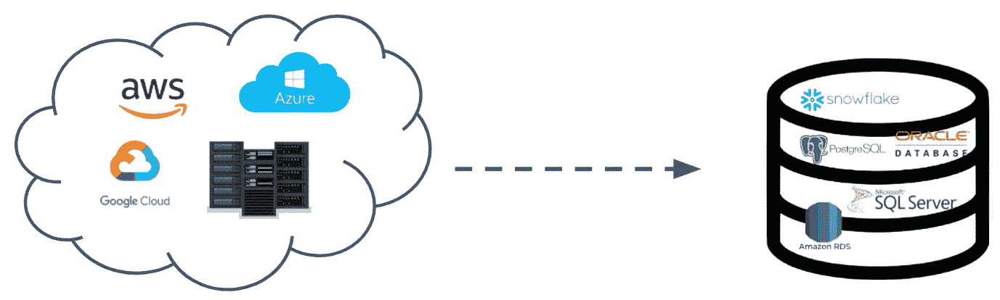
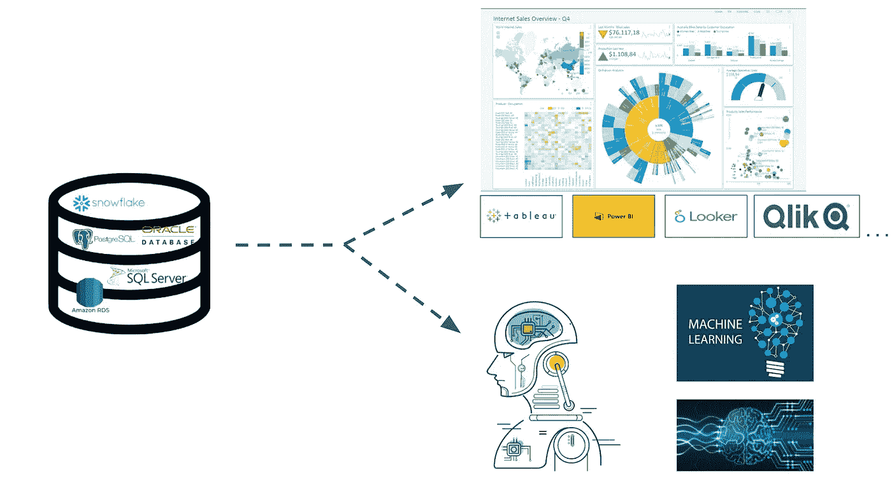
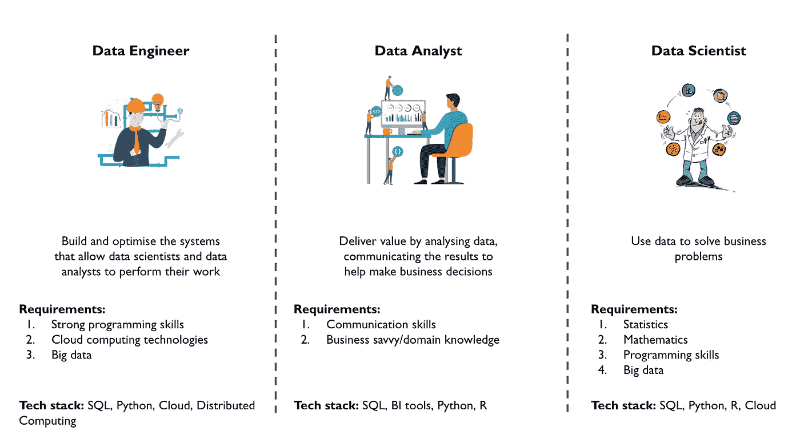

# 数据科学家 vs 数据分析师 vs 数据工程师

> 原文：<https://towardsdatascience.com/data-scientist-vs-data-analyst-vs-data-engineer-1e2514a36d41>

# 数据科学家 vs 数据分析师 vs 数据工程师

## 在数据领域找到你真正的激情

奥布里·奥多姆在 [Unsplash](https://unsplash.com?utm_source=medium&utm_medium=referral) 上的照片

> 数据是新的石油。
> 
> 数据科学家，21 世纪最性感的工作。
> 
> 没有数据分析，公司就像瞎子和聋子。
> 
> ……

数据科学已经成为近年来最热门的职业之一。市场的高需求、丰厚的报酬、丰厚的支票和性感的职位头衔都让新毕业生或正在寻找职业改变的人热衷于进入这一领域。然而，数据团队中的职称和工作分配可能会令人困惑。“*我喜欢摆弄数据*”、“*我是一个数据驱动的人*”都不足以在数据领域找到最适合你的职业。最糟糕的情况可能是浪费大量时间去申请你根本不适合的工作，或者得到一份你认为自己感兴趣但实际上并不感兴趣的工作，最终失去激情。

我花了一些时间才真正理解数据团队中每个角色之间的区别。当我第一次申请这个领域的工作时，我犯了两个错误。

第一个是，我申请了所有标题中有“数据”的工作，仅仅是因为我不知道其中的区别，并认为“我会先进入这个领域，一切都会自行解决”。数据工程师、数据架构师、业务分析师、数据分析师、数据科学家、商业智能分析师、数据大师、数据大师，应有尽有。只要这个角色与数据有关，它就在我的申请列表中。这非常耗时，效率极低，而且毫无目标。

第二个错误是不知道我真正想对数据做什么。最初，我认为我会成为一名数据科学家，因为我喜欢数据，这是最性感的头衔。在开始从事实际项目后，我意识到我真正喜欢的是分析数据，找出洞察力，并为商业决策做出贡献，这更像是一名数据分析师。

这个故事旨在帮助你理解数据团队中这三个角色的作用，因此希望能帮助你找到真正让你兴奋的事情。

为了说明团队中每个角色的作用，我们首先需要了解数据从生成到呈现在业务决策者面前的过程。让我们以一个电子商务网站为例，从 30000 英尺的高度浏览数据。

# 数据之旅

当你登录网站浏览商品时，你的所有行为都会被跟踪和监控。你浏览了什么产品，你如何将鼠标悬停在页面上，你在网站上停留了多长时间，你的用户旅程是什么，你购买了什么，你花了多少钱，等等。这些信息(数据)被记录下来并发送到一个地方，通常是云。它可以由 AWS、Azure、GCP 等提供商或本地服务器托管。

作者图片

在这个阶段，数据通常以非常原始的形式存储，甚至可能没有结构化。为了使这些数据可供查询，我们需要将它们移动到数据库中。根据您的需求，有许多种具有不同特征、用途和功能的数据库可供选择。数据清理和转换也将发生在这个阶段。例如，将数据结构转换成表格格式、将 JSON 中的数据扁平化、基于业务逻辑的聚合、数据验证等。

这个过程就是我们所说的 ETL，提取(从云中)，转换(数据)，加载(到数据库中)。(现代基础设施支持 ELT，即将数据加载到数据库后进行转换。我们将在另一个故事中讨论这个问题。)

这个阶段的目的是为数据消费者提供一组干净的、经过验证的和可用的数据。

作者图片

现在，可用的数据就在数据库中。对此我们可以做两件主要的事情。要么分析数据并找到洞察力以做出商业决策，要么使用数据作为材料来构建一些有趣的产品，如机器学习、深度学习、NLP、推荐系统等。

作者图片

# 每个角色的职权范围

## 数据分析师

数据分析师是数据消费者之一。数据分析师回答关于**现在**的问题，例如:*现在发生了什么？原因是什么？你能给我看看 XYZ 吗？我们应该做些什么来避免/实现 ABC？过去 3 年的趋势如何？我们的产品卖得好吗？*

让我们重新思考什么是数据。**数据是已经发生的事情**。数据驱动的决策意味着我们审视已经发生的事情，解读其中的洞见，然后在此基础上采取下一步行动。数据分析师的工作包括 3 个主要部分:

1.  理解指标/业务问题，即提出正确的问题。
2.  从数据中找出答案或者更多的感悟。
3.  交流。这包括创建具有适当可视化的仪表板，并以易于理解的方式向非技术利益相关者解释它们。

**技能要求**

1.  SQL:这对于所有与数据相关的角色与数据库进行交互是必不可少的。
2.  数据可视化:更重要的是知道如何以适当的方式可视化数据，而不是你使用的工具。大多数公司都有授权的商业智能工具，如 Power BI、Tableau、Looker、Qlik 等。你不需要知道如何使用它们。如果你理解数据分析的核心概念，你应该不会花很长时间去学习其中的任何一个。
3.  领域知识:我认为领域知识对数据分析师来说比其他角色更重要。*指标代表什么？指标之间是如何相互作用的？什么是指针移动器？*这些领域知识对于提出正确的问题、发现真知灼见以及做出商业决策是必要的。

## 数据科学家

数据科学家是另一个数据消费者。他们不是回答关于现在的问题，而是试图在数据中寻找模式，并回答关于未来的问题，即预测。这种技术其实早就存在了。你一定听说过，它叫*统计*。机器学习和深度学习是利用计算机的能力在数据中寻找模式的两种最流行的方法。数据科学家也基于这些预测开发产品。例如，推荐系统预测你喜欢什么，排名系统预测受欢迎程度，NLP 预测一个句子的意思。数据科学家构建这些产品不是为了帮助做出商业决策，而是为了解决商业问题。

描述数据科学家的最佳方式是“用数据解决公司问题”的人。这可能是任何事情，取决于公司的规模。你可能会看到一个数据科学家在一家小公司里做很多分析师和工程师的工作。在一个更大的公司，他们更有可能关注我们刚刚谈到的内容。

**技能要求:**

1.  SQL:这对于所有与数据相关的角色与数据库进行交互是必不可少的。
2.  统计学/数学:你必须掌握统计学知识，如每种机器学习方法背后的理论，概率等，以解决更复杂的问题。这一部分非常学术和理论化，这就是为什么大多数数据科学家角色需要硕士或博士学位。
3.  编程技能:要应用统计学知识解决现实世界的问题，你必须具备编程技能。训练模型、编写算法、构建下一代产品都在一台笔记本电脑上完成。数据科学是一门结合了计算机科学和统计学的学科。目前，Python 和 R 是最流行的编程语言。
4.  软件开发:就像任何其他工程师一样，软件开发技能对于与其他利益相关者合作至关重要。Git 工作流、CI/CD、DevOps 等都是数据科学家的基本工具。

## 数据工程师

数据分析师和科学家是如何获得数据的？用户行为的数据是如何进入数据库的？我们如何确保数据是可靠的？答案是数据工程师。如果没有数据工程师建立整个结构，数据消费者就无法完成他们的工作。他们构建数据管道，将数据从用户设备接收到云，然后再接收到数据库。简单地说，数据到达数据库之前发生的一切都由数据工程师负责。

数据工程师最关心的是:

1.  如何将不同来源的数据接收到一个目的地，供分析师和科学家使用。
2.  确保数据管道、存储、数据结构得到优化，并对公司最具成本效益。
3.  确保分析师和科学家使用的数据是最新、最有效和最可靠的。他们不会因为数据不正确而做出错误的决策。

**技能要求**

1.  SQL:此外，数据工程师应该了解每个不同数据库的来龙去脉，何时使用哪个，它们的优势是什么。有时需要了解 DBA(数据库管理)命令，如监控团队成员的访问、编写程序、维护模式以优化数据库性能。
2.  云计算:由于现在几乎所有的数据都在云上，从存储到数据库再到仓库，工程师必须非常熟悉云计算技术。AWS(亚马逊)、Azure(微软)和 GCP(谷歌)是市场上最受欢迎的三大云服务。这也包括并行计算(Hadoop、Spark)和大数据的应用。
3.  软件开发:同上。

# 摘要

用一句话概括每个角色，

> 业务决策由数据分析师推动。
> 
> 数据科学家解决商业问题。
> 
> 数据工程师使数据分析师和科学家能够完成他们的工作。

作者图片

尽管不同公司的实际情况因规模和组织结构而异，但每个角色的主要目的不应该与我们刚刚讨论的相差太远。不太可能看到数据分析师摆弄 AWS 并建立数据管道，而数据工程师在 Looker 中构建仪表板。然而，数据科学家可以做任何事情。在他的视频中，霍马很好地解释了[在不同规模的公司中组织会是什么样子。他还非常清晰地介绍了数据科学的历史以及什么是真正的数据科学。](https://www.youtube.com/watch?v=xC-c7E5PK0Y&t=13s)

最后，我强烈建议不要只看头衔，而要仔细看职位描述，真正了解这个角色在他们公司做什么，以及这些日常工作是否符合你的期望。

 [## 通过我的推荐链接-何尚谦加入媒体

### 作为一个媒体会员，你的会员费的一部分会给你阅读的作家，你可以完全接触到每一个故事…

hoooching.medium.com](https://hoooching.medium.com/membership)