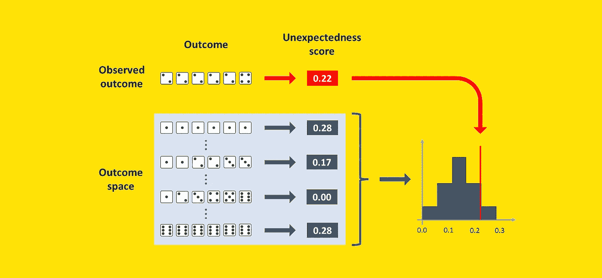
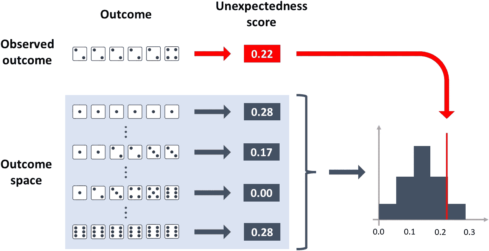
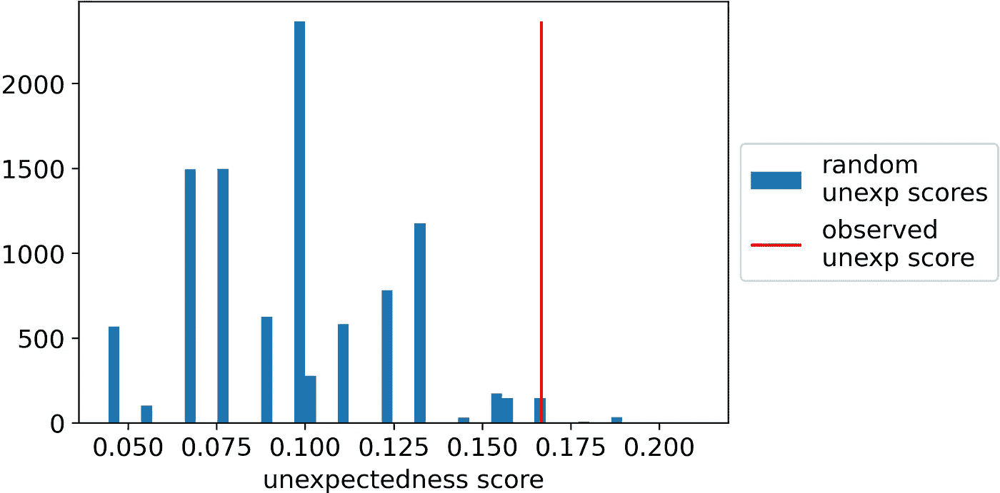
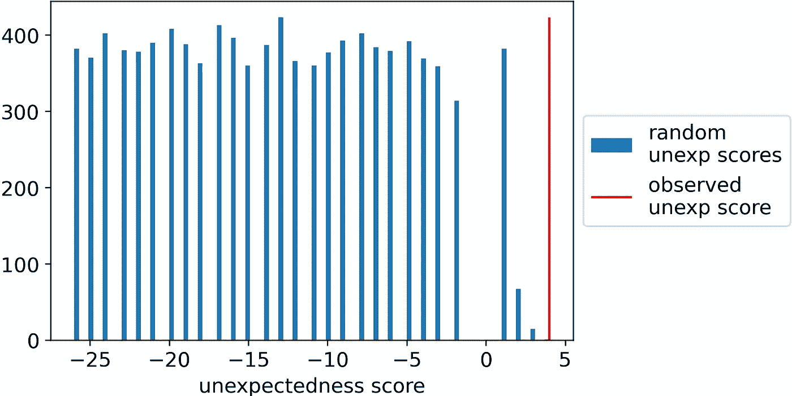
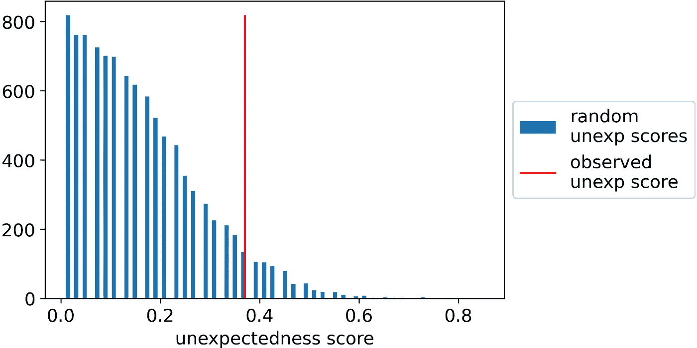
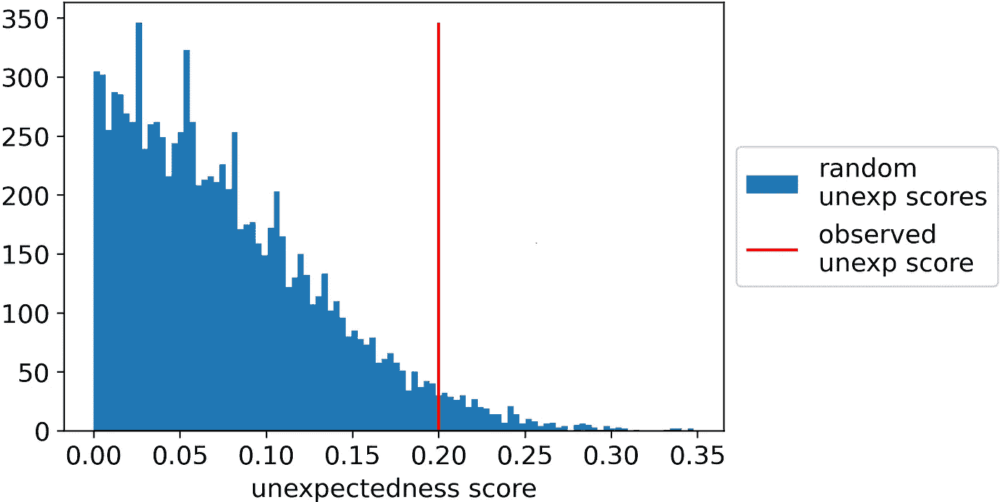

# 数据科学家只需要知道一个统计测试

> 原文：<https://towardsdatascience.com/data-scientists-need-to-know-just-one-statistical-test-3115b2ff26fd>

## 读完这篇文章后，你将能够检验任何可能的统计假设。用独特的算法。



[图片由作者提供]

截止到今天的，维基百科总共统计了 [104 次统计测试](https://en.wikipedia.org/wiki/Category:Statistical_tests)。因此，数据科学家可能会感到不知所措，并问自己:

> “我应该知道他们所有人吗？我如何知道何时使用其中一个？”

我在这里向你保证:作为一名数据专业人员，你只需要知道一个测试。不是因为 1 个测试重要，其他 103 个可以忽略不计。而是因为:

> 所有的统计测试实际上都是同一个测试！

一旦你真正掌握了这个测试是如何工作的，你将能够测试你需要的任何假设。

想要证据吗？在本文中，我们将解决 4 个不同的统计问题。我们会用相同的算法来解决它们。

1.  你已经掷出了 10 次骰子。你得到了[1，1，1，1，2，2，2，3，3]。模具装好了吗？
2.  你的朋友声称一些拼字游戏的瓦片从袋子里掉了出来，巧合的是，这些字母组成了一个真正的单词:“F-E-A-R”。你怀疑你的朋友只是想取笑你。你的朋友在撒谎吗？
3.  在一项客户满意度调查中，100 名客户对产品 A 的平均评分为 3.00，对产品 b 的平均评分为 2.63，这种差异显著吗？
4.  你训练了一个二元分类模型。在您的测试集(由 100 个观察值组成)上，它在 ROC 曲线下的面积为 70%。模型是否明显优于随机？

在深入研究这些问题的答案之前，让我们试着了解一下统计测试的本质。

# 任何统计检验的深刻含义是什么？

我试着用统计学中最不原始的例子来回答这个问题:骰子的投掷。

想象一下，你投了六次骰子，你得到了[2，2，2，2，4]。有点可疑，不是吗？你不会期望 6 次中有 5 次得到相同的数字。至少，如果死亡是公平的，你不会期望它发生*。*

这正是统计测试的要点。

你有一个假设，叫做“零假设”，你想测试它。因此，你问自己:

> “如果假设是真的，我得到的结果和我实际得到的结果一样可疑的几率有多大？”

在骰子的例子中，问题变成了:“如果骰子是公平的，我多久会得到一个像[2，2，2，2，4]这样意想不到的序列？”既然你问的是“多长时间一次”，那么答案必然是一个介于 0 和 1 之间的数字，其中 0 表示从不，1 表示总是。

> **在统计学中，这种“多频繁”被称为“p 值”。**

在这一点上，推理的路线是相当琐碎的:**如果 p 值非常低，那么这意味着你最初的假设很可能是错误的。**

请注意,“出乎意料”的概念与您正在测试的特定假设密切相关。例如，如果你认为骰子是公平的，那么结果[2，2，2，2，4]就很奇怪。然而，如果你认为骰子在 75%的情况下都是装载到数字“2”中，这就不足为奇了。

# 统计测试的要素

阅读前一段，你可能已经猜到我们需要两种成分:

1.  可能结果的分布，取决于零假设。
2.  衡量任何结果的“不可预测性”。

关于第一个因素，得到结果的全部分布并不总是简单的。通常，**随机模拟大量结果**更方便(也更容易):这是真实分布的一个很好的近似值。

关于第二个要素，我们需要定义**一个将每个可能的结果映射成一个数字**的函数。这个数字必须表示结果有多出乎意料，假设零假设为真:结果越出乎意料，这个分数就越高。

一旦我们有了这两个要素，工作基本上就完成了。实际上，计算分布中每个结果的未预期分数和观察结果的未预期分数就足够了。

**p 值是随机得分高于观察得分的百分比。**

就是这样。这就是每一个统计测试的工作原理。

这是我们刚刚描述的流程的图示:



如何计算公平骰子的零假设下 outcome [2，2，2，2，2，4]的 p 值？[图片由作者提供]

# 独特的统计测试

但是我们如何在 Python 中实现呢？算法如下:

1.  定义一个函数`draw_random_outcome`。这个函数应该返回随机试验的结果，假设零假设为真。它可以是一个数字、一个数组、一个数组列表、一个图像，实际上可以是任何东西:这取决于具体的情况。
2.  定义一个函数`unexp_score`(代表“意外得分”)。该函数应该将实验结果作为输入，并返回一个数字。这个数字必须是结果出乎意料程度的分数，假设它是在零假设下产生的。分数可能是正数，负数，整数，或者浮点数，都没关系。它必须具有的唯一属性如下:**结果越不可能，这个分数就必须越高**。
3.  多次(例如 10，000 次)运行函数`draw_random_outcome`(在第 1 点定义)，对于每个随机结果，计算其`unexp_score`(在第 2 点定义)。将所有的分数存储在一个名为`random_unexp_scores`的数组中。
4.  计算观察结果的`unexp_score`，称之为`observed_unexp_score`。
5.  计算有多少随机结果比观察到的结果更出乎意料。也就是说，数一数`random_unexp_scores`有多少个元素比`observed_unexp_score`高。这是 p 值。

**根据具体情况，前两步是唯一需要一点创造力的步骤**，而第 3、4 和 5 步则完全是机械的。

现在，为了更具体，让我们看一下例子。

# 例 1。滚动骰子

我们已经发射了 10 次骰子，并获得了这样的结果:

```
observed_outcome = np.array([1,1,1,1,1,2,2,2,3,3])
```

无效假设是骰子是公平的。在这个假设下，很容易提取随机结果:用 Numpy 的`random.choice`就够了。这是我们算法的第一步:

```
**# step 1** def draw_random_outcome(): return np.random.choice([1,2,3,4,5,6], size=10)
```

第二步是定义一个名为`unexp_score`的函数，该函数应该为每个可能的结果分配一个不可预测的分数。

如果骰子是公平的，我们期望每张脸平均出现六分之一的时间。所以我们要检查每张脸的观察频率和 1/6 的距离。然后，为了获得单个分数，我们应该取平均值。这样，距离六分之一的平均距离越高，结果就越出人意料。

```
**# step 2** def unexp_score(outcome): outcome_distribution = np.array([np.mean(outcome == face) for face in [1,2,3,4,5,6]]) return np.mean(np.abs(outcome_distribution - 1/6))
```

至此，困难的部分已经完成:正如我之前所说，算法的步骤 3、4 和 5 完全是机械的。

```
**# step 3** n_iter = 10000random_unexp_scores = np.empty(n_iter)for i in range(n_iter):
  random_unexp_scores[i] = unexp_score(draw_random_outcome())**# step 4** observed_unexp_score = unexp_score(observed_outcome)**# step 5** pvalue = np.sum(random_unexp_scores >= observed_unexp_score) / n_iter
```

得到的 p 值为 1.66%，这意味着在零假设下，只有 1.66%的结果像[1，1，1，1，1，2，2，2，3，3]一样出乎意料。

出于好奇，这是一个直方图，显示了意外得分的分布以及观察得分的确切位置。



掷出 10 次骰子的意外得分。无效假设:骰子是公平的。观察结果:[1，1，1，1，2，2，3，3]。[图片由作者提供]

# 例 2。拼字迷

你的朋友声称一些拼字游戏的瓦片从袋子里掉了出来，巧合的是，这些字母组成了一个真正的单词:“F-E-A-R”。你怀疑你的朋友在戏弄你。如何统计检查你的朋友是否在说谎？

首先，观察到的结果是一系列字母，因此是一个字符串:

```
observed_outcome = 'FEAR'
```

假设袋子里有 26 个字母。无效假设是随机数量的字母(在 1 到 26 之间)以随机的顺序从袋子里掉出来。因此，我们将不得不使用 Numpy 的`random`来表示字母的数量和字母的选择:

```
**# step 1** def draw_random_outcome(): size=np.random.randint(low=1, high=27) return ''.join(np.random.choice(list(string.ascii_uppercase), size=size, replace=False))
```

现在，如何评价这个场景中的意外？

一般来说，我们有理由认为从袋子里掉出来的字母越多，就越不可能找到一个真正的单词。

因此，我们可以使用这个规则:如果字符串是一个现有的单词，那么它的得分将是该单词的长度。如果字符串不是一个真实的单词，那么它的分数将是单词长度的减。

所以这是算法的第二步(注意:你必须`pip install english-words`让下面的代码工作)。

```
**# step 2** from english_words import english_words_setenglish_words_set = [w.upper() for w in english_words_set]def unexp_score(outcome): is_in_dictionary = outcome in english_words_set return (1 if is_in_dictionary else -1) * len(outcome)
```

步骤 3、4、5 总是相同的，因此我们将从上一个示例中复制并粘贴它们:

```
**# step 3** n_iter = 10000random_unexp_scores = np.empty(n_iter)for i in range(n_iter):
  random_unexp_scores[i] = unexp_score(draw_random_outcome())**# step 4** observed_unexp_score = unexp_score(observed_outcome)**# step 5** pvalue = np.sum(random_unexp_scores >= observed_unexp_score) / n_iterThis is the result:
```

这是结果:



字母表中随机字符串的意外分数。零假设:随机选择一些字母，字母的顺序也是随机的。观察结果:“恐惧”。[图片由作者提供]

在这种情况下，p 值为 0.0，因为没有随机得分高于观察得分。所以，根据这个统计测试，你的朋友在撒谎！

# 例 3。两个平均值之间的差异

您要求 100 名客户对您的两种产品进行评级:产品 A 和产品 b。您获得了以下评级:

```
product_a = np.repeat([1,2,3,4,5], 20)product_b = np.array([1]*27+[2]*25+[3]*19+[4]*16+[5]*13)observed_outcome = np.mean(product_a) - np.mean(product_b)
```

结果计算为产品 A 的平均评分(3.0)和产品 B 的平均评分(2.63)之间的差异，在本例中为 0.37。

因为您想要测试平均评分之间的差异是否显著，所以零假设是产品 A 和产品 b 之间没有差异。如果这是真的，我们可以在两个产品之间调换评分。

因此，函数`unexp_score`将获取所有 200 个评分，对它们进行洗牌，随机分配 100 个给 A，剩余的 100 个给 b。然后，它将计算两个平均值之间的差异。

```
**# step 1** def draw_random_outcome(): pr_a, pr_b = np.random.permutation(np.hstack([product_a, product_b])).reshape(2,-1) return np.mean(pr_a) - np.mean(pr_b)
```

根据两种产品之间没有差异的假设，均值之间观察到的差异应该很小。因此，离零越远的结果值就越出人意料。所以我们可以把结果的绝对值作为意外得分:

```
**# step 2** def unexp_score(outcome): return np.abs(outcome)
```

步骤 3、4、5 总是相同的，因此我们将从上一个示例中复制并粘贴它们:

```
**# step 3** n_iter = 10000random_unexp_scores = np.empty(n_iter)for i in range(n_iter):
  random_unexp_scores[i] = unexp_score(draw_random_outcome())**# step 4** observed_unexp_score = unexp_score(observed_outcome)**# step 5** pvalue = np.sum(random_unexp_scores >= observed_unexp_score)/ n_iter
```

这是结果:



均值间差异的意外得分。零假设:均值之间没有差异。观察结果:0.37。[图片由作者提供]

这种情况下的 p 值为 6.82%。因此，在传统的统计测试中，如果您将阈值设置为 1%或 5%，您应该会得出平均评级之间没有显著差异的结论。

# **例 4。ROC 曲线下面积**

假设你训练了一个预测模型，它在测试数据集上 ROC 下有 70%的面积。好消息，对吧？但是测试集仅由 100 个观察值组成。那么你怎么证明这个结果是否显著呢？

想象这些是你的初始元素:

```
y_test = np.random.choice([0,1], size=100, p=[.9,.1])proba_test = np.random.uniform(low=0, high=1, size=100)observed_outcome = .7
```

无效假设是你的模型与随机模型没有什么不同，所以如果你只是打乱你的预测并计算`roc_auc_score`，你会得到一个在无效假设下产生的结果:

```
**# step 1** def draw_random_outcome(): return roc_auc_score(y_test, np.random.permutation(proba_test))
```

一个结果有多出乎意料？由于我们正在处理 ROC 曲线下的区域，其中 50%表示随机分类器，因此当它进一步远离 50%时，结果更加出乎意料，因此我们的函数`unexp_score`可以是`roc_auc_score`和 50%之间的绝对差值:

```
**# step 2** def unexp_score(outcome):
  return np.abs(outcome - .5)
```

步骤 3、4、5 总是相同的，因此我们将从上一个示例中复制并粘贴它们:

```
**# step 3** n_iter = 10000random_unexp_scores = np.empty(n_iter)for i in range(n_iter):
  random_unexp_scores[i] = unexp_score(draw_random_outcome())**# step 4** observed_unexp_score = unexp_score(observed_outcome)**# step 5** pvalue = np.sum(random_unexp_scores >= observed_unexp_score) / n_iter
```

这是结果:



ROC 曲线下面积的意外分数。零假设:预测模型与随机模型没有区别。观察结果:70%。[图片由作者提供]

p 值为 2.25%，因此观察到的结果并不像我们最初认为的那样“令人惊讶”。如果你设置阈值为 1%，遵循统计测试的经典规则，你不能拒绝你的模型不比随机模型好的假设。

# 那么，为什么所有这些统计测试？

如果你已经走到这一步，你可能会想:如果这么容易，为什么还存在这么多的测试？答案大多是“历史”。

曾几何时，计算比现在昂贵得多，因此“统计测试”基本上是高效计算 p 值的捷径。由于我们所看到的算法的第一步和第二步有如此多的选择可能性，测试激增。

如果你想深化这个话题，可以读一下艾伦·唐尼的经典之作[《只有一个测试》](http://allendowney.blogspot.com/2011/05/there-is-only-one-test.html)，正是它启发了本文。


*感谢您的阅读！我希望你喜欢这篇文章。如果你愿意，* [*在 Linkedin 上加我*](https://www.linkedin.com/in/samuelemazzanti/) *！*