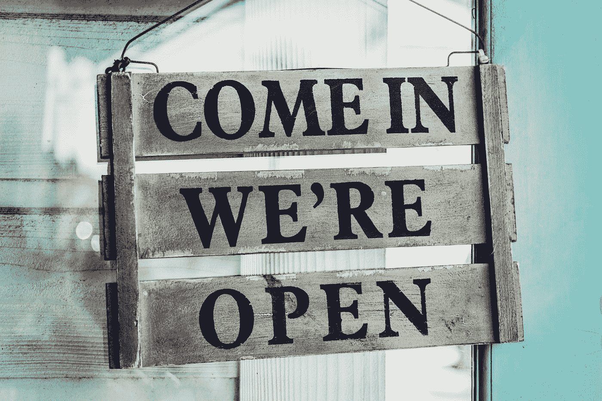
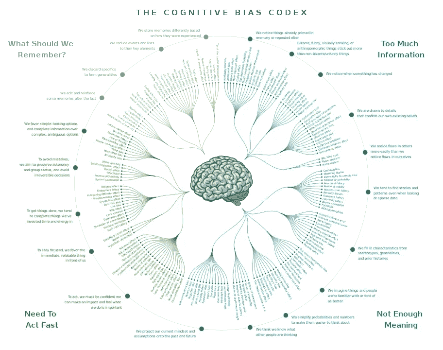

# 你如何建立你的批判性思维？

> 原文：<https://towardsdatascience.com/data-scientists-you-need-that-skill-how-to-build-critical-thinking-9891c833eacd>

## 数据科学家的软技能

## 数据科学家，你需要这个技能。

蒂姆·莫斯霍尔德在 [Unsplash](https://unsplash.com?utm_source=medium&utm_medium=referral) 上的照片

C 批判性思维使用逻辑来联系想法和评估事实，以建立对某一情况的信念。换句话说，批判性思考者逻辑地使用信息来建立更好的理解和解决问题。对于任何以推断客观信息和形成现实解决方案为目标的职业来说，这都是一项重要的资产。

> "能够接受一种思想而不接受它是一个受过教育的人的标志。"——亚里士多德

知道了人类大脑中大约有 200 种认知偏差，就更加需要发展这种技能。

设计者:John Manoogian III 类别和描述:Buster 实现:TilmannR —该文件源自:认知偏差法典— 180+偏差，由 John Manoogian III (jm3)设计。巴新:、CC BY-SA 4.0、[https://commons.wikimedia.org/w/index.php?curid=69756809](https://commons.wikimedia.org/w/index.php?curid=69756809)

# 但是为什么它对数据专业人员如此重要呢？

数据专业人员是有洞察力的数据点和业务之间的纽带，带来了引导变革和推动影响的责任和机会。

> “能力越大，责任越大——彼得·帕克”

照片由[与 Raj](https://unsplash.com/@roadtripwithraj?utm_source=medium&utm_medium=referral) 在 [Unsplash](https://unsplash.com?utm_source=medium&utm_medium=referral) 上的公路旅行拍摄

## 好得难以令人相信

[根据世卫组织](https://www.who.int/news/item/07-05-2021-joint-statement-on-transparency-and-data-integrityinternational-coalition-of-medicines-regulatory-authorities-%28icmra%29-and-who)，数据完整性对于确保可信度、透明度和质量是必要的，也是合乎道德的。批判性思维帮助你退后一步，挑战你手中数据的完整性。你可能已经经历过一个很好的例子:

> 你有多少次立刻开始处理数据集？
> VS
> 停下来问自己:这些数据对解决问题真的有意义吗？

假设数据是干净的、正确记录的、甚至与问题相关的，可能会导致错误的结论和结果，这些结论和结果往往好得令人难以置信。使用批判性思维来质疑数据本身的可靠性，避免做出令人尴尬的错误决策。

## 专注于能带来价值的东西

我相信你已经听说过兔子洞了。

Benoit Beaumatin 在 [Unsplash](https://unsplash.com?utm_source=medium&utm_medium=referral) 上拍摄的照片

它描述了这样一个时刻，我们迷失在小细节中，以至于看不到全局，错过了交付企业想要的东西。批判性思维意味着在形成观点之前，你从更广泛的角度询问数据，以形成对问题更客观的分析，并对你试图解决的问题有更深刻的理解。

## 必备技能

因此，作为一名数据专家，批判性思维可以帮助你提出正确的问题，并专注于事实，同时保持直觉。它鼓励你在收集数据时拓宽视野，并挑战数据与你正在解决的问题的相关性。最后但同样重要的是，批判性思维将帮助你不断保持好奇心，这可以带来更多创新的解决方案。

# 好吧。那么，如何去努力呢？

## 愿意犯错。

批判性思维的困难在于，它需要接受错误，或者至少对你的真理有一定程度的怀疑。它意味着愿意失败，说实话:没人喜欢这样。充其量就是不舒服。最糟糕的是，这很痛苦。

> 它不需要你有任何特殊的天赋。任何人都可能错。

你需要的是培养你对脆弱的接受和更深刻的谦卑感。这并不有趣或令人愉快，但对你的个人成长至关重要。走那条路，你一定会很快感到无比强大！

## 给自己时间和空间。

也许你可以开始给自己时间和空间来思考，用 5 个“为什么”技巧来挖掘“为什么”,以找到问题的根源，而不是专注于问题的症状。

来源:Mindtools

我喜欢冥想，给自己空间和时间。有些人喜欢锻炼身体或写日记。但也可以是一些简单的事情，比如从你的日历中清理掉所有不重要的会议和事件，或者坐 30 分钟喝杯咖啡。对你有用的就行！

  

## 让你的周围充满不同的思想。

不要把自己与你的视角隔离太久，否则你可能会陷入众所周知的[确认偏差](https://en.wikipedia.org/wiki/Confirmation_bias)。相反，我会建议你和各种背景的人在一起，让他们尽最大努力剖析你的逻辑。积极地使信息和逻辑的来源多样化，将会强化不被对世界的单一认知所束缚。

做好准备；会很疼的。不要针对任何人。这与你无关。这是关于开放和寻求真相的更高版本。所以保持你的头脑灵活，你会获得你可能从未考虑过的观点。这就是成长。

**更多关于确认偏差以及如何应对的信息**在这个来自[的视频中，Cassie Kozyrkov](https://www.linkedin.com/in/kozyrkov/) — *谷歌第一任首席决策科学家，主题演讲人，《与机器学习交朋友》的创始人*

## 承认你的失败。

分享你的成功非常有利于激励和建立自信，分享你的失败也是如此！通过分享我们的学习经验，也就是错误，我们正常化了不知道所有事情也没关系。我们允许更多的合作和信任，因为我们知道我们可以寻求帮助，如果有问题，我们可以一起努力解决。研究表明，了解他人的挑战可以提高全球绩效和效率。

> “你不能掩盖你的失败，而是要公开谈论它们，分析哪里出了问题，这样你才能学习新的决策规则”[斯蒂芬·沙兹曼](https://www.linkedin.com/in/stephenschwarzman/)

实话实说吧；分享失败很难！因为在某件事上失败是一种无能的表现，这与我们的自尊背道而驰。但它也可以缓解和乐趣！不要相信我的话；参加由 Fuckup Nights 组织的活动或在线观看他们的视频。这是难以置信的宣泄和鼓舞人心的。

  

## 求一个安全的环境。

因此，为了培养这种能力，你需要一个让失败正常化的环境，一个开放的实验和反思的环境。这是一个安全的地方，在这里你可以从你认为正确的事情后退一步，并挑战它。在这个空间里，你的队友有权提醒你注意自己的盲点或个人倾向。大多数公司都很难做到这一点，因为他们过于关注结果。研究表明，为了产生这种安全感，工作场所应该提倡更多以学习和透明度为中心的价值观，从领导者开始，他们应该更加公开自己的错误。因为什么比以身作则更好呢？

✌️观看 TEDx 视频“如何建立心理安全的工作场所？”：

## 扩展你的知识面。

另一种扩展你的认知和挑战你内心真实的方法是尽可能广泛地阅读。一个典型的错误是从我们有限的经验中过度推断。拓宽你经验的一个方法是阅读不同作者的不同主题。任何有助于开阔你视野的高质量的东西都是有价值的。

如果你想阅读更多关于如何培养批判性思维的书籍，我会向你强烈推荐这些书:

1.  [*思考，快与慢*作者丹尼尔·卡内曼](https://www.goodreads.com/book/show/11468377-thinking-fast-and-slow)
    这本书将你的注意力带到你的思考过程:好的、坏的、丑陋的。它带来意识，最终帮助你做出更明智的决定。
2.  [*永不停止学习:保持相关性，重塑自我，茁壮成长*](https://www.amazon.com/Never-Stop-Learning-Relevant-Reinvent/dp/163369285X?tag=wwwfccom-20) 作者布拉德利·斯塔茨
    这本书是一个很好的起点，让你接受自己并非无所不知，并成为一名更好的学习者。它可以帮助你承认自己的错误，并将他人视为成长的源泉，而不是竞争。
3.  [*在赌注中思考:在没有掌握所有事实的情况下做出更明智的决定*作者安妮·杜克](https://www.goodreads.com/en/book/show/35957157-thinking-in-bets)
    当我写这篇文章的时候，我还在读这本书，并且非常喜欢。这是关于接受你的决策过程中的不确定性，并尽可能得到最好的结果。我相信这在进行数据分析或建立模型时非常重要。

给你一些工具和想法来培养你的批判性思维。如果我想让你从这篇文章中得到什么，那就是:

> **批判性思维需要开放性。**

对真相的不同版本持开放态度，对错误和脆弱持开放态度，对失败持开放态度。所以给自己一点时间；这是一个旅程，而不是目标！

一如既往的给我留下你的评论和[留言](https://www.linkedin.com/in/aureliegiraud9000/)；我将很高兴收到您的来信，并改进这篇文章。在 Medium 上关注我，了解更多关于数据科学的内容。

  

这篇文章的灵感来自 J [奥登·莫罗](https://www.linkedin.com/in/jordanmorrow/)的一篇帖子，以及专家和同行的评论:[古平顺、](https://www.linkedin.com/in/koopingshung/) [苏珊·沃什、](https://www.linkedin.com/in/susanewalsh/) [唐·甘农-琼斯](https://www.linkedin.com/in/concentrateddon/)、[伊万娜·尤尔基夫](https://www.linkedin.com/in/ivanna-jurkiv-9168b5a5/)、[布莱恩·威利特](https://www.linkedin.com/in/brian-willett-3a72393/)、[乔尔·夏皮罗、](https://www.linkedin.com/in/joelkshapiro/) [梅根·s .](https://www.linkedin.com/in/megan-stanley-seattle/)、[安波·托罗-基奇](https://www.linkedin.com/in/amber-toro-keech/)、

 