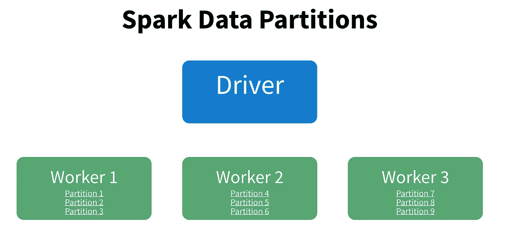
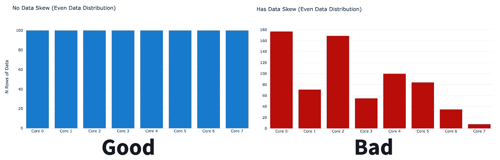
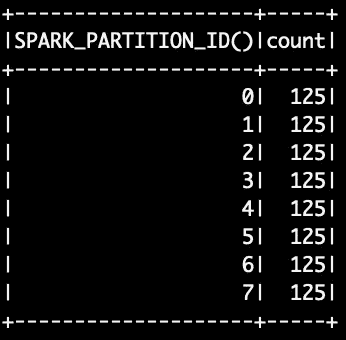
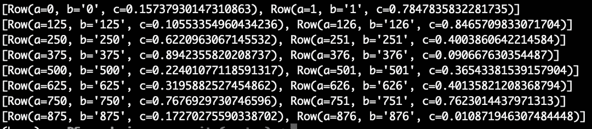
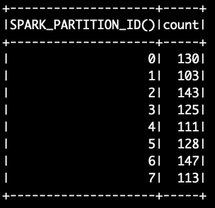

# PySpark 数据在 5 分钟内出现偏差

> 原文：<https://towardsdatascience.com/data-skew-in-pyspark-783d529a9dd7>

## 正是您需要的，仅此而已


约翰·巴克托在 [Unsplash](https://unsplash.com?utm_source=medium&utm_medium=referral) 上拍摄的照片

有很多关于数据偏斜的过于复杂的帖子，这是一个看似简单的话题。在这篇文章中，我们将在 5 分钟内讲述必要的基础知识。

这篇文章的主要来源是 [Spark:权威指南](https://www.amazon.com/Spark-Definitive-Guide-Processing-Simple-ebook/dp/B079P71JHY)，这里是[代码](https://github.com/mberk06/DS_academic_papers/blob/master/39_spark_partitions.py)。

让我们开始吧…

# 什么是数据不对称？

在 spark 中，数据被分成行块，然后存储在 worker 节点上，如图 1 所示。



图 1:数据分区如何存储在 spark 中的例子。图片作者。

每个单独的数据“块”被称为一个**分区**，一个给定的工作者可以拥有任意数量、任意大小的分区。但是，最好将数据均匀分布，以便每个工人都有等量的数据要处理。

**当工人之间的数据不平衡时，我们称之为“偏斜数据”**

如果我们的机器有 8 个 worker 节点，而不是上面显示的 3 个，那么一个完美分布的数据集在每个节点上会有相同数量的行，如图 2 左侧所示。另一方面，具有不对称的数据集在一些内核上有大量数据，而在其他内核上只有很少的数据。



图 2:均匀(左)与不均匀(右)数据偏斜。图片作者。

# 我为什么在乎？

很好，我们知道什么是不对称，但它对我们的应用有什么影响？数据不对称的一些常见结果是…

*   **运行缓慢的阶段/任务:**某些操作会花费很长时间，因为给定的工作人员正在处理太多的数据。
*   **将数据溢出到磁盘**:如果数据不适合工人的内存，它将被写到磁盘[，这将花费更长的时间](https://medium.com/road-to-data-engineering/spark-performance-optimization-series-2-spill-685126e9d21f)。
*   **内存不足错误**:如果 worker 用完了磁盘空间，就会抛出一个错误。

> 数据不对称意味着计算和内存资源的利用率不均衡。

# 如何判断我的数据是否有偏差？

如果你正在经历上述的一些症状，并且预期你的数据是偏斜的，你可以使用下面的方法来诊断。

```
import pyspark.sql.functions as F
df.groupBy(F.spark_partition_id()).count().show()
```

上述代码确定了对数据帧进行分区的键。这个键可以是数据集中的一组列，默认的 spark [HashPartitioner](https://stackoverflow.com/questions/31424396/how-does-hashpartitioner-work) ，或者一个[自定义 HashPartitioner](https://blog.clairvoyantsoft.com/custom-partitioning-spark-datasets-25cbd4e2d818) 。

让我们来看看输出…



图 3:每个 spark_partition_id 的行数。图片作者。

在图 3 中，我们可以看到创建的演示数据没有出现偏差——每个分区中的所有行数都是相同的。太好了，但是如果我想看到每个分区中的数据呢？

为此，我们将访问底层 RDD，并按分区提取数据…

```
df.rdd.glom().collect()
```

`.glom()`返回列表列表。第一个轴对应于给定的分区，第二个轴对应于该分区中的`Row()`对象。在图 4 中，我们打印了每个分区中的前 2 个`Row()`对象——打印 8 个分区中的所有 125 个`Row()`对象并不容易阅读。



图 4:df . rdd . glom()的输出。collect()被截断到每个分区的前 2 行。图片作者。

很酷，对吧？

提醒一句，当使用`.glom()`方法时，你很容易让你的记忆超载。如果您正在处理大型数据集，请确保进行缩减采样，以便您收集的任何内容都可以放入 RAM 中。

# 如何纠正数据倾斜？

尽管有上面的例子，但在现实世界中，完美的数据分布是罕见的。通常在读取数据时，我们会从预分区文件或 ETL 管道中提取数据，这些文件或管道可能不会自动很好地分发。

要解决这个问题，有两个主要的解决方案…

## 1.按列重新分区

第一种解决方案是根据脚本中的转换对数据进行逻辑上的重新分区。简而言之，如果您正在分组或连接，通过 groupBy/join 列进行分区可以提高 [shuffle](https://sparkbyexamples.com/spark/spark-shuffle-partitions/#:~:text=The%20Spark%20SQL%20shuffle%20is,sql.) 的效率。

```
df = df.repartition(<n_partitions>, '<col_1>', '<col_2>',...)
```

## 2.盐

如果您不确定哪些列会导致应用程序的工作负载均匀，您可以使用随机 salt 在内核之间均匀分布数据。我们所做的就是用一个随机值创建一个列，用该列进行分区…

```
import pyspark.sql.functions as Fdf = df.withColumn('salt', F.rand())
df = df.repartition(8, 'salt')
```

为了检查我们的盐是否有效，我们可以使用与上面相同的 groupBy

```
df.groupBy(F.spark_partition_id()).count().show()
```



图 salted keys 的分布示例。图片作者。

如您所见，每个分区的行数有一些变化，但是我们的键分布相当均匀。

# 结论

现在，所有其他复杂的帖子都有宝贵的信息——正确划分数据可以对应用程序性能产生巨大影响。然而，有了上面的信息，你(希望)有一个框架来搜索你的解决方案。

也就是说，这里有一些更复杂的快速提示:

*   你可以在 Spark UI 中查看任务速度的分布。这很有帮助！
*   通常最好让分区的数量是工作线程数量的倍数。
*   这里有一个关于 spark 操作层级的[快速概述](https://stackoverflow.com/questions/42263270/what-is-the-concept-of-application-job-stage-and-task-in-spark?rq=1)。
*   洗牌会导致数据被重新分区。一个好的分区将最小化程序所需的数据移动量。
*   如果你想要一个关于分区大小的超级实用和高级的资源，查看[这个视频](https://www.youtube.com/watch?v=_ArCesElWp8&ab_channel=Databricks)。

*感谢阅读！我会再写 12 篇文章，把学术研究带到 DS 行业。查看我的评论，链接到这篇文章的主要来源和一些有用的资源。*