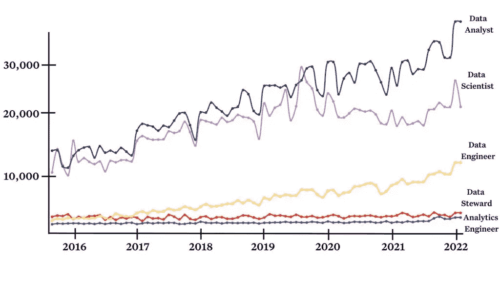
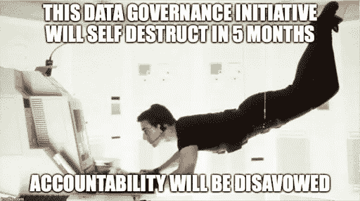
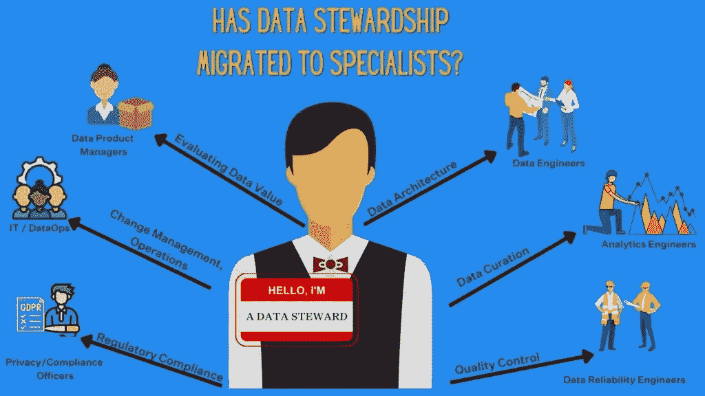
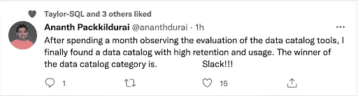
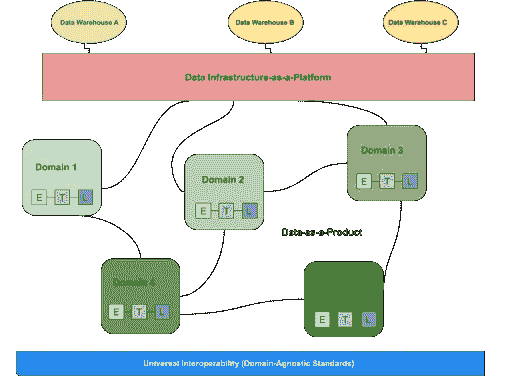

# 数据管理员的座位最差

> 原文：<https://towardsdatascience.com/data-stewards-have-the-worst-seat-at-the-table-e115ec65b639>

## 意见

## 数据管理员的工作是不可能的。以下是为什么以及我们可以做些什么来增强他们的能力。

在他 2017 年的开创性博客文章中， [**数据工程师**](https://maximebeauchemin.medium.com/the-downfall-of-the-data-engineer-5bfb701e5d6b) 的垮台，Maxime Beauchemin 写道，数据工程师的座位最差。

从那时起，数据技术和团队发生了巨大的变化，现在，Apache Airflow 和 Apache Superset 的现任首席执行官和创造者对该行业的未来有了一个[更光明的前景](https://www.montecarlodata.com/blog-the-future-of-the-data-engineer/)。

随着数据从仪表板扩展到机器学习模型、面向客户的应用程序和记录系统，我也看到了曾经是吃力不讨好的职位转变为公司价值的战略驱动力。

那么，如果数据工程师不再坐在最差的位子上，那么数据团队中的谁会继承这个不幸的头衔呢？

当你推断出 Maxime 的一些原始标准时——乏味的任务、低认知度、缺乏权威和操作蠕变的受害者—**数据管家成为显而易见的选择。**

在你发出愤怒的推特之前，我这么说不是出于对这些越来越挑剔的专业人士的鄙视。事实上恰恰相反。

数据管家角色旨在解决当今数据领域的一些最困难的挑战:治理、法规遵从性和访问。戴着这顶帽子的杰出人士已经盯着大数据风暴的眼睛，并向前迈出了一步。

不幸的是，他们很少成功。

原因如下。

# 数据管家的发展

正如我们今天所认识到的那样，2000 年代是第一次出现数据管理员角色的时代。无意中，这也是紧随万维网、电子邮件和个人电脑的广泛使用而出现的。

从一开始，**数据管理员的角色就与数据治理和元数据管理紧密交织在一起**。然而，管理者也在旨在驯服大数据“5 v”的计划中发挥了领导作用:数量、价值、多样性、速度和准确性。

这意味着像数据质量、可访问性、可用性、变更管理、商业智能和法规遵从性这样的职责通常属于管理者的权限范围。

在接下来的 15 年里，从高层管理人员的象牙塔中推出的、旨在对每一项数据资产进行编目的整体数据治理计划**将在自身的重压下屈服。**

然后在 2016 年，欧盟宣布了 [GDPR](https://gdpr.eu/what-is-gdpr/) ，这是一项突破性的、影响深远的数据隐私法规，对违规行为处以严厉的经济处罚。这将带来一波新的跨地区、跨国家、甚至跨州的以数据为中心的监管浪潮(你好 [CCPA](https://oag.ca.gov/privacy/ccpa) ！).

为了遵从法规，组织意识到他们需要更好地了解他们的 PII 和敏感数据在哪里，以及这些数据是如何流经他们的系统的。

这其中很大一部分开始落到精通特定法规的信息安全和隐私团队身上，但它**确实帮助数据管理员更接近行动。**

# 数据团队比较

因为我们是数据人员，所以让我们在深入研究随着时间的推移使数据管理员角色变得不那么有吸引力的其他因素之前，让这个分析更加量化一点。

如果我们认为总搜索量是特定领域的需求和兴趣的粗略表示，我们可以看到数据管家在过去 6 年左右的时间里保持相对静态。

与此同时， [**最差席位**](https://maximebeauchemin.medium.com/the-downfall-of-the-data-engineer-5bfb701e5d6b)****前数据工程师在 2016 年超过数据管家搜索量，同期增长 18 倍。****

甚至像分析工程师这样较新的职位也有类似的工作量，但在过去 6 年里增长了 8 倍。

当然，搜索量并不能衡量一个角色的价值或整体的工作满意度。数据可靠性工程师和数据产品经理等新兴角色的搜索量较低，但对数据团队仍至关重要。

# 不可能的任务:数据管家

如果您选择接受，那么您的任务，即数据管家，就是记录公司中所有数据资产的传承、使用、合规性、业务逻辑、质量、访问、风险和价值，以及我们的政策和流程。

一如既往，如果你们在这个不断扩大的任务中失败，我们将否认对这些行为的任何责任。这项治理计划将在五个月后自毁。

换句话说，从数据管事的工作描述写出来的那一刻起，这些专业人员就发现自己完成任务的可能性很小。

虽然记录和编目关键资产和敏感数据是可能的，也是明智的，但是**数据管理员或他们的领导经常采取最大化的方法。**

对于管理和治理的最大化方法，过于强调策略(记录所有数据资产)，而不是注重目标的实用方法(让我们轻松使用和理解我们的高价值数据)。

数据治理的过程也提出了一些棘手的问题，比如:什么是数据资产？企业中不同实体的关系和所有权是什么？为什么需要这个过程？

虽然一些数据领导者积极主动地与数据消费者一起定义需求并设置 SLA，但其他人只是外包给数据管理员(或数据保管人),并抱着最好的希望。

利用机器学习的现代数据解决方案——如数据目录、数据发现或数据可观察性解决方案——可以通过呈现关键元数据(如读/写、所有者、模式更改和团队对话)来使治理更加实用。

# 责任大，权力小

数据管理员的责任仍然存在，但是他们的权力已经不存在了。

随着现代数据平台的发展和数据价值的增长，数据团队变得更加专业化。

**从数据运营专家和数据可靠性工程师到数据产品经理和分析工程师，数据管家的职责已经被新一代的数据专业人员所取代**。

系统变得越来越复杂，需要更多的技术知识来维护；收集有价值的见解变得更加复杂，需要更多的商业智慧；数据产品变得更有价值，需要更多的市场知识来预见未来的发展。

随着数据团队努力实现数据访问的民主化和实施自助服务机制，传统管家的另一个关键角色——守门数据——实际上已经消失了。

数据集的上下文信息在松散的渠道中快速、猛烈、随心所欲地发生，而不是忠实地记录在目录中。

[来源](https://twitter.com/ananthdurai/status/1518938561491394560)。

dbt 等技术也发挥了作用，使工程师能够将原始数据整理到分析层。

所有这些过程都需要某种程度的治理，但是其中许多现在已经超出了数据管理员的控制范围。剩下的是其他人都不想要的责任:对数据和元数据进行记录、编目和分类。

提醒和**催促过度工作的工程师记录他们已经从任务清单上划掉的项目是一项吃力不讨好但很重要的工作。**鼓励数据团队遵循程序也是如此。

这让我想起了 Maxime 最初博客中关于数据工程师没落的一段话:

"*现代团队行动迅速，无论您的组织是工程驱动型、项目管理驱动型还是设计驱动型，也无论它是否愿意将自己视为数据驱动型，数据工程师都不会经常工作。你必须将它视为一个基础设施角色，人们认为这是理所当然的，并在它被破坏或未能实现其承诺时引起他们的注意。”*

一个被认为是理所当然的基础设施角色，除非它被打破或没有实现它的承诺？我们确定他指的不是数据管理员吗？

# 当数据管家成功时

让数据管家取得成功并不是让通才承担本应由专家承担的责任。

相反，我们应该认识到整个数据团队的权威已经开始分散(我敢说，数据网格？)和**也分散了数据管理员的角色。**

数据网格涉及分散的架构，数据团队的成员嵌入到业务的不同领域，这可以增加数据管理员成功完成任务的机会。图片由作者提供。

换句话说，如果您的团队有数据管理员，那么将他们嵌入到每个域中。

现代数据治理和管理方法还必须超越描述数据的*到理解数据目的的*。**

数据生产者描述资产的方式可能与数据消费者理解资产功能的方式大相径庭，甚至数据消费者之间在理解数据含义方面也可能存在巨大差异。

**领域优先的管理方法**可以更好地对文档进行优先排序，设置需求，并为业务运营工作流中的数据赋予共享的含义。

Clearcover 高级数据工程经理 [Braun Reyes](https://www.linkedin.com/in/braunreyes) 描述了他的组织如何成功部署了类似的策略。

> *我们最初试图让数据治理更像一个集中化的功能，但不幸的是，这种方法并没有获得成功。*
> 
> *我们无法交付价值，因为更广泛的数据和分析组织中的每个团队都负责不同组件和不同复杂程度的数据资产。一刀切的集中式治理方法行不通，也不会扩展。*
> 
> *我们有了更多的联合方法，详见* [*数据网格原则*](https://www.montecarlodata.com/blog-what-is-a-data-mesh-and-how-not-to-mesh-it-up/) *。每个数据域都有一个数据管理员，为数据治理之旅做出贡献。*
> 
> 现在，适当的激励措施已经到位。归根结底是所有权的问题。治理必须是每个人的问题，而且必须易于参与。
> 
> *当每个生成数据的服务都是一个拥有数据和合同的人的域时，治理效果最好。*
> 
> *这是他们的数据，他们的企业关系图(ERD)，以及他们记录如何使用这些数据的责任。我们仍处于早期阶段，但开始看到真正的结果和价值。*

布劳恩的另一条建议？

> *用可追踪的指标设定具体目标。我们还实施了“管理分析”,例如，如果 50%的管理数据缺少文档，这种分析就会浮出水面。*
> 
> 然后，我们可以与该域的管理员进行对话，并找出如何删除阻止程序。

# 数据管家的未来

数据管家的演变让我想起了软件工程中 DevOps 的演变。

安全性和质量保证不是瀑布式流程中的独立阶段，而是在整个应用程序生命周期中自始至终紧密地集成在一起。

数据管理员可能会遇到类似的未来，他们被嵌入到数据运营团队中，并且他们的职责被广泛同化。毕竟，治理不是每个人的责任吗？

感受这种痛苦？[我洗耳恭听](https://www.linkedin.com/in/barrmoses/)