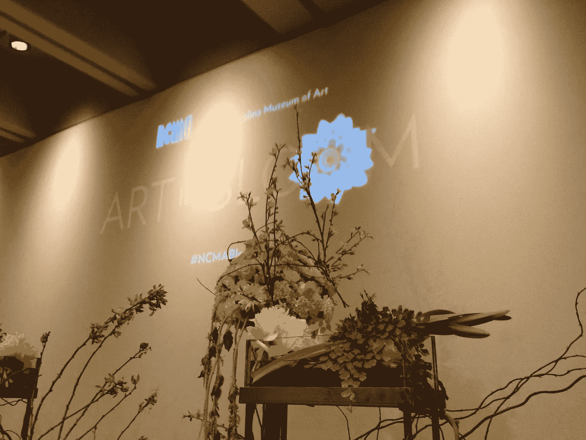
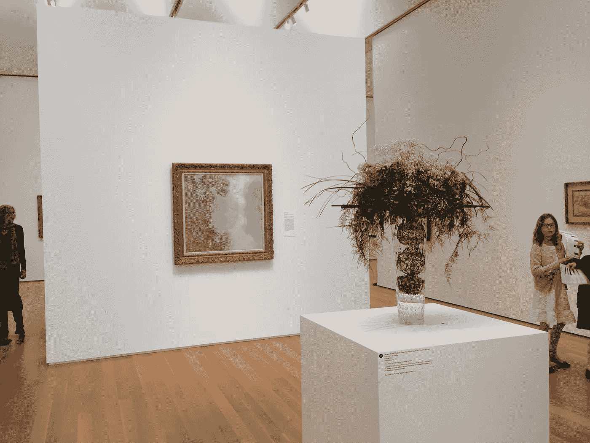
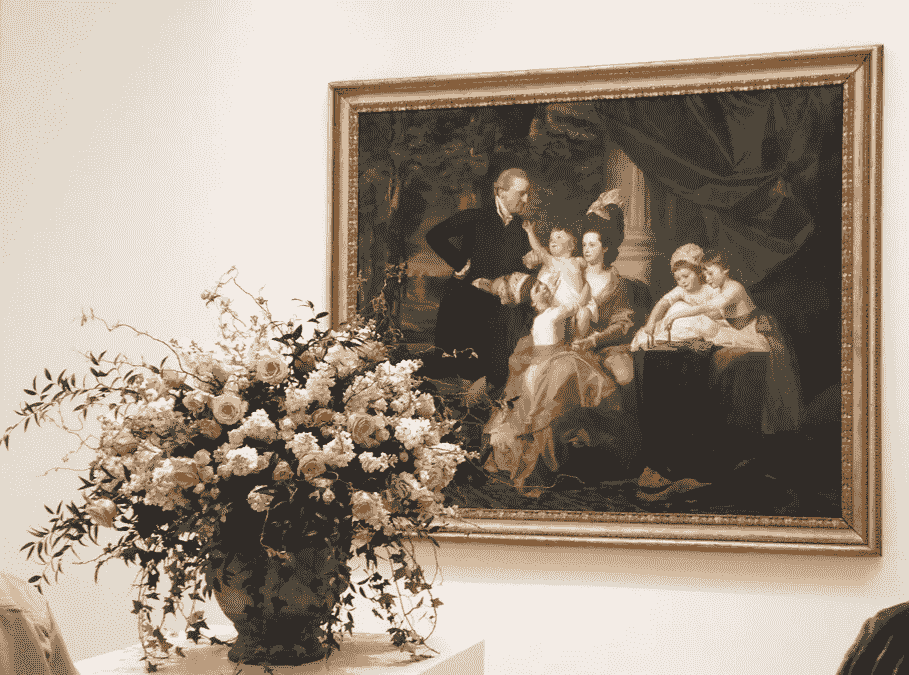
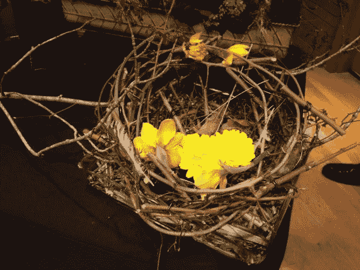
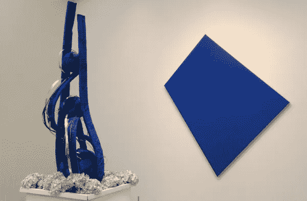
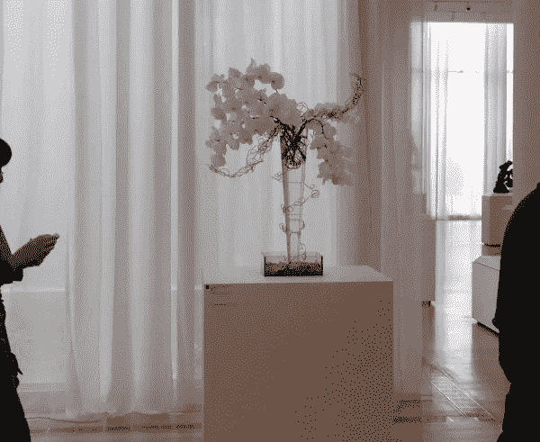
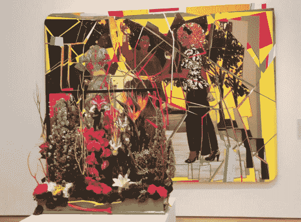
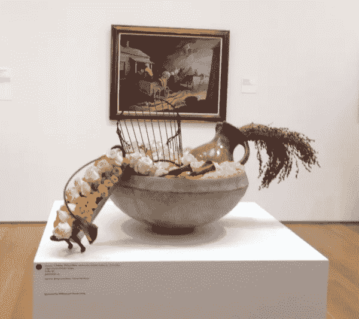
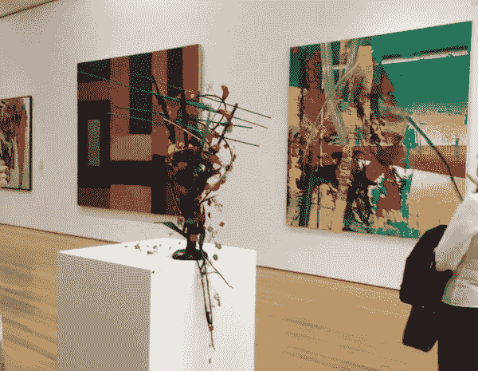
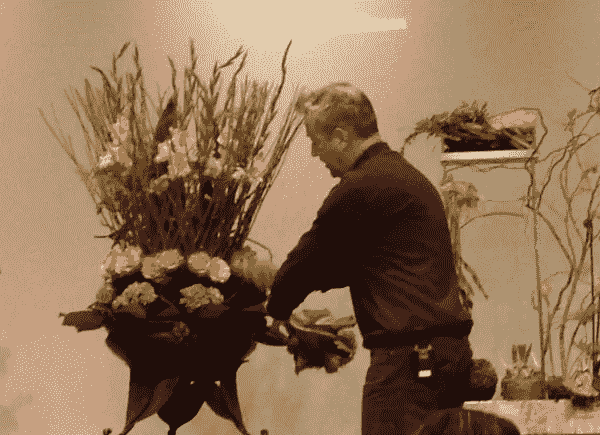

# 关于数据叙事，花艺设计师能教给我们什么

> 原文：<https://towardsdatascience.com/data-storytelling-visualization-floral-design-6a1050607a2e>

## 六节数据可视化课程，灵感来自成功插花的原则

来源:作者收藏

一开始可能并不明显，但是有很多方法可以讲故事。有没有考虑过花艺设计也是讲故事的？他们用鲜花就像数据说书人用数据来讲述他们的故事一样。让我们进入他们的世界，把灵感带到我们的世界。

北卡罗来纳州艺术博物馆有一个名为“盛开的艺术”的年度节日。这个想法是当地花艺设计师利用博物馆的杰作为自己的花艺设计汲取灵感。

来源:作者收藏

当地设计师乔迪·麦克劳德(Jody McLeod)和斯蒂芬妮·加勒特(Stephanie Garrett)讨论为春季设计美丽的花卉图案。讲座开始时，麦克劳德在谈论春天的太阳升起、鲜花开始绽放的时候是多么美好。他指着自己的花卉设计(如上图)，解释了这个设计是如何讲述一个关于春天的故事。他说话的时候，我确实看到了太阳升起，春光初现。

> 是的，花艺设计师是讲故事的人。

但是在我思考之前，我在哪里听过这个相同的主题…可能在我读过的每一本数据故事书中。以下是两人分享的关于花卉设计的其他技巧，你可以在讲述故事时应用数据可视化。

# 提示 1:你是故事的雕塑家

加勒特展示了她雕刻花卉的布置。郁金香是这个过程中最容易使用的，因为它们变得柔韧。她打趣道“你知道郁金香有什么好处吗？没有人能告诉一朵郁金香该做什么。”

数据也是如此。你必须改变数据的形状，使其更适合你的设计，但是数据说什么就是什么。没有人能告诉数据这个故事是什么— *它向我们讲述了这个故事。*

来源:作者收藏

不要害怕花时间将数据整理成你需要的形状——许多人没有意识到只有一小部分数据能说明问题。

这位艺术家重新创作了一幅[印象派画作](https://en.wikipedia.org/wiki/Impressionism)——莫奈的作品。花朵的选择模仿了印象派画家创造艺术的方式，是一层又一层的小笔触。如果这位设计师可以用花朵来绘画，你当然也可以用数据来绘画。

来源:作者收藏

# 技巧 2:展示重要的部分

设计师指出，很多时候你必须编辑一朵花或一株植物。他指的是去掉多余的叶子，这样花的美就更明显了。对于数据故事来说也是如此。当你试图解释你所有的信息时，没有一点是重要的。

想象一下，如果设计师把所有的叶子都留在这些花上——你会很快失去很多美丽。

> 编辑您的消息。

在下面的艺术作品中，这位设计艺术家很好地突出了画中的白色和粉色。虽然这看起来像是很多动作——颜色讲述了一个简单的故事——一家人在一起。

这样的安排让我想到了美丽、纯真、承诺和爱——这些都是感性的词语。在数据讲述中，情感联系非常重要。

来源:作者收藏

# 提示 3:一种颜色突出重要性

我真的很喜欢以多种花和颜色为特色的布置。在插花中，变化创造了整体美。有时，如果你使用一种颜色，它可以让眼睛专注于真正重要的东西。在许多布置中，设计师使用单一的花朵颜色，这就像用画笔将眼睛带到她想要的地方。

数据可视化也是如此。使用一种颜色有助于查看者比较这些值，而不是专注于颜色，这使您的信息毫不费力地出现。

鸟巢讲述了一个春天的故事，黄色的花让人联想到小鸟。正是这种简单的颜色吸引了你的注意力，小鸟的想法产生了情感联系。

来源:作者收藏

艺术品是蓝色的，你是否更关注它的形状？这就像当你有一个非常重要的单一价值时，它必须被强调。这一条信息几乎让你不知所措。

来源:作者收藏

这幅画也很简单，但是你的眼睛马上就能明白什么是重要的。你可以在故事中使用这种技巧——只要把你的注意力集中在主要信息上。

来源:作者收藏

# 提示 4:保持你的信息重点突出

这位设计师自嘲说，她的前几个设计“一团糟”，因为用了太多的东西。在这种情况下，观者不明白往哪里看，甚至没有时间去看花中的个体美。

这件艺术品让你有点紧张吗？我不确定什么是最重要的，艺术家想让我看哪里？插花可能做得更好——我知道重点放在中间的花。

来源:作者收藏

你真的希望你的数据故事集中在一个信息上，而不是吸引别人的注意力。这一点怎么强调都不为过——找到一个忙碌的设计很容易，但找到一个能很好地沟通的有吸引力的东西却很难。

# 提示 5:负空间强调你的观点

在这个安排中，设计师想利用负空间。树枝伸向天空，但它实际上只是给人一种高度的错觉。这被称为销售设计中的“空气”。然而，设计师强调了负空间在整体设计中的价值。

你的数据可视化也需要空间来突出重要的部分。在你的下一次数据可视化中，给负面信息留出更多空间，观察你的数据如何成为焦点。

这种安排看起来比实际要大，因为艺术家使用了负空间来给安排一个更长的感觉。我喜欢它的形状和背后的艺术品很相配。设计师花了很多心思让你看到她脑海中的形状。

来源:作者收藏

在下面的照片中很难看到，但在顶部有蓝色的杆，类似于画中的线条。增加杆会导致装置使用更多的空间。它扩展了故事，增加了丰富的细节。

许多数据故事讲述者不理解在他们的主要信息中添加细节的价值——细节必须增强信息。蓝棒并没有从主要的安排中抽离，它强调了作为一个方案的原色。

来源:作者收藏

# 技巧 6:颜色理论对数据可视化很重要

当你用花作画时，了解颜色是如何起作用的是很重要的。麦克劳德开始在他的布置中添加一些绿色植物，以展示粉色花朵如何从这种苍白的绿色中变得更加突出。他花了几个小时学习颜色如何混合以及什么不能混合。他指出这是一个持续的学习过程，需要数年才能掌握。(数据可视化也是如此。)

来源:作者收藏

色彩理论对所有设计师来说都很重要。我们都见过以奇怪的颜色选择为特色的数据可视化。很奇怪，因为这让你觉得不舒服，你一开始也不明白为什么。

就像上面那幅忙碌的三位女士的画一样，我认为颜色的选择并不相配。在这幅画中，画家可能是故意让观者感到不舒服。

# 数据故事讲述是关于数据可视化的

你的数据故事实际上是展示最终的数据。正如这些花艺设计师用花来讲述一个故事，帮助你了解花的重要之处——你可以用数据来帮助你的观众了解什么是重要的。