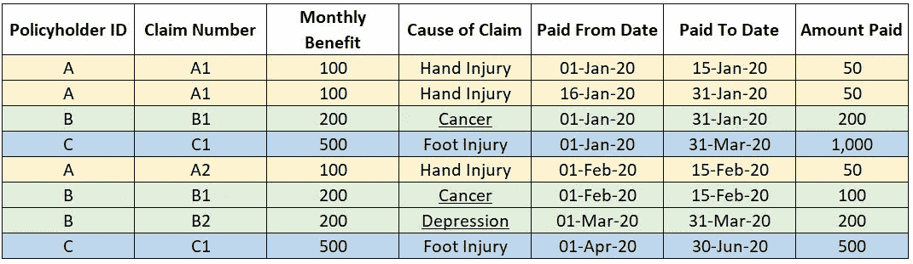
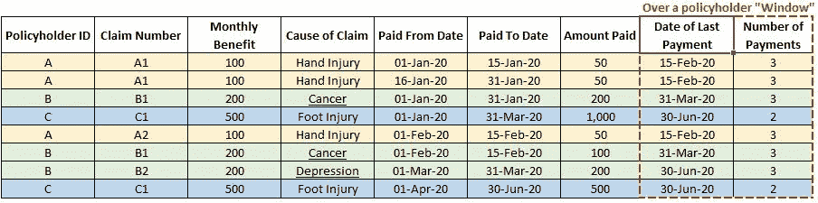
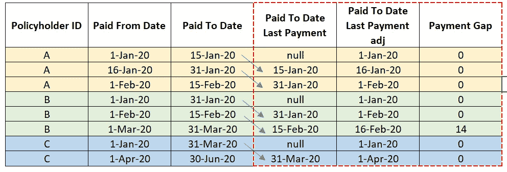
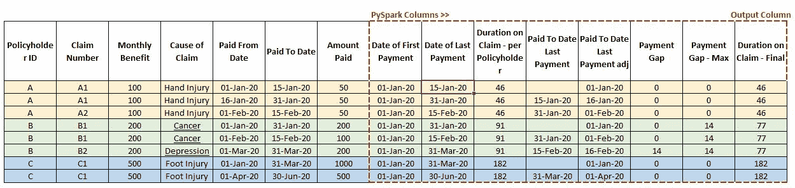
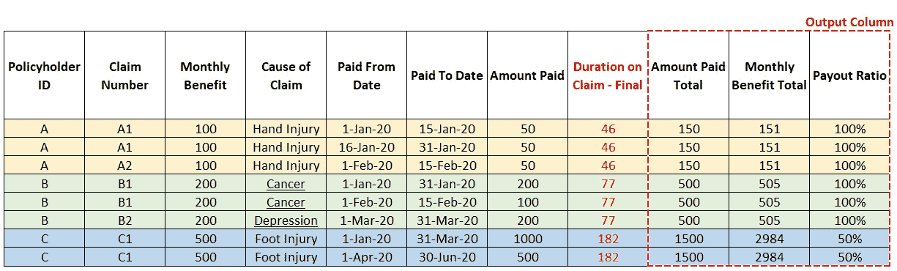
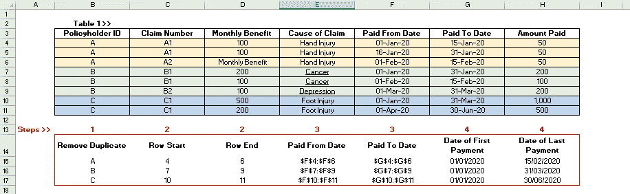

# 利用 PySpark 中的窗口函数进行数据转换

> 原文：<https://towardsdatascience.com/data-transformation-using-the-window-functions-in-pyspark-c044e8be4de6>

## 用一个用例来演示


菲利普·米尔托普在 [Unsplash](https://unsplash.com?utm_source=medium&utm_medium=referral) 上拍摄的照片

# 背景

我在一家保险公司做精算师。出于各种目的，我们(安全地)在数据仓库中为我们的投保人收集和存储数据。一个例子是索赔支付数据，需要对其进行大规模的数据转换，以获得对下游精算分析有用的信息。

为了证明这一点，我们销售的一种受欢迎的产品以收入流的形式提供理赔，以防投保人因受伤或疾病而无法工作(“收入保障”)。对于三个(综合)投保人 A、B 和 C，其收入保障索赔项下的索赔付款可以以如下表格格式存储:



表 1:索赔支付，按投保人 ID 进行颜色编码。按作者分类的表格

对该数据帧的直接观察是，对于一些字段存在一对一的映射，但对于所有字段并不存在。特别是，“投保人 ID”和“每月受益”之间，以及“索赔号”和“索赔原因”之间存在一对一的映射。然而，“投保人 ID”字段与诸如“支付起始日期”、“支付截止日期”和“金额”等字段之间的映射是一对多的，因为索赔付款随着时间的推移而累积并附加到数据帧。

如果我们想从特定的投保人**窗口**提取信息，该怎么办？例如，每个投保人的最后一次付款日期或付款次数。这可能很难实现(特别是使用 Excel，它是大多数人寿保险精算师的主要数据转换工具)，因为这些字段取决于跨多行的值，如果不是特定投保人的所有行的话。为了直观起见，下表中添加了这些字段:



表 2:通过“窗口”提取信息，按投保人 ID 进行颜色编码。按作者分类的表格

从机械上来说，这首先涉及对特定投保人的“投保人 ID”字段应用过滤器，这为该投保人创建了一个**窗口**，对该窗口中的行应用一些操作，并在所有投保人中迭代。基于表 1 中的数据框架，本文演示了如何使用 **PySpark** 中的**窗口函数**轻松实现这一点。

# 一个保险用例

概括来说，表 1 具有以下特征:


表 1:索赔支付，按投保人 ID 进行颜色编码。按作者分类的表格

*   索赔付款以表格形式记录。但是，任何字段都不能用作每笔付款的唯一关键字。
*   保单 A、B 和 C 的月福利分别为 100、200 和 500 英镑。然而，支付的金额可能少于每月津贴，因为索赔人可能无法在某个月的整个期间工作。
*   对 B 来说，索赔付款似乎在 20 年 2 月 15 日停止，然后在 20 年 3 月 1 日恢复。这种付款缺口对于估算索赔期限很重要，需要考虑到这一点。

让我们使用窗口函数来导出投保人级别的两个度量值，索赔的**持续时间**和**赔付率**。这些措施定义如下:

1.  每个投保人在 2010 年 6 月 30 日索赔的时间(索赔的持续时间)，考虑到支付中的任何缺口。例如，这是 b 的 2.5 个月(或 77 天)。
2.  在索赔期间，保单项下每月平均支付给投保人的金额("**赔付率**")。比如，这是投保人 A 和 B 的 100%，投保人 c 的 50%。

对于人寿保险精算师来说，这两个指标与索赔准备金相关，因为索赔持续时间影响未来付款的预期数量，而赔付率影响这些未来付款的预期支付金额。

下面提供了如何使用**窗口函数**导出这两个测量值的分步指南。

# 索赔期限

## **步骤 1 —导入库并启动 Spark 会话**

```
import numpy as npimport pandas as pdimport datetime as dtimport pysparkfrom pyspark.sql.window import Windowfrom pyspark.sql import functions as Ffrom pyspark.sql import SparkSession## Initiate Spark sessionspark_1= SparkSession.builder.appName('demo_1').getOrCreate()df_1 = spark_1.createDataFrame(demo_date_adj)
```

## 步骤 2—定义窗口

由于我们是在保单持有人层面获取信息，因此主要关注窗口将是定位每个保单持有人信息的窗口。在下面的 Python 代码中:

*   Window_1 是“投保人 ID”上的窗口，进一步按“支付开始日期”排序。
*   Window_2 仅仅是“投保人 ID”上的一个窗口。

尽管 Window_1 和 Window_2 都提供了对“投保人 ID”字段的查看，但 Window _ 1 furhter 按照“支付日期”以升序对特定投保人的索赔付款进行排序。这对于使用“滞后”窗口函数推导支付差额非常重要，这将在**步骤 3** 中讨论。

```
## Customise Windows to apply the Window Functions toWindow_1 = Window.partitionBy("Policyholder ID").orderBy("Paid From Date")Window_2 = Window.partitionBy("Policyholder ID").orderBy("Policyholder ID")
```

## 第 3 步-索赔持续时间的窗口函数

“with_Column”是用于在数据帧中创建新列的 PySpark 方法。

创建以下各列是为了导出特定投保人索赔的**持续时间。按此顺序:**

*   首次支付日期—这是特定投保人在 Window_1(或 Window_2)期间的最小“支付开始日期”。
*   最后支付日期—这是特定投保人在 Window_1(或 Window_2)期间的最大“支付日期”。
*   每次付款的索赔持续时间-这是每条记录的索赔持续时间，计算方法为每行的最后一次付款日期*减去第一次付款日期*。
*   **每个投保人的索赔持续时间** —这是对特定投保人在 Window_1(或 Window_2)期间的上述“每次付款的索赔持续时间”列求和，得出一个行前总和(即索赔的总持续时间)。

```
df_1_spark = df_1.withColumn("Date of First Payment", F.min("Paid From Date").over(Window_1)) \.withColumn("Date of Last Payment", F.max("Paid To Date").over(Window_1)) \.withColumn("Duration on Claim - per Payment", F.datediff(F.col("Date of Last Payment"), F.col("Date of First Payment")) + 1) \.withColumn("Duration on Claim - per Policyholder", F.sum("Duration on Claim - per Payment").over(Window_2)) \ 
```

如前所述，对于投保人而言，理赔付款之间可能存在支付缺口。换句话说，在预定义的时间窗内，特定支付的“支付开始日期”可能不会紧跟在先前支付的“支付截止日期”之后。您应该能够在表 1 中看到投保人 b 的情况。

出于精算分析的目的，需要确定投保人的支付缺口，并从最初计算为首次和最后一次支付日期之间的差异的索赔持续时间中扣除。

**支付差额**可以使用下面的 Python 代码得出:

```
.withColumn("Paid To Date Last Payment", F.lag("Paid To Date", 1).over(Window_1)) \.withColumn("Paid To Date Last Payment adj", F.when(F.col("Paid To Date Last Payment").isNull(), F.col("Paid From Date")) \.otherwise(F.date_add(F.col("Paid To Date Last Payment"), 1))) \.withColumn("Payment Gap", F.datediff(F.col("Paid From Date"), F.col("Paid To Date Last Payment adj")))
```

使用视觉效果来解释上述步骤可能更容易。如下表所示，调用窗口函数“F.lag”以返回“支付到最后付款日期”列，对于投保人窗口，该列是前一行的“支付到最后付款日期”,如蓝色箭头所示。然后将其与当前行的“支付起始日期”进行比较，得出**支付差额**。正如预期的那样，我们对投保人 b 有 14 天的支付缺口。

出于计算支付缺口的目的，使用 Window_1，因为索赔支付需要处于“F.lag”函数返回期望输出的逻辑顺序中。



表 3:得出支付差额。按作者分类的表格

在下面添加点睛之笔，给出索赔的最终期限，现在与投保人 ID 是一对一的。

```
.withColumn("Payment Gap - Max", F.max("Payment Gap").over(Window_2)) \.withColumn("Duration on Claim - Final", F.col("Duration on Claim - per Policyholder") - F.col("Payment Gap - Max"))
```

下表显示了用上面的 Python 代码创建的所有列。



表 4:在 PySpark 中创建的所有列。按作者分类的表格

# 支付比率

赔付率被定义为投保人的实际赔付金额除以索赔期间的月收益。这衡量的是某一特定投保人每月支付的福利金额。

利用之前导出的索赔持续时间，可以使用下面的 Python 代码导出赔付率。

```
.withColumn("Amount Paid Total", F.sum("Amount Paid").over(Window_2)) \.withColumn("Monthly Benefit Total", F.col("Monthly Benefit") * F.col("Duration on Claim - Final") / 30.5) \.withColumn("Payout Ratio", F.round(F.col("Amount Paid Total") /  F.col("Monthly Benefit Total"), 1))
```

如下表所示，输出符合预期。要在 PySpark 会话中显示输出，只需添加 ***。*显示()**的末尾代码。



表 5:支付率。按作者分类的表格

# 其他窗口功能的例子

还有其他有用的窗口函数。这篇[文章](https://www.geeksforgeeks.org/pyspark-window-functions/#:~:text=PySpark%20Window%20function%20performs%20statistical,growing%20to%20perform%20data%20transformations.)提供了一个很好的总结。

例如，您可以使用下面的窗口函数 F.row_number()为每个投保人的支付次数设置一个计数器，您可以对其应用窗口函数 F.max()以获得支付次数。

```
.withColumn("Number of Payments", F.row_number().over(Window_1)) \
```

与精算师更相关的另一个窗口函数是 ***dense_rank()*** 函数，如果在下面的窗口中应用该函数，则能够捕获同一投保人在不同索赔原因下的不同索赔。这种方法的一个应用是大规模识别索赔是以前原因的复发还是对投保人的新索赔。

```
Window_3 = Window.partitionBy("Policyholder ID").orderBy("Cause of Claim")....withColumn("Claim_Cause_Leg", F.dense_rank().over(Window_3))
```

# 擅长

正如我在之前的[文章](/applying-data-science-in-the-life-insurance-industry-a-perspective-from-a-qualified-actuary-698c197e1826)中提到的，Excel 已经成为澳大利亚大多数人寿保险精算师的首选数据转换工具。与本文中讨论的一个用例类似，本练习中所需的数据转换很难用 Excel 实现。

鉴于其可伸缩性，将 PySpark 用于涉及大型数据集的商业应用程序实际上是显而易见的。也就是说，对于这种情况，确实存在一个 Excel 解决方案，它涉及到高级数组公式的使用。

简要概述在 Excel 中创建窗口的步骤:

1.  根据表 1，通过“投保人 ID”和“支付日期”字段对数据帧进行手动排序。将“投保人 ID”字段复制并粘贴到新的工作表/位置，然后进行重复数据删除。
2.  引用原始表(即表 1)，分别应用带有最小值/最大值的行公式，以返回特定投保人第一次和最后一次索赔付款的行引用(这是一个数组公式，需要合理的时间来运行)。例如，如下表所示，这是投保人 a 的第 4–6 行。
3.  根据上面的行引用，使用地址公式返回特定字段的范围引用。例如，保单持有人 A 的 G $ 4:$ 6 如下表所示。
4.  将间接公式应用于步骤 3 中的范围，以获得首次付款日期和上次付款日期。



表 6: Excel 演示。按作者分类的表格

# 结论

通过一个实例，本文展示了 PySpark 中各种窗口函数的使用。

根据我自己使用数据转换工具的经验，PySpark 在很多方面都优于 Excel，比如速度和可伸缩性。这个用例支持在某些数据转换任务中脱离 Excel 的情况。

如果您喜欢阅读数据科学技术的实际应用，请务必关注或浏览我的 [Medium profile](https://jin-cui.medium.com/) 以获取更多信息！