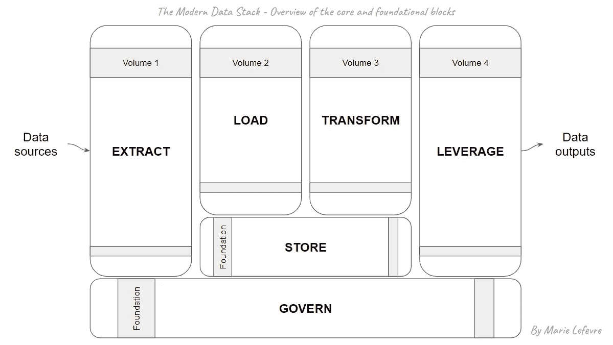
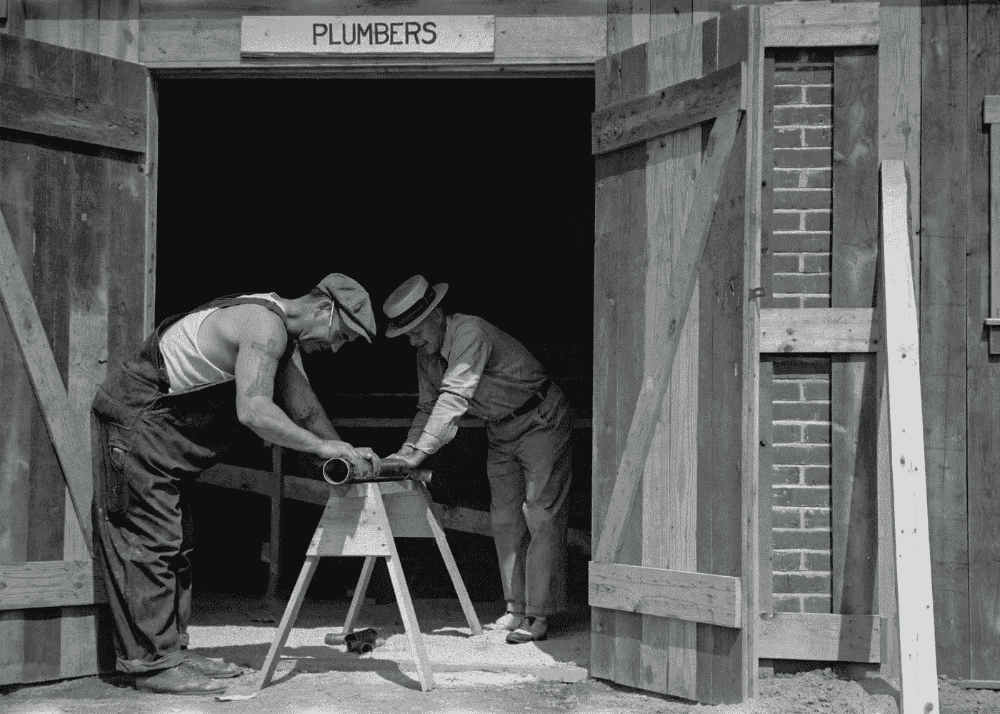
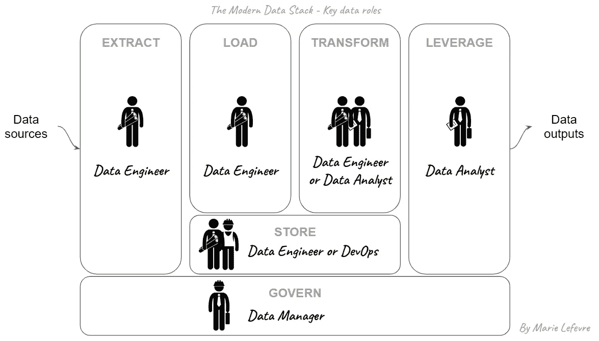

# 数据独角兽很少见，那就雇佣这 3 个人吧

> 原文：<https://towardsdatascience.com/data-unicorns-are-rare-so-hire-these-3-people-instead-80d3c3808af8>

## 数据架构

## 如果数据工程师就像水管工，你还需要哪些技能来构建你的数据堆栈？

当考虑在公司中构建数据架构时，经常出现的一个问题是:

> 您应该雇佣谁来构建(并在以后维护)您的数据架构？

不管公司里的一些人是否已经与数据相关，我认为 **3 种主要技能必须由不同的个人掌握**:

*   数据工程
*   数据分析
*   数据管理

正如我在[以前的文章](/modern-or-not-what-is-a-data-stack-e6e09e74ae7f)中所说，任何数据堆栈都由四个核心组件和两个基础组件组成:

作者图片([原始来源](/modern-or-not-what-is-a-data-stack-e6e09e74ae7f))

从提取到利用数据源提供给业务涉众的信息，**所需的技能范围非常广泛**。虽然第一个核心数据块(提取、加载、存储)需要非常专业的技能，但构成可靠数据堆栈其余部分的数据块(转换、利用、治理)需要更多面向业务的技能。

> 一个人有可能完全掌握任何数据堆栈的全部内容吗？

我相信，即使对于一个人来说构建和维护这样一个架构是可能的，这也可能是不可取的。我来解释一下原因。

为了正确地进行建筑工作，每个工人都必须专攻他们的专业领域。这并不意味着工人必须忽视其他专业领域的同事。恰恰相反:无论应用领域如何，开放的交流是成功的关键之一。但是，如果我们拿建筑工程中的管道部分来说，每个工人的专业技能和他们之间的密切合作是如何使建筑工程取得成功的呢？

当我们谈论数据架构的时候，我发现通过具体的**举一个在建房屋安装管道的例子**来与建筑业进行比较是很有趣的。在本文中，我将介绍我认为对实现和维护数据堆栈起决定性作用的 3 个主要角色。

团队合作——由[Unsplash](https://unsplash.com/@unseenhistories?utm_source=unsplash&utm_medium=referral&utm_content=creditCopyText)[上的](https://unsplash.com/?utm_source=unsplash&utm_medium=referral&utm_content=creditCopyText)看不见的历史拍摄的照片

# 数据工程师就像水管工

在构建一个可持续的数据架构所需的广泛技能的一个方面，**提取数据并将其加载到给定的基础设施**(数据湖和/或数据仓库)需要硬技能。其中包括数据库管理知识、计算和存储资源监控、掌握用于处理大数据的工具(例如 Apache Spark、Python)以及 DevOps 任务的基础知识。

在建造房子的过程中，数据工程师将成为水管工，因为**他们掌握着将源**(字面意思，数据源)连接到数据将被转换和利用的进一步工具的艺术。有趣的是，一个名为[“数据科学的管道工”](https://medium.com/plumbersofdatascience)的媒体出版物收集了关于数据工程的文章。管道工的工作是确保管道连接正确，这样干净的水就能流入、流经指定的管道，并从指定的出水口流出。同样，数据工程师的工作是将正确的数据管道连接到正确的“数据入口”。这些是数据堆栈的**“提取”和“加载”**块。

至于**“存储”**部分，数据工程师可能是负责**管理数据存储方式的人**。或者，他们可以通过与其他技术角色(如开发人员或公司技术基础设施领域的专业开发人员)合作来实现这一目标。借用我们的管道比喻，如果给定建筑工地的管道工负责管理房子的水箱，而不仅仅是水管，情况就会是这样。

# 数据分析师就像项目负责人

在建筑工地上，如果管道工工作正常，水应该从进水口通过管道流到水槽。现在怎么办？管道工程业主的职责是确保**未来的住户将充分受益于引入水槽的水**。管道工程业主有责任确保水流向正确的终点，并且终点位于对未来住户有意义的地方。

这就是数据分析师在我们的数据架构中发挥作用的地方。**从数据工程师交付的地方接管数据流**是他们的任务之一。根据数据角色之间的职责分配，数据工程师或数据分析师可以接管**“转换”**块。最重要的是，每一条数据的责任都讲清楚了。

然后是**“杠杆”**块，对应于数据分析师的主要任务:**将原始(或转换后的)数据转化为对业务利益相关者有用的见解**。就像管道工程项目负责人要确保水以足够高的质量水平输送到正确的终点一样，数据分析师要确保向业务用户提供可靠的数据，并且他们能够理解这些数据。

# 数据经理就像是现场监督员

如同在施工现场一样，要有一个人负责做好各专业之间的**协调**。从水处理厂到房子，这通常是现场主管**的责任，与管道工和项目业主**密切合作，检查房子是否与其余的水网络连接。

通过对数据架构的**“治理”**部分负责，数据经理保证了数据角色之间的**协作和协调，而且在涉及到数据相关问题时，还保证了整个公司的**协作和协调——可能涉及广泛的主题。在出现问题时，数据经理集中信息和决策，以便以最好的方式集体解决问题。至于数据质量，就像现场主管一样，数据经理的职责是**确保通过管道**从源到输出的数据流的质量。

我这里说的数据经理，可以对应公司内部的几个职称:**数据管家、数据团队负责人、数据负责人**等。对于小公司来说，这个角色甚至可能不会作为一个职位头衔出现，因为它更像是管理数据团队的经理的任务之一。

# 结论

最后，上图显示了健壮数据堆栈的关键数据角色:

图片由作者提供，图标由 Gan Khoon Lay 提供([来源](https://thenounproject.com/browse/collection-icon/construction-real-estates-people-job-and-career-31637/?p=1))

正如我在引言中提到的，我相信**有效的数据架构是那些从不断扩展的数据技能和技术领域中选择专攻一个专业领域**的人之间伟大协作的结果。这就是为什么我把安装管道设施比作在一所房子里。

然而，我完全支持**相互好奇和公开交流最佳实践**。根据我自己的经验，虽然我习惯于关注数据堆栈的数据分析部分，但我喜欢学习和深化我的数据工程知识。这只会提高我对“大数据图景”的理解，并使我在执行典型的面向数据分析师的任务时变得更加相关。

*你喜欢读这篇文章吗？* [*成为*](https://marie-lefevre.medium.com/membership) *的一员，加入一个不断成长的充满好奇心的社区吧！*

 