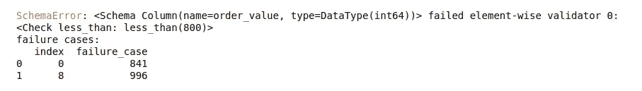

# 高质量的数据伴随着高质量的验证

> 原文：<https://towardsdatascience.com/data-validation-for-pandas-b24613959364>

## 以下是如何在数据管道的每个阶段确保熊猫数据帧的质量


照片由来自[佩克斯](https://www.pexels.com/photo/close-up-photo-of-blue-background-2441454/)的哈里森[坎德林](https://www.pexels.com/photo/close-up-photo-of-blue-background-2441454/)拍摄。

通过挑选正确的垃圾，你可以在垃圾中建造一座城堡。

大多数数据科学项目都是这样——建造城堡🏰从垃圾桶里。在数据湖中数千个数据集的池中，您需要挑选正确的数据集并修复几乎正确的数据集。

你需要一个强大的数据集验证工具。

数据质量是任何现代分析项目的一个基本方面。但是我验证数据集的老派技术有更多的漏洞🐛比蝴蝶还多。

我写自己的验证码；有很多异常处理。

尝试不同的逻辑将花费大量的时间来重新编码😦。此外，我需要编写专门的文档来理解我的验证逻辑。

</stop-firefighting-data-quality-issues-4c064bcbbb53>  

但是我最近发现了一个 Python 库，它去掉了大部分样板文件。有了它，您可以为模式中的 Pandas 数据帧编写更直观的验证逻辑。

它删除了我大量的代码。相反，几行代码提供了更强大的处理验证错误的方法。

来自[吉菲](https://giphy.com/gifs/littlemix-little-mix-black-magic-MUnlAiiNn7HZutahjH)的动画。

让我们学习如何使用熊猫验证工具包 [Pandera](https://pandera.readthedocs.io/en/stable/) 来确保高质量的数据。

在本帖中，我们将讨论

*   使用 YAML 配置验证 Pandas 数据框架:
*   可在数据管道中的任何位置重用的验证批注；
*   定义动态验证，以及。
*   用复杂假设验证数据框架。

但是在我们做任何事情之前，让我们在你的计算机上安装 Pandera。

```
pip install pandera
```

让我们也创建一个虚拟数据集来与示例一起工作。

# 用 YAML 配置验证熊猫数据帧

我喜欢 YAML 的配置！它们易于理解并且可以灵活扩展。做一个或者改装一个不需要 130 的智商。

YAML 文件是分层的键值映射。把它们想象成 Python 中没有花括号的字典。项目列表可以放在以连字符开头的单独的行中。您可以使用缩进来扩展子配置。

要更深入地了解 YAML 文件，请[参阅 Alek Sharma 的本指南](https://circleci.com/blog/what-is-yaml-a-beginner-s-guide/)。

下面的 YAML 文件对我们的数据集做了一些基本的检查。配置不是很直接吗？

请阅读代码上的注释，以便更好地理解验证检查。

对于数据集中的每一列，我们指定字段是否可以有空值、重复项等。我们还可以测试字段值是否在预定义的列表中，或者确认逻辑，比如小于特定的数量。

让我们在项目中使用它来验证我们的虚拟数据集。

上面的代码从文件系统中读取 yaml 文件，并从中创建一个模式。然后，我们可以使用 schema 对象来验证数据帧。

上面的验证调用将返回 df，因为什么也没有发生。😧

但是让我们稍微改变一下我们的 YAML 文件。请注意，新版本有一个额外的验证来检查年龄变量是否小于 60。

如果再次尝试验证示例数据帧，您将看到以下错误。



Pandera 引发的验证错误。图片由[作者提供。](https://thuwarakesh.medium.com)

这个错误是工具性的。除了提高它，Pandera 还打印出不符合要求的记录。

您可以使用普通的 Python 代码来实现这个逻辑。但是对于我们和任何阅读我们代码的人来说，使用 YAML 文件更舒服。

# 使用验证注释方便地测试管道中的数据帧。

在复杂的管道中，您需要在不同的点测试您的数据帧。通常，我们需要在转换前后检查数据完整性。

</the-prefect-way-to-automate-orchestrate-data-pipelines-d4465638bac2>  

您可以像以前一样使用已加载模式的验证方法。但是，Pandera 有一个更好的方法，使用函数注释。

Pandera 有 check_input 和 check_output 注释。当用这些来注释一个函数时，它将测试函数参数和返回值中的数据帧。

要使用它，我们需要定义两个模式；一个用于输入(参数)，另一个用于返回数据帧。

除了前面的 YAML 文件，让我们创建另一个如下指定的文件并加载它。姑且称之为`schema2`。

下面是一个使用注释来验证函数的输入和输出数据帧的示例。请注意，Pandera 假设第一个参数是 dataframe。如果您有多个参数，请确保第一个是您的数据帧

Pandera 对上述功能进行了两次测试。它在函数执行之前用`schema` **测试输入数据集。此外，在**功能执行后不久，用`schema2` **测试输出数据帧。**

玩弄`schema2`，诱发一些错误。

# 动态定义模式以实现快速验证。

从 YAML 文件加载并不是创建模式的唯一方式。然而，这是我最喜欢的方式。您可以完全在 Python 代码中创建模式。

下面是我们第一个 YAML 文件的 Python 版本。注意相似之处。

在 Python 代码中定义模式有一个额外的好处。除了内置检查之外，您还可以定义自定义检查。

例如，下面的代码检查 order_value 列的总和是否大于 1000。

但是您很少需要编写定制代码，因为最常用的代码已经包含在模块中了。你只要抓住正确的。

# 用复杂的假设验证管道中的数据框架。

在所有伟大的功能中，这是我最喜欢的。

检查数据帧中的常见异常是没问题的。但是，做完整的假设检验是一个游戏改变者。我们可以根据更复杂的假设来验证数据集。

例如，在我们的购物数据集中，我们可以检查男性顾客是否比女性顾客购买更多。

下面的代码可以做到这一点。注意，要使这个工具工作，您需要安装假设和 scipy。

```
pip install hypothesis scipy pandera[strategies,hypothesis]
```

请注意，我们要测试的关系是“大于”由于我们的样本数据集没有证据支持这一假设，它将失败。但是如果你把关系改为“相等”,测试就通过了。此外，“等于”是默认设置。所以你可以把它拿掉。

# 最后的想法

验证数据帧从未如此简单。

我曾经为我需要执行的每个检查编写专用代码。当你在许多数据集上工作时，这是一件棘手的事情。当您在数据管道上工作时，经常会遇到这种情况。

</how-to-speed-up-python-data-pipelines-up-to-91x-80d7accfe7ec>  

您需要在每个数据集上编写类似的代码。通常我的代码分布在几个笔记本上。

但随着潘德拉的发现，我可以在一个地方管理他们。我更喜欢把它们放在 YAML 的档案里。但是我们也可以在 Python 代码中定义它。

它从我们的代码中提取了大量的样板代码。它使我们的代码更具可读性，更不容易出错，并提供更多信息。

此外，我们还可以在数据集列上使用假设检验，这非常棒。

> 感谢阅读，朋友！在[**LinkedIn**](https://www.linkedin.com/in/thuwarakesh/)[**Twitter**](https://twitter.com/Thuwarakesh)[**Medium**](https://thuwarakesh.medium.com/)上跟我打招呼。
> 
> 还不是中等会员？请使用此链接 [**成为会员**](https://thuwarakesh.medium.com/membership) 因为，不需要你额外付费，我为你引荐赚取一小笔佣金。