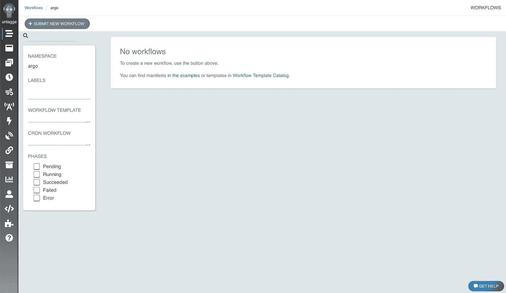
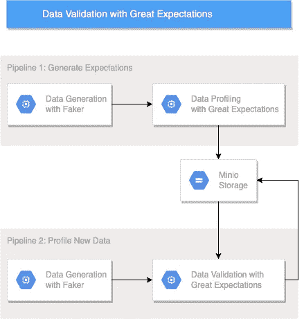
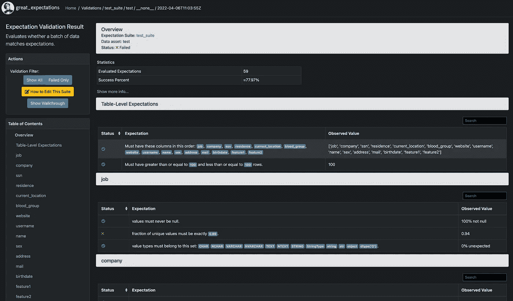

# 满怀期望的数据验证和 Argo 工作流

> 原文：<https://towardsdatascience.com/data-validation-with-great-expectations-and-argo-workflows-b8e3e2da2fcc>

## 远大前程来自库伯内特土著

最近在工作中，我们一直在讨论我们梦想中的机器学习管道会是什么样子。作为背景研究，我们遇到了 [Great Expectations](https://greatexpectations.io/) 包，作为我们管道中的数据验证步骤，它看起来很有希望。在这篇文章中，我将探索使用 Great Expectations 作为 Argo 工作流的一部分，在数据预处理期间运行数据验证。

**声明:我不是专家！**对我来说，这是一个学习过程，因此我在这里实施的可能不是最简化的解决方案。Great Expectations 可以直接与 Prefect 和 Dagster 集成，所以理论上它更容易与这些工具一起使用。我只是喜欢阿尔戈。


由[凯瑟琳·麦考马克](https://unsplash.com/@kathymacky?utm_source=medium&utm_medium=referral)在 [Unsplash](https://unsplash.com?utm_source=medium&utm_medium=referral) 上拍摄

**1。设置我们的环境**

对于这个项目，我在一个小型集群上运行所有的东西。我不打算详细介绍每个方面，我假设您已经安装了 kubectl 和 helm 3。

首先启动您的 minikube 集群:

```
minikube start --cpus 4
```

对于其他项目，我使用 4 个 CPU 来运行我的程序，但是对于我们的例子来说，这并不是必需的，因此“CPU”参数是可选的。

接下来安装 Argo 工作流:

```
kubectl create ns argo
kubectl apply -n argo -f https://raw.githubusercontent.com/argoproj/argo-workflows/master/manifests/quick-start-postgres.yaml
```

我们需要等待一段时间，让一切都启动并运行起来。如果您看到一些“错误”和“CrashBackLoopOff”状态，不要担心，通常它会在 5 分钟内自动解决。

每次我安装 Argo 工作流时，我都喜欢运行一个示例工作流，只是为了确保前面没有错误。让我们通过端口转发访问我们的工作流用户界面。

```
kubectl port-forward svc/argo-server 2746:2746 -n argo
```

现在进行到 [https://localhost:2746。](https://localhost:2746.)你会收到 Chrome 的安全警告(幸好这不是生产系统)。你应该看到的是阿尔戈工作流程开始屏幕。



图一。Argo 工作流程开始屏幕。随意探索侧面板选项 Argo 项目真的很酷。图片作者。

单击“提交新工作流”，然后单击“使用完整工作流选项进行编辑”。它会给你一个 Hello World 的例子，你可以通过点击“+ Create”来运行。如果一切顺利，您应该会看到如下内容:


图二。一次成功的试运行。如果您在这一点上遇到了问题，请随时留下您的评论。排除故障的最佳方法是查看 pod 日志。图片作者。

我们仍然需要做一些整理工作来远程访问我们的 Argo 服务器。奇怪的是，如果我遵循 Argo 的文档，它不能工作，所以这里有一个修改后的版本，可以让你从 Hera 提交工作流。

```
kubectl create role hera --verb=list,update,create --resource=workflows.argoproj.io -n argokubectl create sa hera -n argokubectl create rolebinding hera --role=hera --serviceaccount=argo:hera -n argoSECRET=$(kubectl -n argo get sa hera -o=jsonpath='{.secrets[0].name}')kubectl -n argo get secret $SECRET -o=jsonpath='{.data.token}' | base64 --decode
```

现在记下这个令牌。这样我们就有了一个 Argo 工作流的工作装置！下一步是让 Minio 实例在 minikube 中运行。这可以很容易地实现使用舵图表。

```
helm repo add bitnami [https://charts.bitnami.com/bitnami](https://charts.bitnami.com/bitnami)
helm repo update
helm install ge-minio bitnami/minio --namespace argo
```

在这种情况下，我选择将它安装到 argo 名称空间中，只是为了让自己的东西更整洁一些。最后一个命令将生成一些关于如何获得您的 Minio 凭证的输出。运行这些命令并将输出存储在某个地方。现在我们已经准备好创建我们的项目桶了。要检查您是否有正确的凭证，并感受一下 Minio，请将它的服务进行端口转发，并导航到 localhost:9001。

```
kubectl port-forward svc/ge-minio 9001:9001 -n argo
```

在这里，我创建了一个名为“远大前程”的桶。

最后，让我们安装一个包来用 python 创作 Argo 工作流。

```
pip install hera-workflows
```

现在我们设置好了！

**2。管道组件**

说完这些，让我们来谈谈我们的示例数据验证管道。



图片作者。

1.  [Faker](https://faker.readthedocs.io/en/master/) :快速生成虚假数据集的 python 包。
2.  [远大前程](http://greatexpectations.io):一个用于数据验证的 python 包。
3.  Minio :类似亚马逊 S3 的对象存储。

这些组件中的每一个都有非常棒的文档，并且有一些博客比我能提供的更详细，但是我会涵盖对这个项目很重要的几点。

通过 Faker，我们希望生成一个熊猫数据框架的例子，它可以作为数据科学管道的输入数据。我们可以使用 faker 很简单地做到这一点:

现在我们有了一个数据集，其中包括带有一堆随机生成的信息的虚拟人，以及用 NumPy 生成的两个数字特征列。

现在是时候以编程方式从这些数据中生成期望了。我个人觉得这有点复杂，但我想我们会成功的！

现在我们用煤气做饭。我们有能力生成假数据，从中创建一个验证套件，并运行该验证套件。添加 Minio 只是压缩/ge-store 目录，并使用 python SDK 将文件放入我们的 bucket 中。在 [Minio 文档](https://docs.min.io/docs/python-client-quickstart-guide.html)中提供了一个很好的概述。

**3。阿尔戈管道**

在最后一部分，我们将使用 Hera 来编写和运行我们的测试管道。为了正确使用 Hera，我们需要一个 Docker 镜像来覆盖我们所有的依赖项。为了运行我们的管道，我制作了一个简单的图像 lambertsbennett/argo-ge:v1。它基于 Python 图像，因此非常大。

现在让我们从编写管道 1 开始，以生成和存储我们的期望。

在许多小错误之后，这里是将我们的远大前程套件作为一个 tarball 存储在我们的 Minio bucket 中的代码。

现在让我们在第二个管道上工作，生成一些 faker 数据，从 Minio 中提取我们的验证套件，然后运行我们的数据验证。我们将重用第一个管道步骤来生成假数据，以及我们对文件 io 所做的大量工作。

现在，如果我们导航到 Minio 并下载我们的“ge-results.tar.gz ”,深入了解一下，我们可以看到我们数据验证工作的详细结果。在/uncommitted/data _ docs/local _ site 下的归档文件中，我们可以看到一个 index.html。



图 4。我们的巨大期望的结果。哦，不，我们失败了！图片作者。

这个期望套件中有一些非常严格的规则，所以我们的验证失败了。

我希望这是一本有趣的读物。该代码可在 Github @[https://github.com/lambertsbennett/argo-great-expectations](https://github.com/lambertsbennett/argo-great-expectations)上获得。《远大前程》看似很强大，其实很复杂。幸运的是，他们的文档非常棒。在未来，我将使用基于 kubernetes 的栈研究更多的 MLOP/数据工程/数据科学主题，并希望写更多关于它的文章。感谢您的阅读，如果您有问题或改进的想法，请留下您的评论！