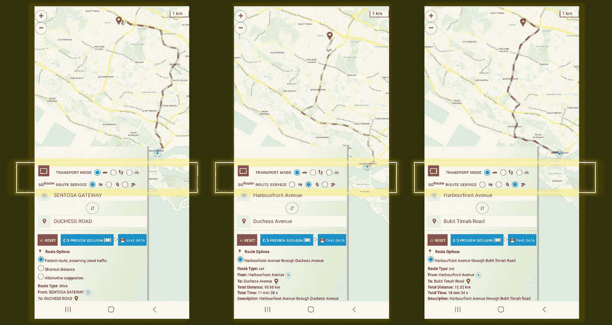
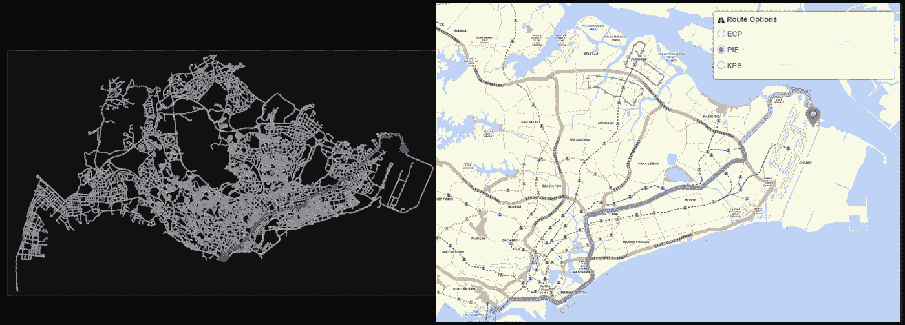

# Web 应用程序上多个服务提供商的旅行路线数据可视化——使用 LeafletJS + NodeJS 构建

> 原文：<https://towardsdatascience.com/data-visualisation-of-travel-routes-by-multiple-service-providers-on-web-app-built-with-leafletjs-dee2117647e9>

## 哪条路是❝ **优** route❞？移动响应地图布局。包括完整的源代码。

M 随着当今“地方病”时代全球消费者需求的激增，任何数字商品，如电子商务购买、食品配送请求以及打车服务，都变得越来越有利可图。除了其无纸化(即数字化)的性质，上述每种服务的另一个共同特征是其依赖于**最优路线规划**以获得经济效率。

> 随着[和](https://www.grab.com/)、 [Gojek](https://www.gojek.com/) 和[优步](https://www.uber.com/)等主要市场参与者发现自己在这个竞争激烈的领域与新进入者打交道，在打车市场取得成功的基石无疑一直是地理空间技术&工具的有效使用。

作者插图|显示 Grab/优步司机在地图提供商建议的路线上导航的经典场景

# 地理空间辅助项目的理由

对于日常事务，我们大多数人直觉地求助于谷歌地图来获得❝可导航的❞旅行路线，以便到达我们的目的地。

> 然而，在宏观规模或商业层面上，大型企业(如物流运输)很少(如果有的话)将此应用于他们的实践，因为他们很清楚**可航行路线≠最佳路线**

因此，为了更深入地了解[旅行推销员问题](https://www.techtarget.com/whatis/definition/traveling-salesman-problem)和**并理解建议路线**的潜在决策，我决定将 3 个不同的路由 API 集成到一个 web 平台上，以便更容易地对建议的旅行路线进行跨服务交叉比较。

## **网络应用功能**

(可通过[https://SG-routing-app . glitch . me](https://sg-routing-app.glitch.me/)访问，具有移动响应布局。)

**集成了 3 个路由 API**

*   [one map Rest API](https://www.onemap.gov.sg/docs/#onemap-rest-apis)，由 [SLA](http://sla.gov.sg/) 提供
*   [graph hopper 方向 API](https://graphhopper.com/maps/)
*   [这里路由 API](https://www.here.com/platform/routing)

**用例演示:**在新加坡的街道上导航

*   运输方式:**汽车**
*   原点:**哈博中心**
*   目的地:**武吉提玛路/公爵夫人路**

**其他特性**

*   在 3 种路由服务之间切换
*   语音合成导航指令与❝ **朗读** ❞功能

# 应用程序预览(移动 Android 布局)

作者截图|从左到右，地图服务商分别是— [Onemap](https://www.onemap.gov.sg/docs/#onemap-rest-apis) 、 [Graphhopper](https://graphhopper.com/maps/) 、[此处](https://www.here.com/platform/routing)。

显然，**对于相同的输入起点&目的地**，所有 3 个地图服务提供商都为假定的驾驶员返回了**不同的导航路径**。这个简单的概念验证证明了每条旅行路径背后的运行算法各不相同，并且在很大程度上取决于正在处理的业务用例。假设企业的目标是实现利润最大化，那么合理的假设是，定制条件(例如，免费、最少遇到红绿灯)最好设置到位，以便**用获得的总收入抵消运输产生的总成本**。

**参考消息:**我的 GitHub repo 上的应用源代码 [sg-routing-app](https://github.com/incubated-geek-cc/sg-routing-app) (请随意🔱或者⭐它，并为您自己的用例进行调整！)

## 额外的概念验证(网络图论)

出于纯粹的好奇，在我将[网络图](https://mathinsight.org/network_introduction)背后的理论应用于各种领域的自我探索中，我决定根据[开放街道地图(OSM)](https://www.openstreetmap.org) 的开源街道网络，与[谷歌地图](https://www.google.com/maps)的返回路线并排绘制最短路径，以获得相同的起点-终点地理坐标:

*   **产地**:新加坡海滨大道 1 号 098585 |纬度:1.264313825，液化天然气:103.8220734
*   **目的地**:新加坡阿尔卑斯大道 101 号，邮编 498793 |纬度:1.375412026，液化天然气:104.025137
*   **模式**:驱动

图片作者|左边返回一条由 Python 包 [networkx](https://pypi.org/project/networkx/) 计算的路径|右边返回由 [Google Maps](https://www.google.com/maps) 返回的路线(一定要注意返回了多条可能的路线)

**结果:**对于几个地点， [Google Maps](https://www.google.com/maps) 建议的路线中至少有一条与图论计算的最短路径的坐标重叠！

# 总体评价和评论

因为决定出行成本的因素(过路费、路线距离、所提供商品的性质等。)因地而异，一个基本假设是❝ **最佳路径** ❞，尽管是最短的路径，但毕竟可能不是为驾驶员实现最大成本节约的路径。

虽然全球地图服务提供商如 [Google Maps](https://www.google.com/maps) 会返回一条全球可导航的路径，但事实上，许多商务旅行者会将他们的最终交付路线建立在更加以位置为中心的地图服务(可以是商业的或内部开发的)上，以便不仅满足客户需求，而且以尽可能低的成本实现其业务 KPI。

现在你知道了！非常感谢你坚持到这篇文章的结尾！❤希望这篇文章对你有用，如果你想了解更多地理信息系统(GIS)、数据分析& Web 应用相关的内容，请随时[关注我的媒体](https://medium.com/@geek-cc)。会非常感激—😀

— 🌮请给我买个玉米卷🎀˶❛◡❛)

 [## 通过我的推荐链接加入灵媒——李思欣·崔

### 获得李思欣·崔和其他作家在媒体上的所有帖子！😃您的会员费直接…

geek-cc.medium.com](https://geek-cc.medium.com/membership)