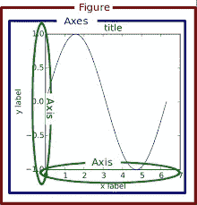
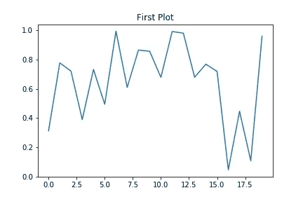
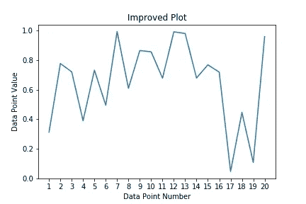
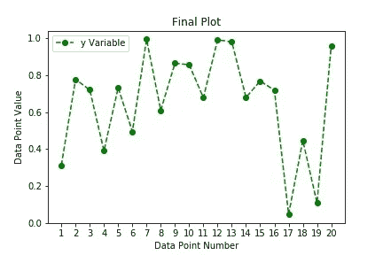
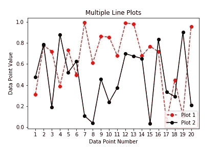
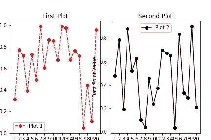
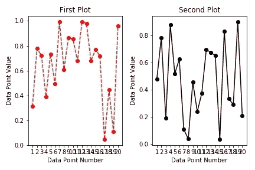
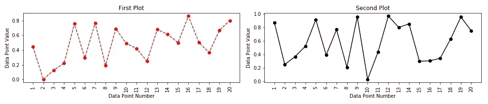

# 使用 Python 实现数据可视化

> 原文：<https://towardsdatascience.com/data-visualization-using-python-422d7ac4cb65>

## 面向初学者的 Matplotlib


照片由[марьянблан| @ marjanblan](https://unsplash.com/@marjan_blan?utm_source=medium&utm_medium=referral)在 [Unsplash](https://unsplash.com?utm_source=medium&utm_medium=referral)

在与许多有抱负的分析师/数据科学家交谈时，我意识到他们唯一的关注点/兴趣是学习预测模型、机器学习算法等。数据科学生命周期的一个重要方面是数据探索，他们在开始时没有关注这个方面。

# **答:设定期望**

数据可视化是有效探索数据的关键工具之一。本教程旨在向读者介绍 python 中最常用的可视化库之一 Matplotlib。我们假设读者已经基本熟悉 python 语言，比如安装包、Python 数据结构、条件&循环，以及关于包的基本知识，比如 Numpy。

# **B. Matplotlib 图结构**

在我们开始教程之前，理解 Matplotlib 制作任何图形/图表所遵循的结构是很重要的。参考下图，Matplotlib 图形/图表中最外面的容器称为**图形**。每个图形可以包含一个或多个轴**轴**轴**轴，这些轴是真实的图**。每个轴还会有进一步的子组件，如**轴(x & y)、** **标题**、**图例**、**轴标签**、**大刻度&小刻度、**等。



图形/图表结构(Matplotlib 官方文档)

Matplotlib 使您能够使用两种不同的接口构建图:

*   使用" **pyplot"** 模块
*   使用面向对象的接口

在本教程中，我们将主要致力于构建" **pyplot"** 模块接口的知识。我们将进一步限定本教程为**创建线图**。其他重要的图表，如直方图、散点图、箱线图、2D 直方图等。将在以后的教程中介绍。

# c .让我们开始吧

让我们从第一个情节开始。

```
*#### Importing the necessary libraries.*from matplotlib import pyplot as pltimport numpy as np*#### Defining data to be used for plots.*x_var = np.random.rand(20)y_var = np.random.rand(20)*#### Making the first plot*plt.plot(y_var)plt.title("First Plot")plt.show()
```



第一个简单的情节(作者图片)

## **C.1 解释第一个情节**

假设读者熟悉 import 语句和 NumPy random 模块的使用，让我们将重点放在用于绘图生成的代码上:

*   **plt。plot(y_var)** —第一条语句使用 **pyplot** 模块的 *plot* 函数来生成图形。默认的绘图功能**创建了如上图所示的线图**。您会注意到 y 轴上的刻度值介于 0 和 1 之间。这是因为被绘制的变量是 y_var，它包含 0 到 1 之间的随机值
*   **plt.title("First Plot")** —第二条语句使用带有文本参数(in ")的 *title* 函数来定义绘图的标题
*   **工厂。 **pyplot** 模块的 show()** — *show* 函数用于绘制图形

正如你们大多数人一定已经注意到的，这个情节有几个问题。

*   没有轴标签
*   x 轴刻度显示为十进制数。假设我们正在构建一个 20 点的线图，我们将会看到代表每个点数的整数(从 1 到 20)

这些问题将在下一个情节中得到解决

```
*#### Improving the plot.*plt.plot(y_var)plt.title("Improved Plot")plt.xlabel("Data Point Number")plt.ylabel("Data Point Value")plt.xticks(range(20), range(1,21))plt.show()
```



改进的情节(图片由作者提供)

## **C.2 解释改进的情节**

可以看到，该图现在有了轴标签。x 轴上的刻度值现在也显示了所需的值。用于改善绘图的附加代码行解释如下:

*   **plt.xlabel("数据点编号")& plt.ylabel("数据点值")**—*x-label*和 *y-label* 功能都用于**给 x 轴和 y 轴添加标签**。这些函数将**文本(in " ")值**作为参数来使用它们作为标签
*   **pltxticks(range(20)，range(1，21))—***x 刻度*函数有两个参数，f **第一个参数**是 x 轴的**位置，刻度将放置在此处，而**第二个参数用于定义刻度**所用的标签。如果缺少第二个参数，则使用第一个参数生成的位置值将用作默认标签**

现在我们已经解决了所有的基本问题，让我们来研究一下图表的美学

```
*#### Beautification*plt.plot(y_var, color = "green", marker = "o",linestyle = '--', label = "y Variable")plt.title("Final Plot")plt.xlabel("Data Point Number")plt.ylabel("Data Point Value")plt.xticks(range(20), range(1,21))plt.legend()plt.show()
```



线条图后期美化(图片作者提供)

## **C.3 解释最终剧情**

视觉改进后的剧情看起来好多了。它具有标记点、虚线样式和可用的图例。用于生成上述图的附加代码块的详细信息如下:

*   **plt.plot(y_var，color = "green "，marker = "o "，linestyle = '-'，label = " introductive Plot ")**—我们现在向同一个函数传递更多的属性，而不是使用普通的 *plot* 。这些属性的解释如下:

1.  **颜色** —用于定义线条的颜色(本例中为绿色)
2.  **标记** —用于定义要使用的数据标记(在这种情况下，黑色的高亮点用“o”表示)
3.  **线条样式**——用于定义要生成的线条的类型(在“- -”表示的情况下为虚线)
4.  **标签** —如果有人想拥有一个传奇，定义一个标签是必须的。分配给标签属性的值显示为图例

*   **plt。图例** —该代码块确保图中出现图例。如前所述，legend 函数使用 plot 函数的 label 参数来定义图例。如果缺少标签参数，图例将会出现，但只有绘图的颜色，没有任何绘图说明

上图中唯一缺少的部分是**显示图上数据点的值。**让我们包括这一点

```
#### Showing the data point values using annotateplt.plot(y_var, color = "green", marker = "o",linestyle = '--', label = "y variable")plt.title("Final Plot With Data Labels")plt.xlabel("Data Point Number")plt.ylabel("Data Point Value")plt.xticks(range(20), range(1,21))for i in range(len(y_var)):plt.annotate(round(y_var[i],1), xy = [i-.5,y_var[i]+.01])plt.legend()plt.show()
```


注释数据标签(图片由作者提供)

## **C.4 用数据标签解释最终绘图**

最后一个代码块和用于生成数据点的代码块之间的唯一区别是**注释函数**。它是在图上显示任何文本的一站式解决方案。在这种情况下，annotate 函数用于显示数据点值。注释功能的详细信息如下:

*   **第一个参数** —第一个参数( **round(y_var[i]，1)** 在我们的例子中)捕获我们想要在图形上显示的文本。在我们的例子中，我们只是取 **y_var** 的相应值，并将其四舍五入为一位数
*   **第二个参数(XY)** —该参数获取图表(以列表形式)的 x 和 y 坐标，其中第一个参数中的文本需要进行注释

请注意，*注释函数*一次只能打印 1 个值，因此在我们的例子中，它被用于一个循环中，因为我们必须打印 20 个不同点的数据点值。

# **D .多个地块**

上面的代码块完成了线图的构造。现在让我们看看如何在同一个图形中创建多条线图

```
*#### Multiple trend lines in the same plot.*plt.plot(y_var, color = "red", marker = "o",linestyle = '--', label = "Plot 1")plt.plot(x_var, color = "black", marker = "o",linestyle = '-', label = "Plot 2")plt.title("Multiple Line Plots")plt.xlabel("Data Point Number")plt.ylabel("Data Point Value")plt.xticks(range(20), range(1,21))plt.legend(loc = [.8,.01])plt.show()
```



多重趋势(图片由作者提供)

## **D.1 解释多线图**

上图在同一个图上绘制了多条线。单线图和多线图的代码块之间的唯一区别是，为了创建多条线，我们使用了多个 **plt。绘图**功能。请注意，每个函数负责其样式和格式。

上述代码块中另一个值得注意的区别是 **plt。图例**功能。图例函数的 **loc** 属性获取需要放置图例的图表(以列表的形式)的 x 和 y 坐标。**第一个值**是图例从图左下角向右方向的**距离&第二个值**是图例从左下角向上方向的**距离**

图表结构的进一步变化是**不同的趋势线**有不同的图表。这可以通过以下方式完成:

```
#### Making 2 plots side by side using axes function#### First plotplt.axes([.05,.05,.425,.8])plt.plot(y_var, color = "red", marker = "o",linestyle = '--', label = "Plot 1")plt.title("First Plot")plt.xlabel("Data Point Number")plt.ylabel("Data Point Value")plt.legend()plt.xticks(range(20), range(1,21))#### Second Plotplt.axes([.525,.05,.425,.8])plt.plot(x_var, color = "black", marker = "o",linestyle = '-', label = "Plot 2")plt.title("Second Plot")plt.xlabel("Data Point Number")plt.ylabel("Data Point Value")plt.xticks(range(20), range(1,21))plt.legend()plt.show()
```



并排图(图片由作者提供)

## **D.2 解释多图表场景**

如你所见，我们通过使用**轴功能**创建了两个并排的图。这个函数是做什么的？

每个轴函数**创建一个新的轴容器**供用户构建图形。该函数期望在列表的**表单中提供 4 个值来定义容器的位置和大小。这 4 个值是**

*   第一个值-左下角 X 坐标
*   第二个值-左下角 Y 坐标
*   第三个值-图的宽度
*   第四个值-图的高度

有几点需要注意:

*   轴功能的使用导致新轴容器的生成，因此轴功能后使用的所有图形功能仅应用于新绘图。在我们的代码块中，请注意，在每个轴函数之后，我们都重复了所有的绘图、图例和标签语句
*   轴功能**只创建新的轴容器**和**而不是新的图形容器**。这意味着使用轴功能创建的所有图都是同一个图形的一部分
*   用户可以用不同的坐标不断重复**轴功能**,并且可以在同一个图形容器中包含多个图形

您一定已经注意到第二个图的轴标签与第一个图重叠，因此像这样绘制多个图变得很乏味，因为这需要对 X & Y 坐标进行强有力的判断。这个问题可以用另一个函数来解决:**子情节**。让我们看一看

```
*#### Making 2 plots side by side using Subplot function**#### First Plot*plt.subplot(1,2,1)plt.plot(y_var, color = "red", marker = "o",linestyle = '--', label = "Plot 1")plt.title("First Plot")plt.xlabel("Data Point Number")plt.ylabel("Data Point Value")plt.xticks(range(20), range(1,21))*#### Second Plot*plt.subplot(1,2,2)plt.plot(x_var, color = "black", marker = "o",linestyle = '-', label = "Plot 2")plt.title("Second Plot")plt.xlabel("Data Point Number")plt.ylabel("Data Point Value")plt.xticks(range(20), range(1,21))*#### Avoiding the plot overlaps*plt.tight_layout()plt.show()
```



紧凑布局(图片由作者提供)

## **D.3 解释无重叠的并排图**

可以看到，现在剧情没有重叠。这可以通过将**子图功能和 tight_layout 功能一起使用**来实现。上述代码块的详细信息如下:

*   **plt。subplot(1，2，2)**—sub plot 功能与 axes 功能相同，唯一的区别是根据要创建的图形数量，图形位置会自动调整。subplot 函数有 3 个参数:

1.  第一个参数定义了我们需要的行数
2.  第二个参数定义了我们在列中需要的绘图数量
3.  第三个参数是您正在创建的地块编号。请注意，图的编号从左到右和从上到下移动，例如在 **2 X 2 图的情况下，左上角的图将是 1 号，右下角的图将是 4 号**

*   **PLT . tight _ layout()**—*tight _ layout*函数确保多个图具有正确的大小，以便图之间没有重叠。请注意 **tight_layout 功能只能在使用**子剧情功能时使用

人们一定已经注意到，尽管我们已经克服了情节重叠的问题，但总体数字仍然很小。随着我们将继续使用支线剧情绘制更多的剧情，实际的剧情尺寸将会继续缩小。为了克服这个挑战，我们需要一些灵活性来修改 matplotlib 结构的**图形容器**。让我们现在就做吧

```
*#### Changing the figure size to change the size of overall plot**#### Changing the size of the figure*plt.figure(figsize=(14,3))*#### First Plot*plt.subplot(1,2,1)plt.plot(y_var, color = "red", marker = "o",linestyle = '--', label = "Plot 1")plt.title("First Plot")plt.xlabel("Data Point Number")plt.ylabel("Data Point Value")plt.xticks(range(20), range(1,21))*#### Second Plot*plt.subplot(1,2,2)plt.plot(x_var, color = "black", marker = "o",linestyle = '-', label = "Plot 2")plt.title("Second Plot")plt.xlabel("Data Point Number")plt.ylabel("Data Point Value")plt.xticks(range(20), range(1,21))*#### Avoiding the plot overlaps*plt.tight_layout()plt.show()
```



修改的图形容器(图片由作者提供)

## **D.4 解说剧情**

如你所见，**图形功能**帮助我们改变了图形的大小。传递给 **figure** 函数的 **figure size** 属性接受一组值，其中**第一个值是宽度**，而**第二个值是高度**。使用这种方法，图形大小发生了变化，现在绘图看起来更好了

# **E 结束语**

在本教程中，我们使用了 matplotlib.pyplot 模块的多个函数。下面给出了它们的一行摘要以及它们的正式 matplotlib 文档页面的链接，供您参考。

*   plt。图 —用于创建具有自定义需求(如图形大小)的图形容器。将链接到 matplotlib 文档
*   **plt 子图** —用于在同一图形容器内创建多个图。[将](https://matplotlib.org/api/_as_gen/matplotlib.pyplot.subplot.html)链接到 matplotlib 文档
*   **plt.tight_layout** —与 plt 一起使用。支线剧情功能。确保多轴图自我调整。[链接](https://matplotlib.org/users/tight_layout_guide.html)到 matplotlib 文档
*   **plt。轴** —用于创建多个轴容器。[链接](https://matplotlib.org/api/_as_gen/matplotlib.pyplot.axes.html)到 matplotlib 文档
*   **plt。图** —用于创建线图。[将](https://matplotlib.org/api/_as_gen/matplotlib.pyplot.plot.html)链接到 matplotlib 文档
*   **工厂。标题** —用于给任何图添加标题。[将](https://matplotlib.org/api/_as_gen/matplotlib.pyplot.title.html)链接到 matplotlib 文档
*   **工厂。xlabel** —用于向任何绘图中的 x 轴添加标签。[将](https://matplotlib.org/api/_as_gen/matplotlib.pyplot.xlabel.html)链接到 matplotlib 文档
*   plt。ylabel —用于向任何绘图中的 y 轴添加标签。将链接到 matplotlib 文档
*   plt。xticks —用于向任何绘图的 x 轴添加刻度。将链接到 matplotlib 文档
*   plt。注释 —用于向绘图的任何部分添加文本。[将](https://matplotlib.org/api/_as_gen/matplotlib.pyplot.annotate.html)链接到 matplotlib 文档