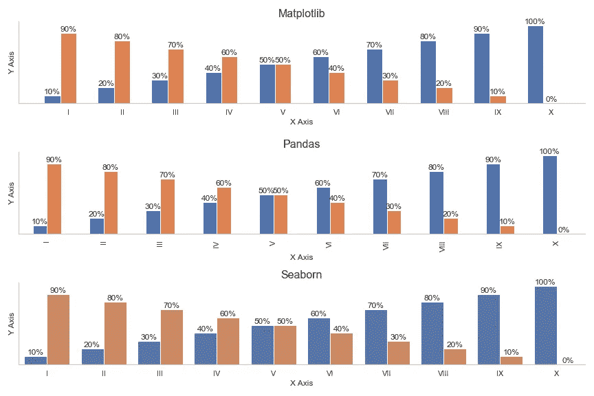
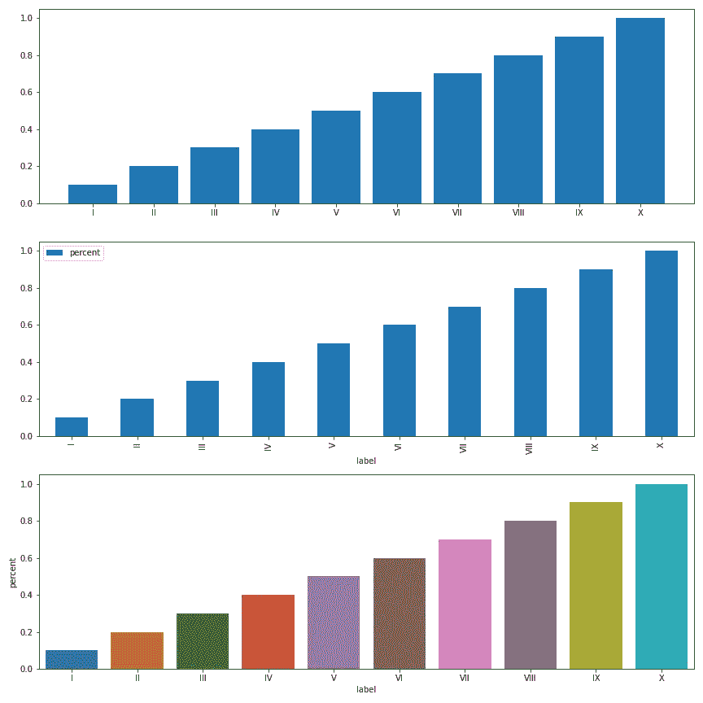
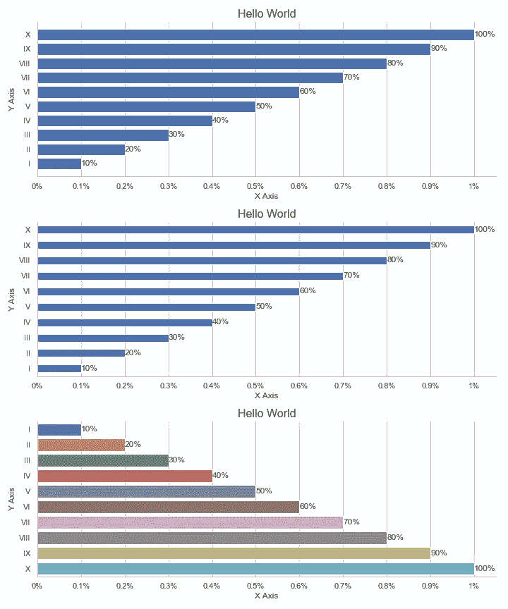
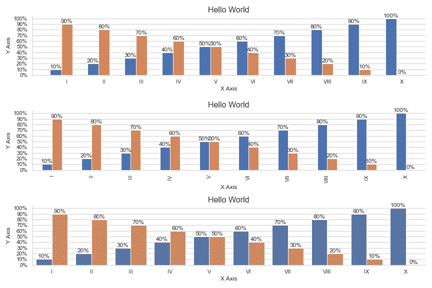

# 使用 Matplotlib、Seaborn 和 Pandas 实现数据可视化

> 原文：<https://towardsdatascience.com/data-visualization-with-matplotlib-seaborn-and-pandas-288f63b99751>

## 有点相同，但也不同

Seaborn 基于 Matplotlib，Pandas 可视化是 Matplotlib 对象，但即使它们使用相同的后端，我们用它们绘制图表的方式也可能非常独特。



分组条形图—作者图片

本文将探索不同的条形图来比较 Matplotlib、Pandas 和 Seaborn 在数据可视化方面的可用性和优缺点。

我们将从定义一些虚拟数据和导入所需的库开始。

```
import pandas as pd
import matplotlib.pyplot as plt
import seaborn as sb
import numpy as npdata = {'label':['I', 'II', 'III', 'IV', 'V', 'VI', 'VII', 'VIII', 'IX', 'X'],
        'percent':[.1, .2, .3, .4, .5, .6, .7, .8, .9, 1],
        'remaining':[.9, .8, .7, .6, .5, .4, .3, .2, .1, 0],
       }df = pd.DataFrame(data)
```

我们将创建一个带有三个支线剧情的 Matplotlib 图形，然后绘制三个条形图，一个带有 Matplotlib，一个带有 Pandas，一个带有 Seaborn。

```
f, (ax1, ax2, ax3) = plt.subplots(3, figsize=(12,8))# matplotlib
ax1.bar(df.label, df.percent)# pandas
df.plot(x='label', y='percent', kind='bar', ax=ax2)# seaborn
sb.barplot(x=df.label, y=df.percent, ax=ax3)

plt.show()
```



简单条形图—图片由作者提供

尽管我们的图表看起来彼此不同，并且我们使用不同的方法来制作它们，但是它们是由相同的 Matplotlib 对象制成的；我们编辑它们的方式是一样的。

## 定制的

一旦我们绘制出条形图，我们可以通过与轴、图形和其他对象交互来定制它们。

为了定制我们的图表，我们可以使用 Seaborn 的函数或者导航 Matplotlib 对象并进行调整。熊猫有它的窍门，可以方便出图，但是它没有编辑 Matplotlib 对象的方法，只有创建它们的方法。

让我们改变图表中的一些东西。我们将设置一个主题，用 Seaborn 删除脊线，添加标签，并用 Matplotlib 编辑记号、标题和图例。

```
# seaborn theme
sb.set_theme(style="whitegrid")f, (ax1, ax2, ax3) = plt.subplots(3, figsize=(10,16))# matplotlib + pandas
ax1.bar(df.label, df.percent)
# pandas + matplotlib
df.plot(x='label', y='percent', kind='bar', ax=ax2)
# seaborn + pandas
sb.barplot(x=df.label, y=df.percent, ax=ax3)**# remove espine
sb.despine(f)****for ax in [ax1, ax2, ax3]:
    # add labels
    container = ax.containers[0]
    labels = ["{:g}%".format(val*100) for val in container.datavalues]
    ax.bar_label(container, labels=labels)
    # horizontal grid only
    ax.grid(False)
    ax.grid(axis='y')
    # set y ticks
    ticks = np.arange(0,1.1,0.1)
    tick_labels = ["{:g}%".format(val) for val in ticks]
    ax.set_yticks(ticks, tick_labels)
    # remove legend
    ax.legend([])
    ax.get_legend().remove()
    # define xy labels
    ax.set_ylabel('Y Axis')
    ax.set_xlabel('X Axis')
    # title
    ax.set_title('Hello World', fontsize=16)**plt.show()
```


条形图—作者提供的图片

## 水平条

为了在 Matplotlib 中改变我们的横条，我们只需要改变`.barh`的方法`.bar`。

如果 X 是一个数字字段，Y 是一个字符串，Seaborn 将自动绘制水平条。如果 X 和 Y 都是数字，我们可以用参数:`orient=’h’`强制水平显示。

熊猫有点令人困惑，但一点也不难。我们需要将参数`kind`改为“barh”，就这样。XY 参数是反转的，所以我们必须将标签传递给 X，即使它们显示在 y 上。

```
f, (ax1, ax2, ax3) = plt.subplots(3, figsize=(10,12))**# matplotlib
ax1.barh(df.label, df.percent)

# pandas
df.plot(x='label', y='percent', kind='barh', ax=ax2)

# seaborn
sb.barplot(data=df, x='percent', y='label', orient='h', ax=ax3)**# remove espine
sb.despine(f)for ax in [ax1, ax2, ax3]:
    # add labels
    container = ax.containers[0]
    labels = ["{:g}%".format(val*100) for val in container.datavalues]
    ax.bar_label(container, labels=labels)
    # horizontal grid only
    ax.grid(False)
    ax.grid(axis='x')
    # set x ticks
    ticks = np.arange(0,1.1,0.1)
    tick_labels = ["{:g}%".format(val) for val in ticks]
    ax.set_xticks(ticks, tick_labels)
    # remove legend
    ax.legend([])
    ax.get_legend().remove()
    # define xy labels
    ax.set_ylabel('Y Axis')
    ax.set_xlabel('X Axis')
    # title
    ax.set_title('Hello World', fontsize=16)

plt.tight_layout()
plt.show()
```



## 分组/聚类条形图

Seaborn 为 Matplotlib 添加了许多功能，Pandas 也有其简化库的方法。

为了用 Matplotlib 绘制一个簇状条形图，我们的 X 需要是数字来调整条形图的位置。我们还需要为每组条形使用`.bar`函数。

这一过程在海鸟和熊猫身上变得更加简单。

```
f, (ax1, ax2, ax3) = plt.subplots(3, figsize=(12,8))**# matplotlib
x = np.arange(0, len(df.label))
ax1.bar(x-0.3, df.percent, width=0.3)
ax1.bar(df.label, df.remaining, width=0.3)****# pandas
df.plot(x='label', y=['percent', 'remaining'], kind='bar', ax=ax2)****# seaborn
df2 = df.melt(id_vars=['label'], value_vars=['percent', 'remaining'])
sb.barplot(data=df2, x='label', y='value', hue='variable', ax=ax3)**# remove espine
sb.despine(f)for ax in [ax1, ax2, ax3]:
    # add labels // loop containers to label all sets of bars
 **for container in ax.containers:
        values = container.datavalues*100
        labels = ["{:g}%".format(val) for val in values]
        ax.bar_label(container, labels=labels)**
    # horizontal grid only
    ax.grid(False)
    ax.grid(axis='y')
    # set y ticks
    ticks = np.arange(0,1.1,0.1)
    tick_labels = ["{:g}%".format(val*100) for val in ticks]
    ax.set_yticks(ticks, tick_labels)
    # remove legend
    ax.legend([])
    ax.get_legend().remove()
    # define xy labels
    ax.set_ylabel('Y Axis')
    ax.set_xlabel('X Axis')
    # title
    ax.set_title('Hello World', fontsize=16)

plt.show()
```



Pandas 允许我们为 Y 使用一个字段列表，并在传递多个值时自动绘制一个簇状条形图；我们需要每组条形的一列值。

Seaborn 允许我们定义色调，它控制我们的数据如何分组和着色；我们需要一列显示所有的值，一列显示条形的类别/组。在上面的例子中，我们必须调整数据帧的形状以适应 Seaborn。

## 最后的想法

Seaborn 对我们的图表风格化很有帮助；通过更多可访问的功能和不同的图表类型，它为可视化过程增加了很多价值。

熊猫擅长快速想象。不用导入任何额外的库，只用一行代码就能生成一个不错的图表。

但最终，它们都是 Matplotlib，所以不管我们使用哪个选项，如果我们理解 Matplotlib 的结构和对象，我们就能够根据我们的需要定制图表。

我们还可以在单个可视化上利用所有三个库；我们可以直接从熊猫开始绘制，使用 Seaborn 添加友好的主题，使用 Matplotlib 调整细节。

感谢阅读我的文章！
[更多教程](https://linktr.ee/thiagobc23) | [推特](https://twitter.com/thiagobc231)