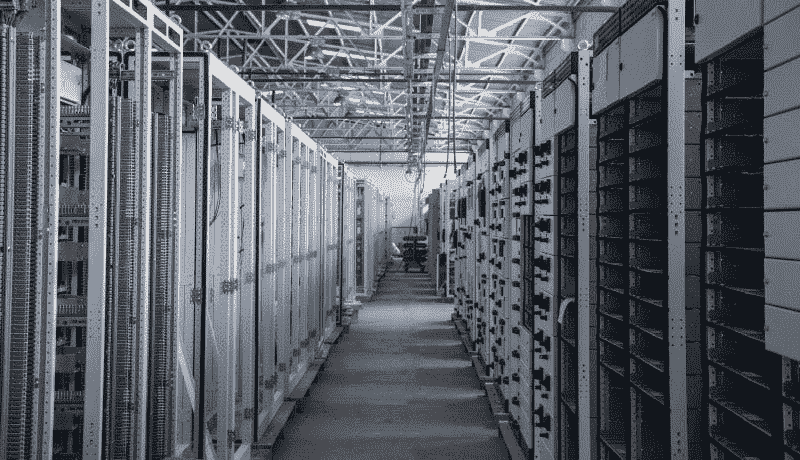
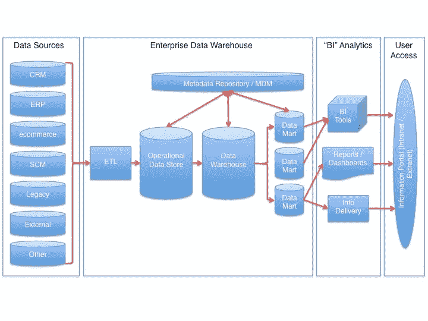

# 分布式应用的数据仓库

> 原文：<https://towardsdatascience.com/data-warehouses-for-distributed-applications-7e34679f74>

# 分布式应用的数据仓库

## 什么是云数据仓库，如何大规模实现它们

[照片](https://unsplash.com/photos/lVZjvw-u9V8)由[i̇smail·埃尼斯·艾汉](https://unsplash.com/@ismailenesayhan?utm_source=medium&utm_medium=referral)在 Unsplash 上拍摄

如今，大多数企业都有自己的内部软件系统，用于消化、分析和管理与企业运营相关的信息。例如，在零售业，内部软件系统用于跟踪付款、客户、工资等。随着时间的推移，这种系统通常会积累大量数据。因此，有效地分析和组织这些数据对企业的发展和成功至关重要。

这就是数据仓库发挥作用的地方。

数据仓库是数据管理系统，使用户能够搜索、分析和查询企业的历史数据。它们通常为用户提供与关键业务运营相关的问题的答案，如在某一时期哪种产品的销量最高？某个部门最大的支出是什么？

这些问题的答案推动着商业决策。因此，数据仓库中的数据和分析模型越好，其答案的质量就越高。

# 选择正确的数据仓库

在购买高功能仓库时，需要考虑很多方面:

*   **稳定性:**数据仓库应该持续运行。
*   **特定领域:**由于有许多部门和部门链接到核心[商业智能](http://static.infotech.com/samples/business-intelligence-core-concepts-and-technologies.pdf)，数据仓库应该能够分离、剖析和聚合其数据，并根据特定部门或主题提供答案。
*   易于使用:员工使用数据仓库不需要大量的培训。
*   **持续备份和存储:**存储在数据仓库中的数据应该永不丢失，并且数据仓库应该能够存储海量的数据。在大多数情况下，我们拥有的数据越多，答案就越准确。最近成功融入数据存储的创新是云。云数据仓库的创建已经彻底改变了数据存储场景，并且现在处于数据存储解决方案的最前沿。

# 云数据仓库

云数据仓库不仅用于存储和备份。它们还能够接收和存储来自多个数据源的数据，这大大提高了仓库的能力。

它们还相当便宜，因为您不必像构建自己的数据仓库那样，实际购买和设置服务器和存储的物理基础架构。相反，您可以简单地在云上租用它们。云提供商通常还会提供高质量的安全措施来保护您存储数据的可用性和完整性。

[来源](https://commons.wikimedia.org/wiki/File:Datawarehouse_reference_architecture.jpg)

数据从 OLTP(在线事务处理)数据库提取到数据仓库。这通常使用定期数据转储或连续更新流来完成。然后，数据被转换成更适合分析的模式，被清理并保存到数据仓库中。这个过程被称为提取-转换-加载( [ETL](https://www.ibm.com/cloud/learn/etl#:~:text=ETL%2C%20which%20stands%20for%20extract,warehouse%20or%20other%20target%20system.) )。

# 分布式应用

照片由 [CreateTravel.tv](https://unsplash.com/@greenmarketing?utm_source=medium&utm_medium=referral) 在 [Unsplash](https://unsplash.com?utm_source=medium&utm_medium=referral) 上拍摄

通常，每个业务部门都有自己的内部系统和自己的数据库。这是因为每个部门基于他们的需求需要不同的功能套件。然而，当涉及到关键数据分析时，需要来自每个部门的每一点数据。因此，数据仓库需要在一个中心位置收集来自不同来源的所有数据。

当然，这个过程带来了许多挑战。例如，在许多企业中，将所有数据存储在一个中央数据库中是没有意义的。因此，数据仓库必须能够动态地从各种来源获取与所提供的查询相关的数据。这就是分布式系统概念发挥作用的地方。

[分布式系统](https://www.techopedia.com/definition/23971/distributed-application)是计算机科学中的一个基础领域，在当今的技术进步中，它变得越来越重要。由于大公司要处理大量的数据和计算，所以用一台机器来处理这些数据和计算是不可行的。因此，他们需要将数据或计算过程“分布”到各种不同的机器上。那么，这些机器必须同步运行，以创建一个大数据处理单元。

该系统也称为水平缩放，不同于通常使用的传统垂直缩放方法。[垂直扩展](https://www.esds.co.in/blog/vertical-scaling-horizontal-scaling/)是你增加更多计算能力的地方(比如 RAM、CPU 等。)到现有的机器上。相比之下，水平扩展是向现有的机器池中添加更多的机器。

分布式数据仓库应用程序最关键的部分之一是体系结构，它反映了不同的数据库在不同的场合如何相互交互。在这样的高质量架构中，复杂的查询并不总是需要所有数据库的输入。他们将能够分解和“标记化”一个复杂的查询，并从正确的数据库中获取相关数据。

好消息是，随着云数据仓库的兴起，您不一定需要从头构建这样一个系统。在大多数情况下，您将能够使用流行的云提供商提供的现成解决方案。

# 结论

总而言之，数据仓库是当今运营业务流程的基本组成部分。它们使产品所有者和经理能够获得重要问题的答案，然后他们用这些答案来为未来做出决策。只有你的数据仓库建立在坚实的架构上，使用分布式系统，使用安全的云平台，才能做到这一点。这将使您的数据仓库能够完成收集和分析所有业务数据的复杂任务。

开发团队必须对他们的存储需求进行非常仔细的评估，然后才能做出明智的选择。他们首先必须评估将要存储的数据类型，无论是结构化的、半结构化的、非结构化的还是它们的混合。接下来，他们必须评估自己的读写访问模式。之后，他们需要通过制定预算和寻找最合适的云提供商来考虑财务方面的事情。他们还需要考虑云提供商提供的服务器的位置，因为它会极大地影响延迟。最后，他们还需要大致了解所需的容量。

如果您想定期收到关于人工智能和机器学习的最新论文的论文评论、高质量的 ML 教程等，请添加您的电子邮件[此处](https://artisanal-motivator-8249.ck.page/5524b8f934) &订阅！