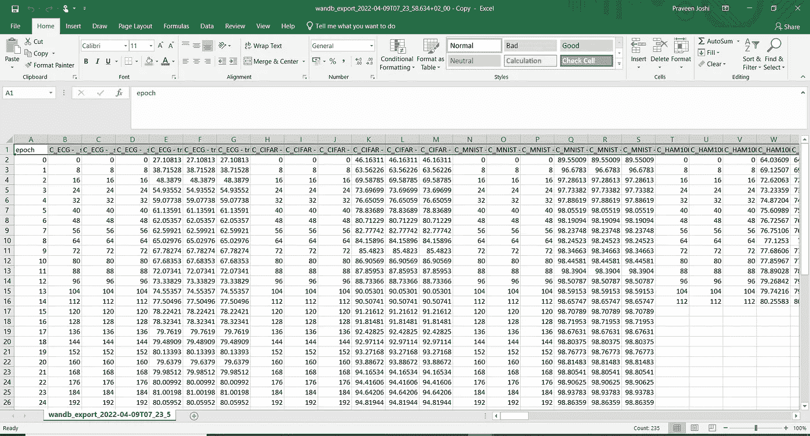
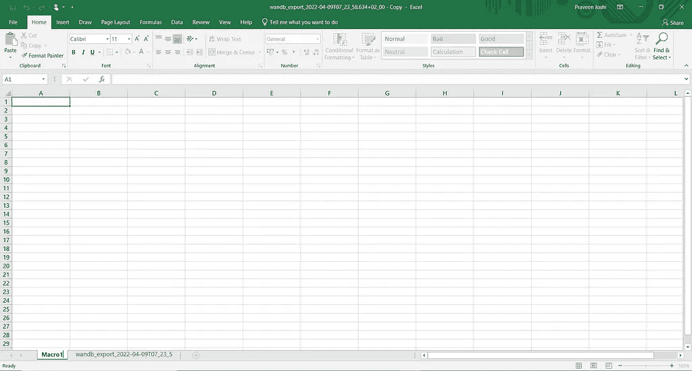
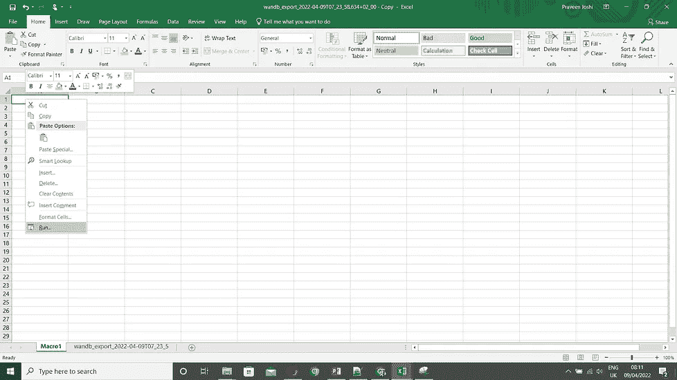
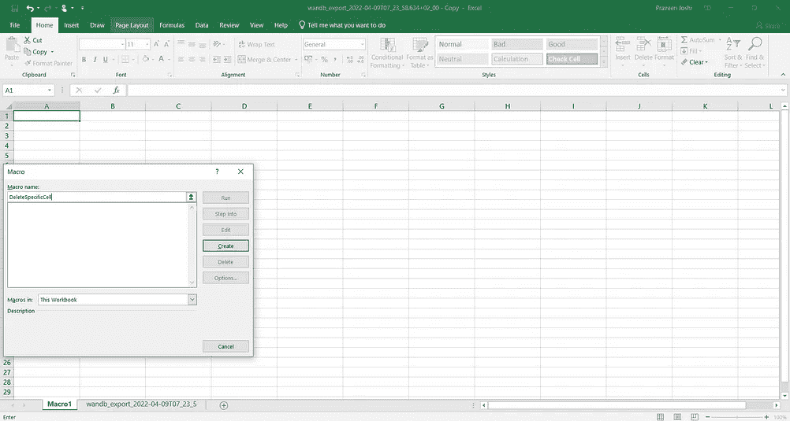
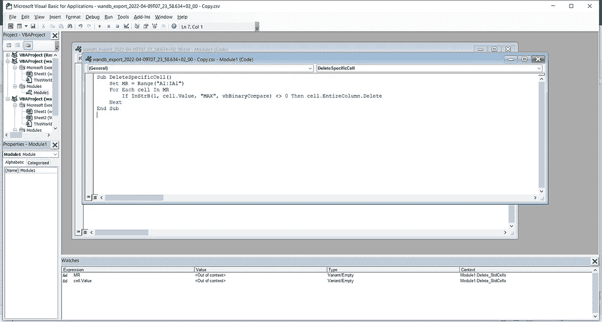

# Wandb.ai 制作 Excel 文件的数据角力

> 原文：<https://towardsdatascience.com/data-wrangling-of-excel-file-produced-by-wandb-ai-68157d67dbde>

> 最好保持真实。— *作者:连姆·尼森*

简而言之:使用 VBA 删除标题中包含特定单词的 Excel 列。

W andb.ai 提供了一个中央仪表盘来跟踪您的超参数、系统指标和预测，以便您可以实时比较模型并分享您的发现。这使得研究人员可以根据记录的数据绘制图表；同时，它还绘制了一段时间内记录的默认值。


Wandb 仪表盘(图片提供:【https://wandb.ai/site】T4)

# 动机

随着大量信息被记录到 Wandb 中，利用所有这些信息来记录有意义的图表变得更加容易。

当有人希望将这些图表的数据下载到 Excel 文件中进行进一步处理时，问题就出现了。尽管这些图表上的数据看起来很可爱，但在 Excel 中，潜在的支持数据却非常庞大。

昨晚我在做一个漂亮的科幻图表，这很棒，但后来我意识到我需要对这些数据做更多的处理。为此，我下载了 Excel 格式的图表数据，发现了大量的数据字段，大约有 256 个属性；其中一半以上是不需要的。所以*我在 wandb 中搜索过滤器功能，但是在我写这篇文章的时候它还没有出现:(*希望它会在我的文章之后出现)。

人们可以想到的一个修复方法是执行 **Ctrl +F** 并找到您感兴趣的列，然后将它们移动到一个新的工作表中，但是我借此机会学习了一个方便的宏，值得与 DataScience 社区共享。

# 解决

## 投稿:如果 Excel 中不必要的列的名称包含(' somethingThatIDontKnowYet ')，如何删除这些列？

解决问题的步骤:

1.  在 Excel 文件的标题列中找到模式，这是进一步处理所不需要的。例如，我想删除后缀为 **_steps、_MAX、**和 **_MIN 的列。**



导出的 wandb Excel 文件

2.一旦你确定了你想要删除的列中的**‘文本’**，下一步就是启动一些 VBA 命令来删除它。

对于 **Windows 10** 用户，是***Ctrl+F11****。这将为您打开一个新的宏表。将 wandb 表中的所有数据复制到宏表中。然后右击宏表的任意单元格，选择*菜单项。**

****

*右边的图像是一个宏表，当你按下(Ctrl+ F11)时就会出现。左图显示了右键单击任何工作表单元格后可以看到的菜单项。*

*3.给你的宏命名。我称之为 *DeleteSpecificCell* (应该是一个*DeleteColumnsContaining*；大脑有自己有趣的做事方式😐).一旦你**点击创建**，一个 VBA 编辑器将会打开，如下图右侧所示。*

*在您的 VBA 编辑器中，您最初会看到两行:*

```
***Sub DeleteSpecificCell()** <<We will be writing code in here>>**End Sub***
```

*在代码块中，编写:*

```
***Set MR = Range("A1:EI1")
    For Each cell In MR
        If InStrB(1, cell.Value, "step", vbBinaryCompare) <> 0 Then cell.EntireColumn.Delete
    Next***
```

*代码块解释:*

```
*# Underneath line represents the selection of columns in the workheet which will be considered while running macro 
**Set MR = Range("A1:EI1")** 
    **For Each cell In MR**
  # Underneath line tells macro to delete entire column where header contains "step" replace this with your identified text.
        **If InStrB(1, cell.Value, "step", vbBinaryCompare) <> 0 Then cell.EntireColumn.Delete
    Next***
```

****

*右侧的图像显示了在执行上一步时，点击菜单中的**运行**后出现的屏幕。左边的图片显示了 VAB 编辑器，一旦你为你的宏提供了一个名字，点击**创建**按钮，这个编辑器就会打开。*

*3.瞧啊。！菜谱做好了。**填写完数据后，按 F5** 键，返回宏表查看神奇之处。我能够将 256 列减少到 65 列，以便进一步处理。*

*这样，Wandb 客户从此可以愉快地处理他们的数据。*

*编码快乐！！*

# *参考:*

*[https://www . extend office . com/documents/excel/3086-excel-delete-columns-based-on-header . html #:~:text = Right % 20 click % 20 column % 20 header，columns % 20 被%20deleted%20at%20once](https://www.extendoffice.com/documents/excel/3086-excel-delete-columns-based-on-header.html#:~:text=Right%20click%20the%20column%20header,columns%20are%20deleted%20at%20once) 。*