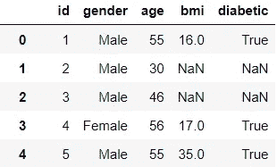
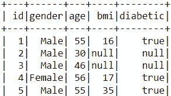
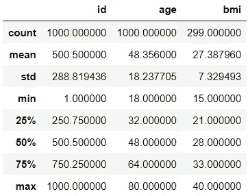
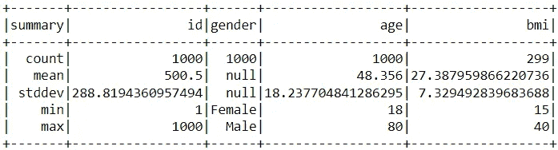
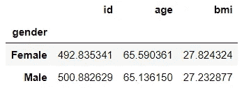
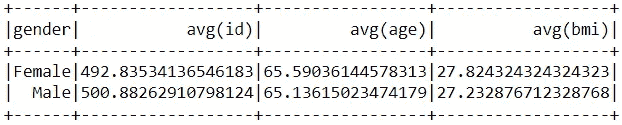
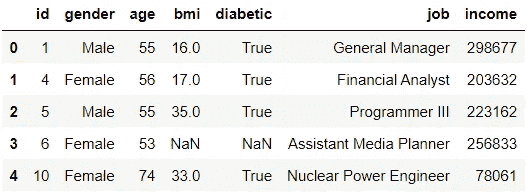
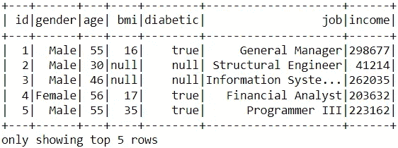
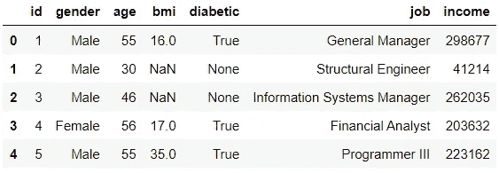

# PySpark 的数据争论，适合初学者

> 原文：<https://towardsdatascience.com/data-wrangling-with-pyspark-for-beginners-3f2197c81511>

## 从熊猫用户的角度看 PySpark 初级读本

戈兰·艾沃斯在 [Unsplash](https://unsplash.com?utm_source=medium&utm_medium=referral) 上的照片

熊猫图书馆是数据科学家的主要宝库，由于其功能和易用性，许多人开始依赖该模块进行数据处理。

不幸的是，当谈到处理大数据时，Pandas 是不够的，随着大数据变得更加普遍，这提出了一个问题。

**PySpark** ，一个用于 Apache Spark 的 Python API，是处理大量数据的绝佳选择。

不幸的是，PySpark 并没有获得和熊猫一样的吸引力，尽管它有着巨大的效用。由于 PySpark 不是一个纯 Python 框架，它的学习曲线更长，这可能会阻碍其他人学习使用该工具。

在这里，我们从一个熊猫用户的角度探索 PySpark 作为一个数据争论的工具。

## 为什么 PySpark 适合大数据？

PySpark 在处理大型数据集方面优于 Pandas，这源于它的两个最明显的特性。

1.  **PySpark 采用并行处理**

与在单台机器上运行所有操作的 Pandas 不同，PySpark 利用并行处理，这需要在多台机器上并行运行操作，从而以更快的处理速度获得结果。

**2。PySpark 实现懒惰评估**

PySpark 还通过引入惰性评估来优化其操作。简单来说，它只会在必要的时候导出运算的结果。这种方法有助于最小化任何数据处理过程的计算和运行时间。

这与熊猫图书馆形成对比，熊猫图书馆使用热切的评价。Pandas 中的所有计算都会在操作被调用后立即执行，结果会立即存储在内存中。虽然这对于小数据集是可行的，但当可伸缩性成为一个问题时，这是一个障碍。

## PySpark vs 熊猫:语法

幸运的是，PySpark 数据帧的语法与 Pandas 的语法非常相似。

我们可以通过对使用 [Mockaroo](https://www.mockaroo.com/) 生成的模拟数据集执行一些操作来展示 PySpark 语法。

为了获得更好的视角，我们将在适当的时候对熊猫执行相同的操作。

**1。创建 Spark 会话**

spark 会话充当创建和操作数据帧的入口点。它方便了 PySpark 中的所有后续操作。

默认情况下，创建的会话将使用所有可用的核心。

**2。加载数据集**

让我们用 Pandas 和 PySpark 加载第一个模拟数据集。

熊猫:

PySpark:

在加载数据时，Pandas 会自动从它读取的数据中做出推断。例如，具有数值的要素将被赋予 int 或 float 数据类型。

另一方面，PySpark 没有这样的推论。默认情况下，PySpark 会将标题视为第一行，将所有列视为字符串变量。为了防止 PySpark 做出任何错误的假设，用户必须给`header`和`inferSchema`参数赋值。

**3。查看数据集**

熊猫:

代码输出预览(由作者创建)

PySpark:

代码输出预览(由作者创建)

因为 PySpark 实现了延迟执行，所以它需要一个触发器来导出任何操作的结果。在这种情况下，`show`函数充当触发器，让用户查看加载的数据集。

**4。选择列**

熊猫:

PySpark:

**5。描述数据集的特征**

熊猫:

代码输出(由作者创建)

PySpark:

代码输出(由作者创建)

虽然 Pandas 和 PySpark 使用相同的`describe`函数，但是两个包的代码输出略有不同。

首先，PySpark 没有透露列的第 25、50 和 75 百分位值。其次，PySpark 与 Pandas 不同，它包含分类特征的描述性统计数据(在本例中为`gender`列)。

**6。重命名列**

使用 Pandas 和 PySpark，我们将`id`列重命名为“person_id”。

熊猫:

PySpark:

**7。添加列**

接下来，我们添加一个显示 10 年内受试者年龄的列。

熊猫:

PySpark:

**8。移除立柱**

之后，我们删除新添加的列。

熊猫:

PySpark:

Pandas 和 PySpark 都用`drop`功能删除列。唯一的区别是 PySpark 不包含`axis`参数。

**9。删除缺失值**

熊猫:

PySpark:

10。过滤

在这个过滤操作中，我们只保留 50 岁以上的人的记录。

熊猫:

PySpark:

PySpark 非常像熊猫，允许使用括号来过滤记录。它还允许用户使用`filter`功能过滤数值。

11。聚合

让我们通过找出每个性别组的所有特征的平均值来执行聚合。

熊猫:

代码输出(由作者创建)

PySpark:

代码输出(由作者创建)

这两个包之间唯一的区别是 PySpark 在输出的列名中包含了聚合类型(类似于 SQL)。

**12。加入**

我们现在有了额外的数据，显示了我们希望与当前数据集合并的每个 id 的工作和收入。

熊猫:

代码输出(由作者创建)

PySpark:

代码输出(由作者创建)

**13。转换成熊猫数据帧**

最后，我们通过使用`toPandas`函数将合并的 PySpark 数据帧转换为 Pandas 数据帧来结束练习。

代码输出(由作者创建)

## PySpark 的缺点(对于熊猫用户)

尽管 Pandas 和 PySpark 数据帧之间的语法相似，但 Pandas 用户可能仍然会发现适应新软件包的困难。

Pandas 用户在使用 Pandas 很长一段时间后，可能会对数据处理有明显的感觉。不幸的是，与熊猫数据框争论的一些原则可能不适用于 PySpark。

PySpark 的一些特性可能会妨碍熊猫用户。

1.  **PySpark 不支持行索引**

行索引(即每一行被分配一个索引号)在 Pandas 中可能很常见，但在 PySpark 中却没有用武之地。习惯于通过索引访问行或使用 Pandas 遍历行的用户可能会发现很难导航 PySpark。

**2。PySpark 不具备熊猫的功能**

Pandas 库提供了大量可以增强项目的工具(例如可视化)。不幸的是，可以使用 Pandas 数据框执行的某些任务无法使用 PySpark 数据框执行。

注意:对于这种情况，用户可以使用`toPandas`函数将 PySpark 数据框转换为 Pandas 数据框。

**3。PySpark 错误更难调试**

PySpark 错误消息可能很难解释和解决。此外，PySpark 并不像熊猫那样拥有大量的社区支持。因此，在 PySpark 中调试可能是一项艰苦的工作。

## 结论

照片由 [Prateek Katyal](https://unsplash.com/@prateekkatyal?utm_source=medium&utm_medium=referral) 在 [Unsplash](https://unsplash.com?utm_source=medium&utm_medium=referral) 上拍摄

尽管数据科学家可以单独使用 Pandas 模块成功完成许多项目，但如果他们缺乏处理更大数据集的适当方法，他们就不应该满足于自己的技能。毕竟，随着行业转向大数据解决方案，像 PySpark 这样的工具将不可避免地成为必需品。

幸运的是，尽管 Pandas 和 PySpark 之间存在差异，但两个包共享相似的语法，因此从一个包转换到另一个包应该是可行的。

我祝你在数据科学的努力中好运！