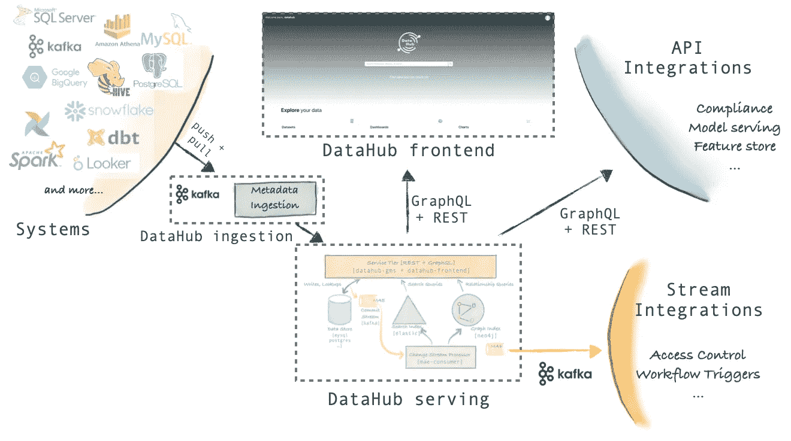
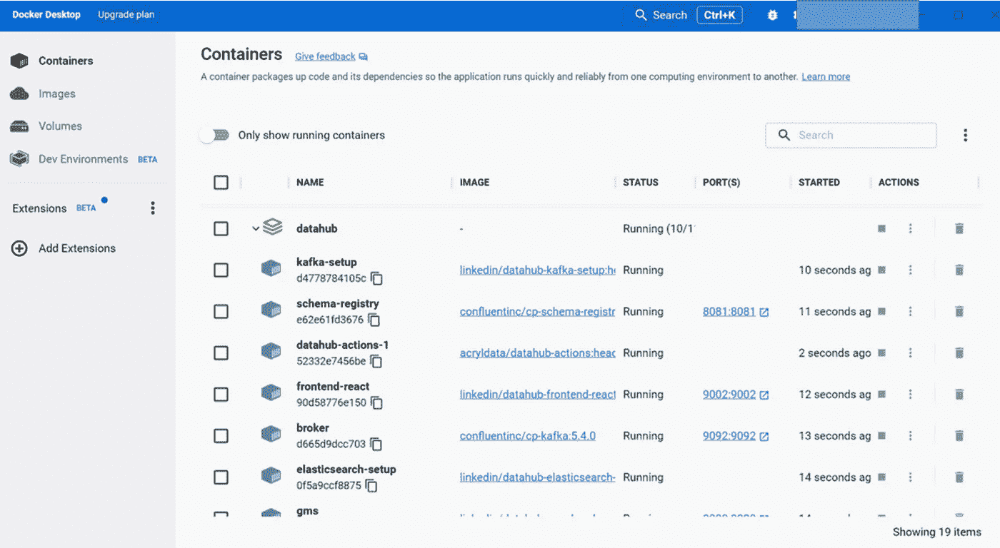
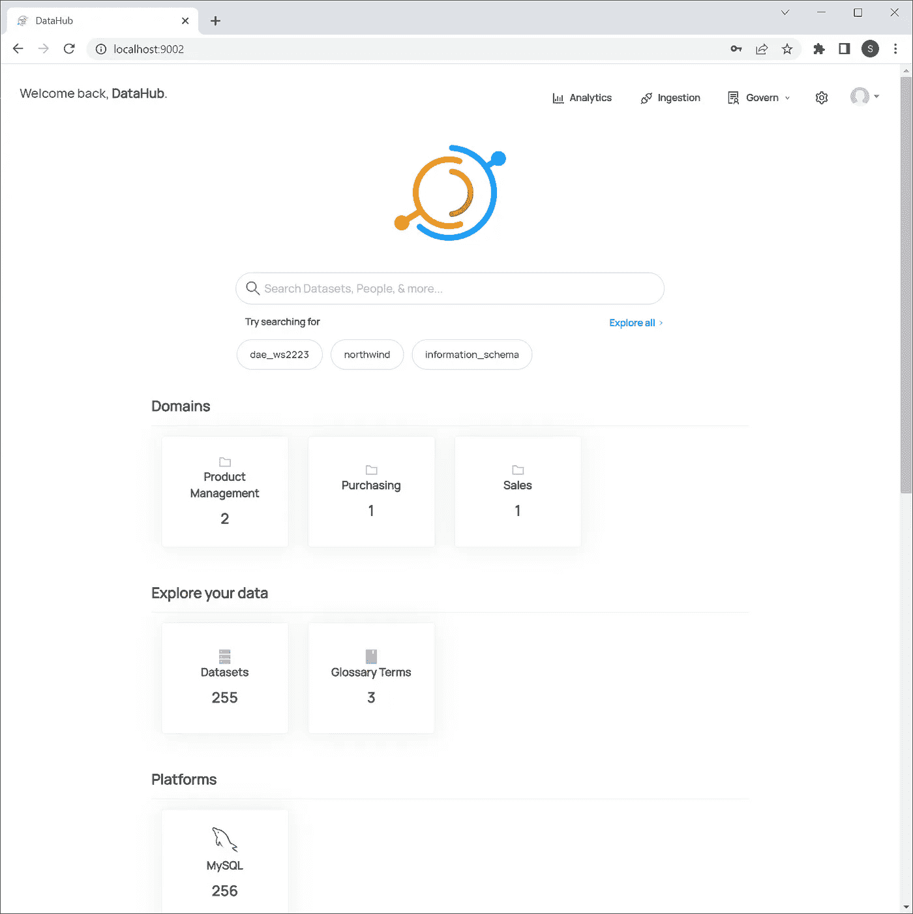
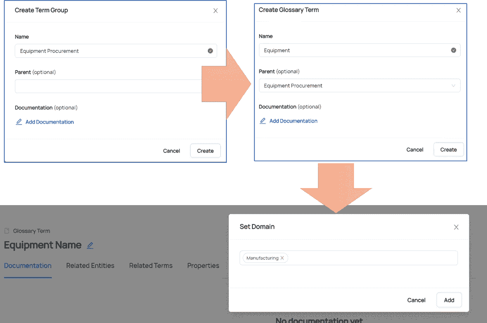
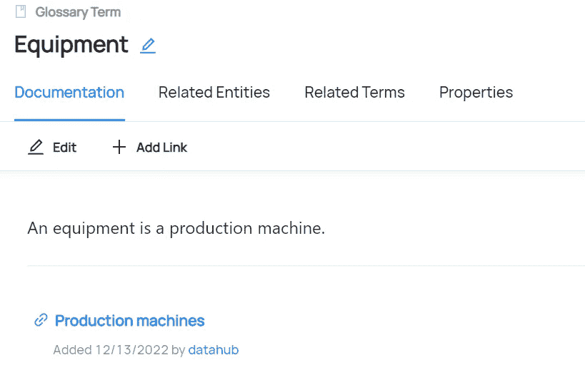
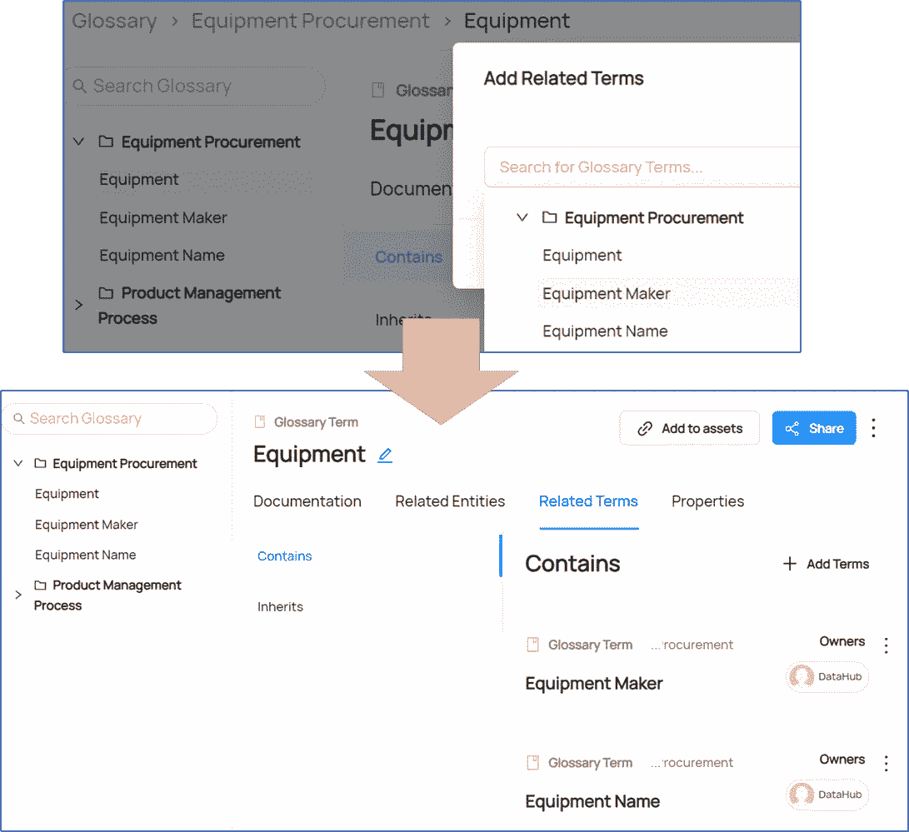
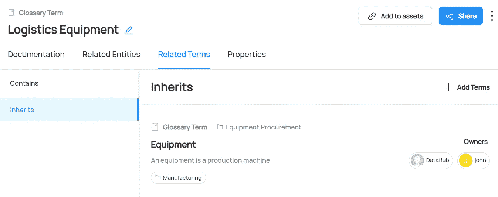

# 数据中心实践第一部分

> 原文：<https://towardsdatascience.com/datahub-hands-on-part-i-f0709e7efec9>

亚历山大·辛恩在 [Unsplash](https://unsplash.com?utm_source=medium&utm_medium=referral) 上的照片

# **简介**

为了准备新的讲座，我正在搜索最新的开源数据编目工具，以便让我的学生能够实践数据治理(DG)理论。其中，我偶然发现了 LinkedIn 的“数据中心”。除了丰富的功能集，如[数据发现、数据血统和数据质量](https://github.com/opendatadiscovery/awesome-data-catalogs)，它还使用 [docker](https://atlan.com/linkedin-datahub-tutorial/) 进行了非常简单的设置。因为我想记录我的测试用例、配置和发现，所以我决定也分享它们。我计划发布 3 个故事部分，包括:

1.  数据治理的动机、数据中心的背景、数据中心设置和基本术语表设计
2.  数据接收、链接数据实体和数据发现
3.  用户和角色、数据验证、数据沿袭和摘要

那么，让我们从第 1 部分开始吧！

# 数据治理

我在行业中看到的鸡和蛋的问题是，DG 处理的问题无法用 IT 工具轻松解决，但如果没有强大的 IT 工具，DG 也根本不会有效。那么从哪里开始呢？公司需要理解(或更好地:感受)整个组织中坏数据的痛苦(例如，坏数据会减慢业务流程)，否则就没有动力和支持 DG。然后，您需要将这种痛苦转换成量化的度量，更具体地说是数据质量(DQ)度量。一旦你了解了你的敌人，你就可以设定一个目标并设计一个计划来实现这个目标。例如，表中特定列的主数据的完整性很容易衡量，可以作为一个起点。假设您现在有 60%的完整性，并希望在一年内达到 90%，那么您需要确定并修复丢失数据的根本原因(例如，GUI 强制)。当然，您需要跟踪进度，例如，检查完整性是否通过这次修复得到显著提高，一年后是否真的达到了 90%——因为如果没有，必须有人举手启动“b 计划”。

## 现实的冲击…

听起来很简单…但是…主要的问题是，你需要一个能够首先看到并量化坏数据的人，一个负责推动这种改进的人，你需要专家来填补缺失的数据并维护(或者一个有好算法的人)，你需要一个在技术上能够修复 it 系统中的某些东西的人，你需要一个来自管理团队的支持业务流程中必要变化的人，以及一个能够实施 DQ 并定期关注 IT 的人。当然，所有这些人都需要时间，需要优先处理其他任务。这就是 DG 的难点所在，即识别、激励和组织合适的人以结构化的方式改善数据环境，因为在现实中，这不仅仅是一个孤立的小问题，而是一系列相互影响的问题，具体取决于公司规模和业务复杂性。

不幸的是，DG 工具并不是一根魔棒，安装后就能让所有的数据问题和组织缺口消失。但至少它有助于测量和可视化 DQ，加速根本原因(和影响)分析，并建立业务条件和 it 实体之间的联系。这些功能会影响仍然需要人力的组织中 DG 活动的吞吐率——但与没有任何工具支持的 DG 相比，可能只是很小的一部分。

这也是我在本文中想要探讨的:DataHub 如何符合这些期望？

# 数据中心

数据中心的整体架构如下图所示:

来源:Datahubproject.io

我们可以看到左边有许多不同数据库技术的连接器，涵盖了 SQL 和 NoSQL。有了这些连接器，就可以很容易地设置元数据接收过程，因为所需的配置由向导指导。如果所需的连接器不可用，仍然可以手动配置记录。元数据被转发到所谓的服务层，它由内部数据存储(例如 MySQL)、搜索引擎(Elastic)、图形索引(neo4j)和可以通过 REST 和 GraphQL 查询的 View More 组成。

最终用户与数据中心前端一起工作，例如搜索实体、浏览目录和维护术语表术语。API 和流集成是我不会在测试用例中涉及的其他特性。

# 数据中心设置

一般来说，您可以选择托管数据中心(SaaS)或自托管数据中心。我选择了第二个选项，简而言之就是在 Docker 环境中部署一个 DataHub 实例。我不会深入讨论每个步骤的所有细节，因为它们在 Datahub 产品页面上都有很好的记录。基本要求是 Docker 桌面、命令行 JSON 处理的 jq、Python 3.7(最低)和足够的硬件(2 个 CPU、8 GB RAM、2 GB 交换空间和 10 GB 磁盘空间)。一旦一切准备就绪(并且所有路径都设置正确:)，就可以使用 CMD 命令轻松安装和部署 DataHub 了。

来源:作者

然后可以通过浏览器访问用户前端。名为“DataHub”的默认用户被配置为用于初始访问。当它工作时，你会看到一个类似谷歌的启动屏幕，有一个中央搜索框——然而，没有什么可搜索的，因为数据目录是空的。由于我已经完成了一些数据接收和术语表维护，我的 DataHub 实例已经显示了关于可用域、数据集和平台的附加信息。

来源:作者

# 词汇表设计

## 元数据概念

在右上角，我们看到一个带有几个选项的菜单栏。为了将业务知识添加到数据目录中，我们对“治理”选项感兴趣。这里我们看到以下子选项:

来源:作者

适当的目录设计需要正确理解可用的元数据概念:

*   **域**:我们希望组织相关数据资产(例如，属于销售组织的所有数据资产)的更广泛的业务领域
*   **术语组**:类似于操作系统的文件夹，可能包含术语甚至其他术语组。
*   **术语**:被赋予特定业务定义的单词或短语。
*   标签:非正式的、松散控制的标签，有助于搜索&发现。

市场上还有其他 DG 框架和数据目录，它们具有稍微不同或附加的元数据概念，例如数据对象、业务流程和策略。根据公司对 DG 工具的灵活性和范围的期望，这可以被认为是 DataHub 的一个弱点。另一方面，各种信息需要从某个地方收集并维护，这意味着相当大的工作量——因此 DataHub 提供的元数据概念集是一个很好的起点，并且仍然允许构建全面的数据模型。

## 元数据维护

现在的问题是如何恰当地使用这些概念。应该有由中央 DG 办公室制定的指导方针，以便每个业务领域(即领域)以相同的方式使用这些概念。例如，你可以说“术语组”应该像业务流程一样对待。让我们来练习一下这个例子:我们希望有一个业务流程(术语组)“设备采购”，它包含与设备采购相关的所有术语(例如，设备名称、设备制造商、设备本身)。这些术语属于“制造”领域。这可以在 DataHub 中完成，如下所示:

来源:作者

然后我们创建我们的术语组，它的一个术语，我们将这个术语关联到相应的领域。

来源:作者

一旦我们的术语被创建，我们可以设置一个正式的定义，并添加更多的信息作为链接:

来源:作者

## 语义建模

这很酷——但是我们可以在词汇表中做更多的语义数据建模！假设我们想要指定一些术语，这些术语是设备的详细信息，比如名称或制造商。然后，我们也可以在 DataHub 中使用“contains”关系构建这样的层次结构，这类似于对象/属性关系:

来源:作者

此外，我们可以在术语表中使用继承。例如，我们想要区分像“测量设备”和“后勤设备”这样的设备类型，它们与“设备”没有区别，只是更具体的“设备”类型。在这种情况下，我们可以通过“继承”功能连接这些术语:

来源:作者

## 结论第一部分

尽管语义建模提供了一些很酷的特性，但我的印象是，在数据中心中，它背后并不总是有技术逻辑。例如，继承术语实际上并不从“父术语”(例如，描述、所有权或链接)继承元数据，而相关的“子术语”(通过“包含”)并不真正了解这种关系，因为它没有出现在它们的数据集中。结构信息只是单向的。我真正缺少的是“包含”术语的继承(就像面向对象编程中的属性)，因为作为通用术语一部分的术语也应该是相关“子”术语的一部分，否则您必须冗余地维护这些信息，或者您最终会得到不一致的元数据。另一个设计选项是避免继承术语中的“包含”关系，因为“父术语”可以被链接和点击，这样就可以很容易地在“父”数据集中找到相关的“包含”关系。我认为，还缺少一个双向关系视图，可能也是一个可视化的形式，这样数据管理员就可以一眼看到全局。同样，术语表的好处是可以共享条目，例如通过邮件或直接链接，这支持数据利益相关者之间的交流过程，或者可以集成到其他 IT 工具中。

在下一部分中，我们将深入研究数据摄取，并讨论如何将术语表(业务领域)与数据集(it 领域)联系起来。