# DBSCAN 集群:给我分解一下

> 原文：<https://towardsdatascience.com/dbscan-clustering-break-it-down-for-me-859650a723af>

## 强大算法的简单介绍

欢迎回到*我不知道为什么我对这个算法感到不安的世界，因为我完全凭直觉得到它*，在这里我们采用复杂的机器学习算法，并用有趣的插图将它们分解成简单的步骤。

今天，我们将处理另一种叫做 **DBSCAN** ( **基于密度的应用程序空间聚类**)的聚类算法。为了更好地理解 DBSCAN，首先查看一下 K-Means 和层次聚类文章。

顾名思义，DBSCAN 通过点的密度来识别簇。聚类通常位于高密度区域，异常值往往位于低密度区域。使用它的 3 个主要优势(根据这个[算法](https://www.aaai.org/Papers/KDD/1996/KDD96-037.pdf)的先驱)是它需要最少的领域知识，可以发现任意形状的集群，并且对于大型数据库是有效的。

既然我们已经介绍完了，让我们进入有趣的部分——真正理解它是如何工作的。假设我们的原始数据是这样的:

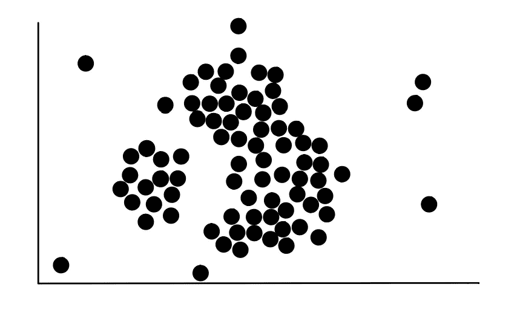

第一件要做的事是数点*接近*的每一个点。我们通过围绕一个点画一个具有一定半径的圆( ***eps*** )来确定这个接近度，并且任何落在这个圆内的其他点都被称为接近第一个点。例如，从这个粉红色的点开始，围绕它画一个圆。

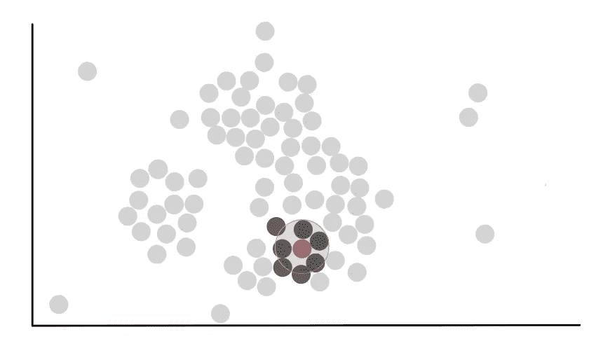

围绕任意一点画一个半径为 eps 的圆

我们看到这一点与其他 7 点完全或部分重叠。所以我们说粉点接近 7 分。

> 称为 ***eps*** 的圆的半径，是我们需要定义的 DSBCAN 算法中的第一个参数。我们需要适当地定义 **eps** ，因为如果我们选择的值太小，很大一部分数据将不会被聚集。另一方面，如果我们选择一个太大的值，聚类将合并，许多数据点将在同一个聚类中。一般来说，较小的 **eps** 值是优选的。

现在考虑这个蓝点。我们看到它接近 3 个点，因为它的半径为 ***eps*** 的圆与另外 3 个点重叠。

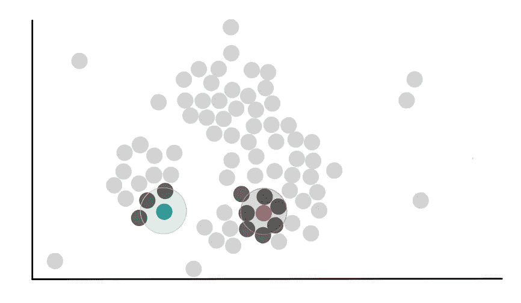

同样，对于所有剩余的点，我们计算接近点的数量。一旦我们这样做了，我们需要决定哪些点是 ***核心点*** ，哪些点是 ***非核心点*** 。

> 这就是我们算法的第二个参数——***min points***——出现的地方。我们使用**最小点**来确定一个点是否是**核心点**。假设我们将**最小点**设置为 4，那么我们说如果至少有 4 个点靠近一个点，那么这个点就是**核心点**。如果少于 4 个点接近一个点，则视为**非核心点**。
> 
> 一般来说， **minPoints** *≥* 数据集中的维数+ 1。对于有噪声的数据集，较大的值通常更好。 **minPoints** 的最小值必须是 3，但是我们的数据集越大， **minPoints** 的值就必须越大。

对于我们的示例，让我们将 ***minPoints*** 设置为 4。那么我们可以说粉色点是一个 ***核心点*** 因为至少有 4 个点接近它，而蓝色点是一个 ***非核心点*** 因为只有 3 个点接近它。

最终，利用以上过程，我们可以确定以下高亮点是 ***核心点……***

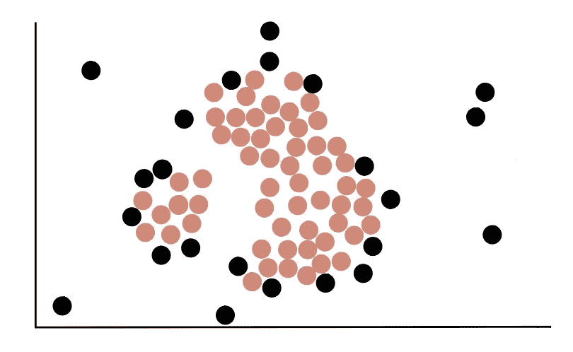

…而剩下的就是 ***非核心点*** 。

现在，我们随机选取一个 ***核心点*** 并将其分配给第一个集群。这里，我们随机选择一个点，并将其分配给*蓝色*簇。

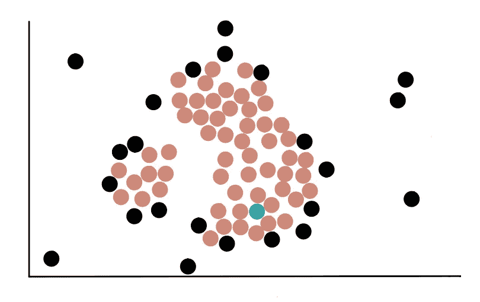

接下来，靠近蓝色星团的 ***核心点*** ，意味着它们与半径为 ***eps*** 的圆重叠…

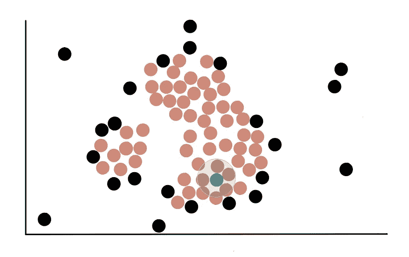

…全部添加到蓝色集群中:

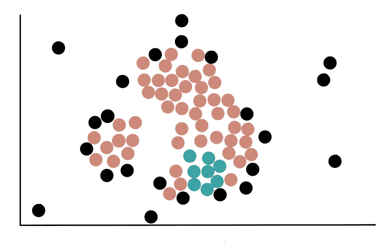

然后，将靠近成长中的蓝色星团的 ***核心点*** 加入其中。下面，我们看到 2 个 ***核心点*** 和 1 个 ***非核心点*** 靠近蓝色集群，但是我们只把 2 个 ***核心点*** 添加到集群中。

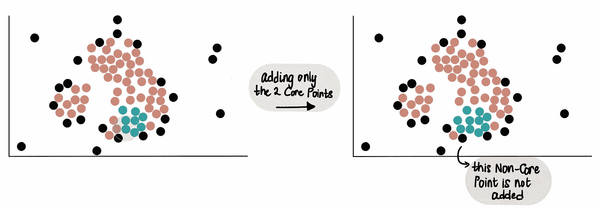

最终，所有靠近增长的蓝色集群的 ***核心点*** 都被添加到其中，数据将如下所示:

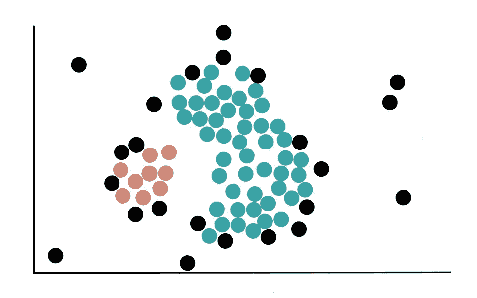

接下来，我们将所有靠近蓝色星团的*非核心点加入其中。例如，这 2 个 ***非核心点*** 靠近蓝色集群，因此它们被添加到其中:*

*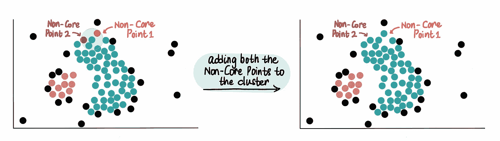*

*然而，由于它们不是**核心点，我们不使用它们来进一步扩展蓝色集群*。这意味着靠近 ***非核心点*** 1 的另一个 ***非核心点*** 将不会被添加到蓝色群集。**

**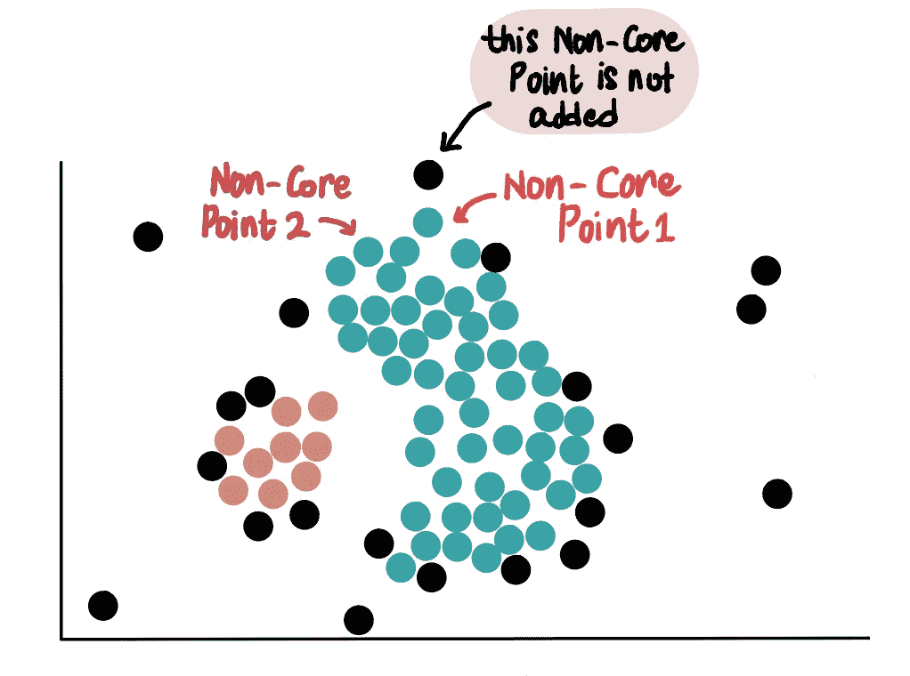**

**所以，与 ***核心点******不同，非核心点*** 只能加入一个簇，不能用来进一步扩展。**

**添加完所有的 ***非核心点*** 后，我们就完成了蓝色集群的创建，看起来像这样:**

**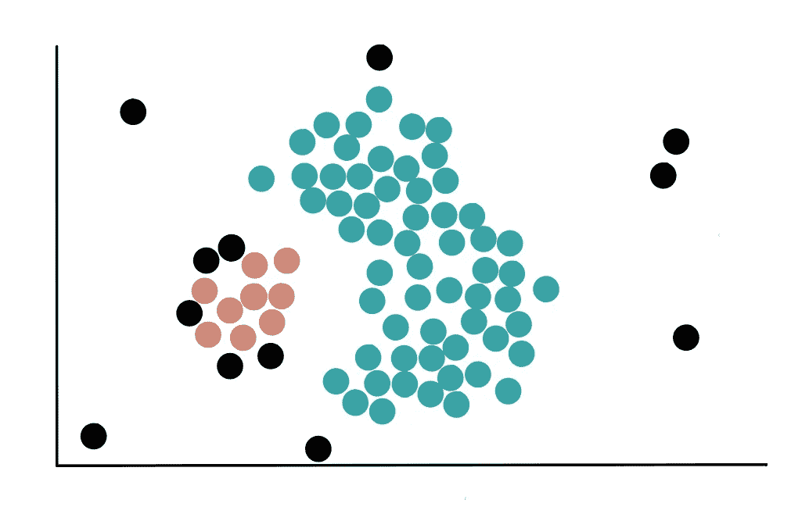**

**现在因为剩余的 ***核心点*** 都没有接近第一个集群，我们开始形成新的集群的过程。首先，我们随机挑选一个 ***核心点*** (不在一个集群中)并将其分配给我们的第二个*黄色*集群。**

**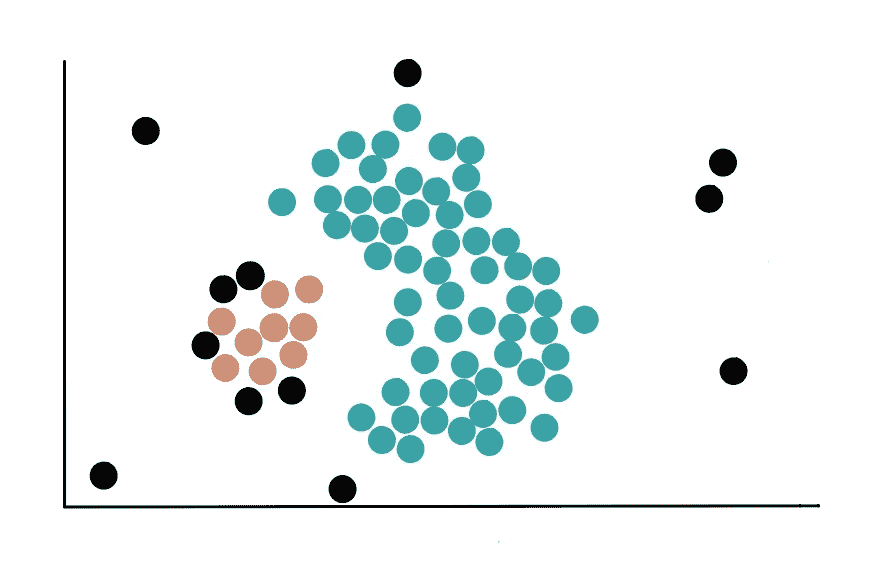**

**然后我们添加所有靠近黄色聚类的 ***核心点*** 并用它们来进一步扩展聚类。**

**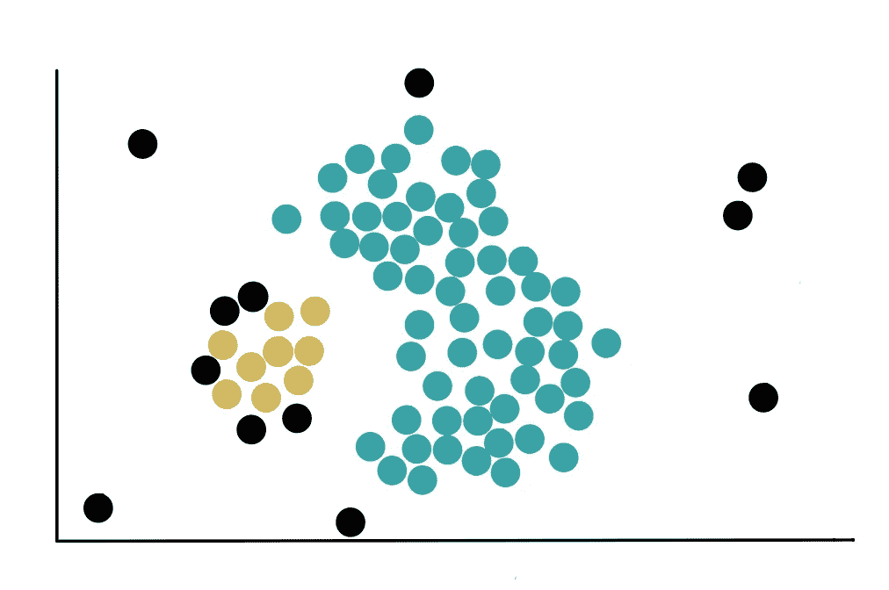**

**将剩余的核心点添加到第二个黄色聚类中**

**然后将靠近黄色簇的 ***非核心点*** 加入其中。完成后，我们的 2 个集群的数据如下所示:**

**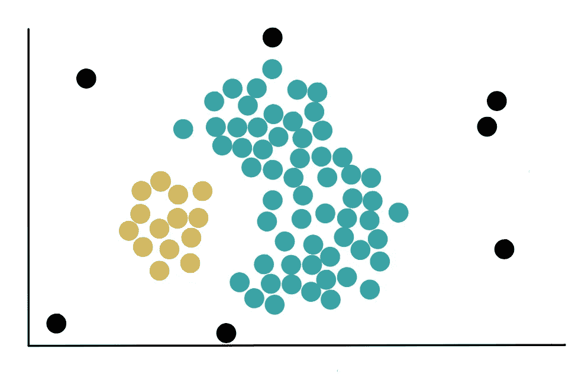**

**在将非核心点添加到黄色聚类之后**

**我们不断重复这个创建集群的过程，直到我们没有核心点*了。在我们的例子中，由于所有的 ***核心点*** 都已经被分配给一个集群，我们就完成了新集群的创建。最后，*任何剩余的* ***非核心点*** *不接近* ***核心点*** *且不属于任何聚类的点称为* ***离群点*** 。***

**就这样，我们建立了两个集群，发现了异常值，并从另一边毫发无损地出来了。**

## **有人可能会问——为什么 DBSCAN 要优于 K-Means 或层次聚类？**

**K-Means 和 Hierarchical 适用于紧凑且分离良好的聚类，但也会受到数据中的噪声和异常值的严重影响。另一方面，DBSCAN 捕捉复杂形状的集群，并在识别异常值方面做得很好。DBSCAN 的另一个好处是，与 K-Means 不同，我们不必指定聚类的数量( *k* )，算法会自动为我们找到聚类。下图举例说明了两者的区别，以及为什么 DBSCAN 在适当使用时会很强大。**

**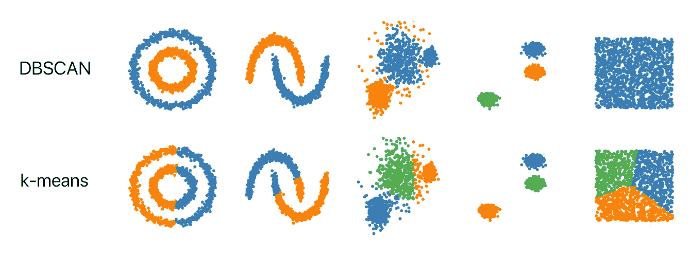**

**图片来源:【https://github.com/NSHipster/DBSCAN **

**今天到此为止。请随时在 [LinkedIn](https://www.linkedin.com/in/shreyarao24/) 上与我联系，或在*shreya.statistics@gmail.com*给我发电子邮件，向我发送关于任何其他您想要说明的算法的问题和建议！**

**如果你想支持我的工作，可以考虑使用[我的链接来注册一个媒体订阅](https://medium.com/@shreya.rao/membership)！(每月 5 美元，随时取消)**