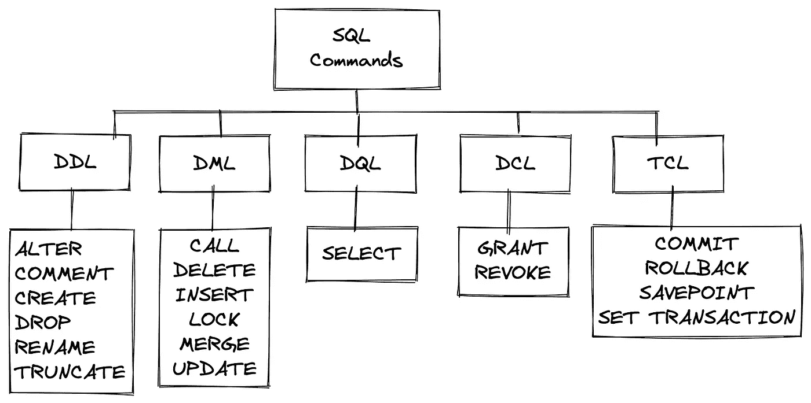

# DDL 和 DML 是什么？

> 原文：<https://towardsdatascience.com/ddl-dml-e802a25076c6>

## 理解 SQL 中 DDL 和 DML 的区别

[张志勇](https://unsplash.com/@danielkcheung?utm_source=unsplash&utm_medium=referral&utm_content=creditCopyText)在 [Unsplash](https://unsplash.com/s/photos/lego?utm_source=unsplash&utm_medium=referral&utm_content=creditCopyText) 上的照片

结构化查询语言(SQL)是用于设计、访问和操作数据库的标准语言。该语言通常用于在指定的数据库上执行某些命令。

在今天的文章中，我们将讨论各种 SQL 命令是如何根据它们对数据库状态的影响而被划分为子类别的。这些类别包括数据定义语言(DDL)和数据操作语言(DML)。

## 数据定义语言

*数据定义语言*由命令组成，这些命令归纳了模式和数据库中对象的构造方式。这些 SQL 命令通常由管理数据库本身的人来执行。

属于 DDL 的 SQL 命令:

*   `**ALTER**`:改变现有数据库对象的结构
*   `**COMMENT**`:将注释插入数据字典
*   `**CREATE**`:创建数据库和数据库对象，如*表*或*索引*。
*   `**DROP**`:删除数据库对象
*   `**RENAME**`:重命名现有的数据库对象
*   `**TRUNCATE**`:删除指定表格中的所有记录，释放分配给它们的空间

# 数据操作语言

*数据操作语言*由用于插入、修改或删除数据库数据的 SQL 命令组成。DML 下的命令如下

*   `**CALL**`:调用子程序(如 PL/SQL)
*   `**DELETE**`:从数据库中删除数据记录
*   `**INSERT**`:将数据记录插入数据库
*   `**LOCK**`:锁定数据库上的资源(并发控制)
*   `**MERGE**`:插入或更新数据记录(又名 UPSERT)
*   `**UPDATE**`:更新数据库中的现有数据

# DQL、大昌洋行和 TCL

除了数据定义和操作语言之外，还有三个子类别来完成这个难题。

## **数据查询语言(DQL)**

数据查询语言是唯一由一个命令组成的子类。但同时我也要说，它是最常用的，因为它可以从数据库中查询数据。

*   `**SELECT**`:从数据库中检索数据

## **数据控制语言(DCL)**

数据控制语言由命令组成，这些命令用于指定对感兴趣的数据库的权限。属于这个家族的两个命令是

*   `**GRANT**`:授予用户访问数据库的权限
*   `**REVOKE**`:撤销用户通过`GRANT`赋予的权限

## **交易控制语言(TCL)**

最后，事务控制语言由用于与事务交互的 SQL 命令组成。一些例子是

*   `**COMMIT**`:提交交易
*   `**ROLLBACK**`:回退交易(如失败)
*   `**SAVEPOINT**`:标记交易中的一个点
*   `**SET** **TRANSACTION**`:指定交易的特征(如隔离级别)

## 最后的想法

下图说明了如何将 SQL 命令分成我们之前讨论过的 5 个不同的子类别。

分为 5 个子组的 SQL 命令—来源:作者

正如您所知，数据定义语言(DDL)和数据操作语言(DML)是将 SQL 命令组合在一起的两个最大的子类别。

一方面，DDL 命令主要用于改变数据库的模式，而属于 DML 的命令用于实际检索、修改或向/从数据库插入数据。

另一个可以用来识别 DML/DDL 命令的经验法则是表达式是否使用了`WHERE`子句。DML 命令可以利用`WHERE`子句，而另一方面，DDL 命令则不能。

[**成为会员**](https://gmyrianthous.medium.com/membership) **阅读介质上的每一个故事。你的会员费直接支持我和你看的其他作家。你也可以在媒体上看到所有的故事。**

  

**相关文章你可能也喜欢**

     