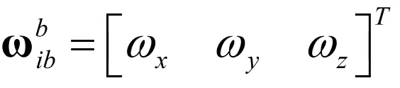
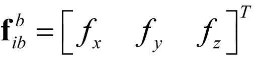
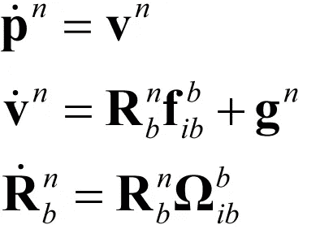
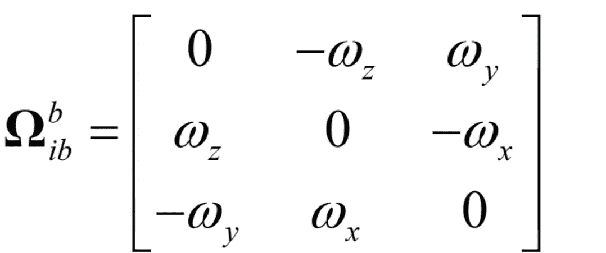
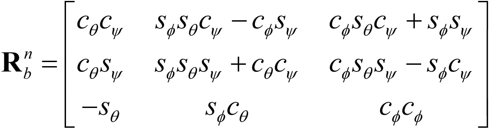
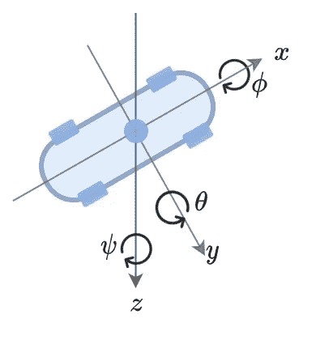

# 航位推算仍然存在！

> 原文：<https://towardsdatascience.com/dead-reckoning-is-still-alive-8d8264f7bdee>

## 介绍航位推算方法，使用具有自主车辆焦点的捷联惯性导航系统。

# 简介和动机

今天，许多司机都对自动驾驶汽车的梦想非常好奇。这个梦想会实现吗，什么时候实现？AV 需要实现的核心技术之一是惯性导航系统(INS)。这些系统将许多传感器集成在一起，我们称之为“传感器融合”方案。这些传感器包括激光雷达、相机、GPS 接收器、雷达、加速度计、陀螺仪等等。一般的传感器融合方案使用一种非常通用的算法将所有的传感器集成在一起，该算法被命名为“**”，以最优地融合所有的传感器(在均方误差意义上)。那么，我们在路上还没有看到一部 AV 的原因是什么呢？在这篇文章中，我们将关注一个主要问题:如何在隧道、桥下、室内停车场、城市峡谷和更加困难的环境中导航？**

****

**由 Stocksnap 拍摄的图像**

**我们希望我们的无人机能够在这些困难的环境中安全航行。看来，在上述所有传感器中，只有加速度计和陀螺仪**在任何物理约束下仍能正常工作:**白天或黑夜、光线或黑暗、高温或低温等。大多数情况下，这两个高度重要且低成本的传感器组合在一个**惯性测量单元** ( [IMU](/what-is-imu-9565e55b44c) )中，几乎随处可见。在现代车辆中，有近 30 个 [IMU](/what-is-imu-9565e55b44c) 传感器支持 ADAS、ABS、巡航控制和许多其他重要系统。 [IMU](/what-is-imu-9565e55b44c) 的一个关键缺点是其附加噪声。例如，当我们对加速度计测量值进行积分以估计 AV 位置时，我们实际上也考虑了噪声，从而导致非常大的累积误差。所以 AV 位置解有很大的**漂移**。**

# **什么是捷联惯导算法？**

**使用 [IMU](/what-is-imu-9565e55b44c) 传感器为汽车导航的常用算法之一是**捷联惯性导航系统，**或简称为“INS”。这也被称为“航位推算”。大多数情况下，我们发现 INS 与额外的传感器一起工作，例如 GPS 接收器或照相机。我们称之为 INS/GPS 融合或视觉辅助 INS。融合包括[卡尔曼](/kalman-filter-celebrates-60-years-an-intro-bb508ee116ff)滤波器及其扩展版本。如果我们操作时间很短(几秒钟，没有 GPS 信号或视觉辅助的非视距)，只想为我们的 AV 提供连续的位置解决方案，实际上没有必要考虑所有这些融合- **但** [**IMU**](/what-is-imu-9565e55b44c) **。****

****

**货车进入隧道(stocksnap)**

# **INS 是如何工作的？超越数学。**

**首先，我们需要了解这是一种实时算法，它考虑了来自加速度计的加速度和来自车辆陀螺仪的角速度。一旦我们想使用 INS，我们需要提供初始条件(通常，我们提供 GPS 接收机可用时获得的最后值)。现在，我们可以为角速度和加速度定义两个向量。角速度矢量由下式定义:**

****

**围绕 x、y 和 z 轴的角速度。**

**其中， ***b*** 表示车身坐标系，而 ***i*** 表示惯性坐标系(仅提及测量是在车身坐标系中进行的，并在惯性坐标系中旋转——实际上是地球。加速度矢量(用字母 ***f*** 表示特定的力，相当于加速度)由下式给出:**

****

**x、y 和 z 轴上的加速度。**

**这两个测量向量是我们从 [IMU](/what-is-imu-9565e55b44c) 传感器获得的唯一向量，它们允许我们计算 AV 的位置、速度和方向，这非常令人惊讶！**

**我们这里有 INS 方程，忽略地球自转，以 3D 矢量形式:**

****

**捷联惯导算法**

**其中 ***p*** 代表位置*，* ***v*** 代表速度， **R** 是作为身体方位角的函数的旋转矩阵(下面提供)，*只是已知的地球重力矢量，**ω**是角速度的倾斜矩阵，由下式提供:***

******

***角速度的偏斜矩阵***

***请注意 ***n*** 和 ***b*** 脚本: ***n*** 代表导航框架，意思是 AV 的位置、速度、方位都表示在导航地图中(例如)。当 AV 沿着导航地图移动时，我们需要在每个时间步旋转 IMU 测量值！这是使用旋转矩阵实现的:***

******

***带欧拉角的旋转矩阵。***

******c*** 代表 cos， ***s*** 代表 sin。AV 车身角度由三个角度提供，如图所示:***

******

***作者图片***

# ***摘要***

***所以，就这样了！现在，您可以继续导航几秒钟，直到您的导航解决方案(位置、速度和方向)开始漂移。但是，嘿！也许这足以让 AV 在艰难的环境中保持在路上，并增加它的安全概率——想想看…***

***我建议你阅读我之前关于惯性导航深度学习的工作。在那里，进行深度学习的集成，以便捕获 IMU 噪声，并由此提高导航精度。***

# ***关于作者***

***Barak 获得了以色列理工学院的航空工程学士学位(2016 年)、硕士学位(2018 年)以及经济和管理学士学位(2016 年，成绩优异)。他曾在高通工作(2019-2020)，在那里他主要研究机器学习和信号处理算法。巴拉克目前正在海法大学攻读博士学位。他的研究兴趣包括传感器融合、导航、深度学习和估计理论。***