# 目标编码分类变量

> 原文：<https://towardsdatascience.com/dealing-with-categorical-variables-by-using-target-encoder-a0f1733a4c69>

## 一个很好的替代方法是一键编码你的类别


由[腾雅特](https://unsplash.com/@tengyart)在 Unsplash 上原创

分类变量对机器学习算法来说是一个挑战。因为它们中的大多数(如果不是全部)只接受数值作为输入，所以我们需要将类别转换成数字，以便在模型中使用它们。

通过一次性编码，我们创建了一个真正稀疏的矩阵，并增加了模型需要处理的维数，我们可能会成为可怕的维数灾难的受害者。当特征具有太多类别时，这种情况会被放大，其中大部分类别对于预测是无用的。

处理这个问题的一个聪明的方法是目标编码器。

本文中使用的代码和示例也可以在我的 GitHub 存储库中找到:

[](https://github.com/vinyluis/Articles/tree/main/Target%20Encoder) [## 物品/主要乙烯基/物品上的目标编码器

### 文章:了解目标编码器[EN]介绍目标编码器背后的思想、代码示例和潜在的…

github.com](https://github.com/vinyluis/Articles/tree/main/Target%20Encoder) 

# 目标编码器

目标编码器背后的主要思想是通过替换类别来对类别进行编码，以测量它们可能对目标产生的影响。

在二元分类器上，最简单的方法是计算概率 ***p(t = 1 | x = ci)*** ，其中 ***t*** 表示目标， ***x*** 是输入， ***ci*** 是第 I 个类别。在贝叶斯统计中，假定输入是类别 ***ci*** ，这被认为是 ***t=1*** 的后验概率。

这意味着我们将用类别 ***ci*** 替换目标的后验概率值为 1 的类别。

考虑下面的数据集:


作者图片

对于每一个可能的类别(非虚构、浪漫、戏剧、科幻和幻想)，我们需要计算目标 0 和目标 1 出现的次数。然后我们计算:

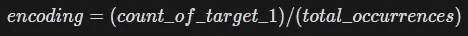

作者图片

这可以通过下面的代码来完成:

```
categories = df['genre'].unique()
targets = df['target'].unique()
cat_list = []
for cat in categories:
    aux_dict = {}
    aux_dict['category'] = cat
    aux_df = df[df['genre'] == cat]
    counts = aux_df['target'].value_counts()
    aux_dict['count'] = sum(counts)
    for t in targets:
        aux_dict['target_' + str(t)] = counts[t]
    cat_list.append(aux_dict)cat_list = pd.DataFrame(cat_list)
cat_list['genre_encoded_dumb'] = cat_list['target_1'] / cat_list['count']
```

所以最后，`cat_list`数据帧看起来会像这样:

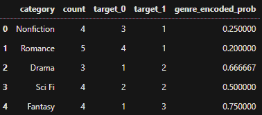

作者图片

既然感兴趣的目标是值“1”，那么这个概率实际上就是目标的 ***均值*** ，给定一个类别。这就是为什么这种目标编码方法也被称为“平均”编码的原因。

我们可以用一个简单集合来计算这个平均值，然后:

```
stats = df['target'].groupby(df['genre']).agg(['count', 'mean'])
```

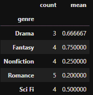

作者图片

这就对了。变量及其各自的编码用一行代码表示。

我们可以用它们的编码值替换类别，如下所示:

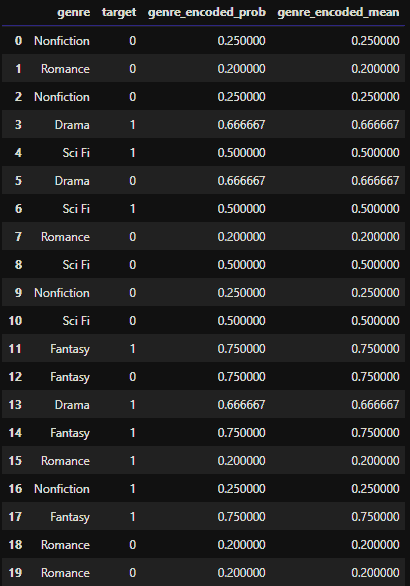

作者图片

由于我们使用每个类别的目标平均值，这种方法也很容易适用于回归模型。

# 这种方法的问题

这种编码方式真的很简单也很强大。然而，在使用它的时候，有一些重要的问题你需要记住。

一个真正重要的影响是*目标泄漏*。通过使用目标的概率对特征进行编码，我们向它们提供了我们试图建模的变量的信息。这就像“欺骗”,因为模型将从一个自身包含目标的变量中学习。


由[潘晓珍](https://unsplash.com/@zhenhappy)在 Unsplash 上原创

你可以认为这可能不是一个问题，如果这种编码反映了目标的真实概率，给定一个类别。但是如果是这样的话，我们甚至不需要一个模型。相反，我们可以使用这个变量作为这个目标的一个强大的预测器。

此外，使用平均值作为整个分布的预测值是好的，但并不完美。如果所有不同的数据分布和组合都可以用一个平均值来表示，我们的生活会轻松得多。

即使平均值是一个很好的总结，我们也要在一小部分数据中训练模型。这个分数的平均值可能不是全部人口的平均值(还记得中心极限定理吗？)，所以编码可能不正确。如果样本与总体差异足够大，模型甚至可能会过度拟合训练数据。

# 具有先验平滑的目标编码器

我们可以使用先前的平滑来减少那些不想要的影响。

这个想法很简单。假设我们有一个模型来预测在线商店中一本书的质量。我们可能有一本书有 5 个评价，得到 9.8 分(满分 10 分)，但其他书的平均分数是 7 分。这种影响是因为我们使用的是小样本的平均值，与我上面提到的问题类似。

通过考虑所有书籍的平均值，我们可以用更少的评价来“平滑”这本书的分数。

回到我们的例子，我们有 5 个类别要编码:非小说，浪漫，戏剧，科幻和幻想，我们已经知道如何使用每个类别的平均编码。现在我们可以使用目标*在所有类别*上的平均值来平滑每个类别的编码。

我们称目标的平均值为先验概率 p(t = 1)的 T6，编码可以使用从 0 到 1 的参数 T12、T13、α、T14、T15 来平衡这种平滑。

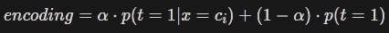

作者图片

通常，我们从下面的表达式中得到这个α:

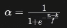

作者图片

使用先前平滑来执行编码的代码是:

```
smoothing_factor = 1.0 # The f of the smoothing factor equation 
min_samples_leaf = 1 # The k of the smoothing factor equationprior = df['target'].mean()
smoove = 1 / (1 + np.exp(-(stats['count'] - min_samples_leaf) / smoothing_factor))
smoothing = prior * (1 - smoove) + stats['mean'] * smoove
encoded = pd.Series(smoothing, name = 'genre_encoded_complete')
```

这改编自基于 sklearn 的类别编码器库。我们还可以使用该库进行编码，而无需手动操作:

```
from category_encoders import TargetEncoder
encoder = TargetEncoder()
df['genre_encoded_sklearn'] = encoder.fit_transform(df['genre'], df['target'])
```

所有方法的结果如下:

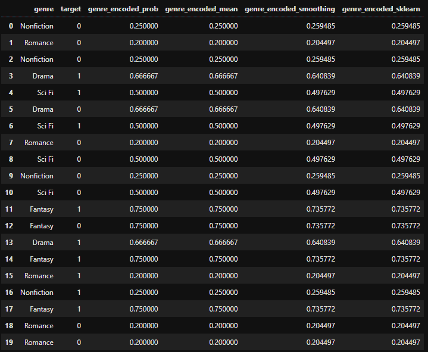

作者图片

我们可以看到，虽然有平滑和没有平滑的方法之间存在一些差异，但它们仍然非常接近。

# 多类方法

到目前为止，我解释了二进制分类器的目标编码器，很容易理解我们如何使它适应回归。但是多类分类呢？

在下面的数据集上，如果我们简单地取平均值，就会认为目标 2 是目标 1 的两倍大。此外，如果目标也是一个类别，我们将如何取平均值？

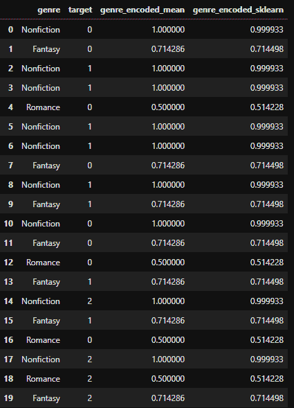

作者图片

编码的结果很奇怪:非小说类的编码条件概率是 1.00，这显然是错误的，因为它可能有所有三个目标。

为了使目标编码器适用于多类分类，我们需要对每个目标的特征进行独立编码。因此，让我们计算给定每个类别的每个目标的后验概率。

```
categories = df['genre'].unique()
targets = df['target'].unique()
cat_list = []
for cat in categories:
    aux_dict = {}
    aux_dict['category'] = cat
    aux_df = df[df['genre'] == cat]
    counts = aux_df['target'].value_counts()
    aux_dict['count'] = sum(counts)
    for t in targets:
        aux_dict['target_' + str(t)] = counts[t] if t in counts.keys() else 0
    cat_list.append(aux_dict)cat_list = pd.DataFrame(cat_list)for t in targets:
    cat_list['genre_encoded_target_' + str(t)] = cat_list['target_' + str(t)] / cat_list['count']
```

结果是:

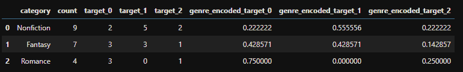

作者图片

正如所料，所有的编码现在都正确地反映了后验性。甚至“浪漫”对于目标“1”也将被编码为“0”，因为它从未出现在该类别中。

上面的代码也适用于分类目标。如果我们使用以下代码行更改目标:

```
df['target'] = df['target'].replace({0: 'apple', 1: "banana", 2: 'orange'})
```

结果不会不同:

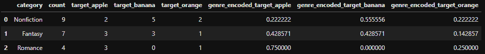

作者图片

既然我们已经理解了在多类问题中使用目标编码需要做些什么，那么就很容易创建一个简单的代码来在这个场景中使用`category_encoders.TargetEncoder`对象:

```
from category_encoders import TargetEncodertargets = df['target'].unique()
for t in targets:
    target_aux = df['target'].apply(lambda x: 1 if x == t else 0)
    encoder = TargetEncoder()
    df['genre_encoded_sklearn_target_' + str(t)] = encoder.fit_transform(df['genre'], target_aux)
```

轻松搞定！两种方法的结果都足够好:

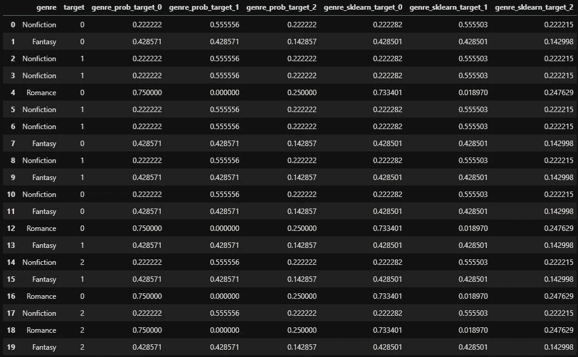

作者图片

如果您熟悉 One-Hot 编码，您会知道现在可以删除任何编码列以避免多重共线性。

# 结论

目标编码分类变量解决了我们通过使用一键编码得到的维数问题，但是这种方法需要小心使用以避免目标泄漏。

您应该在您的模型上使用它，并将其与其他编码进行比较，以选择更适合您的情况的编码。

# 如果你喜欢这个帖子…

支持我一杯咖啡！

[](https://www.buymeacoffee.com/vinitrevisan)

给我买杯咖啡！

看看这个很棒的帖子

[](/evaluating-classification-models-with-kolmogorov-smirnov-ks-test-e211025f5573) [## 用 Kolmogorov-Smirnov (KS)检验评估分类模型

### 使用 KS 检验评估类分布之间的分离

towardsdatascience.com](/evaluating-classification-models-with-kolmogorov-smirnov-ks-test-e211025f5573) 

# 参考

[https://contrib . sci kit-learn . org/category _ encoders/target encoder . html](https://contrib.scikit-learn.org/category_encoders/targetencoder.html)

[https://maxhalford.github.io/blog/target-encoding/](https://maxhalford.github.io/blog/target-encoding/)

[https://dl.acm.org/doi/10.1145/507533.507538](https://dl.acm.org/doi/10.1145/507533.507538)