# 熊猫数据帧中日期和时间的处理

> 原文：<https://towardsdatascience.com/dealing-with-date-and-time-in-pandas-dataframes-7d140f711a47>

## 了解如何操作熊猫数据框中的日期和时间值，让您的生活更轻松


由[埃斯特·扬森斯](https://unsplash.com/@esteejanssens?utm_source=medium&utm_medium=referral)在 [Unsplash](https://unsplash.com?utm_source=medium&utm_medium=referral) 上拍摄的照片

您经常需要对 Pandas 数据帧执行的一个常见任务是操作日期和时间。根据日期和时间值最初在数据集中的编码方式，您通常需要花费大量精力来操作它们，以便可以将它们用于数据分析目的。在这篇文章中，我将向你展示一些常见的技术来处理你的熊猫数据帧中的日期和时间。

我将在本文中使用的 CSV 文件是:

*   **AAPL.csv** —苹果历史数据集([https://www . ka ggle . com/datasets/prasoonkottarathil/Apple-lifetime-stocks-Dataset](https://www.kaggle.com/datasets/prasoonkottarathil/apple-lifetime-stocks-dataset))。许可证— [CC0:公共领域](https://creativecommons.org/publicdomain/zero/1.0/)
*   **Flights.csv** — 2015 年航班延误和取消数据集([https://www.kaggle.com/datasets/usdot/flight-delays](https://www.kaggle.com/datasets/usdot/flight-delays))。许可证— [CC0:公共领域](https://creativecommons.org/publicdomain/zero/1.0/)

# 将列转换为`datetime64`数据类型

让我们将 **AAPL.csv** 文件加载到熊猫数据帧中:

```
import pandas as pd

df = pd.read_csv('AAPL.csv')
df
```

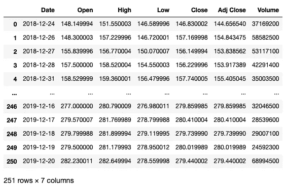

您可以检查数据帧中每一列的数据类型:

```
df.dtypes
```

从下面的输出可以看出，`Date`列被表示为一个`object`:

```
**Date          object** Open         float64
High         float64
Low          float64
Close        float64
Adj Close    float64
Volume         int64
dtype: object
```

您可以使用`datetime.strptime()`函数将`Date`列转换为`datetime64`数据类型:

```
from datetime import datetime

df['Date'] = df['Date'].apply(
    lambda x: datetime.strptime(x,'%Y-%m-%d'))
df
```

> 您可以从[https://docs . python . org/3/library/datetime . html # strftime-and-strptime-format-codes](https://docs.python.org/3/library/datetime.html#strftime-and-strptime-format-codes)获取格式代码列表(如`%Y`、`%m`、`%d`)。

现在您可以检查`Date`列的数据类型:

```
df.dtypes
```

并且`Date`列现在是类型`datetime64`:

```
**Date         datetime64[ns]**
Open                float64
High                float64
Low                 float64
Close               float64
Adj Close           float64
Volume                int64
dtype: object
```

> `datetime64[ns]`中的`[ns]`指定了 DateTime 对象的精度，单位为纳秒。

## 基于特定日期查找行

将`Date`列转换为`datetime64`数据类型可以让您轻松地执行与日期相关的操作，例如查找 2018 年 12 月的所有行:

```
df[(df['Date'].dt.month == 12) & 
   (df['Date'].dt.year == 2018)]
```

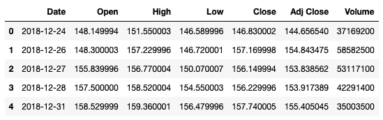

## 根据星期几查找行

您还可以使用`dayofweek`属性来查找一周中的某一天(比如星期一、星期二等等)。例如，以下语句查找日期在星期一的所有行:

```
# 0 is Monday, 1 is Tue, etc
df[df['Date'].dt.dayofweek == 0].sample(5)
```

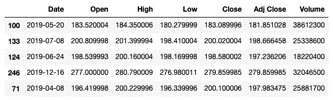

## 按星期几排序

在处理日期时，您会遇到的另一个常见场景是根据一周中的某一天对数据进行排序(例如从星期一到星期天，或者从星期天到星期六)。

这里有一个你可以使用的技巧。首先，使用`strftime()`函数从`Date`列(一个`datetime64[ns]`对象)中提取星期几:

```
df['Day'] = df['Date'].apply(
    lambda x: x.strftime('%a'))
df
```

提取的星期几保存到名为`Day`的新列中:

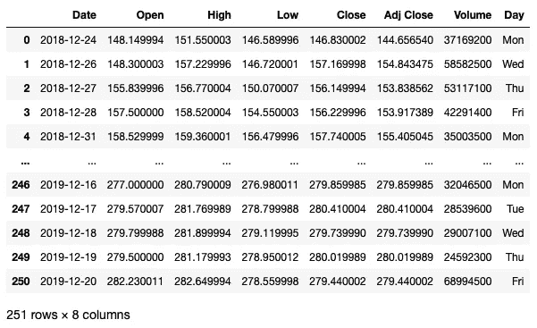

然后，定义要订购的日期顺序:

```
#---define your category order---
cats = ['Mon','Tue','Wed','Thu','Fri'] # omit Sat and Sun
```

> 在上面我省略了周六和周日，因为这两天(周末)没有股票数据。

然后，通过传递您之前定义的日期顺序，使用`CategoricalDtype`类创建一个新的分类数据类型:

```
from pandas.api.types import CategoricalDtype

cat_type = CategoricalDtype(categories=cats, ordered=True)
```

最后，将`Day`列转换为您刚刚创建的新分类类型:

```
#---cast the Day column as categorical---
df['Day'] = df['Day'].astype(cat_type)
df.dtypes
```

您现在可以看到`Day`属于`category`数据类型:

```
Date           object
Open          float64
High          float64
Low           float64
Close         float64
Adj Close     float64
Volume          int64
Day          category
dtype: object
```

如果你想打印出所有按星期排序的股票数据，你现在可以使用`groupby()`功能:

```
for _, gp in df.groupby('Day'):
    display(gp.sample(3))
```

请注意，分组是按`Day`排序的，首先是星期一，然后是星期二，依此类推:

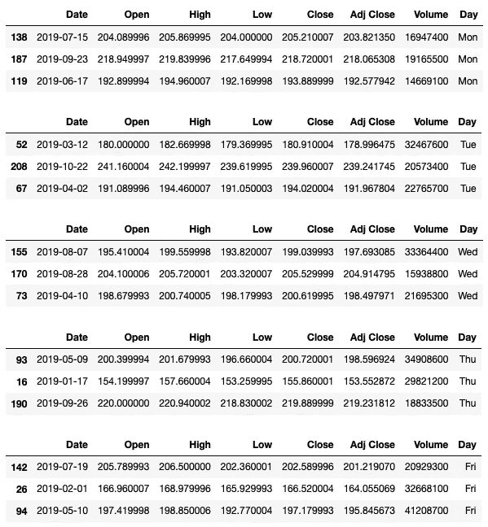

如果您想首先显示星期二，然后显示星期三，依此类推，更改`cats`变量中的顺序:

```
cats = ['Tue','Wed','Thu','Fri','Mon'] # omit Sat and Sun
cat_type = CategoricalDtype(categories=cats, ordered=True)

#---cast the Day column as categorical---
df['Day'] = df['Day'].astype(cat_type)

for _, gp in df.groupby('Day'):
    display(gp.sample(3))
```

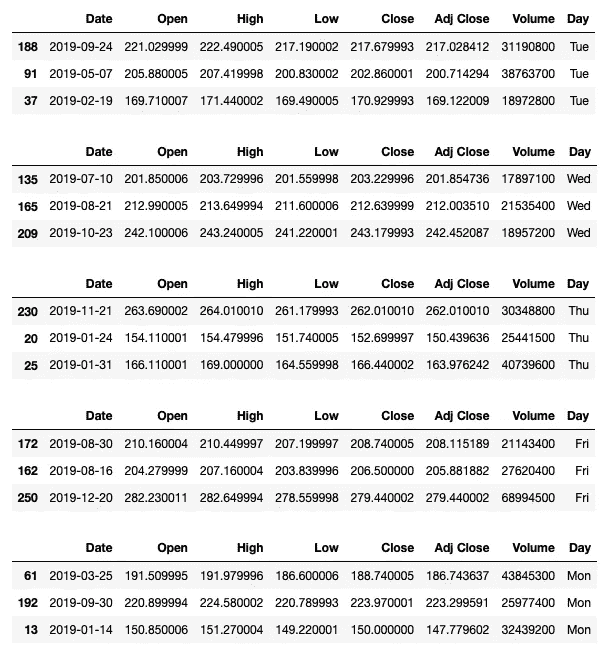

## 在加载期间转换日期时间列

在前面的部分中，在将整个 CSV 文件加载到 DataFrame 中之后，您将`Date`列转换为`datetime64`数据类型。另一种方法是在使用`parse_dates`参数加载 CSV 时执行转换:

```
df = pd.read_csv("AAPL.csv", parse_dates=['Date'])
```

`parse_dates`参数指定要解析为`datetime64`对象的列。

> 注意，如果将`parse_dates`参数设置为`True`，Pandas 将尝试将索引解析为一个`datetime64`对象

# 将多个列解析为日期

有时数据集中的日期分别存储在不同的列中，例如一列表示年份，一列表示月份，等等。虽然以这种方式保存数据有利也有弊，但是如果可以将所有不同的列合并成一个列，有时会更容易。这种表示的一个很好的例子是在 **flights.csv** 文件中。

让我们加载 **flights.csv** 文件，观察前五列中的五个示例行:

```
df = pd.read_csv("flights.csv")

# display sample 5 rows and first 5 columns
df.sample(5).iloc[:,:5]
```

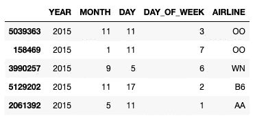

## 在加载时合并列

在 **flights.csv** 文件中，每个航班的日期使用三个不同的列来表示——**年**、**月**日。为了执行数据分析，如果可以使用`parse_dates`参数将三列合并成一个日期列，会更容易:

```
df = pd.read_csv("flights.csv", 
                 parse_dates=[[0,1,2]])
df.sample(5).iloc[:,:5]
```

在上面的代码片段中，我使用了列索引来指示要合并到单个列中的列。我还可以指定列的名称:

```
df = pd.read_csv("flights.csv", 
                 parse_dates=[['YEAR','MONTH','DAY']])
```

结果是前三列被删除并替换为一个新列，新列的名称是三个列名的串联:

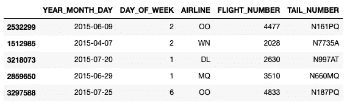

注意，在本文的前面，我用一个列表— `parse_dates=[‘Date’]`设置了`parse_dates`参数。将其设置为列表将导致各个列作为`datetime`对象加载。如果你将它设置为列表的*列表，比如`parse_dates=[[‘YEAR’,’MONTH’,’DAY’]]`，那么这些列将被合并成一个单独的`datetime`对象。*

假设您有一个如下所示的 CSV:

```
DATE,YEAR,MONTH,DAY
2015-09-13,2015,9,13
2015-09-14,2015,9,14
```

您可以将`DATE`列转换为`datetime`对象，同时使用以下`parse_dates`参数值将`YEAR`、`MONTH`和`DAY`列合并为单个`datetime`对象:

```
df = pd.read_csv("test.csv", 
                 parse_dates=['DATE',['YEAR','MONTH','DAY']])
```

结果看起来像这样:

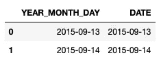

打印出`df`中的`dtypes`确认两列的数据类型:

```
YEAR_MONTH_DAY    datetime64[ns]
DATE              datetime64[ns]
dtype: object
```

## 加载 DataFrame 后合并列

使用`to_datetime()`功能加载数据帧后，您也可以合并数据帧的列:

```
df = pd.read_csv("flights.csv")
df['DATETIME'] = pd.to_datetime(df[['YEAR', 'MONTH', 'DAY']])
df.sample(5).iloc[:,-3:]
```

以下输出显示了数据帧的最后三列，最后一列是三列的组合结果— `YEAR`、`MONTH`和`DAY`:

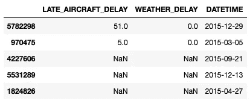

## 格式化时间

除了在三个单独的列中存储预定出发日期之外，您还会注意到有一个名为`SCHEDULED_DEPARTURE`的列:

```
df[['SCHEDULED_DEPARTURE']]
```

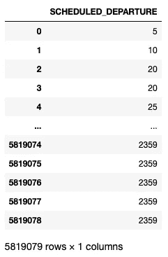

此列是一个整数列，存储数字，如 5，10，直到 2359。每个值代表的实际上是 HHMM 格式的出发时间。所以 5 实际上代表 00:05，而 2359 实际上代表 23:59。如果您要对这个列执行分析，您肯定需要进一步处理这个列。

这里我要做的是将四列合并成一个`datetime`列:

*   `YEAR`
*   `MONTH`
*   `DAY`
*   `SCHEDULED_DEPARTURE`

正如我们在上一节中所看到的，将前三者结合起来是很容易的。第四列需要一些处理:

*   您需要将出发时间格式化为一个字符串，然后提取前两个数字来表示小时(HH)
*   然后提取代表分钟(MM)的最后两位数字

上述操作可以按如下方式实施:

```
import datetime

# function to convert HHMM to datetime.time
def format_time(time):
    # format the time as string
    time = "{0:04d}".format(int(time))
    # extract hh and mm and then convert to time
    hhmm = datetime.time(int(time[0:2]), int(time[2:4]))
    return hhmm

df['SCHEDULED_DEPARTURE'] = \
    df['SCHEDULED_DEPARTURE'].apply(format_time)
df[['SCHEDULED_DEPARTURE']]
```

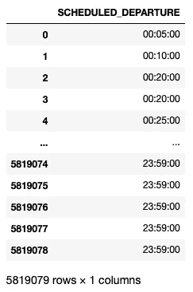

## **合并日期和时间列**

既然我们的 dataframe 有两个数据类型为`datetime`的列— `DATETIME`和`SCHEDULED_DEPARTURE`，我们现在可以将它们合并成一个列。以下代码片段使用`apply()`函数和`datetime.combine()`函数来组合两个指定的列:

```
from datetime import datetime

df['SCHEDULED_DEPARTURE'] = \
    df.apply(
        lambda r: datetime.combine(r['DATETIME'], r['SCHEDULED_DEPARTURE']), 
        axis=1)
df.sample(5)[['SCHEDULED_DEPARTURE']]
```

`SCHEDULED_DEPARTURE`列现在包含出发日期和时间:

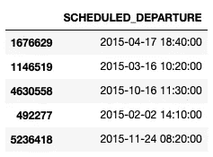

现在，您可以轻松找到在特定时间起飞的所有航班:

```
df[(df['SCHEDULED_DEPARTURE'].dt.month == 12) & 
   (df['SCHEDULED_DEPARTURE'].dt.year == 2015) & 
   (df['SCHEDULED_DEPARTURE'].dt.hour >= 22) & 
   (df['SCHEDULED_DEPARTURE'].dt.minute > 30)]\
   [['FLIGHT_NUMBER','SCHEDULED_DEPARTURE']]
```

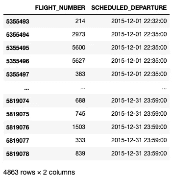

## 如果你喜欢阅读我的文章，并且认为它对你的职业/学习有所帮助，请考虑注册成为一名灵媒会员。每月 5 美元，你可以无限制地访问 Medium 上的所有文章(包括我的)。如果你使用下面的链接注册，我会赚一小笔佣金(不需要你额外付费)。你的支持意味着我将能够投入更多的时间来写这样的文章。

[](https://weimenglee.medium.com/membership)  

# 摘要

我希望这篇文章在处理您的 Pandas 数据帧中的日期和时间时对您有用。特别是，我介绍了:

*   如何在加载数据帧后将列转换为`datetime64`数据类型
*   如何在加载期间将列作为`datetime64`对象加载
*   如何找到特定日期的星期几
*   如何根据星期几对数据帧进行排序
*   如何在加载时将不同的列组合成一个`datetime64`对象
*   数据框加载后如何将不同的列组合成一个`datetime64`对象
*   如何将字符串转换为时间格式
*   如何组合日期和时间列