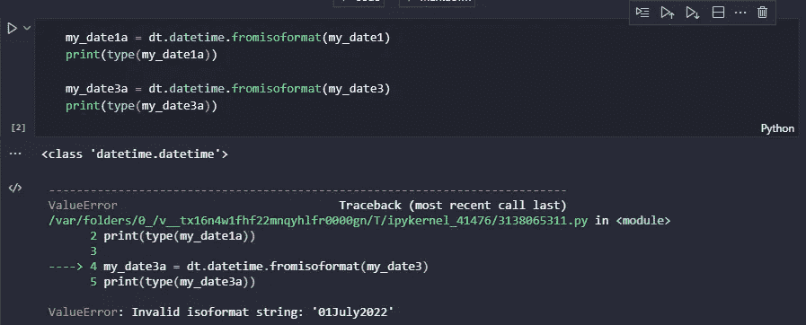
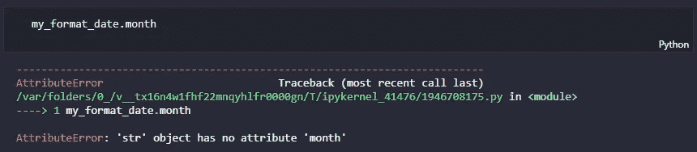
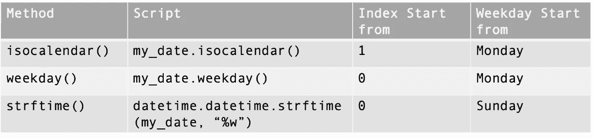

# 用 Python 处理日期

> 原文：<https://towardsdatascience.com/dealing-with-dates-in-python-1b4069a07a0f>

## 使用 Python 实现自动化

## 这篇文章是关于可以对日期时间变量执行的操作。


在 [Unsplash](https://unsplash.com/s/photos/calendar?utm_source=unsplash&utm_medium=referral&utm_content=creditCopyText) 上由[埃斯特·扬森斯](https://unsplash.com/@esteejanssens?utm_source=unsplash&utm_medium=referral&utm_content=creditCopyText)拍摄的照片

你在处理日期时间对象的时候会纠结吗？嗯，不得不承认我经常纠结。我总是需要做大量的搜索来为我的用例找到合适的方法。然后，我决定写这篇文章，作为给我亲爱的读者和我自己的文档。

# 背景

当我开发自动报告准备或 Excel 文件组合的工具时，我必须能够从文件名或文件夹中识别信息。通常，系统生成的文件或定期报告将根据固定模式命名，并存储在相同的文件夹中。

文件名通常是报告名称、报告日期或期间以及文件扩展名的组合，例如，名为*“用电报告 2022 _ Q4 _ ww43 . xlsx”*的定期报告和名为*“工具申请报告 2022 10 21 . CSV”*的每日报告。为了检索正确的文件，我们需要根据报告自动化工具运行的时间来计算文件名中的日期或周期。

因此，本文的结构如下:

1.  [解析并格式化日期时间(*str ptime*vs*strftime*)](#5c35)
2.  [提取年/月/日信息](#bd8b)
3.  [从日期](#0289)开始计算世界周
4.  [从日期开始计算星期几](#014a)
5.  [将日期时间对象转换为周期](#6ba1)
6.  [计算数据时间间隔](#a8f4)

> 我们开始吧！

解析日期时间意味着我们将包含日期的字符串对象转换成日期时间对象。例如，当我们用正则表达式或其他方法从报表*“工具申请报告 20221021 . CSV”*中获取日期时，日期“20221021”将是一个字符串变量。

在我们解析它之后，它将成为一个 DateTime 对象，并被写成 ISO 格式(YYYY-MM-DD)，2022–10–21。然后，我们可以将其格式化为特定的格式，比如 2022 年 10 月 21 日。请注意，DateTime 对象在我们格式化后将变成一个 string 对象。

> 迷惑？放心吧！

从下面的例子中你会有一个更清晰的画面。

# 1.解析和格式化日期时间

## 解析日期时间

DateTime 库中有两种方法可以解析日期:

*   `datetime.fromisoformat()`
*   `datetime.strptime()`

让我们看看他们有什么不同！

```
import datetime as dtmy_date1 = "2022-07-01"
print(my_date1)
print(type(my_date1))my_date2 = "01-07-2022"
print(my_date2)
print(type(my_date2))my_date3 = "01July2022"
print(my_date3)
print(type(my_date3))
```

好的，我创建了 3 个不同的日期作为变量，现在它们是字符串对象。现在让我们将它们解析成 DateTime 对象。

```
my_date1a = dt.datetime.fromisoformat(my_date1)
print(type(my_date1a))my_date3a = dt.datetime.fromisoformat(my_date3)
print(type(my_date3a))
```



图片作者。

对于第一种方法`datetime.fromisoformat()`，就像方法名一样，它只能解析 ISO 格式的日期 YYYY-MM-DD，就像在名为`my_date1`的变量中一样。因此，当我们试图在`my_date3`中对其他日期时间格式使用该方法时，它将返回一个*值错误*。`my_date1a`变量是我们通过解析`my_date1`变量得到的 DateTime 对象。

下面是一个用`datetime.strptime()`方法解析日期的例子。对于这种方法，我们必须根据日期格式指定**格式代码**来解析日期。您可以在 [strftime()和 strptime()行为](https://docs.python.org/3/library/datetime.html#strftime-and-strptime-behavior)中了解更多关于格式代码的信息。

```
# my_date2 = "01-07-2022"
my_date2a = dt.datetime.strptime(my_date2, "%d-%m-%Y")
print(type(my_date2a))
print(my_date2a)**# Output**:
# <class 'datetime.datetime'>
# 2022-07-03 00:00:00
```

让我们看另一个不同日期格式的例子。

```
# my_date3 = "01July2022"
my_date3a = dt.datetime.strptime(my_date3, "%d%B%Y")
print(type(my_date3a))
print(my_date3a)**# Output:**
# <class 'datetime.datetime'> 
# 2022-07-01 00:00:00
```

使用`strptime()`方法解析日期是通过用各自的格式代码替换日、月和年。如上例所示，%d 表示日，%m 表示月数字，%B 表示月的全名，%Y 表示带有世纪的年。

如果你是新手，现在看起来可能很复杂，但是我向你保证，一旦你熟悉了格式代码，你就会变得很棒。记住，你可以随时参考 [strftime()和 strptime()行为](https://docs.python.org/3/library/datetime.html#strftime-and-strptime-behavior)。😉

## 格式化日期时间

在我们将 string 对象解析成 DateTime 对象后，它将以 ISO 格式显示。如果您希望它是其他形式，我们必须使用`datetime.strftime()`方法来格式化日期。

```
# my_date3a: 2022-07-01 00:00:00
my_format_date = dt.datetime.strftime(my_date3a, "%B %d, %Y")
print(my_format_date)**# Output:**
# July 01, 2022
```

请注意，在我们格式化日期之后，它将变成一个字符串。

在我们将字符串解析成 DateTime 对象后，我们可以从中获得信息。

# 2.提取年/月/日信息

*注意:下面的例子使用了第一节例子中的变量。*

要获取年、月和日信息，我们只需使用下面 DateTime 对象中的相应属性。

*   `datetime_object.year`
*   `datetime_object.month`
*   `datetime_object.day`

```
# my_date3a: 2022-07-01 00:00:00**# Get Year Info** my_date3a.year**# Output:** # 2022**# Get Month Info** my_date3a.month**# Output:** # 7**# Get Day Info** my_date3a.day**# Output:** 
# 1
```

简单吧？😄

但是，我们无法从格式化的日期中提取上述信息。

```
# my_format_date = "July 01, 2022"
my_format_date.month
```



图片作者。

它将返回一个属性错误。这是因为当我们将日期格式化为其他格式时，它会再次变成 string 对象。我们只能从日期时间对象返回日期时间属性。

```
print(type(my_date3a))
print(type(my_format_date))Output:
<class 'datetime.datetime'> 
<class 'str'>
```

> 要知道 strftime()的乘积是 string 对象，而 strptime()的乘积是 DateTime 对象。

# 3.从日期开始计算世界周

*注意:在本节中，我们将使用新的变量作为示例。*

首先，我用不同的日期创建两个新的 string 对象，然后将它们解析成 DateTime 对象。

```
import datetime as dtmy_date_str_1 = "2022-07-01"
my_date_1 = dt.datetime.strptime(my_date_str_1, "%Y-%m-%d")
print(my_date_1)my_date_str_2 = "2022-07-03"
my_date_2 = dt.datetime.strptime(my_date_str_2, "%Y-%m-%d")
print(my_date_2)**# Output:**
# 2022-07-01 00:00:00 
# 2022-07-03 00:00:00
```

我们将使用`isocalendar()`方法从 DateTime 对象中获取世界周信息。这是因为 DateTime 对象没有世界周属性。

```
print(my_date_1.isocalendar())
print(my_date_2.isocalendar())**# Output:**
# datetime.IsoCalendarDate(year=2022, week=26, weekday=5) 
# datetime.IsoCalendarDate(year=2022, week=26, weekday=7)
```

`isocalendar()`方法将返回一个包含 ISO 年份、周数和工作日的元组。工作日将以数字形式返回。我们可以返回相应索引的值。

```
print("Date 1: 2022-07-01")
print("Year:", my_date_1.isocalendar()[0])
print("World Week Number: ", my_date_1.isocalendar()[1])
print("Weekday: ", my_date_1.isocalendar()[2])print("Date 2: 2022-07-03")
print("Year:", my_date_2.isocalendar()[0])
print("World Week Number: ", my_date_2.isocalendar()[1])
print("Weekday: ", my_date_2.isocalendar()[2])**# Output:**
# Date 1: 2022-07-01 
# Year: 2022 
# World Week Number:  26 
# Weekday:  5 
# Date 2: 2022-07-03 
# Year: 2022 
# World Week Number:  26 
# Weekday:  7
```

这就是我们如何得到星期数，以及年份和工作日。

# 4.从日期开始计算星期几

*注意:以下示例使用第 3 节示例中的变量。*

有多种方法可以从日期中返回星期几信息。其中一种方法是通过`isocalendar()`，如前一节所示。另一种方法是使用如下所示的`weekday()`方法。

```
print("Date 1: 2022-07-01")
print("Weekday: ", my_date_1.weekday())print("Date 2: 2022-07-03")
print("Weekday: ", my_date_2.weekday())**# Output:**
# Date 1: 2022-07-01 
# Weekday:  4 
# Date 2: 2022-07-03 
# Weekday:  6
```

嗯，2022 年 7 月 1 日是星期五。`isocalendar()`方法不遵循 python 索引规则。所以实际上，`isocalendar()`和`weekday()`方法都在星期一开始计数，但是`isocalendar()`使用从 1 开始的索引，而 weekday()是从 0 开始的 python 函数。提到的两种方法以数字形式返回星期几。还有一种方法，你能猜出来吗🤔？

是`strftime()`法。

我们可以通过用相应的格式代码格式化日期来获得工作日的名称。

```
date_weekday_1 = dt.datetime.strftime(my_date_1, "%a")
print(date_weekday_1)date_weekday_2 = dt.datetime.strftime(my_date_2, "%a")
print(date_weekday_2)**# Output:**
# Fri 
# Sun
```

我们可以通过使用如上例所示的“%a”格式代码来格式化星期几的缩写名称，或者通过使用如下例所示的“%A”格式代码来返回星期几的全名。

```
date_weekday_1 = dt.datetime.strftime(my_date_1, "%A")
print(date_weekday_1)date_weekday_2 = dt.datetime.strftime(my_date_2, "%A")
print(date_weekday_2)**# Output:** # Friday 
# Sunday
```

我们也可以用数字的形式返回工作日。

```
date_weekday_1 = dt.datetime.strftime(my_date_1, "%w")
print(date_weekday_1)date_weekday_2 = dt.datetime.strftime(my_date_2, "%w")
print(date_weekday_2)**# Output:**
# 5 
# 0
```

有趣的事实是，当你使用`strftime()`方法时，计数从周日开始，指数从 0 开始，正如[文档](https://docs.python.org/3/library/datetime.html#strftime-and-strptime-behavior)所示。

为了更好地理解，我合并了下面的比较表，以显示从上面显示的日期开始以数字形式返回工作日的几种方法之间的差异。



将星期几作为起始日期的数字返回的方法之间的差异。图片作者。

# 5.将日期时间对象转换为周期

*注意:在本节中，我们将使用新的变量作为示例。*

我们已经学习了返回年、月、日、世界周数和工作日的方法和属性。如果大家还记得我在本文开头给出的报告名称的例子*《用电报告 2022 _ Q4 _ ww43 . xlsx》*，还有一条信息我们还没有得到，那就是季度。

为了从日期中获取季度，我们必须使用`pandas`库和 DateTime 库。

```
import pandas as pd
import datetime as dt
# pandas.Timestamp.to_perioddate_1 = '2022-10-21'
timestamp_1 = pd.Timestamp(date_1)
```

首先，我们将日期创建为字符串对象，然后将其转换为时间戳。之后，我们可以将时间戳转换成句点。

```
year_period = timestamp_1.to_period(*freq*='Y')
month_period = timestamp_1.to_period(*freq*='M')
week_period = timestamp_1.to_period(*freq*='W')
quarter_period = timestamp_1.to_period(*freq*='Q')print("Year: ", year_period)
print("Month: ", month_period)
print("Week: ", week_period)
print("Quarter: ", quarter_period)**# Output:**
# Year:  2022 
# Month:  2022-10 
# Week:  2022-10-17/2022-10-23 
# Quarter:  2022Q4
```

很简单吧？

根据 [pandas 的官方文档](https://pandas.pydata.org/docs/reference/api/pandas.Timestamp.to_period.html)，对于`pandas.Timestamp.to_period()`方法只有 4 种输出类型。在前面的部分中，我们分别得到年、月和周。然后，该方法返回日期的特定时间段。例如，2022Q4 指的是 2022 年的第四季度。

只检索“Q4”而不是“2022Q4”还需要一个步骤。`quarter_period`变量现在是一个周期对象。所以，我们需要将它转换成一个 string 对象，然后返回最后两个字符串以得到“Q4”。

```
print(str(quarter_period))[-2:]
```

除此之外，我们可以定义一个 python 函数来表示每个月的季度。当您的组织有自己的财政年度计算方法时，此方法也适用。例如，第一季度可能在 11 月、12 月和 1 月。

```
**# Output:**
# Q4
```

上面显示了当您的组织不遵循标准的季度定义时，如何返回季度。您可以根据组织的季度定义修改条件。

# 6.计算数据时间间隔

*注意:在本节中，我们将使用新的变量作为示例。*

日期时间间隔有两种计算方式:

1.  计算两个日期之间的间隔
2.  给日期加上/减去一个时间间隔

让我们一个一个来看！

在此之前，让我们为示例创建一些日期。

```
import datetime as dtmy_date1 = dt.datetime.fromisoformat("2022-07-01")
my_date2 = dt.datetime.fromisoformat("2022-07-05")
```

## 计算两个日期之间的间隔

计算两次约会的间隔真的很简单。我们只需要减去一个日期。

```
print(my_date2 - my_date1)**# Output:**
# datetime.timedelta(days=4)
```

输出将是一个 *timedelta* ，它指的是两个 DateTime 对象之间的差异。

## 给日期加上/减去一个时间间隔

另一个例子是给日期加上或减去一个时间间隔。

```
from datetime import timedeltaprint(my_date2 - timedelta(*days*=10))
print(my_date2 + timedelta(*days*=10))
print(my_date2 - timedelta(*seconds*=10))
print(my_date2 + timedelta(*seconds*=10))**# Output:**
# 2022-06-25 00:00:00 
# 2022-07-15 00:00:00
# 2022-07-04 23:59:50 
# 2022-07-05 00:00:10
```

我们将使用日期时间库中的 [timedelta 类来执行该操作。这个类允许我们在日期上加/减天数、秒数或微秒数。](https://docs.python.org/3/library/datetime.html#datetime.timedelta)

# 结论

总之，已经展示了将字符串对象解析为日期时间对象以及将日期时间对象格式化为特定格式的方法。然后，讨论了从日期中获取年、月、日、世界周以及工作日的方法。

给出了将日期时间对象转换成周期的方法，如一年、一年中的一个月以及一年中的一个季度。对于有自己的财政年度计算方法的组织，条件语句可用于返回正确的季度。

最后，解释 DateTime 间隔的两种计算类型，它计算两个日期之间的间隔，并给日期加上/减去一个时间间隔。

用我展示的所有方法和例子，你能用今天的日期(26/10/2022)重新创建下面的文件名吗？😎在评论里落下你的答案吧！

*   *《2022 年用电报告 _ Q4 _ ww43 . xlsx》*
*   *“工具征用报告 2022 10 21 . CSV”*

在文章底部回答。自己先试一下再查答案！😉

我希望您喜欢阅读这篇文章，并希望它能帮助您更多地了解如何在 Python 中处理 DateTime 对象。谢谢！😊

# 保持联系

在 YouTube[上订阅](https://www.youtube.com/channel/UCiMtx0qbILP41Ot-pkk6eJw)

# 边注

在[使用 Python 的报告自动化技巧](/report-automation-tips-with-python-783a9cd58e23)中，我解释了一些关于报告自动化的技巧。看看吧！

# 参考

1.  [Python 的 DateTime 模块文档](https://docs.python.org/3/library/datetime.html)
2.  [熊猫。Timestamp.to_period 文档](https://pandas.pydata.org/docs/reference/api/pandas.Timestamp.to_period.html)
3.  [strftime()和 strptime()行为](https://docs.python.org/3/library/datetime.html#strftime-and-strptime-behavior)

谢谢你，祝贺你读到最后😊！


照片由 [Alexas_Fotos](https://unsplash.com/@alexas_fotos?utm_source=unsplash&utm_medium=referral&utm_content=creditCopyText) 在 [Unsplash](https://unsplash.com/s/photos/thanks?utm_source=unsplash&utm_medium=referral&utm_content=creditCopyText) 上拍摄

## 回答:

希望你做对了！😊