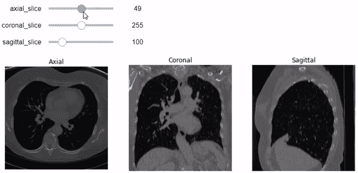
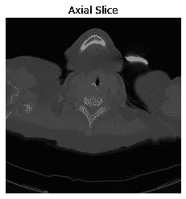
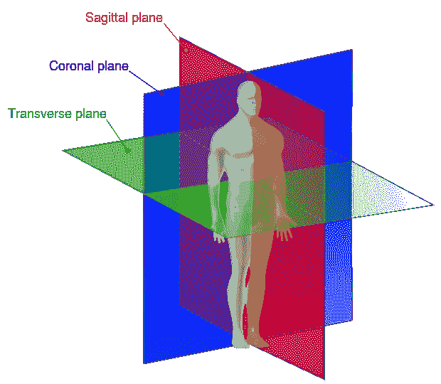
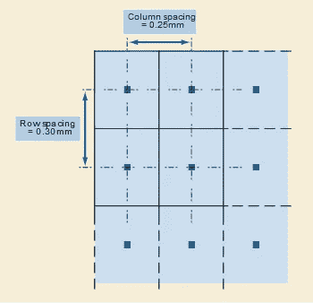
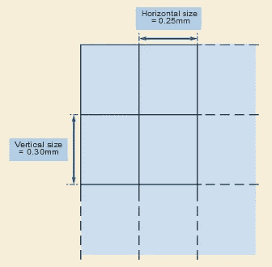
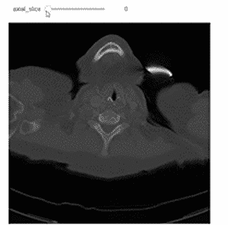
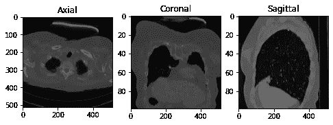
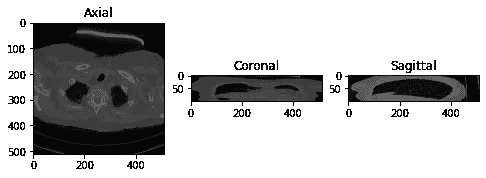

# 用 ImageIO Python 包处理 DICOM

> 原文：<https://towardsdatascience.com/dealing-with-dicom-using-imageio-python-package-117f1212ab82>

## 医学图像== DICOM


乔纳森·博尔巴在 [Unsplash](https://unsplash.com?utm_source=medium&utm_medium=referral) 上的照片

在本文中，我们将使用 ImageIO Python 包来读取 DICOM 文件，提取元数据和属性，并使用 Ipywidgets 使用交互式滑块小部件绘制图像切片。



下面是最终代码的输出。[图片由作者提供]

# 背景信息

DICOM 是医学成像系统的支柱。如果你是生物医学工程师、医疗保健领域的 IT 专家，或者是**医疗保健数据科学家/分析师**，你可能使用过或者至少听说过 DICOM，因为它与医疗成像系统无处不在。

DICOM，即医学中的数字成像和通信，是一套标准，旨在实现多种形式的通信，如 CT、MRI、超声波等。这样，所有符合 DICOM 标准的医疗设备在通过网络发送信息时都可以使用同一种语言。

DICOM 文件通常包含信息，而不仅仅是像素数据。DICOM 标准提供了一组属性来标准化存储在 DICOM 文件中的数据。每个属性都有特定的数据类型(如字符串、整数、浮点等)。)用固定值表示。这些属性称为元数据。DICOM 元数据的示例:

*   ***患者相关属性:*** 姓名、年龄、性别等。
*   ***模态相关属性:*** 模态(CT、MRI、超声等。)、制造商、收购日期等。
*   ***图像相关属性:*** 形状、采样、长宽比、像素数据等。

> ***注意*** 我上面提到的图像相关属性对于理解非常重要，因为它们对于在医学图像上实现真实世界的计算非常有用。我们将严重依赖他们。你最好理解每一个代表什么。

有几十种属性可以表征 DICOM 文件。所以，你不能把它们都读完。您只需要关注在 DICOM 相关工作中可能会遇到的属性。为此，我强烈推荐这个由 [Innolitics](https://innolitics.com/) 构建的伟大的 [DICOM 标准浏览器](https://dicom.innolitics.com/ciods)，你只需要搜索你想要了解的属性。

现在让我们进入正题…我们将使用 python 轻松浏览 DICOM 文件。我们将着重于使用(ImageIO)包来展示一些关于 DICOM 文件的基础知识。我们将讨论以下内容:

*   使用 ImageIO 读取 DICOM 文件。
*   DICOM 属性，元数据。
*   访问特定的 DICOM 属性。
*   使用 Matplotlib 包的图像表示。
*   堆叠并读取多个切片。
*   了解像素间距、形状、切片厚度、纵横比和视野。
*   使用 Ipywidgets 沿轴向、冠状面和矢状面构建交互式图像表示。

# 让我们编码

首先，让我们导入所需的包。我们将使用(ImageIO)处理 DICOM 文件，使用(NumPy)将像素数据作为 NumPy 数组读取，使用(matplotlib)将图像可视化。另外一个包(Ipywidgets)也用于构建一个交互式滑块，我们可以用它在多个图像切片之间滚动。

> 我用[***Google Colab***](https://www.google.com/url?sa=t&rct=j&q=&esrc=s&source=web&cd=&cad=rja&uact=8&ved=2ahUKEwjUmOStkIP8AhWYSvEDHUOhD7QQFnoECB4QAQ&url=https%3A%2F%2Fcolab.research.google.com%2F&usg=AOvVaw3A5aPK2kLFzKOzb6sOckVw)用 Python 编码

```
import ipywidgets as widgets
import numpy as np
import matplotlib.pyplot as plt
%matplotlib inline
import imageio
```

## DICOM 数据集

互联网上有很多 DICOM 样本。你可以使用你自己的 DICOM 文件。在这篇博客中，我选择了一个病人的 99 片胸部 CT 扫描的数据集。你可以在 Kaggle 上找到它。我把数据集保存在我的[驱动器](https://drive.google.com/drive/folders/1dbJpXVUBn0mSUxgJIqKZj4d_0thSeTW3?usp=sharing)上，这样我就可以很容易地通过 GoogleColab 访问。

## 读取 DICOM 文件

您可以轻松地读取 DICOM 文件，并使用(.imread)。

```
#Reading a DICOM Image
im = imageio.imread('/content/drive/MyDrive/Datasets/Kaggle/DICOM/dicom_lung/000009.dcm')
```

## DICOM 属性

使用(。meta)输出包含 DICOM 文件的属性和元数据的字典。

```
#DICOM Metadata
im.meta
```

```
Dict([('TransferSyntaxUID', '1.2.840.10008.1.2.1'),
      ('SOPClassUID', '1.2.840.10008.5.1.4.1.1.2'),
      ('SOPInstanceUID',
       '1.3.6.1.4.1.14519.5.2.1.7085.2626.397047382026069586801778973091'),
      ('StudyDate', '20100227'),
      ('SeriesDate', '20100227'),
      ('AcquisitionDate', '20100227'),
      ('ContentDate', '20100227'),
      ('StudyTime', '161937.171'),
      ('SeriesTime', '162536.14 '),
      ('AcquisitionTime', '162208.162527 '),
      ('ContentTime', '162208.162527 '),
      ('Modality', 'CT'),
      ('Manufacturer', 'SIEMENS'),
      ('StudyDescription', 'CT CHEST W IV CONTRAST'),
      ('SeriesDescription', 'LUNG 3.0  B70f'),
      ('PatientName', 'C3N-00247'),
      ('PatientID', 'C3N-00247'),
      ('PatientBirthDate', ''),
      ('PatientSex', 'F '),
      ('PatientAge', '077Y'),
      ('StudyInstanceUID',
       '1.3.6.1.4.1.14519.5.2.1.7085.2626.258626612405225511766549337110'),
      ('SeriesInstanceUID',
       '1.3.6.1.4.1.14519.5.2.1.7085.2626.242193282649561899185427104083'),
      ('SeriesNumber', 2),
      ('AcquisitionNumber', 2),
      ('InstanceNumber', 1),
      ('ImagePositionPatient', (-143.2177734375, -287.2177734375, 6.0)),
      ('ImageOrientationPatient', (1.0, 0.0, 0.0, 0.0, 1.0, 0.0)),
      ('SamplesPerPixel', 1),
      ('Rows', 512),
      ('Columns', 512),
      ('PixelSpacing', (0.564453125, 0.564453125)),
      ('BitsAllocated', 16),
      ('BitsStored', 12),
      ('HighBit', 11),
      ('PixelRepresentation', 0),
      ('RescaleIntercept', -1024.0),
      ('RescaleSlope', 1.0),
      ('PixelData',
       b'Data converted to numpy array, raw data removed to preserve memory'),
      ('shape', (512, 512)),
      ('sampling', (0.564453125, 0.564453125))])
```

由于元数据存储为字典，您可以看到 DICOM 文件的关键字、属性名称:

```
# The Attributes of the DICOM File
im.meta.keys()
```

```
odict_keys(['TransferSyntaxUID', 'SOPClassUID', 'SOPInstanceUID',
            'StudyDate', 'SeriesDate', 'AcquisitionDate', 'ContentDate',
            'StudyTime', 'SeriesTime', 'AcquisitionTime', 'ContentTime',
            'Modality', 'Manufacturer', 'StudyDescription', 'SeriesDescription',
            'PatientName', 'PatientID', 'PatientBirthDate', 'PatientSex',
            'PatientAge', 'StudyInstanceUID', 'SeriesInstanceUID',
            'SeriesNumber', 'AcquisitionNumber', 'InstanceNumber',
            'ImagePositionPatient', 'ImageOrientationPatient',
            'SamplesPerPixel', 'Rows', 'Columns', 'PixelSpacing',
            'BitsAllocated', 'BitsStored', 'HighBit', 'PixelRepresentation',
            'RescaleIntercept', 'RescaleSlope', 'PixelData', 'shape',
            'sampling'])
```

> **注意:**我们在这里看到的属性可能不是这个 DICOM 文件中包含的全部属性。这是因为 ImageIO 对 DICOM 图像的处理尽可能的轻。一个可选的阅读是检查这个[链接](https://github.com/imageio/imageio/blob/c57e31c90f17d32d1b0b1fe8d45a3f274776094d/imageio/plugins/_dicom.py#L29)以查看 ImageIO 支持的属性字典。

## **访问特定的 DICOM 属性**

访问特定属性，例如“设备”，可以按如下方式完成:

```
#The Modality Attribute
im.meta['Modality']
```

```
'CT'
```

## 使用 Matplotlib 包的图像表示

通常，“像素数据”属性具有像素值。让我们像以前一样访问这个属性:

```
# Access the Pixel Data attribute
im.meta['PixelData']
```

```
b'Data converted to numpy array, raw data removed to preserve memory'
```

正如它所说，像素值存储为一个 NumPy 数组。这很有用，因为 NumPy 适合快速处理数组及其计算。现在让我们看看像素值:

```
#print the image Numpy-array
im
```

```
Array([[ -985,  -990,  -999, ..., -1017, -1008,  -971],
       [-1016,  -984,  -963, ..., -1000, -1009,  -999],
       [-1024, -1008,  -996, ...,  -979, -1021,  -987],
       ...,
       [ -920,  -942,  -944, ...,  -893,  -917,  -955],
       [ -871,  -879,  -905, ...,  -895,  -869,  -867],
       [ -876,  -855,  -873, ...,  -933,  -982,  -936]], dtype=int16)
```

我们只看到一串数字，其中每个数字代表 [Hounsfield 单位(HU)](https://radiology.expert/x-ray-ct-technique/ct/hounsfield-units/) 形式中的像素值。您可以使用 NumPy 数组索引对图像数组进行切片:

```
#Slicing the first 5 rows and first 5 columns
im[0:5, 0:5]
```

```
Array([[ -985,  -990,  -999,  -982, -1011],
       [-1016,  -984,  -963,  -978, -1005],
       [-1024, -1008,  -996,  -969,  -992],
       [-1006,  -984,  -997,  -963, -1002],
       [ -970,  -988, -1006,  -992,  -999]], dtype=int16)
```

了解了像素数据代表什么之后，我们来展示一下这些像素的图像。

```
#Show the image with gray color-map
plt.imshow(im, cmap='gray')
#Don't show tha axes
plt.axis('off')
#Add a title to the plot
plt.title('Axial Slice')
plt.show()
```



使用 Matplotlib 的图像表示[图片由作者提供]

## 堆叠并读取多个切片

DICOM 文件可以有多个帧，这些帧可能堆叠在像素数据属性中。你可以看到在 DICOM 文件中有视频或彩色图像，RGB 通道。此外，有时您会在一个文件夹中找到多个 DICOM 文件，其中每个 DICOM 文件包含同一患者的一个帧或切片。在这种情况下，我们必须自己堆叠这些 DICOM 文件。幸运的是，这很容易通过使用(.volread)来自 ImageIO。

```
#Stacking 99 slices
vol = imageio.volread('/content/drive/MyDrive/Datasets/Kaggle/DICOM/dicom_lung')
```

```
Reading DICOM (examining files): 99/99 files (100.0%)
  Found 1 correct series.
Reading DICOM (loading data): 99/99  (100.0%)
```

您可以使用数组索引来访问特定的切片:

```
#Access the first slice
vol[0,:,:]
```

```
Array([[ -985,  -990,  -999, ..., -1017, -1008,  -971],
       [-1016,  -984,  -963, ..., -1000, -1009,  -999],
       [-1024, -1008,  -996, ...,  -979, -1021,  -987],
       ...,
       [ -920,  -942,  -944, ...,  -893,  -917,  -955],
       [ -871,  -879,  -905, ...,  -895,  -869,  -867],
       [ -876,  -855,  -873, ...,  -933,  -982,  -936]], dtype=int16)
```

此外，单个特定切片的图像表示可以像前面一样进行:

```
#Show the first slice.
plt.imshow(vol[0,:,:], cmap='gray')
#Don't show the axis
plt.axis('off')
#Add a title
plt.title('Axial Slice')
plt.show()
```


这是 99 个堆栈图像的第一个切片。[图片由作者提供]

> 处理堆叠切片对于提取其他平面(矢状面和冠状面)非常有用。此外，放射科医生在诊断时滚动多个切片也很有帮助。但是为了正确地显示三个平面和滚动切片，我们工程师必须理解特定属性的含义。这些属性是采样、形状和长宽比。



人体解剖平面，横向是轴向平面。[图片来自[维基共享资源](https://commons.wikimedia.org/wiki/File:Human_anatomy_planes.svg)

```
#Introduce the metadata of the stacked images.
vol.meta
```

```
Dict([('TransferSyntaxUID', '1.2.840.10008.1.2.1'),
      ('SOPClassUID', '1.2.840.10008.5.1.4.1.1.2'),
      ('SOPInstanceUID',
       '1.3.6.1.4.1.14519.5.2.1.7085.2626.397047382026069586801778973091'),
      ('StudyDate', '20100227'),
      ('SeriesDate', '20100227'),
      ('AcquisitionDate', '20100227'),
      ('ContentDate', '20100227'),
      ('StudyTime', '161937.171'),
      ('SeriesTime', '162536.14 '),
      ('AcquisitionTime', '162208.162527 '),
      ('ContentTime', '162208.162527 '),
      ('Modality', 'CT'),
      ('Manufacturer', 'SIEMENS'),
      ('StudyDescription', 'CT CHEST W IV CONTRAST'),
      ('SeriesDescription', 'LUNG 3.0  B70f'),
      ('PatientName', 'C3N-00247'),
      ('PatientID', 'C3N-00247'),
      ('PatientBirthDate', ''),
      ('PatientSex', 'F '),
      ('PatientAge', '077Y'),
      ('StudyInstanceUID',
       '1.3.6.1.4.1.14519.5.2.1.7085.2626.258626612405225511766549337110'),
      ('SeriesInstanceUID',
       '1.3.6.1.4.1.14519.5.2.1.7085.2626.242193282649561899185427104083'),
      ('SeriesNumber', 2),
      ('AcquisitionNumber', 2),
      ('InstanceNumber', 1),
      ('ImagePositionPatient', (-143.2177734375, -287.2177734375, 6.0)),
      ('ImageOrientationPatient', (1.0, 0.0, 0.0, 0.0, 1.0, 0.0)),
      ('SamplesPerPixel', 1),
      ('Rows', 512),
      ('Columns', 512),
      ('PixelSpacing', (0.564453125, 0.564453125)),
      ('BitsAllocated', 16),
      ('BitsStored', 12),
      ('HighBit', 11),
      ('PixelRepresentation', 0),
      ('RescaleIntercept', -1024.0),
      ('RescaleSlope', 1.0),
      ('PixelData', b'Deferred loading of pixel data'),
      ('shape', (99, 512, 512)),
      ('sampling', (3.0, 0.564453125, 0.564453125))])
```

请注意堆叠图像的“形状”和“采样”属性的差异。这是在使用(.volread)。

## 了解“形状”、“采样”和“像素比例”属性

*   ***形状:*** 简单来说就是每个切片中的行数和列数。因为我们处理的是多个切片，所以会有一个第三维度，它等于堆叠在一起的切片的数量。在我们的示例中，堆叠图像的形状是 99 个切片、512 行和 512 列。

```
# The shape of the stacked images in each plane
# (Axial, Coronal, and Sagittal, respectively)
n0, n1, n2 = vol.shape
# Print the ouput
print("Number of Slices:\n\t", "Axial=", n0, "Slices\n\t",
                               "Coronal=", n1, "Slices\n\t",
                               "Sagittal=", n2, "Slices")
```

```
Number of Slices:
  Axial= 99 Slices
  Coronal= 512 Slices
  Sagittal= 512 Slices
```

*   ***采样:*** 如果在 DICOM 标准下搜索“采样”，不会得到直接的答案。因为它是 ImageIO 内置的[特殊变量](https://github.com/imageio/imageio/blob/c57e31c90f17d32d1b0b1fe8d45a3f274776094d/imageio/plugins/_dicom.py#L451)。这是 SliceThickness 和 PixelSpacing 两个属性的采样组合。切片厚度是以毫米为单位的名义切片厚度。至于像素间距属性，它是患者的物理距离。它由一个数字对指定:第一个值是以 *mm* 为单位的行间距，即相邻行中心之间的间距，或垂直间距。第二个值是以 *mm* 为单位的列间距，即相邻列中心之间的间距，或水平间距。



PixelSapcing 属性。[图片由 [DICOM](http://dicom.nema.org/medical/dicom/current/output/html/figures/PS3.3_10.7.1.3-1.svg) 提供]

```
# The sampling of the stacked images in each plane
# (Axial, Coronal, and Sagittal, respectively)
d0, d1, d2 = vol.meta['sampling'] # in mm
# Print the output
print("Sampling:\n\t", "Axial=", d0, "mm\n\t",
                               "Coronal=", d1, "mm\n\t",
                               "Sagittal=", d2, "mm")
```

```
Sampling:
  Axial= 3.0 mm
  Coronal= 0.564453125 mm
  Sagittal= 0.564453125 mm
```

*   ***像素长宽比:*** 图像中像素沿特定轴的垂直尺寸与水平尺寸的比值。请注意,“PixelAspectRatio”不在堆叠图像的元数据中。但这没关系，因为我们可以通过使用“采样”参数来计算每个轴的纵横比。下图表示 PixelAspectRatio 属性。



PixelAspectRatio 属性。[图片来自 [DICOM](http://dicom.nema.org/medical/dicom/current/output/html/figures/PS3.3_C.7.6.3.1.7-1.svg)

```
# The aspect ratio along the axial plane
axial_asp = d1/d2
# The aspect ratio along the sagittal plane
sagittal_asp = d0/d1
# The aspect ratio along the coronal plane
coronal_asp = d0/d2
# Print the output
print("Pixel Aspect Ratio:\n\t", "Axial=", axial_asp, "\n\t",
                               "Coronal=", coronal_asp, "\n\t",
                               "Sagittal=", sagittal_asp)
```

```
Pixel Aspect Ratio:
  Axial= 1.0 
  Coronal= 5.314878892733564 
  Sagittal= 5.314878892733564
```

## 视野

通过将“形状”参数乘以“采样”参数，即沿每个轴的物理空间(单位为 *mm* ),我们得到沿每个轴的视场。

```
print("Field of View:\n\t", "Axial=", n0*d0, "mm\n\t",
                            "Coronal=", n1*d1, "mm\n\t",
                            "Sagittal=", n2*d2, "mm")
```

```
Field of View:
  Axial= 297.0 mm
  Coronal= 289.0 mm
  Sagittal= 289.0 mm
```

## 使用 Ipywidgets 构建交互式图像表示

> 现在，在理解了采样和形状的含义之后，让我们用它们来做一个图像的正确表示，沿着每个轴有正确的纵横比。我们将使用 Ipywidgets 构建一个整数滑块，我们可以在特定平面(轴向、矢状或冠状)的不同切片之间滚动。

```
# Add a slider that starts with 0 and ends at the number of
# slices along the axial plane, n0=99.
@widgets.interact(axial_slice=(0,n0-1))
# Define the function that shows the images of the specified slice number.
# It starts with the 10th slice. And you can scroll over any slice
# using the slider.
def axial_slicer(axial_slice=50):
  fig, ax = plt.subplots(1, 1, figsize=(8, 8))
  # Show the image of the specified slice number in 'gray' color-map
  # and axial aspect ratio
  ax.imshow(vol[axial_slice,:,:], cmap='gray', aspect=axial_asp)
  # Don't show the axis
  ax.axis('off')
```



使用交互式小部件在多个轴向切片上滚动。[图片由作者提供]

现在让我们展示沿特定轴的三个切片的图像。我有意显示了轴，以便于理解沿每个轴的切片形状。

```
# Define a figure with 1 row and 3 columns of plots to show
# the images along the three planes
fig, ax = plt.subplots(1, 3, figsize=(8, 8))
# Axial Plane: show the 10th slice
ax[0].imshow(vol[10,:,:], cmap='gray', aspect= axial_asp)
#ax[0].axis('off')
ax[0].set_title('Axial')

# Coronal Plane: show the slice 100
ax[1].imshow(vol[:,100,:],cmap='gray', aspect= coronal_asp)
#ax[1].axis('off')
ax[1].set_title('Coronal')

# Sagittal Plane: show the slice 100
ax[2].imshow(vol[:,:,100], cmap='gray', aspect= sagittal_asp)
#ax[2].axis('off')
ax[2].set_title('Sagittal')
plt.show()
```



切片(10 个轴向，100 个冠状，100 个矢状)具有每个平面的正确纵横比。[图片由作者提供]

让我们尝试错误的方式…让我们忽略每个轴的纵横比来显示图像。

```
# Define a figure with 1 row and 3 columns of plots to show the
# images along the three planes
fig, ax = plt.subplots(1, 3, figsize=(8, 8))
# Axial Plane: show the 10th slice
ax[0].imshow(vol[10,:,:], cmap='gray')
#ax[0].axis('off')
ax[0].set_title('Axial')

# Coronal Plane: show the slice 100
ax[1].imshow(vol[:,100,:],cmap='gray')
#ax[1].axis('off')
ax[1].set_title('Coronal')

# Sagittal Plane: show the slice 100
ax[2].imshow(vol[:,:,100], cmap='gray')
#ax[2].axis('off')
ax[2].set_title('Sagittal')
plt.show()
```



切片(10 个轴向，100 个冠状，100 个矢状)忽略每个平面的纵横比。[图片由作者提供]

我们可以看到只有轴面不乱。这是因为参数“aspect”默认设置为 1，这是我们例子中轴平面的纵横比(D1/D2 = 0.564453125/0.564453125 = 1)。

## 我们的最终代码

让我们超越只有一个图像平面的滑块。我们将构建包含三个平面(分别为轴向、冠状和矢状)的三个图。我们可以使用每个平面的特定滑块来指定切片编号。不要忘记添加正确的长宽比，这样就不会像上面那样乱七八糟了。

```
# Add three sliders that start with 0 and ends at the number of slices
# along each plane.
# Axial:    n0=99   slice
# Corornal: n1=512  slice
# Sagittal: n2=512  slice
@widgets.interact(axial_slice=(0,n0-1), coronal_slice=(0,n1-1),\
                  sagittal_slice=(0,n2-1))
def slicer(axial_slice, coronal_slice, sagittal_slice=100):
  fig, ax = plt.subplots(1, 3, figsize=(12, 12))

  # Show the specfied slice on the axial plane with 'gray' color-map
  # and axial aspect ratio.
  ax[0].imshow(vol[axial_slice,:,:], cmap='gray', aspect= axial_asp)
  ax[0].axis('off')
  ax[0].set_title('Axial')

  # Show the specified slice on the coronal plane with 'gray' color-map
  # and coronal aspect ratio.
  ax[1].imshow(vol[:,coronal_slice,:],cmap='gray', aspect= coronal_asp)
  ax[1].axis('off')
  ax[1].set_title('Coronal')

  # Show the specified slice on the sagittal plane with 'gray' color-map
  # and sagittal aspect ratio.
  ax[2].imshow(vol[:,:,sagittal_slice], cmap='gray', aspect= sagittal_asp)
  ax[2].axis('off')
  ax[2].set_title('Sagittal')
```


使用交互式小工具在多个轴向、冠状和矢状切片上滚动。[图片由作者提供]

# 结论

*   我们已经看到了如何使用 ImageIO 包来读取 DICOM 文件。以及使用的力量(。volread)来叠加图像，更方便的阅读。
*   我们知道 DICOM 文件有元数据、一组属性以及像素数据。我们还介绍了一些与图像相关的特定属性的基础知识，如像素间距、切片厚度、形状和像素比例。
*   我们已经指出了当沿着轴绘制图像时纵横比参数的重要性，以及如果没有正确指定纵横比，图像会变得如何混乱。
*   我们使用 Ipywidgets 包的滑块构建了一个图形，显示了沿轴向、冠状和矢状平面的指定切片数。

***感谢阅读……***

# 建议

*   更多关于 DICOM 的细节:参考之前的博客， [***什么是 DICOM？***](https://medium.com/@omar.ok1998/what-is-dicom-a28c5fe24c9d)
*   ***DICOM 元数据—大数据分析的有用资源:***
    这篇[文章](https://healthmanagement.org/c/healthmanagement/issuearticle/dicom-metadata-a-useful-resource-for-big-data-analytics)概述了通过结合患者访问和 DICOM 信息来表示数据的新方法，医学成像元数据的高级使用，辐射剂量和图像分割的分析，以及用于丰富数据的特征工程的深度学习。
*   [***生物医学图像分析在 Python 课程*** 上](https://app.datacamp.com/learn/courses/biomedical-image-analysis-in-python)在 **DataCamp** 上。本课程是我第一次使用 Python 研究 DICOM 图像和医学图像处理。本博客中的信息严重依赖于本课程的第一章，这是唯一免费的一章。
*   ***Ipywidget***[***文档***](https://ipywidgets.readthedocs.io/en/7.6.2/examples/Widget%20Basics.html) 是学习构建交互式小部件的良好开端。

# 参考

[1] DataCamp，Python 课程中[生物医学图像分析第一章，第一章，探索。](https://app.datacamp.com/learn/courses/biomedical-image-analysis-in-python)

[2] C. Rossant， [IPython 交互式计算和可视化食谱](https://ipython-books.github.io/)，(2018)，[掌握 Jupyter 笔记本中的小部件](https://ipython-books.github.io/33-mastering-widgets-in-the-jupyter-notebook/)。

[3] ImageIO，GitHub，ImageIO-Plugin-DICOM，(2022)，DICOM 属性， [MINIDICT](https://github.com/imageio/imageio/blob/c57e31c90f17d32d1b0b1fe8d45a3f274776094d/imageio/plugins/_dicom.py#L28) 。

[4] Innolitics，DICOM 标准浏览器，(2022)，[切片厚度属性](https://dicom.innolitics.com/ciods/ct-image/image-plane/00180050)。

[5] Innolitics，DICOM 标准浏览器，(2022)，[像素间距属性](https://dicom.innolitics.com/ciods/ct-image/image-plane/00280030)。

[6] Innolitics，DICOM 标准浏览器，(2022)，[纵横比属性](https://dicom.innolitics.com/ciods/ct-image/image-pixel/00280034)。