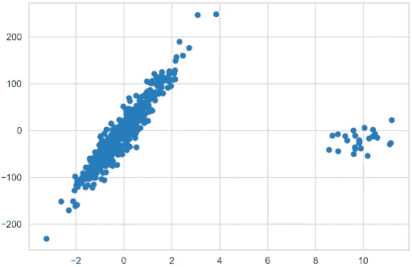
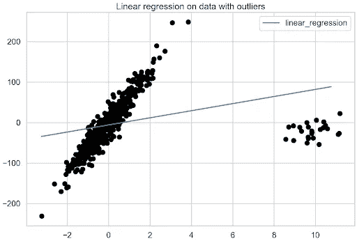
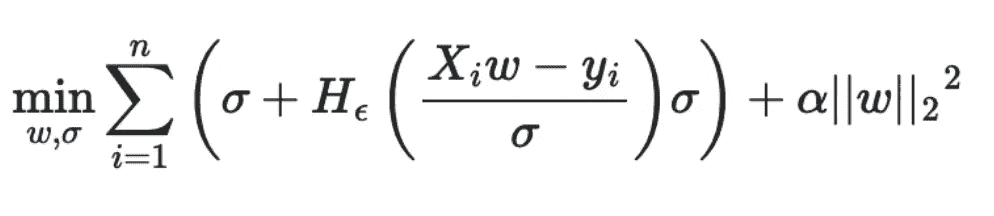
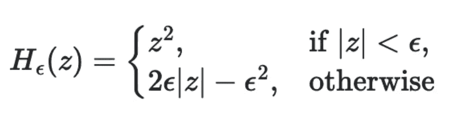
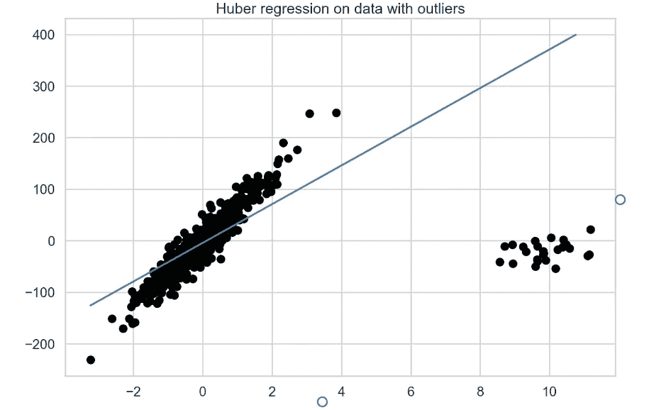
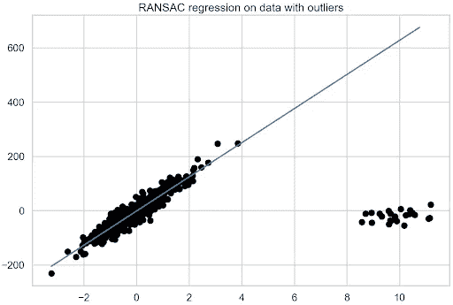
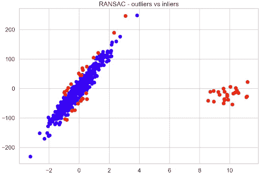
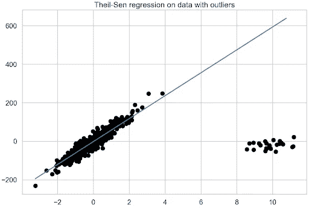
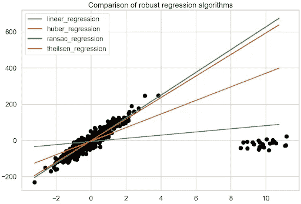
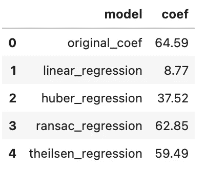

# 使用三种稳健线性回归模型处理异常值

> 原文：<https://towardsdatascience.com/dealing-with-outliers-using-three-robust-linear-regression-models-544cfbd00767>


照片由 [**里卡多·戈麦斯天使**](https://unsplash.com/@rgaleria?utm_source=unsplash&utm_medium=referral&utm_content=creditCopyText) **上** [**下**](https://unsplash.com/s/photos/stand-out?utm_source=unsplash&utm_medium=referral&utm_content=creditCopyText)

## 通过使用 Huber、RANSAC 和 Theil-Sen 回归算法的实际例子

线性回归是最简单的机器学习模型之一。它通常不仅是学习数据科学的起点，也是构建快速简单的最小可行产品(MVP)的起点，这些产品随后将作为更复杂算法的基准。一般来说，线性回归拟合一条线(在二维中)或一个超平面(在三维和更多维中),它们最好地描述了特征和目标值之间的线性关系。

异常值是位于预期分布之外很远的值。它们导致特性的分布不太好。因此，该模型可能会偏向异常值，正如我们已经确定的，这些异常值远离观察值的中心。自然地，这导致线性回归发现更差和更有偏差的拟合，具有较差的预测性能。

重要的是要记住，异常值可以在要素和目标变量中找到，并且所有场景都可能使模型的性能恶化。

处理异常值有许多可能的方法:从观测值中去除异常值，处理异常值(例如，将极端观测值限制在一个合理的值)，或者使用非常适合处理这些值的算法。这篇文章主要关注这些健壮的方法。

# 设置

我们使用相当标准的库:`numpy`、`pandas`、`scikit-learn`。我们在这里工作的所有模型都是从`scikit-learn`的`linear_model`模块导入的。

# 数据

假设目标是显示不同的稳健算法如何处理异常值，第一步是创建一个定制的数据集，以清楚地显示行为的差异。为此，我们使用了`scikit-learn`中的可用功能。

我们首先创建一个包含 500 个观察值的数据集，其中有一个信息丰富的特征。只有一个特征和目标，我们绘制数据，以及模型的拟合。此外，我们指定噪声(应用于输出的标准偏差)并创建一个包含基础线性模型系数的列表，也就是说，如果线性回归模型适合生成的数据，系数将是多少。在这个例子中，系数的值是 64.6。我们为所有模型提取这些系数，然后用它们来比较它们与数据的拟合程度。

接下来，我们将前 25 个观察值(5%的观察值)替换为离群值，远远超出生成的大量观察值。请记住，先前存储的系数来自没有异常值的数据。包括他们会有所不同。



图 1

# 线性回归

我们从好的旧线性回归模型开始，它很可能受到异常值的影响。我们使用以下示例来拟合模型和数据:

```
lr = LinearRegression().fit(X, y)
coef_list.append(["linear_regression", lr.coef_[0]])
```

然后，我们准备一个对象用于绘制模型的拟合。`plotline_X`对象是一个 2D 数组，包含由生成的数据集指定的间隔内均匀分布的值。我们使用这个对象来获取模型的拟合值。它必须是一个 2D 数组，因为它是`scikit-learn`中模型的预期输入。然后，我们创建一个`fit_df`数据框架，在其中存储拟合值，通过将模型拟合到均匀分布的值来创建。

准备好数据框架后，我们绘制线性回归模型与异常值数据的拟合图。

图 2 显示了异常值对线性回归模型的重大影响。



图 2

使用线性回归获得基准模型。现在是时候转向稳健的回归算法了。

# 胡伯回归

[休伯回归](https://scikit-learn.org/stable/modules/generated/sklearn.linear_model.HuberRegressor.html)是稳健回归算法的一个例子，该算法对被识别为异常值的观察值分配较少的权重。为此，它在优化例程中使用了 Huber 损失。Huber 回归最小化以下损失函数:



其中σ表示标准偏差，X_i 表示特征集，y_i 是回归的目标变量，ω 是估计系数的向量，α是正则化参数。该公式还表明，根据 Huber 损失，异常值的处理方式不同于常规观测值:



Huber 损失通过考虑由 z 表示的残差来识别异常值。如果观察值被认为是规则的(因为残差的绝对值小于某个阈值𝜖)，则我们应用平方损失函数。否则，观察值被认为是异常值，我们应用绝对损失。话虽如此，Huber 损失基本上是平方损失函数和绝对损失函数的组合。

好奇的读者可能会注意到，第一个方程类似于[岭回归](https://en.wikipedia.org/wiki/Ridge_regression)，也就是说，包括 L2 正则化。Huber 回归和岭回归的区别在于对异常值的处理。

通过分析两个流行的回归评估指标之间的差异，您可能会认识到这种损失函数方法:均方误差(MSE)和平均绝对误差(MAE)。与 Huber 损失的含义相似，建议在处理异常值时使用 MAE，因为它不会像平方损失那样严重地惩罚那些观察值。

与前一点相关的事实是，优化平方损失会导致均值附近的无偏估计量，而绝对差会导致中位数附近的无偏估计量。对于异常值，中位数比平均数更稳健，所以我们期望这能提供一个更少偏差的估计。

我们对𝜖使用默认值 1.35，这决定了回归对异常值的敏感度。Huber (2004)表明，当误差遵循σ = 1 的正态分布时，相对于 OLS 回归，𝜖 = 1.35 产生 95%的效率。对于您自己的用例，我建议使用网格搜索之类的方法来调优超参数`alpha`和`epsilon`。

然后，我们使用以下示例对数据进行 Huber 回归拟合:

图 3 显示了拟合模型的最佳拟合线。



图 3

# RANSAC 回归

[随机样本一致性(RANSAC)回归](https://scikit-learn.org/stable/modules/generated/sklearn.linear_model.RANSACRegressor.html)是一种非确定性算法，它试图将训练数据分为内点(可能会受到噪声的影响)和离群点。然后，它只使用内联器来估计最终的模型。

RANSAC 是一种迭代算法，其中迭代由以下步骤组成:

1.  从初始数据集中选择一个随机子集。
2.  使模型适合所选的随机子集。默认情况下，该模型是线性回归模型；但是，我们可以将其更改为其他回归模型。
3.  使用估计模型计算初始数据集中所有数据点的残差。绝对残差小于或等于所选阈值的所有观测值都被视为内点，并创建所谓的共识集。默认情况下，阈值被定义为目标值的中值绝对偏差(MAD)。
4.  如果足够多的点已经被分类为共识集的一部分，则拟合的模型被保存为最佳模型。如果当前估计的模型与当前最佳模型具有相同数量的内联器，则只有当它具有更好的分数时才被认为是更好的。

这些步骤迭代执行最大次数，或者直到满足特定的停止标准。这些标准可以使用三个专用的超参数来设置。正如我们前面提到的，最终的模型是使用所有的内层样本来估计的。

在下面的代码片段中，我们用 RANSAC 回归模型来拟合数据。

正如您所看到的，恢复系数的过程有点复杂，因为我们首先使用`estimator_`访问模型的最终估计器(使用所有识别的内联器训练的那个)。由于它是一个`LinearRegression`对象，我们继续像前面一样恢复系数。然后，我们绘制 RANSAC 回归拟合图(图 4)。



图 4

使用 RANSAC 回归，我们还可以检查模型认为是内部值和异常值的观察值。首先，我们检查模型总共识别出多少异常值，然后检查手动引入的异常值中有多少与模型的决策重叠。训练数据的前 25 个观察值都是已经引入的异常值。

运行该示例将打印以下摘要:

```
Total outliers: 51
Outliers you added yourself: 25 / 25
```

大约 10%的数据被确定为异常值，所有引入的观察值都被正确地归类为异常值。这样，我们可以快速地将内标值与外标值进行比较，以查看标记为外标值的其余 26 个观察值。

图 5 显示了距离原始数据的假设最佳拟合线最远的观察值被认为是异常值。



图 5

# 泰尔-森回归

在`scikit-learn`可用的最后一种稳健回归算法是[泰尔森回归](https://scikit-learn.org/stable/auto_examples/linear_model/plot_theilsen.html)。它是一种非参数回归方法，这意味着它对基础数据分布不做任何假设。简而言之，它包括在训练数据的子集上拟合多重回归模型，然后在最后一步聚合系数。

算法是这样工作的。首先，它计算从训练集 x 中的所有观察值创建的大小为 *p* (超参数`n_subsamples`)的子集的最小二乘解(斜率和截距)，如果我们计算截距(它是可选的)，则必须满足以下条件:`p >= n_features + 1`。线的最终斜率(可能还有截距)被定义为所有最小二乘解的(空间)中值。

该算法的一个可能的缺点是其计算复杂性，因为它可以认为最小二乘解的总数等于`n_samples choose n_subsamples`，其中`n_samples`是 *X* 中的观测值的数量。考虑到这个数字会迅速膨胀，我们可以做一些事情:

*   仅将该算法用于样本和特征数量方面的小问题。然而，由于显而易见的原因，这并不总是可行的。
*   调整`n_subsamples`超参数。较低的值以较低的效率为代价导致对异常值的较高鲁棒性，而较高的值导致较低的鲁棒性和较高的效率。
*   使用`max_subpopulation`超参数。如果`n_samples choose n_subsamples`的总值大于`max_subpopulation`，该算法只考虑给定最大尺寸的随机子群体。自然地，只使用所有可能组合的随机子集会导致算法失去一些数学特性。

此外，我们应该意识到，随着问题的维数增加，估计量的稳健性会迅速下降。为了了解这在实践中是如何实现的，我们使用下面的代码片段来估计 Theil-Sen 回归:



图 6

# 模型的比较

到目前为止，我们已经对包含异常值的数据拟合了三种稳健的回归算法，并且我们已经确定了各个最佳拟合线。现在是比较的时候了。

我们从图 7 的目视检查开始。为了不显示太多的线条，我们没有打印原始数据的拟合线。然而，给定大多数数据点的方向，很容易想象它看起来像什么。显然，RANSAC 和 Theil-Sen 回归得到了最准确的最佳拟合线。



图 7

更准确地说，我们看估计的系数。下表显示 RANSAC 回归的结果与原始数据最接近。观察 5%的异常值对常规线性回归拟合的影响有多大也很有趣。



你可能会问哪个稳健回归算法最好？通常情况下，答案是:“视情况而定。”以下是一些指导原则，可能有助于您针对具体问题找到合适的模型:

*   一般来说，在高维设置中的稳健拟合是困难的。
*   与 Theil-Sen 和 RANSAC 不同，Huber 回归没有试图完全过滤掉异常值。相反，它减少了他们对适合的影响。
*   Huber 回归应该比 RANSAC 和 Theil-Sen 更快，因为后者适合数据的较小子集。
*   Theil-Sen 和 RANSAC 不太可能像使用默认超参数的 Huber 回归那样稳健。
*   RANSAC 比 Theil-Sen 更快，并且随着样本数量的增加，它的伸缩性更好。
*   RANSAC 应该更好地处理 y 方向上的大异常值，这是最常见的情况。

考虑到上述所有信息，您还可以根据经验试验所有三种稳健的回归算法，看看哪一种最适合您的数据。

你可以在我的 [GitHub repo](https://github.com/erykml/nvidia_articles/blob/main/robust_regression.ipynb) 中找到这篇文章中使用的代码。一如既往，我们非常欢迎任何建设性的反馈。你可以在[推特](https://twitter.com/erykml1?source=post_page---------------------------)或评论中联系我。

*喜欢这篇文章？成为一个媒介成员，通过无限制的阅读继续学习。如果你使用* [*这个链接*](https://eryk-lewinson.medium.com/membership) *成为会员，你就支持我，不需要你额外付费。提前感谢，再见！*

您可能还会对以下内容感兴趣:

[](/r-shiny-is-coming-to-python-1653bbe231ac) [## R Shiny 要来 Python 了

### Shiny 正在加入 Streamlit 和 Dash 等网络应用工具的行列

towardsdatascience.com](/r-shiny-is-coming-to-python-1653bbe231ac) [](/three-approaches-to-feature-engineering-for-time-series-2123069567be) [## 时间序列特征工程的三种方法

### 使用虚拟变量、循环编码和径向基函数

towardsdatascience.com](/three-approaches-to-feature-engineering-for-time-series-2123069567be) [](https://medium.com/geekculture/investigating-the-effects-of-resampling-imbalanced-datasets-with-data-validation-techniques-f4ca3c8b2b94) [## 利用数据验证技术研究不平衡数据集重采样的效果

### 了解流行的重采样方法对处理类别不平衡的影响

medium.com](https://medium.com/geekculture/investigating-the-effects-of-resampling-imbalanced-datasets-with-data-validation-techniques-f4ca3c8b2b94) 

# 参考

*   菲施勒，硕士和博尔斯，R. C. (1981 年)。随机样本一致性:模型拟合范例及其在图像分析和自动制图中的应用。*ACM 的通信*， *24* (6)，381–395。
*   Peter J. Huber，Elvezio M. Ronchetti，稳健统计伴随规模估计，第 172 页
*   胡伯，P. J. (1992 年)。位置参数的稳健估计。在*统计学的突破*(第 492–518 页)。纽约州纽约市斯普林格

所有图片，除非特别注明，均为作者所有。

*最初发表于* [*NVIDIA 的开发者博客*](https://developer.nvidia.com/blog/dealing-with-outliers-using-three-robust-linear-regression-models/)*2022 年 7 月 20 日*