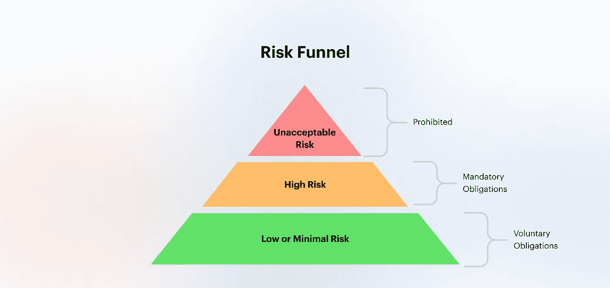
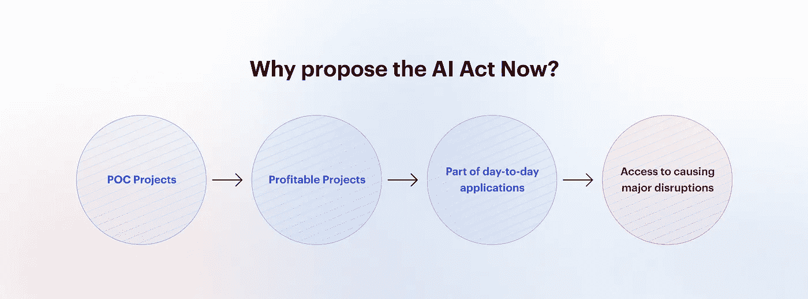
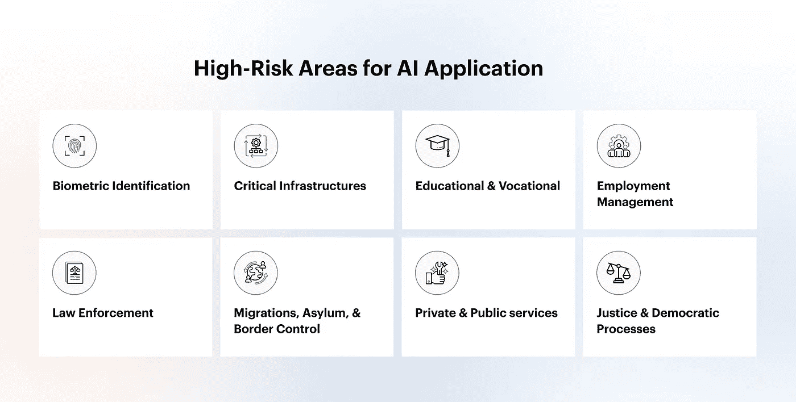
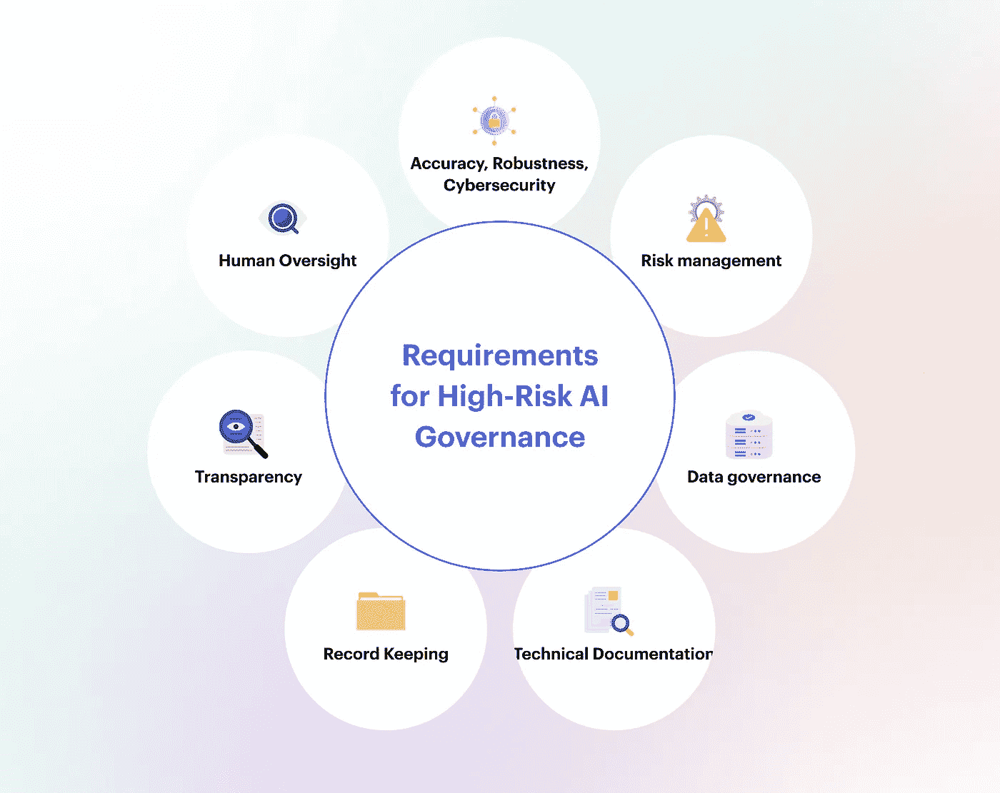

# 应对欧盟人工智能法案

> 原文：<https://towardsdatascience.com/dealing-with-the-eu-artificial-intelligence-act-40e7059c8210>

## 风险类别、要求、修订和最佳实践

图片提供: [unsplash](https://unsplash.com/)

在撰写本文时，关于欧盟人工智能(AI)法案的讨论很少，除了附件之外，很少有具体的来源简要介绍该法案的主要观点。

《人工智能法案》尚未得到认可，它是一个革命性的里程碑，将人工智能带入了主流技术。受到政府当局的监控必然会使人工智能更加强大、可靠和标准化。尽管建立符合法案标准的基础可能具有挑战性，但下一步除了大规模可伸缩性之外别无选择。

本文摘录了 AI 法案的主要亮点，并向读者简要介绍了 AI 的**风险类别、高风险 AI 的禁令和要求，以及避免不遵守拟议法律的后果的最佳实践**。这本书非常适合决策者或团队领导，他们可以在各自的组织中塑造和重定向人工智能基础设施和人工智能实践的过程。

# 什么是欧盟人工智能法案

《欧盟人工智能法案》是由一个主要监管机构提出的首创性提案。《大赦国际法》是在 2021 年 4 月提出的，尚未成熟成为通过的法案。

尽管这是第一个主要命题，但当中国和巴西分别于 2021 年 11 月和 9 月通过其人工智能法规时，它失去了作为第一个具体人工智能法律的地位。

立法者对人工智能的兴趣证明了人工智能不仅在慢慢超越日常技术，也证明了政府开始将其作为主流和可观察的技术使用的兴趣。

人工智能法案通过将人工智能分为三个明确的类别来建立其基础:

AI 法案规定的 AI 风险类别|图片由 [censius.ai](http://censius.ai) 提供

## **不可接受的风险**

对最终用户的福祉或隐私构成严重威胁的应用程序，如某些政府使用的社交评分应用程序，将被禁止。

## **高风险**

根据法案中的定义，高风险应用范围很广。我们将在本文后面讨论更多的细节。简而言之，高风险应用程序是那些干预平民活动的应用程序，如简历扫描工具。这些申请受到该法规定的严格法律和禁令的约束。

## **低风险或最小风险**

低风险或最小风险应用程序是那些不会对最终用户的隐私、安全或健康造成任何威胁的应用程序。比如推荐风景滤镜的娱乐类 app。建议当局鼓励和促进行为准则，以促进对低风险人工智能系统自愿适用这些要求。

在本文中，我们将深入探讨构成人工智能法案症结的高风险应用程序。

# 为什么是现在？

人工智能在学术领域已经存在了几十年，在主流企业或公司应用程序中也存在了大约五年。那为什么政府当局现在想到要管制它呢？

经过多年的概念验证项目和跨行业测试，人工智能已经表明，它有足够的能力和利润成为日常应用中的一项深入吸收的技术。因此，我们现在在主要应用中看到人工智能，有时尽管没有意识到它的存在也在使用它。例如，当我们浏览视频或电子市场时，人工智能就在发挥作用。当我们在谷歌文档或任何流行的文档平台上简单地写一句话时，人工智能甚至会提示我们。它推荐书，推荐要买的东西，甚至推荐吃什么食物。

为什么现在提出 AI 法案？|图片由 [censius.ai](http://censius.ai)

随着人工智能逐渐开始帮助平民的决策活动，政府当局感到有必要规范人工智能的影响，以避免建筑商的错误判断或故意恶意造成的任何重大伤害。

近年来发现的人工智能的力量可以显著提高政府的能力，这也不足为奇。这是为什么人工智能需要被密切监控和监管的另一个重要原因，以便政府和执法机构也可以利用它，而不会扰乱基本人权的安宁。因此，人工智能法案成为理解和实现如何在保护最终用户权利的同时构建各种易受风险影响的人工智能应用的桥梁。

AI 法案的直接摘录，列出了为什么现在需要 AI 法案:

*   确保投放到联盟市场和使用的人工智能系统是安全的，并尊重关于基本权利和联盟价值观的现有法律；
*   确保法律确定性，以促进人工智能领域的投资和创新；
*   加强对适用于人工智能系统的基本权利和安全要求的现有法律的治理和有效执行；
*   促进合法、安全和值得信赖的人工智能应用的单一市场的发展，防止市场分裂。

# 为什么按照 AI 法案开始建造是必要的？

是的，人工智能法案仍然是一个命题，它肯定需要一段时间才能作为一个独立的法案通过。拖延既有政治原因，也有技术原因。

政治倾向于不同立法者之间的争论。然而，立法者意识到了这一延迟，并希望在 11 月举行最终投票以通过该法律，并弥补失去的时间，即使这意味着损害一项完全证明的法律。

延迟背后也有技术原因，因为人工智能法案相当雄心勃勃，旨在提供一个解决方案来监管各种各样的人工智能应用。目前版本的拟议法律有一些漏洞，一些机构和组织正在发送他们的建议，以便对最终版本进行明智的修改。

> “……目标是建立一个有利于创新、经得起未来考验并能抵御干扰的法律框架”。

然而，尽管欧盟人工智能法案似乎还有几个月的时间，但中国和巴西等其他监管机构已经通过了有关人工智能的法律。因此，要参与全球市场，关键是要开始理解和执行管理机构建议的最低义务。

# 你在构建高风险的 AI 吗？

《人工智能法案》非常明确地阐述了高风险应用程序的定义。然而，即使这个定义也不是完全包罗万象的，因为人工智能是一个非常活跃的领域，每隔一天都会带来新的创新和技术。以下是法案中定义高风险应用的一些直接摘录。

如果满足以下条件，AI 被视为高风险:

(a)人工智能系统旨在用作产品的安全部件，或者本身就是一种产品，由附录 II 中所列的欧盟协调立法涵盖

*   简单来说，这意味着任何影响系统安全组件的人工智能产品，或者本身就是一个完整的产品，都将被视为高风险
*   ***产品或系统的安全组件*** 是指产品或系统的一个组件，该组件实现该产品或系统的安全功能，或其故障或失灵危及人身或财产的健康和安全
*   作为快速参考，可以在[附件文件](https://artificialintelligenceact.eu/annexes/)的第 2 页找到欧盟协调立法清单

**“(b)其安全组件为人工智能系统的产品，或人工智能系统本身作为一种产品，需要进行第三方符合性评估，以便根据附录 II 中所列的欧盟协调立法将该产品投放市场或投入使用。”**

*   " ***投放市场*** 是指第一个在欧盟市场上提供的人工智能系统；"
*   *投入使用是指将人工智能系统直接提供给用户首次使用或在欧盟市场上供自己使用以达到其预期目的*
*   ****符合性评估*** 是指验证高风险人工智能系统的要求是否得到满足的过程；*

*除了上面提到的高风险人工智能系统，在[附件三](https://artificialintelligenceact.eu/annexes/)(第 4 页)中提到的区域运行的人工智能系统也应被视为高风险。附件三中提到的领域概述如下:*

**

*附件三中提到的地区|图片由 [censius.ai](http://censius.ai) 提供*

*   *自然人的生物识别和分类*
*   *关键基础设施的安全组件*
*   *教育和职业培训，包括准入、分配或评估*
*   *就业、工人管理和自营职业*
*   *获得和享受基本的私人服务和公共服务及福利*
*   *法律的实施*
*   *移民、庇护和边境控制管理*
*   *司法和民主进程*

*如果人工智能系统对健康和安全造成危害的风险，或对基本权利造成不利影响的风险，即就其严重性和发生概率而言，等于或大于高风险人工智能系统造成的危害或不利影响的风险，则可通过增加高风险人工智能系统来更新上述标准。*

# *高风险人工智能系统的要求*

*对于高风险的人工智能应用，有特定的要求，如果遵循这些要求，可以确保供应商和最终用户的最大安全。通过确保遵循这些要求，开发人员也可以确保规模，因为基础隐含地变得强大和可靠。*

*下面是对高风险系统的全部要求的一个总结或几个要点，如提议的 AI 法案所述。*

**

*高风险 AI 系统需求|图片由 [censius.ai](http://censius.ai)*

## *风险管理系统*

*   *应建立、实施、记录和维护与高风险人工智能系统相关的风险管理系统(RMS)。*
*   *RMS 应包含一个连续的迭代过程，要求定期系统更新。*
*   *应**识别&分析**已知和可预见的风险，**估计&评估**常规使用或误用可能出现的风险，基于**上市后监控**系统收集的数据分析评估其他可能出现的风险，**采取适当的风险管理**措施*
*   *识别风险后，需要**消除&控制措施和信息发布**措施，并且必须是风险管理系统计划的一部分*
*   *"**测试**应针对初步**定义的度量和概率阈值**进行，这些度量和概率阈值适用于高风险人工智能系统的预期目的。"*
*   *阅读直接摘录[此处](https://eur-lex.europa.eu/legal-content/EN/TXT/HTML/?uri=CELEX:52021PC0206&from=EN#:~:text=Article%209-,Risk%20management%20system,-1.)*

## *数据和数据治理*

*   *保持高质量的培训、测试和验证数据，使其没有**抽样误差、偏差或数据缺口***
*   *高风险系统的提供商可以处理特殊类别的个人数据，这些数据对于**确保与高风险人工智能系统**相关的偏差监控、检测和纠正是绝对必要的*
*   *应适用适当的**数据治理和管理实践***
*   *点击阅读直接摘录*

## *技术资料*

*   *在系统投放市场或投入使用之前，必须编制详细的技术文件**，并保持更新。***
*   *技术文件必须证明高风险人工智能系统符合高风险人工智能系统的要求*
*   *阅读直接摘录[此处](https://eur-lex.europa.eu/legal-content/EN/TXT/HTML/?uri=CELEX:52021PC0206&from=EN#:~:text=Article%2011-,Technical%20documentation,-1.)*

## *记录保存*

*   *系统必须自动记录**事件(‘日志’)***
*   *测井能力应符合公认的标准或通用规范。*
*   *记录功能应使**能够监控**高风险人工智能系统的运行，以防止可能导致人工智能系统出现风险的情况发生*
*   *阅读直接摘录[此处](https://eur-lex.europa.eu/legal-content/EN/TXT/HTML/?uri=CELEX:52021PC0206&from=EN#:~:text=Article%2012-,Record%2Dkeeping,-1.)*

## *透明度和向用户提供信息*

*   *系统应**使用户能够解释系统的输出**并正确使用*
*   *该系统应附有以适当的数字格式或其他方式使用的说明，包括简明、完整、正确和清晰的信息，这些信息对用户来说是相关的、可访问的和可理解的。*
*   *这些信息应该包括系统的预期**目的、精确度、健壮性、网络安全**以及任何其他可能需要的规格。*
*   *阅读直接摘录[此处](https://eur-lex.europa.eu/legal-content/EN/TXT/HTML/?uri=CELEX:52021PC0206&from=EN#:~:text=Article%2013-,Transparency%20and%20provision%20of%20information%20to%20users,-1.)*

## *人为监督*

*   *要求在人工智能系统使用期间，该系统能够受到自然人的有效监督*
*   *当高风险人工智能系统按照其预期目的使用或在可合理预见的误用条件下使用时，监督者应致力于防止或最大限度地降低健康、安全或基本权利的风险*
*   *监督者应充分了解高风险人工智能系统的能力和局限性，并能够适时**监控其运行，以便尽早发现和解决异常、功能障碍和意外性能的迹象***
*   *系统应该有一种方法或一个按钮，当监管人员认为功能可能有风险时，可以停止功能*
*   *对于特定系统，最终决定不应仅取决于该系统，而必须首先由至少两个自然人核实*
*   *阅读直接摘录[此处](https://eur-lex.europa.eu/legal-content/EN/TXT/HTML/?uri=CELEX:52021PC0206&from=EN#:~:text=Article%2014-,Human%20oversight,-1.)*

## *准确性、稳健性和网络安全*

*   *系统需要**保持准确性或标准度量的一致性**,使其永远不会低于合适的阈值*
*   *高风险人工智能系统的稳健性可以通过技术冗余解决方案来实现，这可能包括备份或故障安全计划，如关于不一致或故障的**根本原因分析***
*   *有必要**警惕异常情况**，例如当未经授权的第三方试图访问系统时*
*   *阅读直接摘录[此处](https://eur-lex.europa.eu/legal-content/EN/TXT/HTML/?uri=CELEX:52021PC0206&from=EN#:~:text=Article%2015-,Accuracy%2C%20robustness%20and%20cybersecurity,-1.)*

# *高风险人工智能的禁止事项*

*除了高风险系统必须遵循的要求，法案还列出了高风险系统严禁从事的几点:*

*   *在一个人的意识之外使用潜意识技术，从物质上扭曲一种导致或可能导致身体或心理伤害的行为*
*   *利用特定人群因其年龄、身体或精神残疾而存在的任何弱点，从实质上扭曲该人群中造成或可能造成身体或心理伤害的人的行为*
*   *公共当局或代表公共当局使用人工智能系统对自然人在一定时期内的可信度进行评估或分类*
*   *在公共场所使用“实时”远程生物识别系统进行执法，除非此类使用对于一系列列出的目标是绝对必要的*

*上述例子可能包括伤害少数群体的有偏见的应用程序，推动有影响力的媒体扭曲一个人的行为的营销应用程序，甚至是战略性地放置内容以影响大众行为的社交媒体算法，这些行为会影响重大决策，如下一位政治候选人。*

# *预算造价*

*数据创新中心的一份报告声称，欧盟人工智能法案将在未来五年内花费€**310 亿美元**，并减少人工智能投资近 20%。Meeri Haataja 和 Joanna Bryson 等独立研究人员发表了他们自己的工作，表明成本可能会低得多，因为该法案主要覆盖了一小部分被认为是高风险的人工智能应用。*

*直接从法案中提取的其他估计成本:*

*开发或使用对公民的安全或基本权利构成高风险的人工智能应用程序的企业或公共机构必须遵守特定的要求和义务。*

*   *“**符合这些要求**将意味着到 2025 年，供应一个平均约 170000 欧元€的高风险人工智能系统的成本总计约为 6000 至 7000 欧元€。”*
*   *“对于人工智能用户来说，根据使用情况，在适当的情况下，还会有每年花费在确保**人工监督**上的时间成本。据估计，这些费用每年约为 5000 欧元至 8000 欧元。”*
*   *“**对于高风险人工智能的供应商来说，验证成本**可能会达到另外 3000 至 7500 欧元的€。”*

# *修正和建议*

*如前所述，AI 法案是一个命题，各大组织和机构目前都在参与对最早可以通过的最终版本进行完善修正或建议。来自不同实体的一些重要建议分享如下:*

*   ***欧盟轮值主席国斯洛文尼亚**:改善人工智能操纵的禁令*
*   *未来生命研究所(Future of Life Institute):该法案应该确保人工智能提供商考虑他们的应用对个人和整个社会的影响*
*   ***剑桥**:增加监管的灵活性，允许对高风险系统清单进行修改*
*   ***现在就进入欧洲**:该提案不足以保护生物识别应用(如情感识别)的基本权利*
*   *未来社会:人工智能法案应该确保政府对新的技术趋势保持敏感。*

# *与 AI 法案保持一致的最佳实践*

*以下是一些最佳实践，以确保尽早始终如一地满足法案规定的要求:*

## ***测井***

*记录元数据、事件发生、设备、网络和每一个微小的细节对于确保可以跟踪数据传承以及可以重现或跟踪任何结果都是至关重要的。这也确保了解决方案的高度清晰，任何操作人员都可以轻松管理系统，而不会有太多的复杂性。*

## ***测试***

*测试不仅仅局限于模型和数据验证。测试涵盖整个 ML 堆栈，其中每个端点都需要进行交叉检查，以确保解决方案基础架构和模型输出的完全安全性以及最大功能和健康。*

## ***监控***

*监控是构建可信的人工智能应用的最重要的实践之一。应持续监控模型和数据的重要指标，如性能、质量、漂移和偏差，以便尽早标记和处理任何潜在问题。*

## ***可解释性***

*如果问题没有得到及时解决，那么监控和检测问题只会带来部分好处。强烈建议人工智能解释，因为它揭示了标记问题背后的根本原因，并使人工智能团队能够缩小雷达范围并修复有针对性的干扰。*

## ***资源规划***

*如果不提前规划资源，遵守该法案规定的所有限制和义务可能会非常昂贵。在提交资源计划之前，评估资源成本、构建与购买成本、流程成本和其他几项成本非常重要。*

# *最后一个音符*

*尽管人工智能法案尚未通过，但立法者和各种组织正在积极努力建立一套经得起未来考验的法律，以最终规范和监管人工智能应用。同样的过程以前已经应用于各种其他技术，今天我们将它们作为主流技术使用，最不关心后果，因为有法律保护我们的基本权利和安全。也是时候对人工智能进行监管，以确保越来越多的最终用户免受潜在伤害。*

*开始确保你的人工智能应用程序符合法案中的规定是至关重要的。这样，一旦法律规定成为强制性的，人们就可以避免被切断主流市场的风险。《人工智能法》可能最终会像《GDPR》一样成为一项全球标准。*

*确保您的应用程序遵守法规的最快方法是遵循 MLOps 实践，这从本质上使整个 ML 堆栈更具弹性、可再现性和可信赖性。请关注此处，了解即将发布的关于 MLOps 实践和工具的详细内容。*

## *顶级参考*

*   *幕正文:[https://artificialintelligenceact.eu/the-act/](https://artificialintelligenceact.eu/the-act/)*
*   *附件:【https://artificialintelligenceact.eu/annexes/ *
*   *[https://www . technology review . com/2022/05/13/1052223/guide-ai-act-Europe/](https://www.technologyreview.com/2022/05/13/1052223/guide-ai-act-europe/)*
*   *[https://artificialintelligenceact.substack.com/archive?sort=new](https://artificialintelligenceact.substack.com/archive?sort=new)*
*   *[https://www . iccl . ie/news/flaws-in-ex-post-enforcement-in-the-ai-act/](https://www.iccl.ie/news/flaws-in-ex-post-enforcement-in-the-ai-act/)*

## ***取得联系！***

*如果你想了解更多关于 MLOps 和可靠 AI 框架的知识，请参考我们的[资源(博客、电子书、白皮书](https://censius.ai/blogs))。有关可行的入门步骤，[请联系我们](https://censius.ai/get-started)以获得在您的组织中实施 MLOps 的指导计划。欢迎[向我们索取一个关于增强人工智能解决方案可信度的监控和可解释性的演示](http://censius.ai/get-started)。*