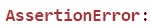
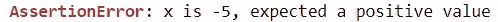

# 使用 Assert 语句在 Python 中调试很容易

> 原文：<https://towardsdatascience.com/debugging-in-python-is-easy-with-with-assert-statements-ff333bfb3388>

## 了解一种能够带来无痛苦故障排除体验的工具


马特·阿特兹在 [Unsplash](https://unsplash.com?utm_source=medium&utm_medium=referral) 上拍摄的照片

你是否厌倦了不断与讨厌的虫子打交道？即使使用流行的 ide 提供的调试功能，最小的错误也可能花费宝贵的时间来排除故障。

如果我告诉你，通过在运行程序时主动执行健全性检查，你可以更好地处理错误，那会怎么样？

幸运的是，Python 提供了 assert 语句，使用户能够做到这一点。

在这里，我们提供了 Python 的 assert 语句的概述，并解释了为什么它是 Python 脚本的资产。

## 断言语句

assert 语句遵循以下逻辑:

> 如果<expression>为假，则抛出 AssertionError</expression>

换句话说，assert 语句是一行程序，如果不满足特定的条件，它就会引发错误。

您可以将这些语句视为“安全卫士”，在允许任何后续操作之前对您的程序进行搜身。

## 句法

assert 语句遵循以下语法:

```
assert <expression>
assert <expression>, <error message>
```

举个例子，假设我们有一个变量，它必须是一个正数，这样后续的操作才能成功。我们可以使用 assert 语句在程序中进行健全性检查。



代码输出(由作者创建)

在这种情况下，由于变量为负，将引发 AssertionError。

用户还可以选择添加他们自己的自定义错误信息，这些信息将在引发 AssertionError 时显示。



代码输出(由作者创建)

这是一个有用的特性，尤其是当一个脚本将要包含多个 assert 语句时。该消息将使用户更深入地了解问题的原因。

## 利益

虽然 assert 语句不是程序中的强制包含项，但它非常有用。

仅仅这个简单的一行程序就可以改善您的编码体验。

用户可以使用 assert 语句主动执行健全性检查，以确保满足必要的条件，而不是采取被动的方法来调试程序。

如果条件不满足，程序将会产生一个错误，这将使用户能够立即发现问题并解决它。

## 现实生活中的例子

到目前为止，assert 语句的应用可能看起来很抽象，因此有必要提供一些例子来说明如何将它集成到数据科学项目中。

我参加了一门课程，这门课程将机器学习问题作为考试的一部分。要求是将模型的预测作为 CSV 文件提交，然后进行评分。

不幸的是，我的 CSV 文件的尺寸不正确，所以我第一次提交时得到了 0 分(幸运的是我被允许提交 5 次)。

我之所以犯这个错误，是因为我没有主动检查文件的尺寸是否符合要求，但是我能够通过在脚本的末尾添加一个 assert 语句来执行检查，以确保生成的 CSV 文件与提供的示例 CSV 文件具有相同的尺寸，从而纠正这个错误。

通过简单的一行程序，我能够避免意外提交维度错误的文件。这是我在机器学习黑客马拉松中经常用到的一行代码。

从那以后，我养成了使用 assert 语句在程序的某些部分执行健全性检查的习惯，以确保满足特定的条件。总的来说，这个习惯极大地改善了我的调试体验。

以下是可以使用 assert 语句执行的其他一些健全性检查示例:

*   检查变量是否具有正确的数据类型
*   检查一个数字是否在某个范围内
*   检查输入矩阵是否具有神经网络的正确维数
*   检查列表、集合或字典是否有特定的元素

## 常见错误

此时，有必要指出在执行健全性检查时会犯的两个常见错误。

**1。使用非调试工具进行调试。**

人们可能会犯使用 if 语句和 try/except 子句来执行健全性检查的错误。不幸的是，这些工具不是用来调试的。为此目的使用这样的工具是低效的，并且不可避免地会导致更长的代码行，这会妨碍可读性。

希望本文为使用 assert 语句来实现这一目的提供了有力的证据。

**2。将断言语句用于非调试目的**

断言语句是用来调试的，应该只有使用*来调试。对于像错误处理这样的应用程序，最好依靠 try/except 子句。*

## 结论


照片由 [Unsplash](https://unsplash.com?utm_source=medium&utm_medium=referral) 上的 [Prateek Katyal](https://unsplash.com/@prateekkatyal?utm_source=medium&utm_medium=referral) 拍摄

如果我继续将 assert 语句类比为安全卫士，我会说，在 Python 脚本中包含 assert 语句就像在程序的任何给定点设置安全检查点，以确保所有活动部分都按预期运行。

这是一个一行程序，使用户能够主动执行健全性检查，从而省去他们被动排除错误的麻烦。

我祝你在数据科学的努力中好运！