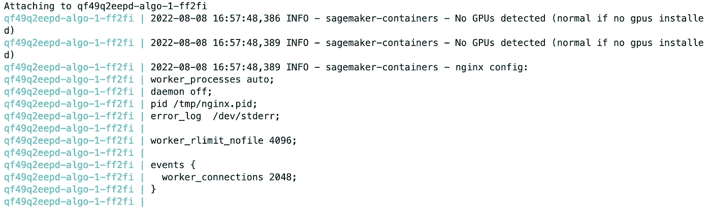
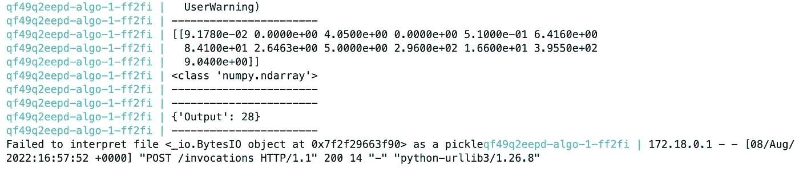
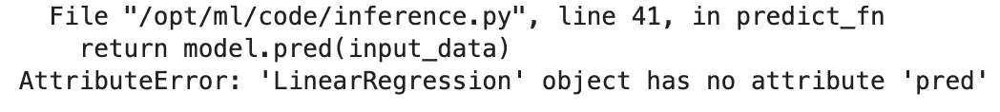

# 使用本地模式快速调试 SageMaker 端点

> 原文：<https://towardsdatascience.com/debugging-sagemaker-endpoints-quickly-with-local-mode-2975bd55f6f7>

## 停止等待您的端点创建

图片来自[本·怀特](https://unsplash.com/@benwhitephotography)的 [Unsplash](https://unsplash.com/photos/9emAQvCJQ4c)

对于经常使用 [SageMaker 推论](https://docs.aws.amazon.com/sagemaker/latest/dg/deploy-model.html)的用户来说，一个常见的挫折是能够快速调试端点。通常使用 [SageMaker 端点](https://docs.aws.amazon.com/sagemaker/latest/dg/realtime-endpoints.html)时，您最终会得到一个[定制推理脚本](https://aws.plainenglish.io/adding-custom-inference-scripts-to-amazon-sagemaker-2208c3332510)，帮助您控制模型的预处理和后处理。

最初，当我第一次使用 SageMaker 时，每当我必须对推理脚本进行更改时，我都会重新部署端点。这很费时间，因为我会等 2-3 分钟，而不知道推理是否会成功。 [SageMaker 本地模式](https://sagemaker.readthedocs.io/en/stable/overview.html#local-mode)幸运地通过将 [SageMaker 容器](https://github.com/aws/deep-learning-containers/blob/master/available_images.md)下拉到您的本地环境来帮助我们简化这个过程。在本文中，我们将采用一个简单的 SKLearn 模型，并使用 SageMaker 本地模式部署它，以展示它对于调试您的端点是多么有用。请注意，SageMaker 本地模式也可以用于预处理和训练脚本，本文将只讨论具有该特性的模型服务/推理。

**注意**:对于刚接触 AWS 的人来说，如果你想继续学习，请确保在下面的 [**链接**](https://aws.amazon.com/console/) 中注册账户。本文假设对 AWS 和 SageMaker 相对满意。如果你想获得更多关于 SageMaker 入门的指导，请务必查看我的附加资源部分。

## 设置

在我们开始之前，我们有通常的 SageMaker 导入来准备我们的环境。

这里主要导入的是 [SageMaker Python SDK](https://github.com/aws/sagemaker-python-sdk) ，这是支持本地模式的包。这是一个高级的 SDK，它是对 [Boto3 Python SDK](https://boto3.amazonaws.com/v1/documentation/api/latest/reference/services/sagemaker.html) 的包装，以简化 SageMaker 中的常见流程和操作。要完全理解这两个 SDK 的区别，请参考下面的[文章](/sagemaker-python-sdk-vs-boto3-sdk-45c424e8e250)。

接下来，我们可以创建我们的 Python Sklearn 模型，我们将在本地训练一个[线性回归](https://scikit-learn.org/stable/modules/generated/sklearn.linear_model.LinearRegression.html)模型，并生成一个 model.joblib 文件，其中包含一个样本回归问题的模型工件/数据。

本地模型训练

我们为生成的模型数据提供的另一个脚本是推理脚本。这包含了[推理处理器](https://docs.aws.amazon.com/sagemaker/latest/dg/adapt-inference-container.html)，它将控制端点内模型推理的输入和输出。

推理脚本

SageMaker 希望我们的 model.joblib 和推理脚本中的这两个部分在一个 model.tar.gz 中结合在一起。我们将这些包装在一起，并将其推到一个 [S3 桶](https://aws.amazon.com/s3/)中，供我们的本地模型拾取。

将数据推送到存储桶

现在，我们已经具备了启用本地模式所需的所有要素。

## SageMaker 本地模式服务

首先我们创建一个 [SageMaker 本地会话](https://github.com/aws/sagemaker-python-sdk/blob/master/src/sagemaker/local/local_session.py)，这实际上是告诉 SageMaker 我们正在本地模式下工作。

本地会话

验证本地会话(作者截图)

接下来，我们配置我们的 SKLearn SageMaker 估计器，使其启用本地模式。

启用 Sklearn 服务的本地模式

在这里，我们传入我们的推理脚本，然后传入带有打包模型数据的模型工件的路径。该路径可以是 S3 路径，也可以是本地目录结构中的文件路径。

让我们来看一个示例负载，在这种情况下，我们的模型需要一个 2D 数组，因此我们使用来自测试数据集的示例数据点创建了一个 numpy 数组。

样本有效载荷

接下来，我们可以用局部模式预测器进行样本推断。注意，第一次运行下面的单元时，需要花几分钟的时间，因为需要下载 SKLearn 的容器映像。请注意，我们还将实例类型指定为 local，而不是通常的 EC2 实例。

局部模型推理

接下来我们看到的是在端点创建期间生成 [CloudWatch 日志](https://docs.aws.amazon.com/AmazonCloudWatch/latest/logs/WhatIsCloudWatchLogs.html)时，我们通常必须等待才能看到的内容。我们看到我们的推理服务器启动并运行，我们还看到我们的样本预测。

推理服务器正在启动(作者截图)

我们还可以在推理脚本中看到我们的日志记录语句，然后还可以看到示例负载的输出。

推理日志(作者截图)

让我们快速地用一个错别字打破我们的推理脚本，看看本地模式是否反映了错误。

这里我将我的 predict_fn 函数改为“model.pred ”,而不是 SKLearn 模型所期望的“model.predict”。

打字错误/错误

我重新运行正在创建我的 SKLearn 估计器并使用我更新的脚本执行推理的单元，不久之后我看到了正确的错误反映。

错误(作者截图)

## 其他资源和结论

 [## GitHub-RamVegiraju/sage maker-Local-Mode:SM 本地模式示例 Sklearn 部署

### 此时您不能执行该操作。您已使用另一个标签页或窗口登录。您已在另一个选项卡中注销，或者…

github.com](https://github.com/RamVegiraju/SageMaker-Local-Mode/tree/master) 

您可以在上面的链接中找到整个示例的代码。SageMaker 本地模式是一个非常有用的特性，可以快速调试您的模型训练和推理，正如本文所反映的那样。更多本地模式示例，请查看 [AWS 样本库](https://github.com/aws-samples/amazon-sagemaker-local-mode)。关于 SageMaker 入门的更多资源，请点击这里查看我的系列文章。

*如果你喜欢这篇文章，请在*[*LinkedIn*](https://www.linkedin.com/in/ram-vegiraju-81272b162/)*上与我联系，并订阅我的媒体* [*简讯*](https://ram-vegiraju.medium.com/subscribe) *。如果你是新来的中号，用我的* [*会员推荐*](https://ram-vegiraju.medium.com/membership) *报名吧。*