# 调试 Vaporexpress Profile 浓缩咖啡照片

> 原文：<https://towardsdatascience.com/debugging-vaporexpress-profile-espresso-shots-bfe050dcca0a>

## 咖啡数据科学

## 重命名蒸汽预注入配置文件

几个月前，我能够更准确地指出为什么杠杆式咖啡机(Kim Express)优于像样的浓缩咖啡机，即[蒸汽预浸泡](https://medium.com/nerd-for-tech/steam-pre-infusion-for-espresso-a-summary-1c58c65a937a)。我开始更多地探索这个变量，蒸汽预注入打破了我们通常与浓缩咖啡联系在一起的一些东西，比如压力。我的大部分镜头压力都低于 2 巴，但提取效果很好。所以我想突破界限，进一步发展自己的形象。

经过 40 次迭代，我重新命名了这个概要文件。Vaporexpress 用几个词来描述这个轮廓。Vapore 在意大利语中是蒸汽的意思。这个侧写是基于蒸汽预注入，这是我用金快车发现的。第一个变体将会跑得像涡轮子弹一样快，伴随着普通子弹的研磨，因此在 express 上有额外的意义。目前的化身已经稍微慢了下来。

我查看了一些变量，以便更好地理解概要文件的走向，因为概要文件是新的。没有关于在哪里或如何改进它的其他信息，也没有关于如何解决它的信息。我使用了以下指标:

1.  **用折射仪测量总溶解固体量(TDS)，这个数字结合一杯咖啡的输出重量和输入重量用来确定提取到杯中的咖啡的百分比，称为**提取率(EY)** 。 [**【强度半径(IR)**](/improving-coffee-extraction-metrics-intensity-radius-bb31e266ca2a) 是将 TDS vs EY 控制图转换为极坐标时的半径。**
2.  **[**咖啡渣 TDS (gTDS)**](/grounds-tds-across-the-espresso-puck-1581825ddcac) 的测量方法是将咖啡渣和一些水放在折光仪上，测量咖啡中剩余的可溶物的量。在浓缩咖啡过程中，较高的萃取率导致较低的 gTDS 读数。**

# **数据**

**这是一个很好的样本拍摄。流动到一边，在另一个讨论中，我把它引到了淋浴屏幕。**

**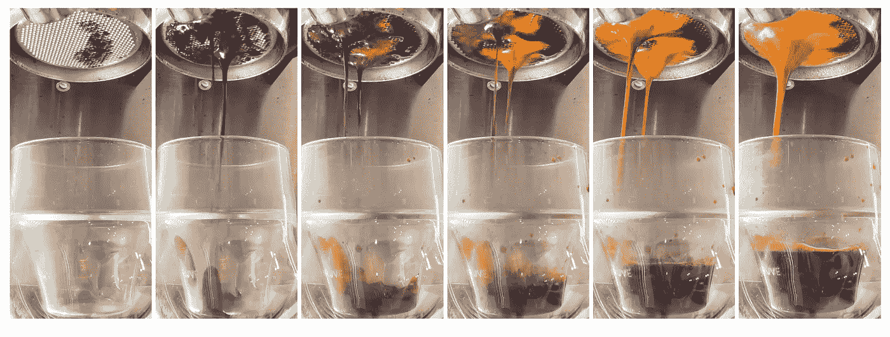**

**所有图片由作者提供**

**在观察这个冰球时，很难看到任何黑点来理解冰球内部的水流。**

**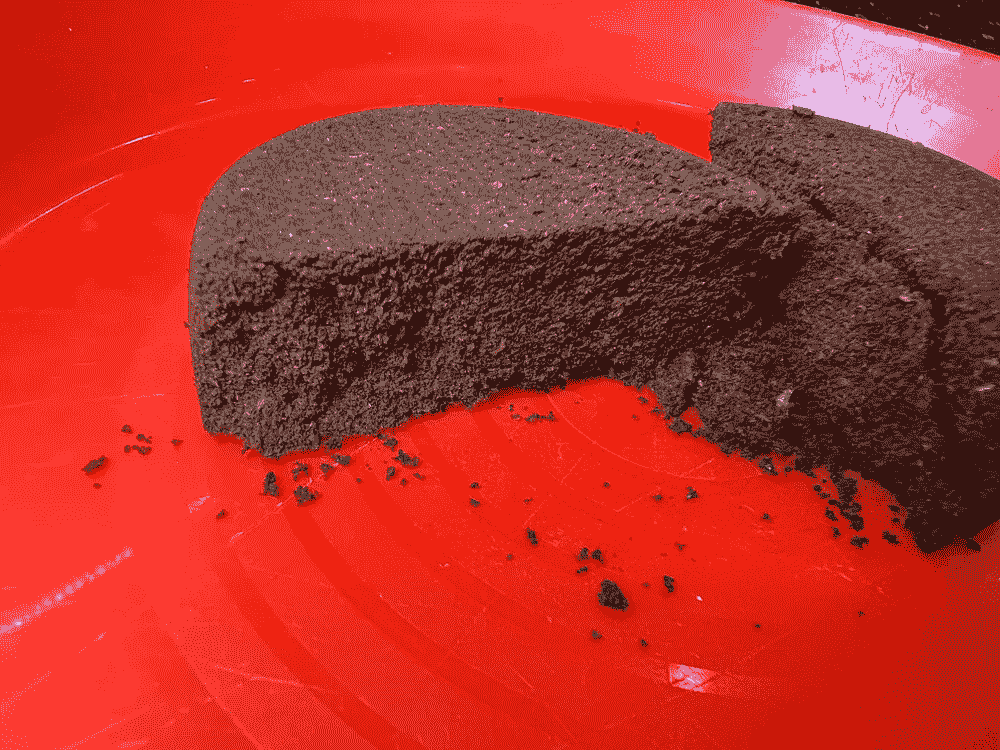****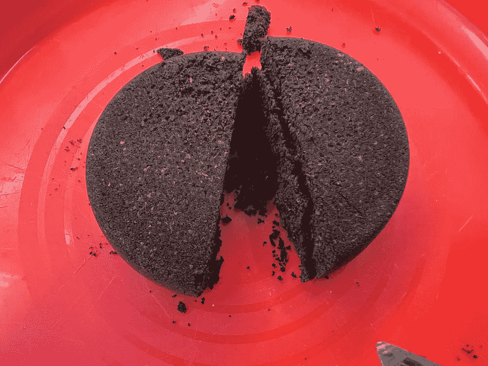**

**所以我看了地面 TDS (gTDS)给出更多的答案。**

**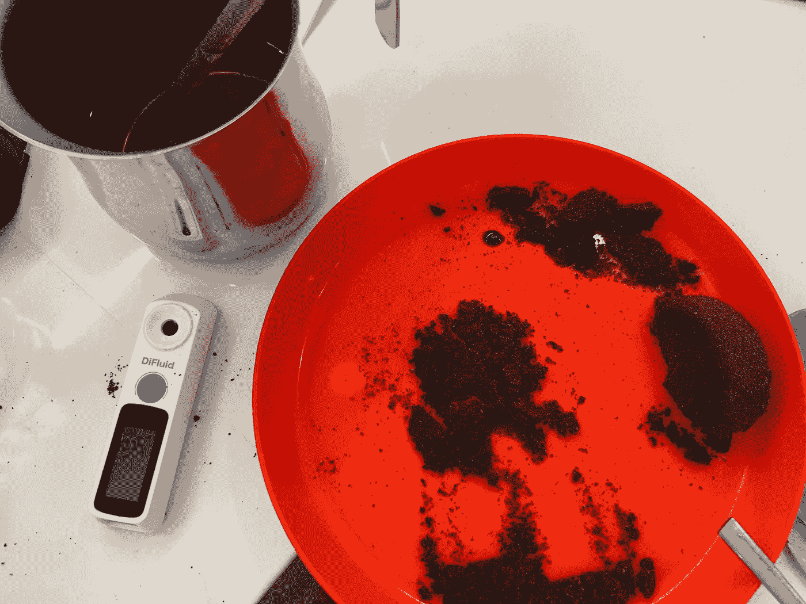**

**在观察这个镜头时，我从冰球的两边和中心各取了一个样本。我在顶部、中部和底部切割每个样品。**

**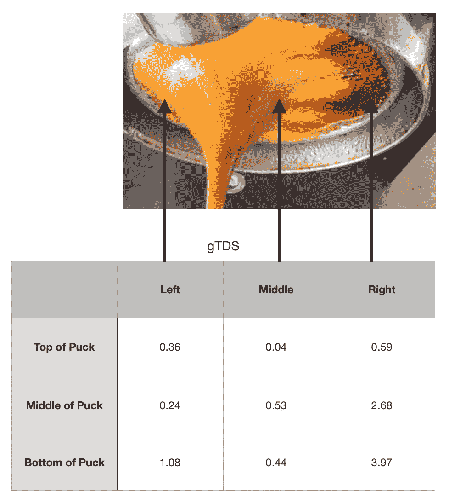**

**右侧有明显数量的未提取的可溶物，但是圆盘的顶部大部分被提取。我在这里用几种方式绘制了它:**

**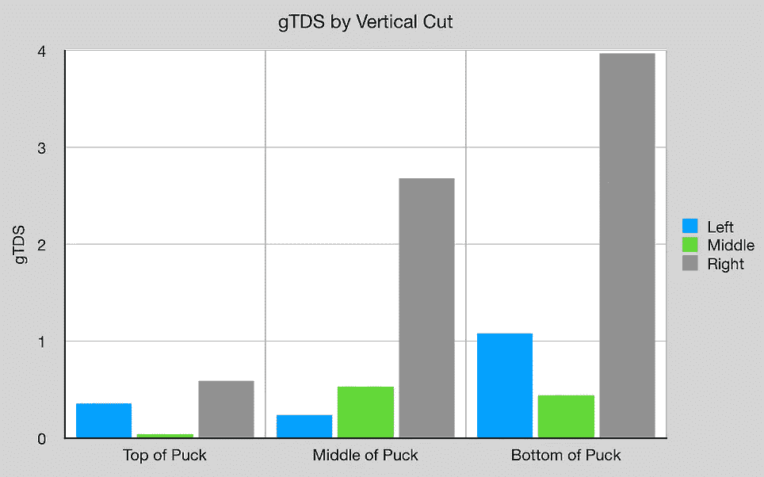****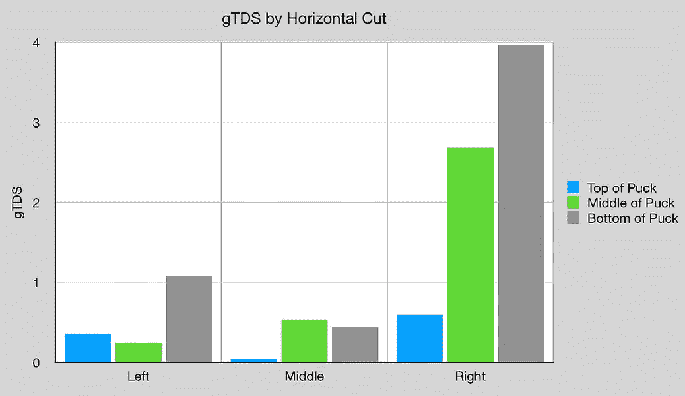**

**我需要更好地了解如何解决这个问题，但我也想更好地了解蒸汽是如何影响咖啡的，因为这对温度有很大的影响。**

# **搬运温度**

**前两步后，我将温度从 105 摄氏度降至 98 摄氏度，但在混合过程中温度仍在上升。在该图中，所有温度值都比所示值高 8C(由于校准偏差)。我怀疑随着新的、更冷的水的加入，水向下流动，但是蒸汽向上冒泡。我不确定还能怎样解释温度的上升。**

**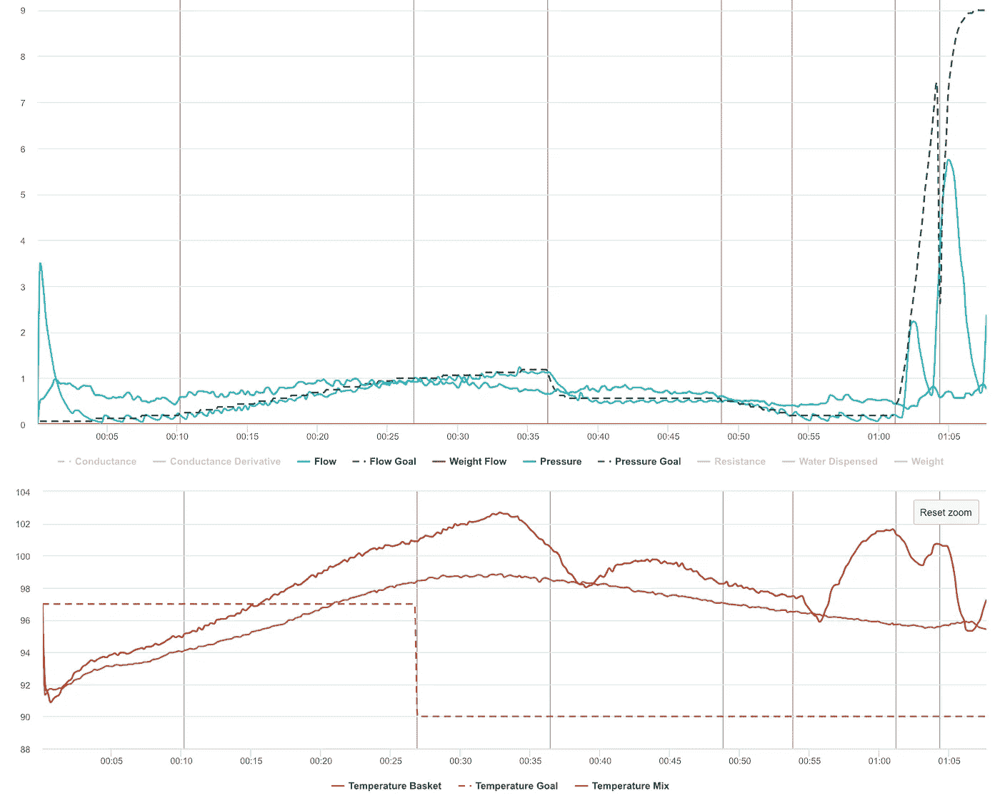**

**冰球内部更奇怪。通常情况下，顶部比中部更突出，中部比底部更突出，但在我的一个镜头中，从中心和侧面测量的 GTD 显示增加。这和上面的镜头不一样。**

**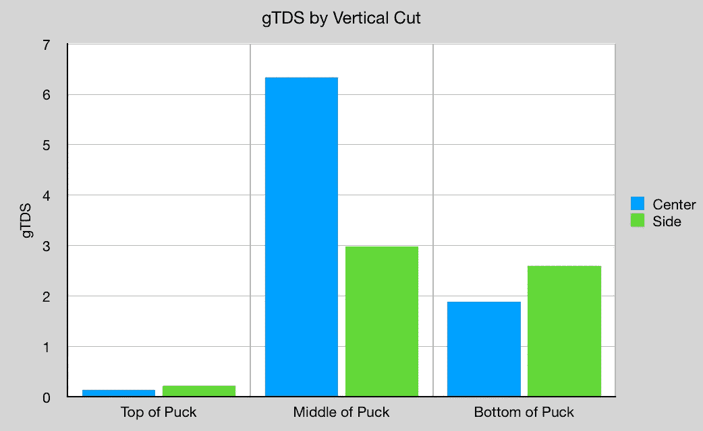**

# **只有蒸汽**

**所以我只看了蒸汽预注入。我在最热的水温下用 0.2 毫升/秒的流量做到了这一点。这就变成了蒸汽，但是这种蒸汽状态会持续多久还不知道。我从 10 秒、20 秒和 30 秒开始。水没有完全通过，当水通过冰球大约一半的时候，主要的通道就开始了。**

**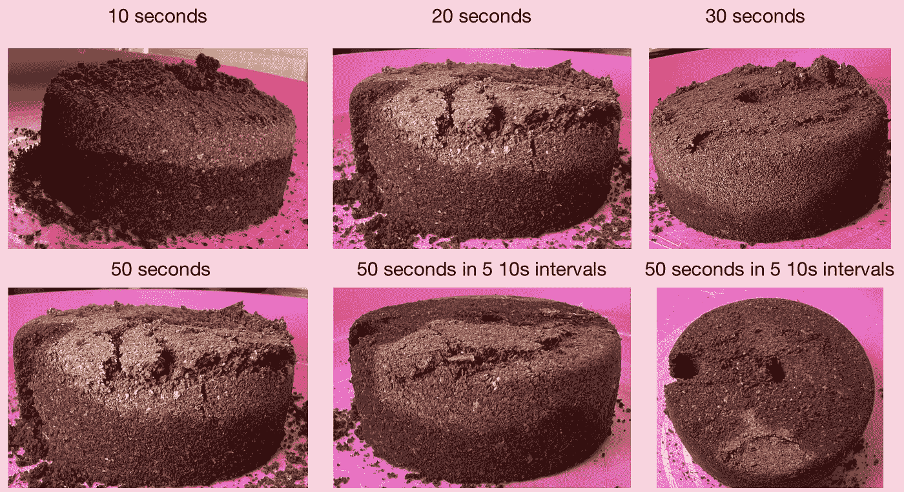**

**在观察中心和侧核时，有趣的是看到侧核总是在顶部提取，并且大部分在中间。中心似乎有很多麻烦。这部分是由于淋浴设计和篮子形状倾向于侧沟。我甚至尝试以 30 秒的速度旋转冰球，试图抵消左右两侧水流的轻微不均匀，但这很难完成，通道似乎已经完成了。**

**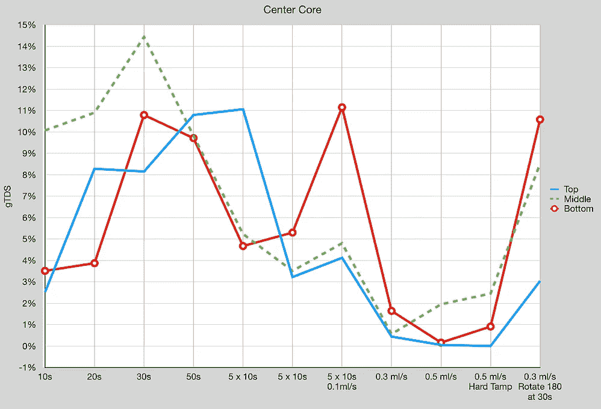****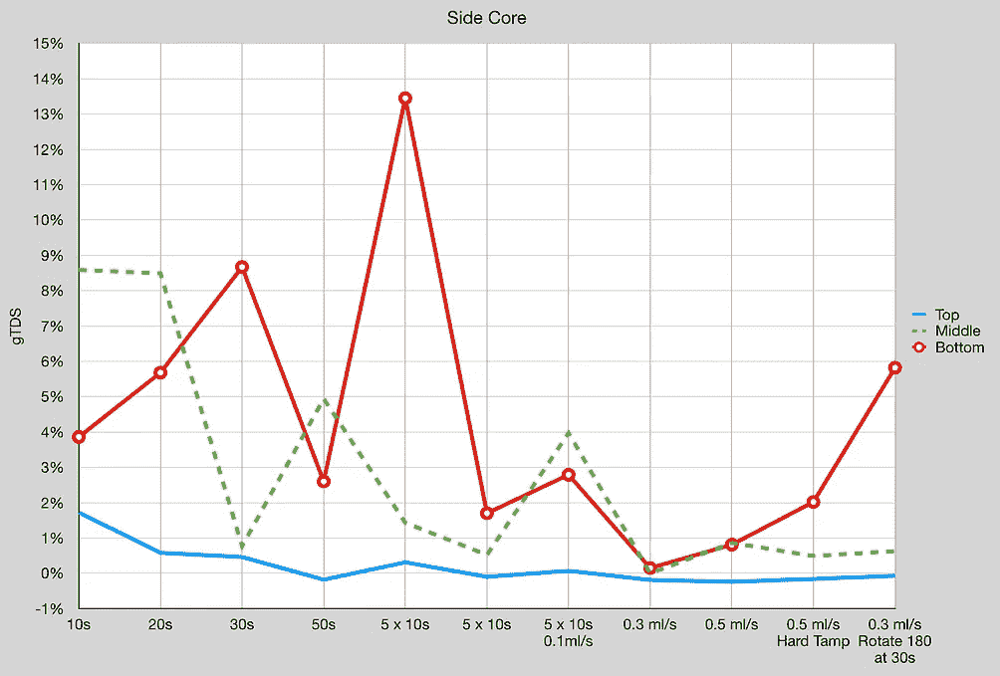**

**就实际拍摄的 TDS/EY/IR 而言，我没有得到一个明确的指示去哪里与配置文件。**

**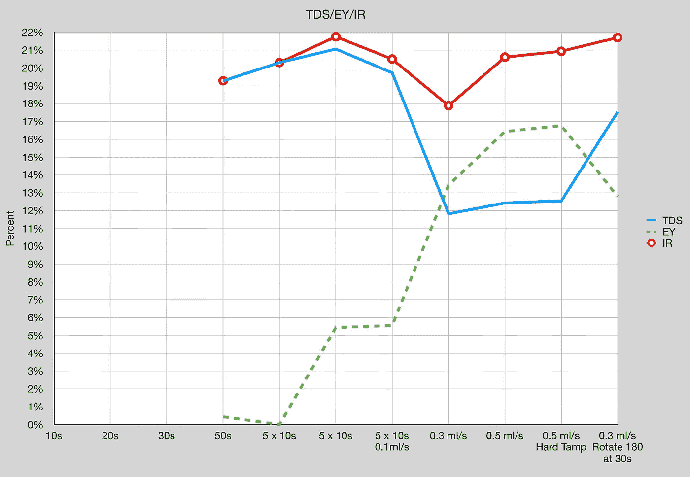**

**我不小心弄明白了是怎么回事。**

# **视频证据**

**我决定在我像样的咖啡机下面黑掉我的 Kompresso。我想找到得到答案的方法。**

**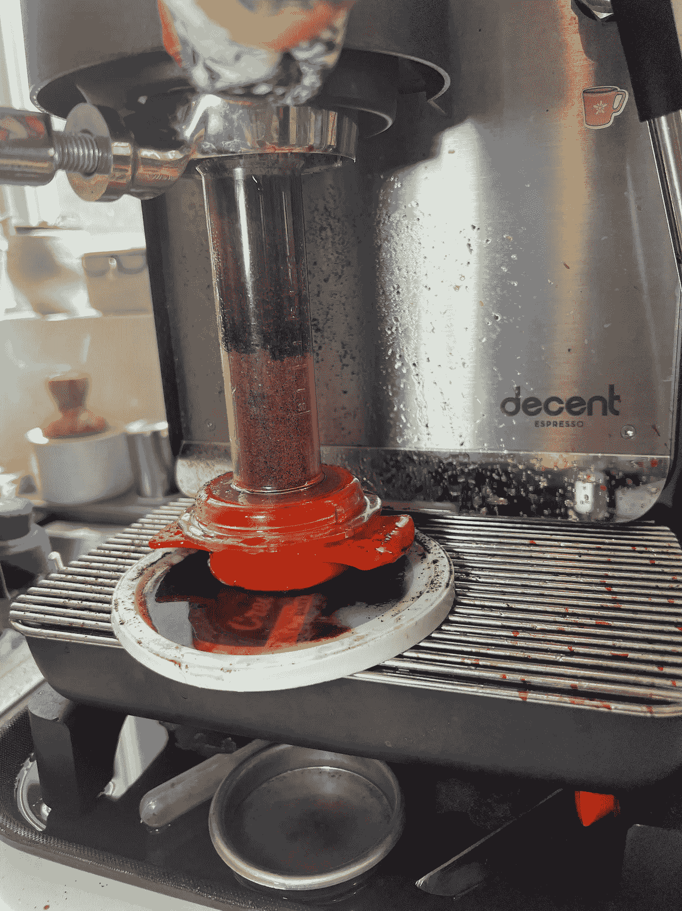**

**第一个视频中的冰球太深，所以水流不畅:**

** [## 在像样的咖啡机上使用 Kompresso，更好地理解蒸汽的轮廓。

### 编辑描述

youtube.com](https://youtube.com/shorts/_qtOc6U5pSA) 

然而，我在第二个视频中使用了纸巾，效果好多了。我能够看到蒸汽预注入很快变成低压预注入。

 [## 较短的圆盘高度显示蒸汽预注入快速转化液体。浓咖啡

### 编辑描述

youtube.com](https://youtube.com/shorts/c_Itz7MeahY) 

由于这个视频和这些调查，我改变了我的个人资料，做蒸汽预输注 2 秒钟，然后缓慢上升。

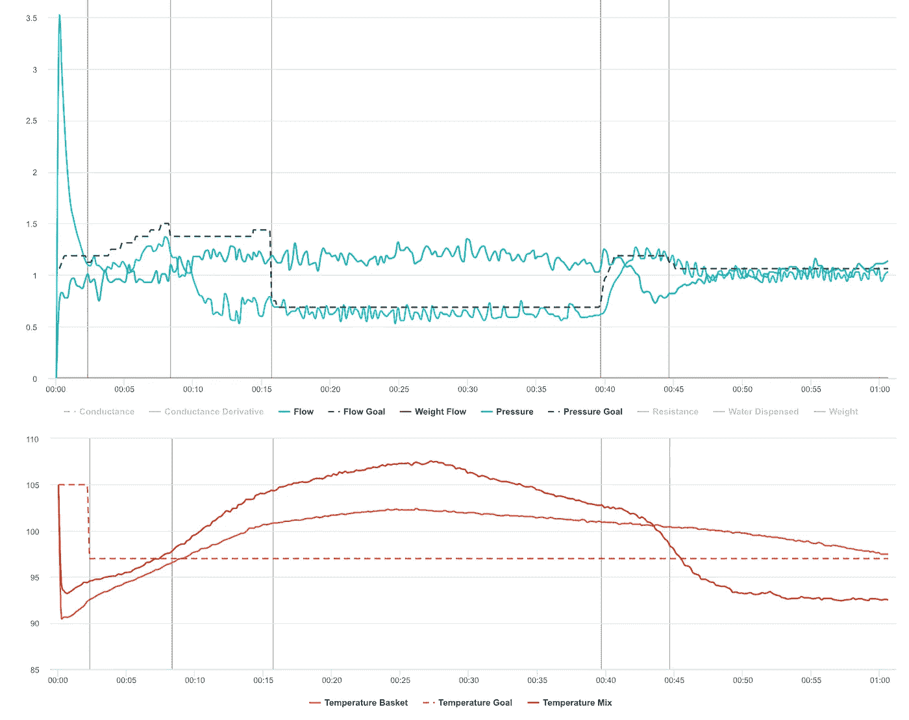

我喜欢这种形象，但这是一个艰难的过程。我知道我会有所成就，但每次我发现失败并深入挖掘，我都会学到更多。

如果你愿意，可以在推特、 [YouTube](https://m.youtube.com/channel/UClgcmAtBMTmVVGANjtntXTw?source=post_page---------------------------) 和 [Instagram](https://www.instagram.com/espressofun/) 上关注我，我会在那里发布不同机器上的浓缩咖啡照片和浓缩咖啡相关的视频。你也可以在 [LinkedIn](https://www.linkedin.com/in/dr-robert-mckeon-aloe-01581595) 上找到我。也可以关注我在[中](https://towardsdatascience.com/@rmckeon/follow)和[订阅](https://rmckeon.medium.com/subscribe)。

# [我的进一步阅读](https://rmckeon.medium.com/story-collection-splash-page-e15025710347):

[我的书](https://www.kickstarter.com/projects/espressofun/engineering-better-espresso-data-driven-coffee)

[我的链接](https://rmckeon.medium.com/my-links-5de9eb69c26b?source=your_stories_page----------------------------------------)

[浓缩咖啡系列文章](https://rmckeon.medium.com/a-collection-of-espresso-articles-de8a3abf9917?postPublishedType=repub)

工作和学校故事集**