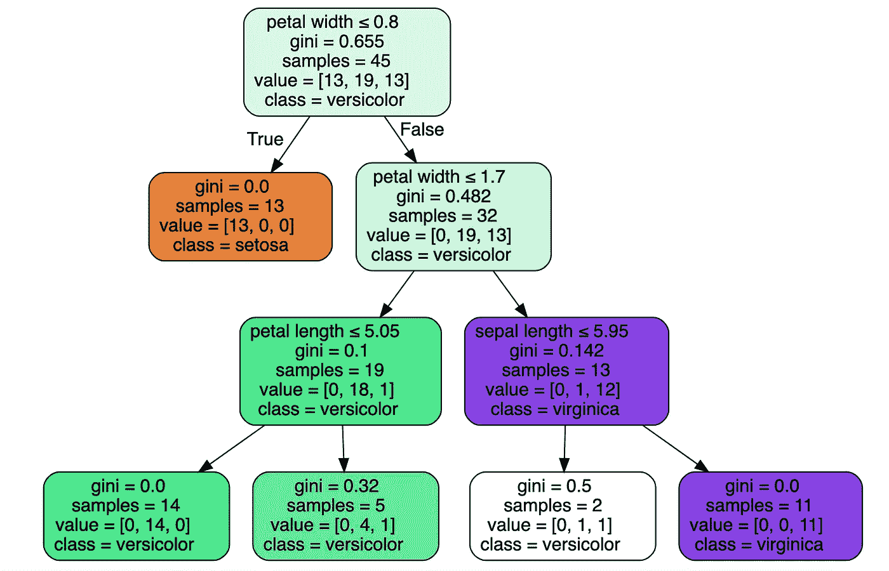
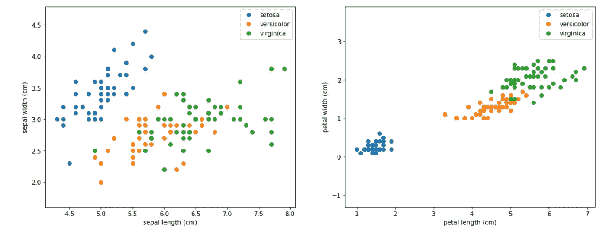
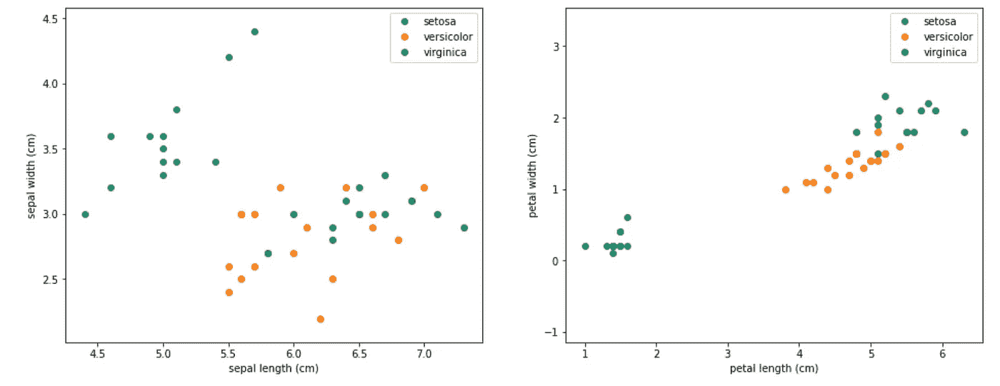
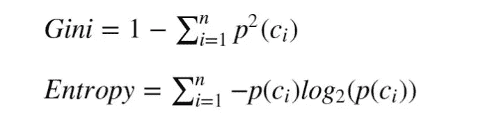
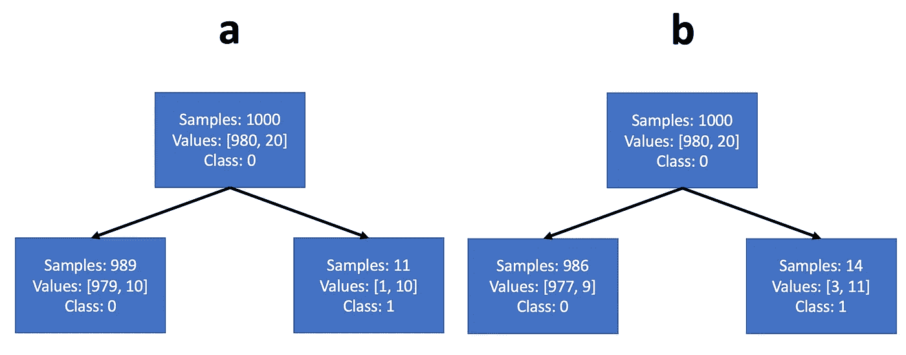

# 决策树，解释

> 原文：<https://towardsdatascience.com/decision-trees-explained-d7678c43a59e>

## 如何训练他们，他们如何工作，与工作代码的例子


津巴布韦的一棵大决策树。图片作者。

在这篇文章中，我们将讨论一种常用的机器学习模型，称为 ***决策树*** 。决策树是许多应用程序的首选，主要是因为它们的高度可解释性，但也因为它们的设置和训练相对简单，以及用决策树进行预测所需的时间较短。决策树对于表格数据来说是很自然的，事实上，在这种类型的数据上(相对于图像)，它们目前似乎优于神经网络。与神经网络不同，树不需要输入标准化，因为它们的训练不是基于梯度下降，并且它们只有很少的参数可以优化。他们甚至可以对有缺失值的数据进行训练，但现在这种做法不太推荐，缺失值通常是估算的。

决策树的众所周知的用例是推荐系统(根据你过去的选择和其他特征，如年龄、性别等，你预测的电影偏好是什么)。)和搜索引擎。

树中的预测过程由样本属性(特征)与预先学习的阈值的一系列比较组成。从顶部(树根)开始向下(朝向树叶，是的，与真实的树相反)，在每一步中，比较的结果确定样本在树中是向左还是向右，并由此确定下一步的比较。当我们的样本到达一个叶子(一个末端节点)时，基于叶子中的多数类做出决策或预测。

图 1 显示了根据花瓣和萼片的长度和宽度将鸢尾属样品分成 3 个不同种类(类)的问题。

我们的示例将基于著名的 Iris 数据集(Fisher，R.A .“分类问题中多重测量的使用”Annual Eugenics，7，Part II，179–188(1936))。我是用 [sklearn](https://scikit-learn.org/stable/faq.html) 包下载的，这是一个 ***BSD*** (Berkley 源码发布)授权软件。我修改了其中一个类的特性，减小了训练集的大小，将这些类混合在一起，让它变得更有趣。



图 1 在 Iris 数据集的修正训练集上训练的决策树。图片作者。

我们稍后会解决这棵树的细节问题。现在，我们将检查根节点，并注意到我们的训练群体有 45 个样本，分为 3 类，如下所示:[13，19，13]。“class”属性告诉我们，如果这个样本是一个叶子，树将为它预测的标签——基于节点中的多数类。例如，如果不允许我们运行任何比较，我们将处于根节点，我们的最佳预测将是类 Veriscolor，因为它在训练集中有 19 个样本，而其他两个类只有 13 个样本。如果我们的比较序列将我们引向左起第二片叶子，模型的预测将再次是 Veriscolor，因为在训练集中有 4 个该类的样本到达这片叶子，而只有 1 个 Virginica 类的样本和 0 个 Setosa 类的样本。

决策树可用于分类或回归问题。让我们从讨论分类问题开始，解释树训练算法是如何工作的。

# 做法:

让我们看看如何使用 sklearn 训练一棵树，然后讨论其机制。

下载数据集:

```
import numpy as np
from sklearn.datasets import load_iris
from sklearn.model_selection import train_test_split
from sklearn.preprocessing import OneHotEncoderiris = load_iris()
X = iris['data']
y = iris['target']
names = iris['target_names']
feature_names = iris['feature_names']# One hot encoding
enc = OneHotEncoder()
Y = enc.fit_transform(y[:, np.newaxis]).toarray()# Modifying the dataset
X[y==1,2] = X[y==1,2] + 0.3# Split the data set into training and testing
X_train, X_test, Y_train, Y_test = train_test_split(
    X, Y, test_size=0.5, random_state=2)# Decreasing the train set to make things more interesting
X_train = X_train[30:,:]
Y_train = Y_train[30:,:]
```

让我们将数据集可视化。

```
# Visualize the data sets
import matplotlib
import matplotlib.pyplot as pltplt.figure(figsize=(16, 6))
plt.subplot(1, 2, 1)
for target, target_name in enumerate(names):
    X_plot = X[y == target]
    plt.plot(X_plot[:, 0], X_plot[:, 1], linestyle='none', marker='o', label=target_name)
plt.xlabel(feature_names[0])
plt.ylabel(feature_names[1])
plt.axis('equal')
plt.legend();plt.subplot(1, 2, 2)
for target, target_name in enumerate(names):
    X_plot = X[y == target]
    plt.plot(X_plot[:, 2], X_plot[:, 3], linestyle='none', marker='o', label=target_name)
plt.xlabel(feature_names[2])
plt.ylabel(feature_names[3])
plt.axis('equal')
plt.legend();
```



图 2 改进的 Iris 数据集的可视化。图片作者。

仅仅是火车组:

```
plt.figure(figsize=(16, 6))
plt.subplot(1, 2, 1)
for target, target_name in enumerate(names):
    X_plot = X_train[Y_train[:,target] == 1]
    plt.plot(X_plot[:, 0], X_plot[:, 1], linestyle='none', marker='o', label=target_name)
plt.xlabel(feature_names[0])
plt.ylabel(feature_names[1])
plt.axis('equal')
plt.legend();plt.subplot(1, 2, 2)
for target, target_name in enumerate(names):
    X_plot = X_train[Y_train[:,target] == 1]
    plt.plot(X_plot[:, 2], X_plot[:, 3], linestyle='none', marker='o', label=target_name)
plt.xlabel(feature_names[2])
plt.ylabel(feature_names[3])
plt.axis('equal')
plt.legend();
```



图 3——只有(缩小的)列车组。图片作者。

现在，我们准备训练一棵树，并将其可视化。结果就是我们在图 1 中看到的模型

```
from sklearn import tree
import graphviziristree = tree.DecisionTreeClassifier(max_depth=3, criterion='gini', random_state=0)
iristree.fit(X_train, enc.inverse_transform(Y_train))feature_names = ['sepal length', 'sepal width', 'petal length', 'petal width']dot_data = tree.export_graphviz(iristree, out_file=None, 
                      feature_names=feature_names,  
                      class_names=names,
                      filled=True, rounded=True,  
                      special_characters=True)  
graph = graphviz.Source(dot_data)display(graph)
```

我们可以看到，该树使用花瓣宽度进行第一次和第二次分割——第一次分割清楚地将类 Setosa 与其他两个类分开。请注意，对于第一次分裂，花瓣长度可以同样好地工作。

让我们看看这个模型在训练集上的分类精度，然后是测试集:

```
from sklearn.metrics import precision_score
from sklearn.metrics import recall_scoreiristrainpred = iristree.predict(X_train)
iristestpred = iristree.predict(X_test)# train precision:
display(precision_score(enc.inverse_transform(Y_train), iristrainpred.reshape(-1,1), average='micro', labels=[0]))
display(precision_score(enc.inverse_transform(Y_train), iristrainpred.reshape(-1,1), average='micro', labels=[1]))
display(precision_score(enc.inverse_transform(Y_train), iristrainpred.reshape(-1,1), average='micro', labels=[2]))>>> 1.0
>>> 0.9047619047619048
>>> 1.0# test precision:
display(precision_score(enc.inverse_transform(Y_test), iristestpred.reshape(-1,1), average='micro', labels=[0]))
display(precision_score(enc.inverse_transform(Y_test), iristestpred.reshape(-1,1), average='micro', labels=[1]))
display(precision_score(enc.inverse_transform(Y_test), iristestpred.reshape(-1,1), average='micro', labels=[2]))>>> 1.0
>>> 0.7586206896551724
>>> 0.9473684210526315
```

正如我们所看到的，训练集中数据的稀缺以及类 1 和类 2 混合的事实(因为我们修改了数据集)导致测试集中这些类的精度较低。0 类保持完美的精度，因为它与其他两类高度分离。

# 现在谈谈理论——树是如何训练的？

换句话说，它如何选择最佳的特征和阈值放入每个节点？

## 基尼杂质

如同在其他机器学习模型中一样，决策树训练机制试图最小化由训练集上的预测误差引起的一些损失。**基尼杂质指数**(源自意大利统计学家 ***科拉多基尼*** )是分类准确度的自然衡量标准。



图 4-树木的两个常见训练目标:基尼系数和熵。P(ci)是从总体中随机选取一个 ci 类样本的概率。n 是类的数量。

高基尼系数对应的是异质人口(每个阶层的样本量相似)，而低基尼系数表示同质人口(即主要由单一阶层组成)

最大可能的基尼值取决于类别的数量:在 C 个类别的分类问题中，最大可能的基尼值是 1–1/C(当类别均匀分布时)。最低基尼系数为 0，当整个人口由一个阶层组成时，基尼系数达到 0。

**基尼系数是随机分类时错误分类的期望值。**

为什么？

因为从 ci 类中随机选取一个样本的概率是 ***p(ci)*** 。挑了那个，预测错类的概率是 ***(1-p(ci))*** 。如果我们对所有类别的***p(ci)*(1-p(ci))***求和，我们得到图 4 中的基尼系数公式。

以基尼指数为目标，该树在每一步中选择特征和阈值，以最大限度地降低两个结果人口的加权平均基尼系数(或最大限度地增加其加权平均同质性)的方式分割人口。换句话说，训练逻辑是最小化两个结果群体中随机分类错误的概率，将更多的权重放在较大的子群体上。

是的——该机制会检查所有样本值，并根据标准将其拆分，以检查所得的基尼系数。

根据这个定义，我们还可以理解为什么阈值总是在至少一个训练样本上找到的实际值——使用样本之间的间隙值没有好处，因为得到的分割是相同的。

另一个常用于树训练的度量是 ***熵*** (见图 4 中的公式)。

## 熵

基尼策略的目标是最小化下一步的随机分类误差，而熵最小化策略的目标是最大化 ***信息增益*** 。

## 信息增益

在缺乏关于一个群体如何被分成 10 类的先验知识的情况下，我们假设在它们之间平均分配。在这种情况下，我们需要平均 3.3 个是/否问题来确定样本的分类(您是 1-5 级吗？如果不是，你是 6-8 班的吗？等等。).这意味着总体的熵是 3.3 比特。

但是现在让我们假设我们做了一些事情(比如一个聪明的分裂)给了我们关于人口分布的信息，现在我们知道 50%的样本在 1 类，25%在 2 类，25%在 3 类。在这种情况下，总体的熵将是 1.5——我们只需要 1.5 比特来描述随机样本。(第一个问题——你是一班的吗？这个序列有 50%的时间会在这里结束。第二个问题——你是二班的吗？并且不需要更多的问题—所以平均 50%*1 + 50%*2 = 1.5 个问题)。我们得到的信息值 1.8 比特。

像基尼一样，最小化熵也与创建更同质的人口相关，因为同质人口具有更低的熵(单个阶层人口的极端熵为 0——无需问任何是/否问题)。

## 基尼还是熵？

大多数消息来源声称，这两种策略之间的差异并不显著(事实上，如果你试图在我们刚刚解决的问题上训练一棵熵树，你会得到完全相同的分裂)。很容易看出为什么:当基尼系数最大化一类概率的期望值时，熵最大化对数类概率的期望值。但是对数概率是概率的单调递增函数，所以它们的操作通常非常相似。然而，当人口高度不平衡时，**熵最小化可能选择不同于基尼系数的配置**。例如，我们可以考虑一个包含 1000 个训练样本的数据集，其中 980 个属于 0 类，20 个属于 1 类。假设该树可以根据图 5 中的示例 ***a*** 或示例 ***b*** 选择一个阈值对其进行分割。我们注意到，这两个示例都创建了一个主要由多数类组成的人口众多的节点，以及一个主要由少数类组成的人口较少的第二节点。

在这种情况下，对数函数在小值处的陡度将比基尼准则更强烈地激励熵准则来净化具有大群体的节点。如果我们算一下，我们会发现基尼系数会选择分裂 ***a*** ，熵系数会选择分裂 ***b*** 。

这可能导致特征/阈值的不同选择。不一定更好或更坏——这取决于我们的目标。



图 5 高度不平衡数据的两种可能分裂。图片作者。

请注意，即使在初始群体平衡的问题中，分类树的较低节点通常也会具有高度不平衡的群体。

# 培训结束

当树中的路径达到指定的深度值时，或者当它包含零基尼/熵群体时，它停止训练。当所有路径停止训练时，树就准备好了。

通常的做法是限制树的深度。另一个是限制一个叶子中的样本数量(不允许样本少于阈值)。这两种做法都是为了防止列车组过度装配。

# 回归树

既然我们已经研究出了训练分类树的细节，那么理解回归树就非常简单了:回归问题中的标签是连续的而不是离散的(例如，给定药物剂量的有效性，以%的情况来衡量)。在这类问题上训练，回归树也分类，但是标签是作为每个节点中样本的平均值动态计算的。这里，通常使用 ***均方误差*** 或 ***卡方度量*** 作为最小化的目标，而不是基尼和熵。

# 结论

在这篇文章中，我们了解到决策树基本上是比较序列，可以训练来执行分类和回归任务。我们运行 python 脚本来训练决策树分类器，使用我们的分类器来预测几个数据样本的类别，并计算训练集和测试集上预测的精度和召回指标。我们还学习了决策树训练背后的数学机制，其目的是在每次比较后最小化一些预测误差度量(基尼、熵、mse)。我希望你喜欢读这篇文章，在我的其他文章中再见！