# 决策树解释—熵、信息增益、基尼系数、CCP 剪枝

> 原文：<https://towardsdatascience.com/decision-trees-explained-entropy-information-gain-gini-index-ccp-pruning-4d78070db36c>

尽管决策树看起来简单而直观，但算法如何决定分裂以及如何修剪树却一点也不简单。在这篇文章中，我将带你通过一个简单的例子来理解决策树的内部工作原理。

来自 Scikit Learn 的 Iris 决策树(图片来源: [sklearn](https://scikit-learn.org/stable/modules/tree.html) )

决策树是一种流行的和令人惊讶的有效技术，特别是对于分类问题。但是，看似直观的界面隐藏着复杂性。选择变量和层次的标准可能很难得到，更不用说基尼指数，熵(等等，那不是物理学吗？)和信息增益(那不是信息论吗？).如你所见，有很多棘手的问题会让你陷入困境。理解决策树的最好方法是通过一个小例子，这个小例子足够复杂，能够展示一些共同点，人们突然会说，“不知道这里发生了什么…？”。

因此，这篇文章更像是一个教程或演示，我将通过我创建的玩具数据集来理解以下内容:

1.什么是决策树:根节点、子节点、终端/叶节点

2.分割标准:熵、信息增益与基尼系数

3.子节点如何分割

4.为什么树木过度生长，如何阻止这种现象

5.如何使用决策树进行预测

那么，让我们开始演示吧…

**1。** **决策树是做什么的？**

让我们从核心问题真正开始。例如，我们试图根据各种预测变量(如空腹血糖、身体质量指数、血压等)对患者是否患有糖尿病进行分类。这显然是一个新患者的预测问题。我们也有 1000 份病历来帮助我们了解哪些特征在预测中最有用。与逻辑回归等其他分类算法不同，决策树在运行和识别哪些变量是重要的方面有所不同。

在决策树中要理解的第一件事是，它们将预测器空间，即目标变量分割成不同的子组，从目标变量的角度来看，这些子组相对更同质。例如，如果目标变量是二进制的，类别为 1 和 0(在下图中用绿色和红色的点表示),那么决策树会将目标变量空间划分为多个子组，这些子组在具有 1 或 0 方面更加同质。

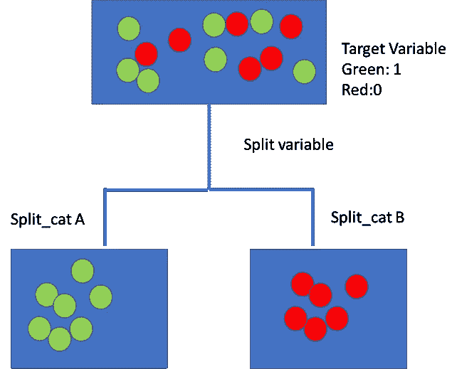

目标变量拆分过程(图片来源:作者)

这是总体概念。让我们从理解决策树的各种元素开始。

**理解决策树的组成部分**

决策树是一个分支流程图或树形图。它由以下组件组成:

。目标变量如糖尿病与否及其初始分布。

*   根节点:这是通过查找最能拆分目标变量的变量来开始拆分过程的节点
*   节点纯度:决策节点通常是不纯的，或者是两类目标变量的混合(图像中的 0，1 或绿色和红色点)。纯节点是那些只有一个类的节点，因此称为纯节点。它们要么只有图像中的绿点，要么只有红点。
*   决策节点:这些是后续或中间节点，其中目标变量再次被其他变量进一步分割
*   叶节点或终端节点是纯节点，因此用于进行数值或类别的预测。

让我们直观地看看这个..

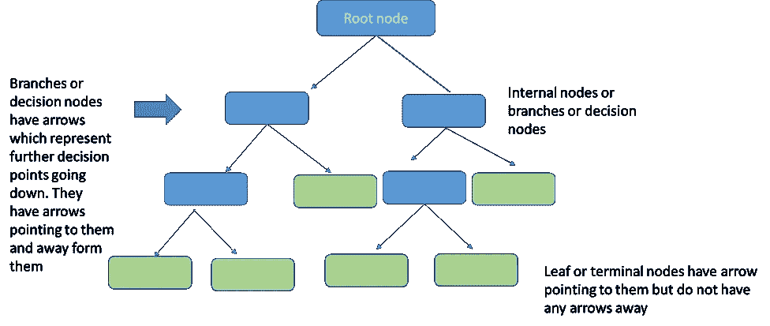

决策树的结构(图片来源:我的收藏)

一般来说，决策树采用一个陈述或假设或条件，然后决定该条件是否成立。条件沿分支显示，应用于目标变量的条件结果显示在节点上。

远离节点的箭头表示应用于该节点的条件。指向某个节点的箭头表示满足某个条件。

这是决策树的第一层——理解将决策空间分割成更小空间的流程，这些空间最终在目标变量中变得越来越同质。这最终导致了一个预测。

决策树提供了极大的灵活性，因为我们可以使用数字和分类变量来分割目标数据。类别数据在变量中被分成不同的类。数字有点复杂，因为我们必须为被测试的条件分割成阈值，例如<18 and ≥18, for example. A numeric variable can appear multiple times in the data with different cut offs or thresholds. Also final classifications can be repeated.

The important things from data science perspective are:

1\. Flow of information through the Decision Tree

2\. How does Decision Trees select which variable to split on at decision nodes?

3\. How does it decide that the tree has enough branches and that it should stop splitting?

Now let us look at a simplified toy example to understand the above process more concretely.

***首先是问题:***

我们有学生数据的 15 个数据点的数据，关于在线 ML 考试的通过或失败。为了理解基本过程，我们从一个数据集开始，该数据集包括一个二元(通过/失败)目标变量和各种二元或分类预测变量，例如:

*   是否注册了其他在线课程
*   学生是否来自数学、计算机科学或其他背景
*   不管工作还是不工作

数据集如下所示:

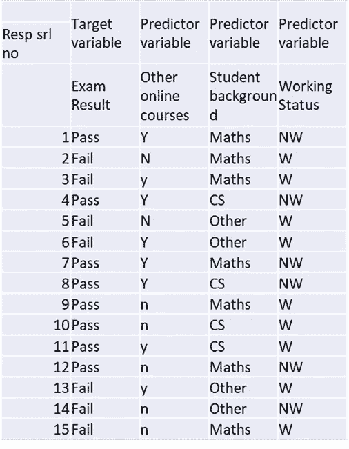

在线 ML 考试的玩具数据集(来源:作者)

请注意，只有一个变量，“学生背景”有两个以上的级别或类别——数学、计算机科学、其他。这是决策树与其他分类模型(如逻辑回归或 SVM)相比的优势之一，我们不需要进行一次热编码来将它们变成虚拟变量。

让我们首先看看决策树是如何工作的，然后我们将深入研究决策实际上是如何做出的…

**决策树流程**

决策树从目标变量开始。这通常称为父节点。然后，决策树根据对该目标变量的影响的层次顺序进行一系列拆分。从分析的角度来看，第一个节点是**根节点**，这是拆分目标变量的第一个变量。

为了识别根节点，我们将评估我们当前拥有的所有变量对目标变量的影响，以识别将考试通过/失败类分成最同质组的变量。我们拆分这个的候选人是:背景，工作状态，其他在线课程。

我们希望通过这种拆分达到什么目的？假设我们从工作状态作为根节点开始。这分为两个子节点，分别用于工作和不工作。因此，在每个子节点中分别更新通过/失败状态。

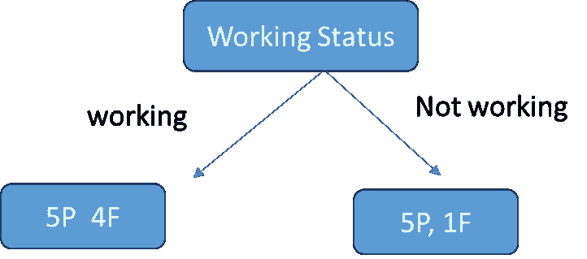

示例决策树流程(图片来源:作者创建

这是决策树的基本流程。只要在一个子节点中存在通过和失败的混合，就有进一步分裂的余地，以试图使它成为唯一的一个类别。这被称为节点的纯度。例如，不工作具有 5 个通过和 1 个失败，因此它比具有 5P 和 4F 的工作节点更纯。叶节点将是仅包含通过或失败类的节点。

不纯的节点可以进一步分支以提高纯度。然而，大多数时候我们不一定要深入到每一片叶子都是“纯净”的地步。了解每个节点都是独立的也很重要，因此最好地分割“工作”节点的属性可能不是最好地分割“不工作”节点的属性。

现在，让我们继续学习决策树的核心部分——关键问题:

**这棵树如何决定在每一层分出哪个变量？**

***贪婪的自上而下的做法***

决策树遵循一种自上而下的贪婪方法，这种方法被称为递归二进制分裂。递归二进制分裂方法是自上而下的，因为它从树的顶部开始，然后它连续分裂预测器空间。在每次分割时，预测器空间被分成两部分，并通过两个指向下方的新分支显示。该算法被称为贪婪算法，因为在该过程的每一步中，该步骤都进行了最佳分割。它不会向前投射并尝试选择对整个树来说更好的分割。

因此，该算法根据一些统计标准评估所有变量，然后选择根据该标准表现最佳的变量。

***变量选择标准***

这就是决策的真正复杂性和复杂性所在。变量是根据应用于每个决策节点的复杂统计标准选择的。现在，决策树中的变量选择标准可以通过两种方法来实现:

1.熵和信息增益

2.基尼指数

这两个标准大体相似，并且试图确定哪个变量将拆分数据以导致底层子节点最同质或最纯粹。两者都用在不同的决策树算法中。更令人困惑的是，不清楚哪一种是首选方法。因此，人们必须对两者都有所了解。

让我们从熵和信息增益准则开始

***什么是熵？***

熵是一个来自物理学的术语，意思是无序的度量。更具体地说，我们可以将其定义为:

> **熵**是一个科学概念，也是一个可测量的物理属性，通常与无序、随机或不确定状态相关联。这个术语和概念被用于不同的领域，从第一次被认识的经典热力学到统计物理学的微观描述，以及信息论的原理。

[https://en.wikipedia.org/wiki/Entropy](https://en.wikipedia.org/wiki/Entropy)

> 在[信息论](https://en.wikipedia.org/wiki/Information_theory)中，[随机变量](https://en.wikipedia.org/wiki/Random_variable)的**熵**是该变量可能结果固有的“信息”、“惊喜”或“不确定性”的平均水平。

[https://en . Wikipedia . org/wiki/Entropy _(information _ theory)](https://en.wikipedia.org/wiki/Entropy_(information_theory))

在决策树的上下文中，熵是节点中无序或不纯的度量。因此，具有更多可变组成的节点，例如 2 个通过和 2 个失败，将被认为比仅通过或仅失败的节点具有更高的熵。熵或无序的最大水平由 1 给出，最小熵由值 0 给出。

所有实例都属于 1 类的叶节点的熵为 0。然而，类被平均划分的节点的熵将是 1。

熵的度量公式如下:

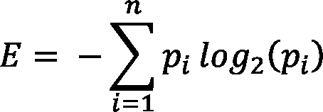

其中 pi 是随机选择类别 I 中的一个示例的概率。让我们在示例的上下文中更好地理解这一点。因此，父节点的初始熵由通过与失败的概率给出。在我们的数据集中，目标变量有 9 次通过，6 次失败。因此，熵公式的概率为:

现在本质上，决策树确定根节点的工作是计算每个变量的熵和它的潜在分裂。为此，我们必须计算每个变量的潜在分裂，计算两个或所有节点的平均熵，然后计算相对于父节点的熵变化。这种熵的变化被称为信息增益，代表一个特征为目标变量提供了多少信息。

Entropy_parent 是父节点的熵，Entropy_children 表示跟随该变量的子节点的平均熵。在当前情况下，因为我们有 3 个变量，必须从分割的角度进行计算。

1.就业状况

2.在线课程状态

3.学生背景

为了计算熵，首先让我们将熵和信息增益的公式放在数据集中的变量上:

1.  每个节点通过和失败的概率，即 Pi:

2.熵:

3.子节点的平均熵:

请注意，平均熵是父节点拆分成的所有子节点的加权平均值。因此，在我们的示例中，工作状态有 2 个子节点，学生背景有 3 个子节点。

4.信息增益:

***父节点计算***

首先，我们将使用上面的公式计算父节点熵。使用任何在线 log2 计算器计算对数值。在我们的案例中，他们计算出:

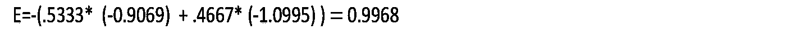

(数学注释:任何小于 1 的以 2 为底的对数都是负数，因此我们乘以一个负号得到一个正数)

到目前为止，这只是父节点的熵。现在我们必须决定使用哪个属性或变量来分割它以获得根节点。

***计算根节点***

为此，我们必须计算每个变量的潜在分裂，计算两个节点的平均熵，然后通过父节点计算熵的变化。

让我们从工作状态变量开始，计算分裂的熵。

然后，我们计算工作状态分裂的平均熵，作为来自落在每个子节点中的观察总数的观察份额的加权平均值。

信息增益=熵 _ 父—熵 _ 子=

0.9183–0.8119 = .1858

(计算显示在下面的电子表格中)

以类似的方式，我们可以评估学生背景和在线课程变量的熵和信息增益。结果如下表所示:

我们将暂时放弃这个变量，然后继续评估其他变量。下面的电子表格显示了所有变量的熵计算:

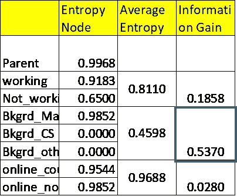

根节点熵计算(来源:作者)

为了找到根节点属性，我们查看来自学生背景的相对于初始父熵的信息增益。这表明最大降幅为 0.5370。因此，这是将被选为根节点的属性。另一个变量——“工作状态”和“在线课程”显示，相对于父节点，熵的减少要小得多。

因此，根据上面的计算，我们已经确定了根节点是什么。该树现在看起来如下所示:

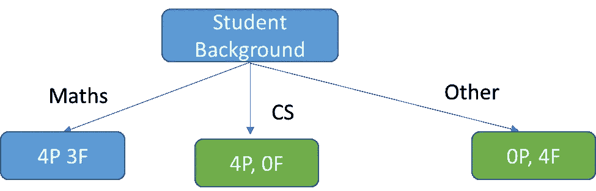

决策树的根节点

学生背景将目标变量分为 3 组。来自 CS 背景的每个人都清楚地通过，因此这是终端或叶节点。其他背景的人都失败了，这也是一个终端节点。数学背景分为 3 次通过和 4 次未通过，因此是不纯的，还有进一步分离以达到更高纯度的空间。

现在，为了分割数学背景子节点，我们需要计算剩余变量的熵和信息增益，即工作状态和在线课程。然后，我们将选择显示最高信息增益的变量。

数学背景节点的熵和信息增益计算可以在下表中看到。注意，我们现在有数学背景作为被分裂的节点，因此分裂的平均熵是以它为基础计算的。

注意:输入 log(0)会抛出一个错误。然而数学上我们可以使用极限。通常我们只是在计算中不包括 pj=0 的情况。然而，我已经包括只是为了显示完整的计算。

> 按照惯例 **0 log 0 = 0** ，由于 y log y → 0 为 y → 0。

[https://www.icg.isy.liu.se/courses/infotheory/lect1.pdf](https://www.icg.isy.liu.se/courses/infotheory/lect1.pdf)

每个潜在分裂的熵是:

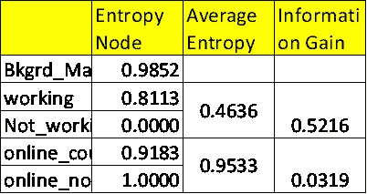

拆分数学子节点(图片来源:作者)

我们可以看到，工作状态变量的信息增益更高。因此，这是用于继续分支的变量。

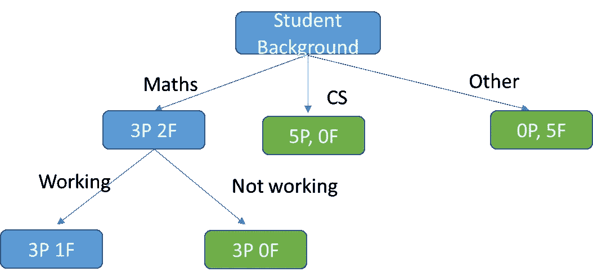

数学节点分支

我们现在看到数学节点已经分裂成右边的一个终端节点和一个仍然不纯的节点。注意，现在几乎所有的节点都是终端节点。只有一个节点不是终端。我们可以尝试使用其他在线课程进一步拆分。总之，你明白了。在任何情况下，大多数决策树不一定分裂到每个节点都是终端节点的点。大多数算法都内置了止损点，我们将在后面讨论。此外，如果决策树继续分裂，我们还有另一个问题，即过度拟合。在我们简要回顾了使用基尼指数开发决策树的另一种方法之后，我们将在下面再次讨论这一点。

**基尼指数**

另一种分割决策树的方法是通过基尼指数。熵和信息增益方法关注节点中的纯度和杂质。基尼指数或杂质衡量随机选择时随机实例被错误分类的概率。基尼指数越低，分类错误的可能性就越低。

基尼指数公式

其中 j 代表目标变量中的类的数量——在我们的例子中是通过和失败

P(i)表示通过/节点中观察总数的比率。

那么，让我们从上面的决策树中取一个例子。让我们从根节点开始，计算每个分裂的基尼指数。基尼系数的最小值(最高纯度)为 0。它的最大值为 0.5。如果基尼系数是 0 . 5，它表明阶级的随机分配。

现在让我们计算学生背景属性的根节点的基尼指数。在这种情况下，我们有 3 个节点。基尼公式要求我们计算每个子节点的基尼指数。然后进行加权平均，计算出该节点的总体基尼指数。

数学子节点:4 通过，3 失败

CS 子节点:4 通过，0 失败

其他子节点:0 通过，4 失败

如我们所见，CS 节点中错误分类的概率为零，因为每个人都通过了。同样，在其他节点上没有错误分类的余地，因为每个人都会失败。只有数学节点有可能被错误分类，这是相当高的，因为最大基尼系数是 0.5。

这种分割的总体基尼系数的计算类似于熵，即 3 个节点分布的加权平均值。

同样，我们也可以计算工作状态和在线课程的基尼指数。这些内容如下:

工作/不工作

在线课程

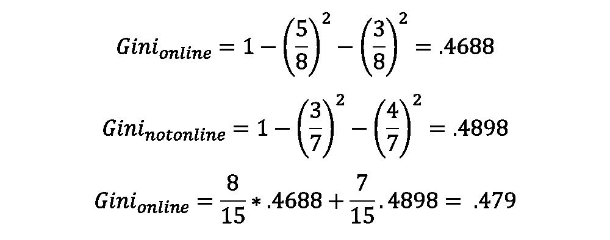

学生背景变量的基尼指数最低。因此，类似于熵和信息增益标准，我们选择这个变量作为根节点。以类似的方式，我们将再次沿着树向下移动，在节点纯度较低的地方执行拆分

**基尼指数与信息增益**

根据使用的杂质测量，树分类结果可能会有所不同。这可能对您的模型产生很小(有时很大)的影响。不同的决策树算法似乎没有一个首选的方法。比如 CART 用基尼；ID3 和 C4.5 使用熵。

基尼指数的最大杂质为 0.5，最大纯度为 0，而熵的最大杂质为 1，最大纯度为 0。

**如何在决策树中做出预测**

既然我们已经了解了，希望是详细了解了，决策树是如何进行分裂和变量选择的，我们可以继续研究它们是如何进行预测的。实际上，一旦一棵树经过训练和测试，预测就很容易了。该树基本上提供了一个基于各种预测变量的流程图。假设我们有一个新的实例和它的不同预测变量的值一起进入流程。与定型和测试数据不同，它没有目标属性的类。我们试图通过沿着树向下移动来预测这个类，在不同的分支测试不同预测变量的值。最终，新实例将移动到叶节点中，并根据叶节点中的主要类进行分类。

假设它看起来像下面的配置:

基于我们的树，我们将首先检查数学分支，然后工作是分支。如我们所见，这是一个叶节点，新的观察结果将基于该节点中的多数投票进行分类，即，因为它是通过，所以该新的观察结果也将被预测为通过。

在实践中，当算法评估新的示例并到达叶节点时，预测基于叶节点中类别的模态值。从上面的例子可以看出，工作节点并不是完全纯的。然而，我们继续预测模态值，这是通过。通常，大多数叶节点不是纯的，因此对于分类预测，我们使用模态值进行预测。如果是数值预测(回归树)，我们预测每个叶节点的目标值的平均值。

**过度拟合和决策树**

过度适应对决策树来说是一个很大的挑战。甚至在我们的玩具例子中，我们可以看到算法继续分裂，直到它到达一个叶节点。通常叶节点可能只有一个或两个实例。这显然会导致一个复杂的树形结构，可能无法很好地概括测试场景。这是因为每个叶子将表示在训练数据中看到的一组非常具体的属性组合，并且树将无法对在训练数据中没有看到的属性组合进行分类。有几种方法可以防止决策树变得过于笨拙:有三种避免过度拟合的方法:

1.  预修剪或提前停止:防止树长得太大或太深
2.  后期修剪:让一棵树长到最大，然后根据不同的标准去掉不同的树枝

3.集合或使用多个模型的平均值，如随机森林

在这里，我们将只简要概述预修剪和后修剪技术。像随机森林这样的集合技术需要更多的解释，因此将在另一篇文章中讨论。

**修剪**

*预修剪*

预修剪技术指的是提前停止决策树的生长。预修剪技术包括在训练流水线之前调整决策树模型的超参数。SkLearn 中决策树分类器的超参数包括`**max_depth**`、`**min_samples_leaf**`、`**min_samples_split**` ，可以对这些超参数进行调优，以提前停止树的生长，防止模型过拟合。最好的方法是使用 GridSearchCV 技术的 sklearn 实现来为决策树模型找到最佳的超参数集。

早期停止方法的一个挑战是它面临一个“地平线”问题，早期停止可能会阻止一些更有成效的拆分。

*后期修剪*

在这项技术中，我们允许树长到它的最大深度。然后，我们删除部分树，以防止过度拟合。我们有效地考虑了完整树的子树，这些子树根据一个标准被评估，然后被删除。因此，我们有效地沿着树向上走，将树叶转换成节点和子树。特定整合是否通过的标准通常是回归树的 MSE 和分类树的分类误差。

后剪枝的一个挑战是决策树可能会变得非常深和大，因此评估每个分支在计算上可能是昂贵的。一个重要的后期修剪技术是**成本复杂性修剪** (ccp)，它在这方面提供了一个更有效的解决方案。CCP 是一项复杂而先进的技术，由 Scikit 学习决策树分类器模块中的参数α进行参数化。

*那么，CCP 是如何工作的，它做了什么？*

CCP 提出的基本问题是:如何确定修剪一棵树的最佳方式？直觉上，我们会选择一个子树来修剪，这样它的移除会导致更低的测试错误率。这可以通过交叉验证来完成，或者，如果我们有足够的样本，可以通过验证集方法来完成。然而，给定一棵完全成长的树中的子树的数量，即使是一个小样本，这也可能是一个非常计算和时间密集型的过程。

> 成本复杂性修剪—也称为最弱链接修剪—为我们提供了一种方法。我们不是考虑每一个可能的子树，而是考虑由非负调整参数α索引的树序列。…….
> 
> 调整参数α控制子树的复杂度和它对训练数据的拟合度之间的折衷。当α = 0 时，那么子树 T 将简单地等于 T0，因为然后(8.4)只是测量训练误差。然而，随着α的增加，拥有一个有许多终端节点的树是有代价的，因此对于一个更小的子树，数量(8.4)将趋于最小化

统计学习导论，第 333 页

本质上，参数α非常类似于 Lasso 回归中的惩罚项。CCP 的基本方程式如下

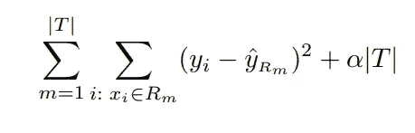

CCP 方程，哈斯蒂，p332(图片来源:詹姆士[等](https://www.statlearning.com/)

这是一个复杂的等式。但是让我们试着更深入地理解一下。一些定义:

Rm: Rm 是对应于第 m 个终端节点的矩形(即预测器空间的子集)

yrm 是与第 m 个末端叶子相关的预测响应

(yi-yˉRm)—由终端节点 m 引用的子树的 MSE(我们对该方程使用回归树方法。为了简单起见，我采用了詹姆斯等人(2014 年)中的公式和方法。

|T|:是树 T 中终端节点的数量

现在让我们看看这个方程在做什么。我们本质上是在所有终端节点上最小化由(yi-yrm)给出的成本或损失。现在α是一个乘以树中终端节点总数的项。如果α=0，那么我们将最小化训练损失。该树将与原始树相同。然而，当α>0 时，我们添加一个随着终端节点数|T|而增加的惩罚项。这意味着对于更小的子树，总成本会最小化。

> 最小成本复杂性修剪递归地找到具有“最弱链接”的节点。最弱的链路由有效α来表征，其中具有最小有效α的节点首先被修剪。

[https://sci kit-learn . org/stable/auto _ examples/tree/plot _ cost _ complexity _ pruning . html](https://scikit-learn.org/stable/auto_examples/tree/plot_cost_complexity_pruning.html)

这是什么意思？这意味着该算法正在搜寻训练损失已经很高的节点，因此只能用小的α来最小化。另一方面，作为最小化的一部分，训练损失较小的节点可以容纳较大的惩罚项。

> 为了了解什么值的`ccp_alpha`可能是合适的，scikit-learn 提供了`[**DecisionTreeClassifier.cost_complexity_pruning_path**](https://scikit-learn.org/stable/modules/generated/sklearn.tree.DecisionTreeClassifier.html#sklearn.tree.DecisionTreeClassifier.cost_complexity_pruning_path)`，它在修剪过程的每一步返回有效 alphas 和相应的总叶子杂质。

[https://sci kit-learn . org/stable/auto _ examples/tree/plot _ cost _ complexity _ pruning . html](https://scikit-learn.org/stable/auto_examples/tree/plot_cost_complexity_pruning.html)

随着α的增加，更多的树被修剪。然后，我们在偏差和方差之间进行权衡。与`*ccp_alpha*`

实际上，我们增加了模型的偏差，也就是说，我们简化了模型。然而，从反面来看，这意味着我们必须容忍终端节点中的杂质水平不断增加。我们看到，随着α的增加，节点数量和树深度都在减少。

*如何确定最优α*

绘制`ccp_alpha`与训练和测试精度的关系图我们看到，当α =0 并且保持`[**DecisionTreeClassifier**](https://scikit-learn.org/stable/modules/generated/sklearn.tree.DecisionTreeClassifier.html#sklearn.tree.DecisionTreeClassifier)`的其他默认参数时，树过拟合，导致 100%的训练精度和 88%的测试精度。随着 alpha 的增加，更多的树被修剪，从而创建一个更好的决策树。然而，在某种程度上，随着模型变得过于简化，α的进一步增加实际上会导致测试精度的降低。在本例中，设置`ccp_alpha=0.015`可最大化测试精度。(详见[https://sci kit-learn . org/stable/auto _ examples/tree/plot _ cost _ complexity _ pruning . html](https://scikit-learn.org/stable/auto_examples/tree/plot_cost_complexity_pruning.html))。

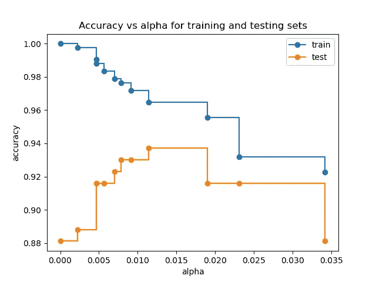

精确度与 Alpha(图像源 [SkLearn](https://scikit-learn.org/stable/auto_examples/tree/plot_cost_complexity_pruning.html) )

**决策树的优缺点**

1.树给出了用于分类的变量之间关系的可视化模式，因此更易于解释。树的层次结构提供了对可变重要性的洞察。

2.有时，他们实际上可以反映决策过程。

3.白盒模型是可解释的，我们可以追溯到模型的每个结果。这与神经网络等黑盒模型形成对比。

4.一般来说，不太需要准备和清理数据，如标准化和分类变量和缺失值的热编码。

注意 Sklearn 实现目前不支持分类变量，所以我们需要创建虚拟变量。同样，它也不支持缺少值。但理论上两者都可以处理。

5.模型可以通过统计来验证

**缺点**

1.倾向于过度拟合并因此降低预测准确性

2.决策树可能不稳定，因为数据的微小变化可能会导致生成完全不同的树。例如，这个问题可以通过在集成中使用决策树来缓解

3.可能是不稳健的，即数据的小变化会导致最终估计树的大变化

4.基于相关终端节点的预测是近似的。因此，这可能不是将模型结果外推至未知情况的最佳方法。

5.如果某些类占主导地位，决策树学习者会创建有偏见的树。在与决策树拟合之前，需要平衡数据集。

这就是决策树从开始到至少三分之二的过程。有很多复杂的事情，因此我不能说结束。我希望你喜欢这个关于决策树内部运作的博客。有一点很清楚，这绝不是一项简单的技术。到目前为止，我只回顾了如何选择变量层次结构、如何构建树结构以及如何修剪的复杂性。即使在 Scikit Learn 中也有许多类型的决策树算法。其中包括:ID3、C4.5、C5.0 和 CART。对这些模型的探索将在另一个博客中进行。

**参考文献**

1.  [G .詹姆士](https://www.bibsonomy.org/person/1b3febabdc45a8629023cee7323dfbd86/author/0)、 [D .威滕](https://www.bibsonomy.org/person/1b3febabdc45a8629023cee7323dfbd86/author/1)、 [T .哈斯蒂](https://www.bibsonomy.org/person/1b3febabdc45a8629023cee7323dfbd86/author/2)、 [R .蒂布拉尼](https://www.bibsonomy.org/person/1b3febabdc45a8629023cee7323dfbd86/author/3) (2013)，《统计学习导论:在 R、*斯普林格、* ( *2013* )中的应用
2.  [Satyam Kumar](https://satyam-kumar.medium.com/?source=post_page-----1e7d3d985a09--------------------------------) 、【避免决策树过度拟合的 3 种技术】、[走向数据科学](https://towardsdatascience.com/?source=post_page-----1e7d3d985a09--------------------------------)、[https://towardsdatascience . com/3-避免决策树过度拟合的技术-1e7d3d985a09](/3-techniques-to-avoid-overfitting-of-decision-trees-1e7d3d985a09)
3.  [https://sci kit-learn . org/stable/modules/tree . html # minimal-cost-complex-pruning](https://scikit-learn.org/stable/modules/tree.html#minimal-cost-complexity-pruning)
4.  https://towards data science . com/learn-how-decision-trees-grown-22 bc3d 22 FB 51 #:~:text = Training % 20a % 20 decision % 20 tree&text = This % 20 approach % 20 makes % 20 the % 20 decision % 20 features % 20 from % 20 the % 20 data。
5.  https://www . science direct . com/topics/computer-science/Cost-complexity #:~:text = Cost % 2d complexity % 20 pruning % 20 is % 20 based，leaf % 20 of % 20 the % 20 subtree % 20 concerned。
6.  [https://en . Wikipedia . org/wiki/Entropy _(information _ theory)](https://en.wikipedia.org/wiki/Entropy_(information_theory))