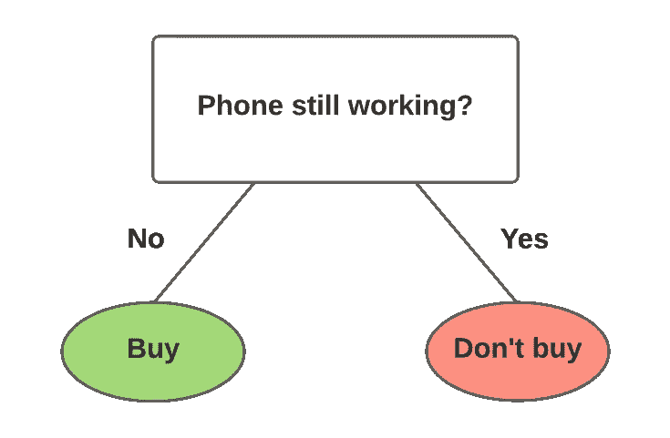
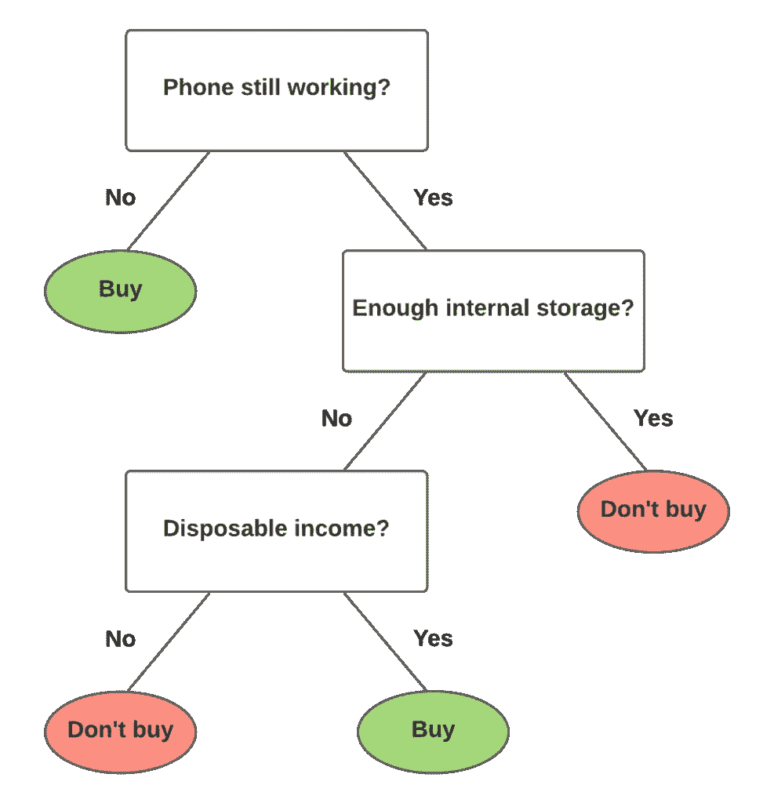

# 决策树、随机森林和梯度推进:有什么区别？

> 原文：<https://towardsdatascience.com/decision-trees-random-forests-and-gradient-boosting-whats-the-difference-ae435cbb67ad>

# 决策树、随机森林和梯度推进:有什么区别？

## 基于决策树的算法简介

[简·侯伯](https://unsplash.com/@jan_huber?utm_source=medium&utm_medium=referral)在 [Unsplash](https://unsplash.com?utm_source=medium&utm_medium=referral) 上拍照

# 介绍

基于决策树的算法由于其效率和预测性能而非常受欢迎。

一个很好的例子就是 *XGBoost* ，它已经帮助赢得了许多 Kaggle 比赛。为了理解这些算法是如何工作的，了解决策树、随机森林和梯度推进之间的差异很重要。

因为这是一个更容易直观解释的话题，我在下面链接了我的视频，你也可以看看。

*除了阅读这篇文章，你还可以看看我在 YouTube 上关于这个话题的视频。*

# 决策树

西蒙·威尔克斯的照片

决策树是非常简单的预测工具。

基本上，一个决策树代表了你需要采取的一系列有条件的步骤来做决定。

让我们从一个非常基本的例子开始。

## 示例 1

比方说，我正试图决定是否值得购买一部新手机，下面有一个决策树来帮助我做出决定。

一个非常简单的决策树。(图片由作者提供)

从树顶开始，第一个问题是:我的手机还能用吗？

既然我的手机还能用，我们就顺着“是”的路径走，然后就完事了。我不买新手机。

现在我知道你在想什么:这个“决策树”几乎不是一棵树。因此，让我们来看一些更复杂的东西，比如下一个例子。

## 示例 2

稍微不那么简单的决策树。(图片由作者提供)

我们已经回答了第一个问题“是”,所以我们可以继续下一个问题:我的手机还有足够的内存来存储视频和照片吗？

我的回答是不。

因此，我们再次沿着“不”的路径，进入最后一个问题:我有足够的可支配收入来购买一部新手机吗？

我的答案是肯定的，所以最后的决定是买一部新手机。

你可以看到，如果我们真的想，我们可以继续添加问题到树中，以增加其复杂性。相比之下，我们也可以从树中删除问题(称为“修剪”)以使其更简单。

如上面的例子所示，决策树为制定决策提供了清晰的视觉效果。它们也很容易通过计算来构建。

然而，这种简单性带来了一些严重的缺点。

最主要的是过度拟合。这是当模型(在这种情况下，单个决策树)变得非常擅长为特定数据集(只有我)做出预测(决策)时，它在不同的数据集(其他人)上表现很差。

在我们的例子中，我们越往下走，我决定购买新手机的场景就越具体。通过增加几个问题，很容易使这个决策树变得过满，使这个树对我来说太具体*了*，而对其他人来说太笼统*。*

此外，决策树可能看起来非常不同，这取决于它开始时的问题。如果我们一开始就用不同的问题创建决策树，那么问题在树中的顺序可能会非常不同。

总之，尽管决策树很容易构建，但它本身并没有那么有用。只有一个决策树作为通用模型来进行预测是不理想的

这就是我们引入随机森林的地方。

# 随机森林

[veeterzy](https://unsplash.com/@veeterzy?utm_source=medium&utm_medium=referral) 在 [Unsplash](https://unsplash.com?utm_source=medium&utm_medium=referral) 上拍照

随机森林使用*集体智慧的概念:*当一组事物一起工作时出现的智慧和增强的能力。

顾名思义，随机森林独立构建了一堆决策树。每个决策树都是一个简单的预测器，但是它们的结果被聚合成一个结果。理论上，这应该更接近我们通过集体智慧寻找的真实结果。

正如我前面提到的，根据数据的不同，每个决策树可能看起来非常不同；随机森林将随机构造决策树，以尝试获得各种不同的预测。

随机森林的一个缺点是它们比单一的决策树更难解释。由于随机森林需要独立地构建和评估每个决策树，所以构建起来也比较慢。

# 梯度推进

照片由 [Ivars Utināns](https://unsplash.com/@ivoprod?utm_source=medium&utm_medium=referral) 在 [Unsplash](https://unsplash.com?utm_source=medium&utm_medium=referral) 上拍摄

像随机森林一样，我们也有梯度推进。像 *XGBoost* 和 *CatBoost* 这样的流行算法就是使用梯度推进框架的好例子。

本质上，梯度推进只是弱预测器的**集合**，它们通常是决策树。

随机森林和梯度推进的主要区别在于决策树是如何创建和聚合的。与随机森林不同，梯度提升中的决策树是附加构建的；换句话说，每个决策树都是一个接一个建立起来的。

然而，这些树并不是无目的地被添加的。每一棵新树都是为了改进先前树的不足而构建的，这个概念被称为*增强*。

梯度提升的*梯度*部分来自于在算法构建每棵树时最小化损失函数的梯度。

如果这没有任何意义，那么现在不用担心。主要的一点是每次都添加一棵树来改进整个模型。这与随机森林形成对比，随机森林独立地构建和计算每个决策树。

随机森林和梯度增强之间的另一个关键区别是它们聚合结果的方式。在随机森林中，决策树的结果在过程结束时被聚集。梯度推进不会这样做，而是聚合沿途每个决策树的结果来计算最终结果。

总体而言，梯度推进通常比随机森林表现得更好，但它们容易过度拟合；为了避免这种情况，我们需要记住仔细调整参数。

# 结论

由于其效率和性能，梯度提升如今非常受欢迎。希望这篇文章能够澄清这些算法之间的一些差异。

这是初学者数据科学系列的一部分，所以如果你喜欢这篇文章，你可以在 YouTube 上查看我的其他视频。如果你想通过电子邮件了解我在做什么，你可以考虑注册我的[简讯](https://leonlok.co.uk/newsletter/)。

*原载于 2022 年 1 月 5 日 https://leonlok.co.uk***。**