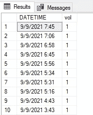
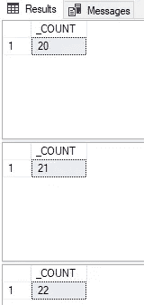
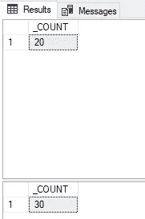
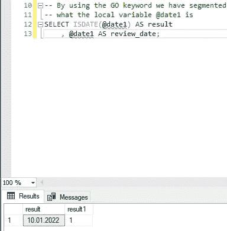
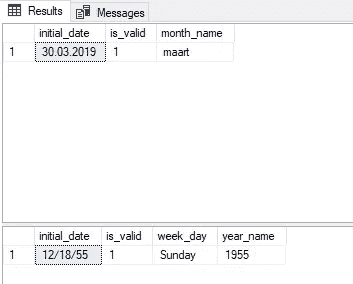

# 在 SQL 中声明变量

> 原文：<https://towardsdatascience.com/declaring-variables-within-sql-fe6a479a7f9c>

## 确保在 SQL 代码的开头声明关键变量有助于自动化代码的重用。

帕特里克·帕金斯在 [Unsplash](https://unsplash.com?utm_source=medium&utm_medium=referral) 上的照片

W 当开始使用 SQL 代码时，许多数据科学家会根据他们想要完成的任务来编写代码。有了创建的输出，用户就可以进入数据之旅的下一个阶段，这可能是数据可视化。努力创建一个样板代码，在代码的开头定义硬编码的变量值，确保在将来的使用中不会遗漏任何变量。

重新分解 SQL 代码以确保自动化任务可以有效地执行，这有助于更好地测试代码。反过来，在与其他利益相关者共享代码时，它也为用户提供了更多的信心。许多利益相关者可能不知道已经共享的 SQL 查询的内部工作方式，所以作者必须小心清楚地定义所有关键项。

在本文中，我们展示了如何将 declare 语句与一些基本变量一起使用。许多这样的例子将展示创建更简化的 SQL 代码的潜力。

## 资料组

对于这篇分析，希腊的地震数据集取自 Kaggle。

  

本文中显示的 SQL 代码是使用 Microsoft SQL Server Management Studio 18 的一个实例创建的。

## 入门指南

第一次使用 declare 语句时，用户会注意到它与其他编程语言的相似之处。每个变量最初都可以用特定的数据类型来声明，这可以确保用户键入适当的数据。设置新变量提供了将在随后的 SQL 代码中使用的第一个数据输入。

用于探索性数据分析(EDA)的 SQL 代码 1.1 简单声明和设置语句(图片由作者提供)

正如读者所见，在 declare 语句中，我们创建了两个日期变量和一个字符变量。start 变量的第一个 set 语句创建一个用户定义的日期值。通过包含可调整的日期值，用户可以快速查询数据集。但是，对于所有用户定义的值，都有可能出现键入错误。因此，必须小心确保提供适当的数据类型值。在代码中保留一个变量为最终用户提供了灵活性。

对于第二个日期变量 stop，我们使用一个内部关键字变量来提供今天的日期值。应用这个系统生成的变量允许 SQL 代码在用户不做任何调整的情况下工作。我们可以从 SELECT 语句中看到，函数 DATEADD 被提供了第二个日期变量。DATEADD 函数创建的是今天日期前三个月的月份值。

以这种方式创建变量值可以确保从查询结果中排除最近三个月的数据。有时，开发人员会将此操作纳入他们的数据分析中，因为最新的时间序列数据可能会在结果中包含一些波动性。这种易变性的含义可能与创建数据的团队没有完全验证数据有关。因为在最初的数据分析阶段，所有的数据源可能没有提供完全核实的输入。如果是这种情况，那么可以给数据源提供者分配时间来验证他们提供的数据。如果需要任何调整，则可以提供这些调整，以便适当制作管理信息报告。

SQL output 1.1 结果显示了使用日期过滤器的初始行(图片由作者提供)

包括一个声明的变量，该变量使用今天的日期，并在代码中对其进行调整，以将三个月前的值作为结束日期，这突出了如何安排该查询来自动创建输出。有了输出的结果，我们就能够共享数据的适当快照。

## 计数器

很多时候，当使用 SQL 代码时，我们希望了解我们在这个过程中进行到了什么程度。利用计数器可以提供最近阶段的概观。用计数器跟踪度量有助于确保我们总是知道所取得的进展，特别是如果程序有许多迭代要执行的话。

SQL 代码 1.2 基本计数器，用于检查已完成的代码阶段(图片由作者提供)

将计数器变量创建为整数数据类型允许用户以适合他们要完成的任务的格式设置变量值。通过取整数值零，用户可以迭代直到任务完成五个步骤。然而，如果用户更喜欢以降序查看计数器，则可以设置更高的值，例如 5，然后在每次迭代中递减。随着上面显示的计数器值的更新，有两种不同的方法可用。第一种方法显示了如何通过将计数器值加 1 来更新计数器变量。对于第二种方法，采用一种快捷方式来更新计数器变量。在每次迭代中，值会随着每种方法而增加。这些结果可以在下面看到。

SQL 输出 1.2 计数器的每次迭代都可以打印到结果日志中(图片由作者提供)

## WHILE 循环

与上一节中的计数器类似，另一个可以使用的选项是 while 循环。正如在其他编程语言中看到的那样，while 循环为循环的工作提供了一个端点。在循环的每次迭代中，该函数检查以了解循环是否达到了最终迭代值。当没有到达最后一次迭代时，程序将继续执行所请求的任务。

SQL 代码 1.3 使用 while 循环创建计数器变量(图片由作者提供)

声明计数器变量时遵循与前面相同的步骤。变量被声明为整数数据类型。变量再次被设置为初始值。其中计数器变量需要连续复制代码来使用先前的计数器方法更新变量值。while 循环优化了代码，只在一行中包含了计数器变量的更新。代码循环部分的开始和结束包含两个关键字。

SQL 输出 1.3 使用 while 循环迭代计数器的结果(图片由作者提供)

使用 while 循环进行的演示会显示第一个和最后一个计数器值。

## 日期格式

在 SQL 代码的开头可以调整的另一个选项是决定使用哪种日期格式。开发人员可以使用许多日期格式选项，我们在这里不做介绍。对于这个例子，我们强调如何使用 set 语句来提供我们需要的日期格式。

SQL 代码 1.4 使用日期格式关键字(图片由作者提供)

该代码旨在检查并查看所声明的 date1 变量是否被 SQL 解释器视为 SQL 日期。通过在下面的输出中返回结果 1，我们能够确认情况确实如此。使用不同的日期格式将允许开发者改变输出日期类型以适应当地的期望。

日期评估的 SQL 输出 1.4 结果(图片由作者提供)

上面用红色下划线标出的代码表明 SQL 解释器还不知道这个值正在被创建。由于这段代码之前的 go 语句重新启动了解释器，因此先前对这个声明变量的了解就丢失了。要再次使用声明的变量，我们需要注释掉前面的 go 语句。或者，我们也可以再次创建声明的变量并提供不同的值。使用 SQL 解释器了解这些子句可以确保在不应该发生的时候不会出现潜在的错误。包含 go 关键字有助于将代码分成不同的部分，这取决于您的工作需求。

## 语言

到目前为止，我们已经通过声明公共变量来处理数据。另一个可用的选项是调整后台使用的语言。在处理日期时，我们可能需要使用该功能。在示例代码中，我们展示了两种语言之间的区别。使用语言选项创建不同的变量名有助于使用内置数据。

SQL 代码 1.5 通过设置语言选项来调整日期结果(图片由作者提供)

在使用每种语言选项时，代码都保持非常相似。这有助于显示自动创建的不同输出，而无需更改大量代码。我们还会看到如何使用 go 关键字来创建两个代码块。包含不同的初始日期值还会突出显示可以使用多少种日期格式。

SQL 输出 1.5 两种语言的区别(图片由作者提供)

拥有维护代码语法的能力有助于让开发人员的生活变得更加轻松。随着代码自动为月份名称和工作日生成相关的字符值，我们可以看到有多少选项可用于生成管理信息。

这些例子仅仅触及了使用 declare 和 set 语句属性时的皮毛。通过修改查询中的一些内部设置，开发人员可以更自由地使用相似的代码产生不同的结果。不必不断地创建大量相似的代码一直是人们的梦想。

## 结论

在本文中，我们已经完成了许多变量的声明。利用许多内置方法允许代码自动化。正是这种自动化可以通过设置调度处理流程来实现定期报告的复制。处理日期时，有许多日期格式可供使用。注意理解适当的日期有助于确保正确筛选数据。通过使用计数器或 while 循环，我们能够维护代码当前迭代的记录。调整 SQL 解释器使用的语言显示了如何使用相同的代码产生适合所需语言的结果。

留下您的评论，非常感谢您的阅读！

**您可以使用下面的链接成为高级媒体会员，并访问我的所有故事和数以千计的其他故事:**

  

**你可以在** [**LinkedIn**](https://www.linkedin.com/in/james-mc-neill-180a9057/) **上联系我，友好地聊一聊所有的事情数据。我分享过的其他故事:**

        

[1] : Kaggle dataset 许可来自[https://www.kaggle.com/nickdoulos/greeces-earthquakes](https://www.kaggle.com/nickdoulos/greeces-earthquakes)的地震，许可协议来自[https://opendatacommons.org/licenses/dbcl/1-0/](https://creativecommons.org/publicdomain/zero/1.0/)