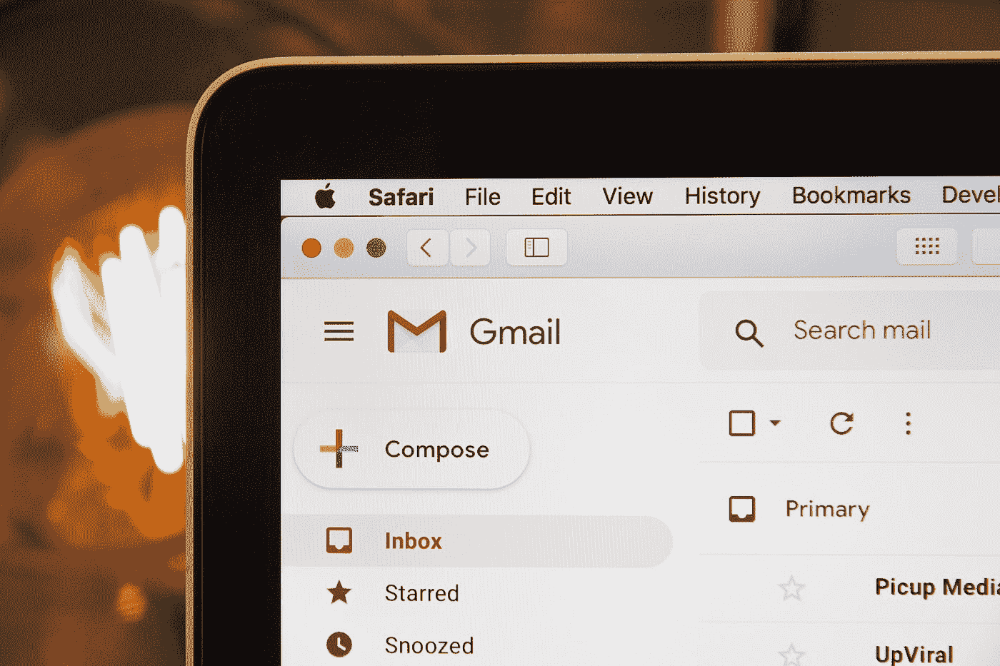
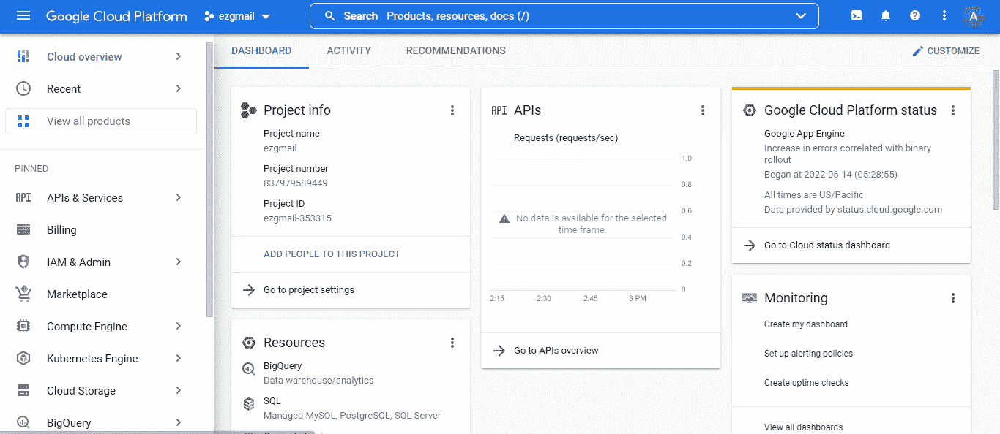
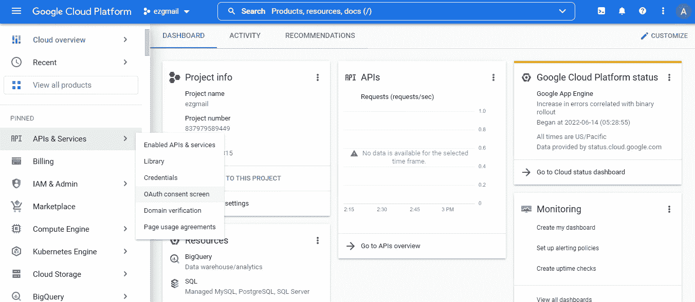
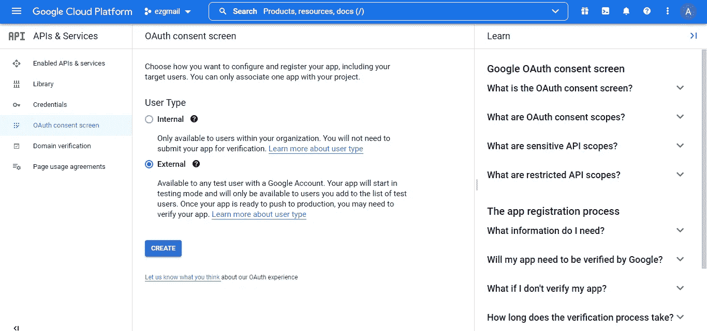
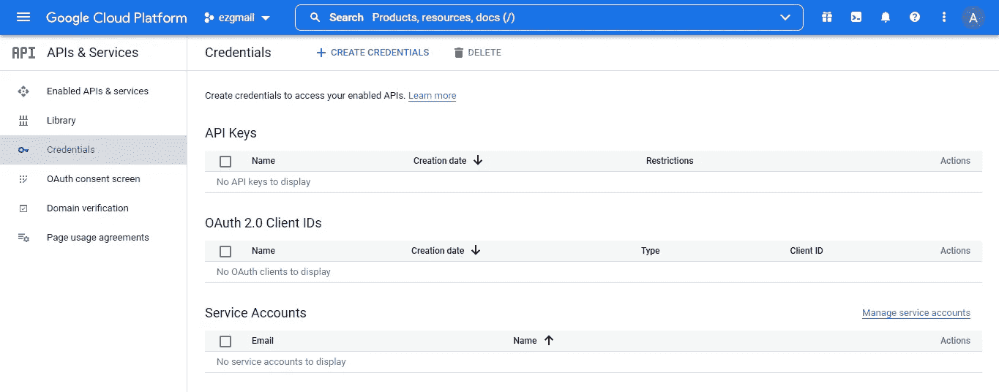
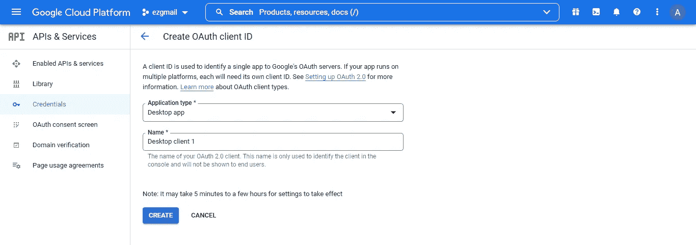
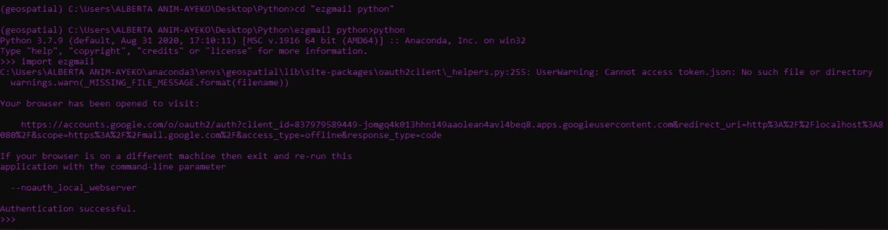

# 使用 Python 整理您的 Gmail 收件箱

> 原文：<https://towardsdatascience.com/declutter-your-gmail-inbox-with-python-e06a4102b0b7>

## 使用 ezgmail 自动阅读和删除电子邮件



斯蒂芬·菲利普的照片[—](https://unsplash.com/@hostreviews?utm_source=medium&utm_medium=referral)在 [Unsplash](https://unsplash.com?utm_source=medium&utm_medium=referral)

## 介绍

不得不在 gmail 应用程序中手动删除一封又一封电子邮件绝对不是对时间的良好利用，尤其是当你可以自动化这个过程的时候。在这篇文章中，我将向你展示如何自动删除不想要的邮件，并将邮件标记为已读。这样，当你在做一件重要的事情或者看你最喜欢的电视节目时，你可以让一个程序来帮你做这件事😉。

就在不久前，我发现了由 [Al Sweigart](https://twitter.com/AlSweigart) 创建的 [ezgmail](https://pypi.org/project/EZGmail/) python 包，我认为与我以前见过的其他包相比，它的功能非常简单。

## 要求

*   安装在您电脑上的 python 版本。如果您没有安装 python，请按照这里的说明[来安装。](https://www.youtube.com/watch?v=i-MuSAwgwCU)
*   您选择的 ide。Jupyter 笔记本，spyder，pycharm 等。
*   安装 ezgmail 包，这可以通过在终端中运行`pip install EZgmail`来完成

## 设置您的 gmail 开发者帐户

您不能跳过这一步，否则 ezgmail 包将无法工作。这一部分很长，但是当你读到最后的时候，它是完全值得的。

*   创建一个您将在其中工作的新文件夹。`ezgmail_python`是个不错的选择。
*   点击[此处](https://developers.google.com/gmail/api/quickstart/python/#step_1_install_the_google_client_library)并使用您的 gmail 帐户登录。
*   **按照页面上的步骤 1** 运行:

```
pip install --upgrade google-api-python-client google-auth-httplib2 google-auth-oauthlib
```

**按照页面上的步骤 2** 创建 quickstart.py 文件，并将步骤 2 中的代码添加到文件中。

*   将 quickstart.py 保存在开始时创建的文件夹中。`ezgmail_python`文件夹
*   **不要像页面上说的那样运行 python quickstart.py** ！
*   如有必要，点击[此处](https://console.cloud.google.com/getting-started?)并登录。
*   点击`Select a project -> New Project -> Enter a Project name in the field provided(Eg: ezgmail)`可以忽略位置字段
*   点击`CREATE`
*   从弹出的通知中选择您的`ezgmail`项目。您将被转到以下页面:



ezgmail 项目的仪表板

*   在屏幕的左窗格中，点击`APIs & Services`->-`OAuth consent screen`，如下图所示:



选择 OAuth 同意屏幕选项

*   从显示的 OAuth 同意屏幕中，点击`external` 选项，然后点击`create` ，如下图所示:



为用户类型选择“外部”选项

*   接下来会出现一个**编辑应用程序注册**表单。填写以下字段:

**— App 信息**

*   `App name` = ezgmail
*   `User support email` =你自己的 gmail
*   App logo 可以忽略

**—应用领域**

*   忽略此处的所有字段，因为它们不是必填字段

**—授权域**

*   忽略此部分

—开发人员联系信息

*   `Enter your own email here`

单击保存并继续

忽略下一部分，它是关于你的应用程序的**范围**的。

单击保存并继续

对于下一部分，即**测试用户**部分，点击`+Add Users`按钮和`add your own email address`，点击添加

单击保存并继续

之后，你提供了你所提供的所有数据的摘要，如果一切正常，点击 `BACK TO DASHBOARD`

现在，点击屏幕左侧的`Credentials` 选项，您将看到以下内容:



“创建身份证明”页

点击上面的`+CREATE CREDENTIALS`选项，然后选择`OAuth Client ID`选项。从应用类型下拉列表中，选择`Desktop App`选项，您可以保留名称不变。点击`CREATE`。预期屏幕如下所示:



“创建 OAuth 客户机 ID”页

点击`CREATE`按钮后会出现另一个弹出窗口，显示您的凭证；你的`Client ID`和`Client Secret`。确保不要与任何人分享这些。点击`DOWNLOAD JSON`按钮下载这些凭证。请务必将文件重命名为`credentials.json`，并保存在您开始创建的`ezgmail_python`文件夹中。

## 使用 ezgmail 包

我强烈建议下面的命令在终端中运行，而不是在你的 ide 中。

使用`cd` 命令进入你的`ezgmail_python`文件夹。运行以下命令:

`python` - >运行这个命令可以让您开始在终端中编写 python 代码

`import ezgmail` - >运行此程序后，浏览器中会打开一个窗口，要求您选择希望访问您的应用程序的电子邮件帐户。选择你想要清理的自己的电子邮件。然后你会看到另一个页面，告诉你这个应用程序没有通过验证，以及你是否要继续。点击`continue`


关于应用程序验证的谷歌警告页面

再次点击`continue` 以确保您允许 ezgmail 访问您的 google 帐户。有一个页面说:`The authentication flow has completed.`你也会意识到在成功认证后，你的 ezgmail_python 文件夹中有一个名为`token.json`的新文件。



命令在终端中运行

如果上面的 `import ezgmail`步骤不起作用，请尝试`ezgmail.init()`

嚄😅，你都准备好了！使用下面介绍的功能非常简单。准备好体验魔法了吗？

**将邮件标记为已读**

以下代码现在可以在您的 ide 中运行，而不是在终端中运行。

```
unreadThreads = ezgmail.unread(maxResults=300)
print(f'There are {len(unreadThreads)} unread emails in your account')
for unread in unreadThreads:
    print(ezgmail.summary(unread), ‘\n’)
    unread.markAsRead()
```

就这么简单！😲在上面代码片段的第一行，您可以将`maxResults` 参数更改为您选择的任何数字，因为它控制着返回的未读邮件的数量。从那里，收件箱中未读邮件的实际数量被返回并打印到您的屏幕上。第四行返回你的未读邮件的摘要，在最后一行，这些邮件被程序标记为已读。

**删除邮件**

对于删除电子邮件，你必须非常确定，然后再继续。下面的代码可以帮助你删除。

*   **通过查找关键字删除电子邮件**

```
keywords = ['LinkedIn', 'Cesium Forum', 'ASOS']
for keyword in keywords: 
   threads = ezgmail.search(keyword, maxResults=300)
   print(f’There are {len(threads)} emails with the keyword,     {keyword}’)
   ezgmail.summary(threads) #You can check a summary just to make sure you’re not deleting anything important
    for i in range(len(threads)):
       if len(threads)==0:
          print(‘No \’{keyword}\’ messages to delete, moving on to the next’)
       else:
         threads[i].trash()
```

上面的关键词列表应该被你感兴趣的关键词所取代，它们可以是你想要的任意多的单词。使用 for 循环遍历关键字列表，ezgmail 搜索包含这些特定关键字的每封电子邮件，并返回它们。对于每一个关键词线索，在它们最终被删除之前，存在的电子邮件的数量被计数。

如果你意识到你删除了一些重要的东西，不要惊慌，你可以在 gmail 应用程序的垃圾箱中找到被删除的邮件。

*   **删除最近的邮件**

```
threads = ezgmail.recent(maxResults=20)
print(f’There are {len(threads)} recent emails in your inbox’)
ezgmail.summary(threads) #You can check a summary just to make sure you’re not deleting anything important
for i in range(len(threads)):
     if len(threads)==0:
        print(‘No recent emails')
     else:
        threads[i].trash()
```

介绍了最近的功能和关键字的概念，它也可以用来标记电子邮件为已读，如果你认为这是一个更安全的选择。

## 离别的思绪

您还可以使用其他 ezgmail 功能，如`re`(用于正则表达式)，它可以帮助您在继续标记为已读或删除之前，在电子邮件中查找特定模式。值得探讨。我希望在看完这篇文章后，你会采用一些清理收件箱的方法。感谢阅读！👋🏾

## 来源

[Ezgmail 文档](https://ezgmail.readthedocs.io/en/latest/)