# GAN 中的基本数学解码—简化版

> 原文：<https://towardsdatascience.com/decoding-the-basic-math-in-gan-simplified-version-6fb6b079793>

## 生成性对抗网络的数学基础是什么？

在过去十年中，生成对抗网络(GANs)是深度学习领域的一场革命。自 Ian Goodfellow 等人在 2014 年发布第一个 GAN 版本以来，已经有许多 GAN 的变体，其中一些应用令人惊叹。

在本文中，我们将尝试用简单的术语来理解 GAN 背后的基本数学基础。

为了对 GANs 如何工作有一个高层次的直觉，建议您首先浏览下面的文章:[对 GANs 的直观介绍](https://lakshmi1212.medium.com/intuitive-introduction-to-generative-adversarial-networks-gans-230e76f973a9)

# GAN 概述

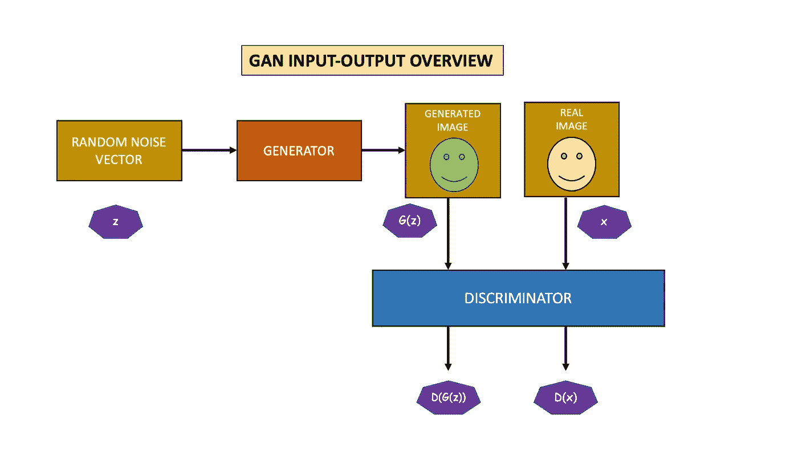

**甘输入输出流程**(图片作者提供)

生成器将随机向量[z]作为输入，并生成输出图像[G(z)]。鉴别器将生成的图像[G(z)]或真实图像[x]作为输入，并生成输出[D]。

在鉴别器训练期间，生成器的权重和偏差被冻结。当鉴别器预测真实图像是假的或者假图像是真的时，它将受到惩罚。鉴频器的权重和偏置通过来自鉴频器损耗的反向传播来更新。

类似地，在生成器训练期间，鉴别器的权重和偏差被冻结。生成器的目标是欺骗鉴别器。因此，如果鉴别器能够识别出生成器生成的图像是假图像，则生成器会受到处罚。在这种情况下，损耗通过发电机网络反向传播，以更新其权重和偏差。

# 双人极大极小游戏

GAN 在概念上可以被认为是发生器模型和鉴别器模型之间的极小极大博弈。两个模型同时被训练，其中一个模型试图最小化损失，而另一个试图最大化损失。

根据原始 GAN 论文，GAN 的损失函数如下

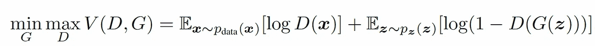

图片来自[甘— 2014 论文](https://arxiv.org/abs/1406.2661)

让我们试着推导这个等式来更好地理解它。

# 二元交叉熵损失

生成器和鉴别器都使用二进制交叉熵损失来训练模型。一般来说，二元交叉熵损失可以写成:

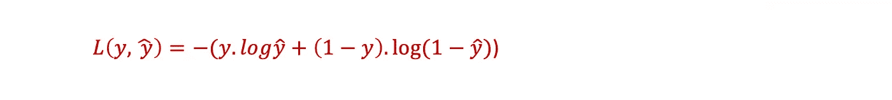

# 鉴频器损耗

鉴别器可以有两种可能的输入，真的或假的。

1.  对于实数输入，y = 1。在二元交叉熵损失函数中代入这个值，得到下面的损失值:

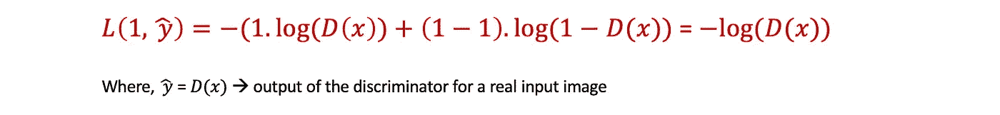

2.类似地，对于伪输入，y = 0，这给出了下面的损耗值:

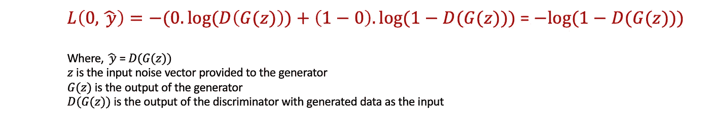

结合鉴频器的上述损耗，一个是真实输入，另一个是虚假输入，得出以下鉴频器损耗

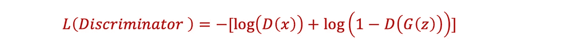

鉴别器的目标是最小化这种损失，

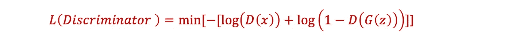

移除负号会将最小值变为最大值，因此单个数据点的最终鉴频器损耗可写为:

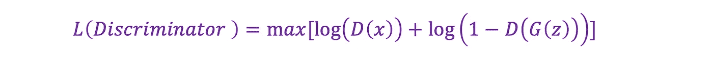

# 发电机损耗

对于发生器，损耗是根据鉴频器损耗计算的。在发电机训练期间，鉴别器被冻结。因此，对于鉴别器来说，只有一个输入是可能的，这就是伪输入。这使得鉴频器损耗等式中的第一项为零。

生成器试图欺骗鉴别器将假数据归类为真实数据。这意味着发生器试图最小化鉴频器损耗方程中的第二项。单个生成数据点的发电机损耗函数可写为:

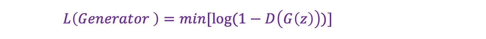

# GAN —损耗方程

将鉴频器损耗和发生器损耗结合起来，我们可以得到一个单一数据点的等式，如下所示。

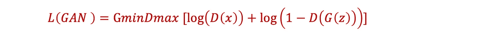

这是发生器和鉴别器之间的极小极大博弈。发电机试图最小化损耗，而鉴别器试图最大化损耗。

将该方程推广到多个数据点的期望值(E)给出了如下的最终方程，

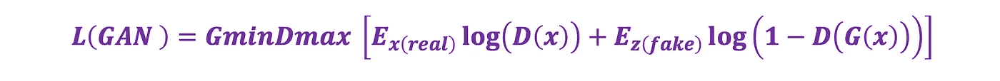

现在将其与 GAN 论文中给出的损失函数进行比较，以便更好地理解它。

图片来自[甘— 2014 论文](https://arxiv.org/abs/1406.2661)

# GAN 的局限性

以下是 GAN 中常见的一些问题

1.  消失梯度问题，由于该问题，发电机训练可能会失败
2.  模型折叠，其中生成器可能重复创建相同的输出
3.  无法收敛，因为鉴频器反馈对发生器的意义变得更小，从而影响其质量

# 结论

自问世以来，GANs 已经有了很大的改进，研究人员已经找到了在很大程度上克服这些局限性的方法。选择正确的损失函数是热门的研究课题之一，许多备选方案正在被提出和评估。

希望你喜欢这篇文章。尽情享受甘的各种风味吧。