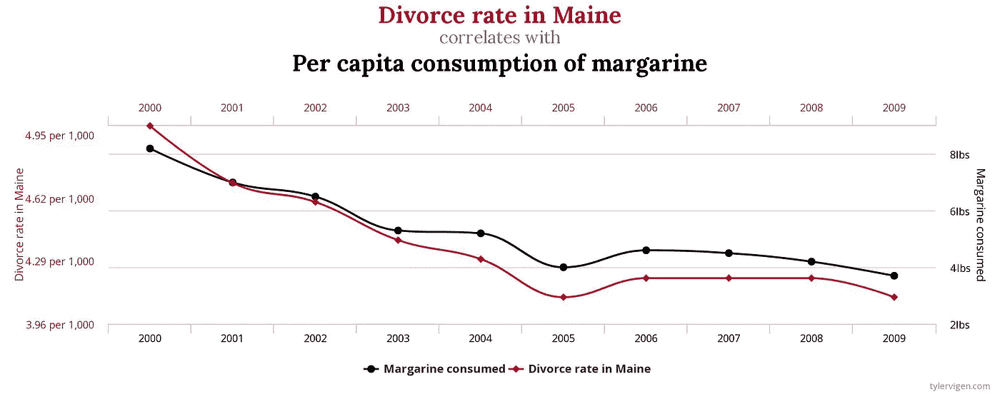
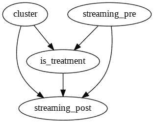
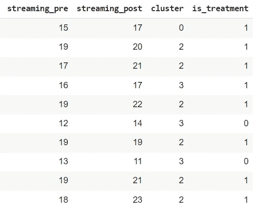
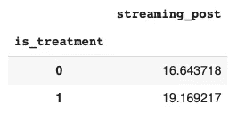
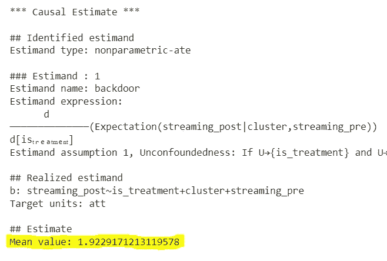
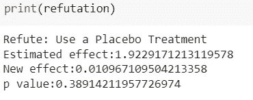
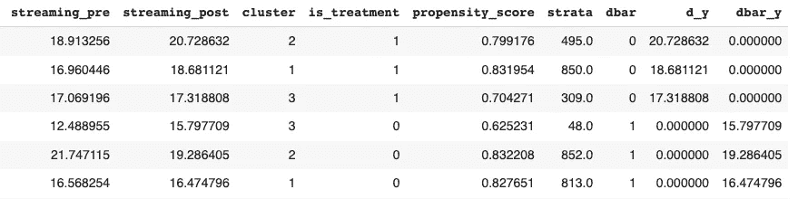
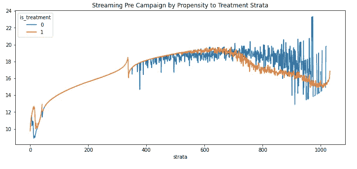
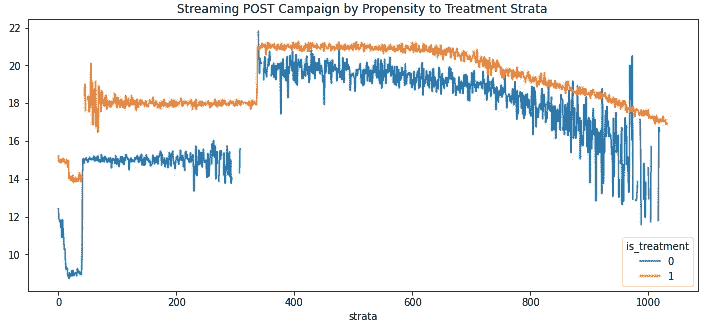

# 像专业人士一样和 DoWhy 解除关系

> 原文：<https://towardsdatascience.com/deconfounding-like-a-pro-with-dowhy-c7e03fa03a3f>

## 因果分析帮助你解决很多关键的决策问题。许多开源框架都来帮忙了，微软的 DoWhy 是最有前途的一个。

在 [Unsplash](https://unsplash.com?utm_source=medium&utm_medium=referral) 上由 [Nadir sYzYgY](https://unsplash.com/@nadir_syzygy?utm_source=medium&utm_medium=referral) 拍摄的照片

[在之前的一篇文章](/a-gentle-intro-to-causality-in-a-business-setting-4285aee4b83)中，我提出了因果关系的理由，奠定了一些理论基础，并认为对因果机制的深刻理解应该成为每个数据科学家通过数据做出关键决策的工具。

因果推断分析通常需要绘制一张什么可能导致什么的图表，识别[混杂因素](https://en.wikipedia.org/wiki/Confounding)，并对其进行分层，以发现治疗对结果的影响。这样做可以让你远离虚假的相关性和荒谬的主张。

图 1 —来自[https://www.tylervigen.com/spurious-correlations](https://www.tylervigen.com/spurious-correlations)。人造黄油主要消费量和人均消费量之间似乎有因果关系，但事实上并非如此。

因此，找到正确的混杂因素，即影响治疗和结果的因素，是解决因果关系的关键。

DoWhy 是最强大的库之一，由微软研究团队完全开源。5 月 31 日，亚马逊科学与微软联手创建了一个更广泛的因果分析生态系统，名为 PyWhy，增强了技术和数据科学界对简化该领域的巨大兴趣。下面是公告。

接下来，我将用一个真实的案例场景(出于显而易见的原因，使用假数据)来简要介绍它的潜力。

## DoWhy 底漆

用例是衡量一个媒体公司中增加流媒体数量的活动的实际影响。假设不可能为一项试验抽取一个随机对照组，那么唯一可能的测量方法就是通过观察研究。我们可以通过比较目标群体与所有因为未同意联系而未包括在活动中的客户来衡量活动的结果。

第一步是将问题构建成有向无环图(DAG)。DoWhy 既支持 *gml* 又支持*点*格式，我在这里使用的就是这两种格式。我初始化一个有向图，然后设置节点和边。我选择了一个平凡的用例，但是这些图会很快变得复杂。

用 Graphviz 打印图表后，我们可以识别两个混杂因素。社会人口统计聚类可能会影响治疗，因为一些群体可能更倾向于同意联系并参与活动，但也可能直接影响流的数量。对于活动前的流数量也可以进行同样的考虑。为了衡量治疗(活动)如何偶然影响接受治疗的客户的平均流媒体数量，有必要控制*集群*和*流媒体 _pre。*在随意推理的行话中，这被称为**阻塞从变量到结果的后门路径**。

图 2 —因果图。作者图片

在下面的步骤中，我为不同的客户使用不同的正态分布组合来生成一些假数据。在现实世界中，您几乎不会看到客户的行为可以用高斯钟形曲线来建模，但是对于这个示例来说，这就足够了。

上面的代码生成了下面这个非常简单的数据集。

图 3 —合成数据集。作者图片

在进行分析之前，我们可以观察到营销活动后的平均流差异为 2.5，但这一差异中有多大一部分归因于营销活动？

图 4 —活动后按客户划分的平均流。作者图片

有了手头的数据，我们现在可以从工具箱中取出 DoWhy 了。我通过传递用 Graphviz 定义的图来初始化因果模型(注意删除示例中显示的制表符和换行符),并指定目标和结果变量。

我们可以继续确定一个估计量，这是我们需要控制的变量，以便计算因果效应。这就是道威通过从上面定义的 DAG 推断来施展他的魔法的地方。

接下来的步骤是实际的评估，软件包提供了许多方法。我在这里选择了倾向得分分层，其中 DoWhy 计算了每个虚假客户的治疗倾向，然后根据该得分将每个客户分配到一个阶层，并计算目标群体和对照组之间在活动后的结果差异。这应该足以抵消假设的混杂因素的影响。**我们基本上是在比较非常相似的群体，其中相似性是通过分享对活动的相同倾向来给出的。**

目标单位是被治疗者的平均治疗效果(att ),因为在这种情况下，我只对参加活动的人的效果感兴趣。

最终的因果估计值是活动产生的平均 **1.92** 个流，低于最初分析的 **2.5** 个流。这两个值之间的差异可以解释为客户的惯性行为，不管活动如何，我们都会看到这一点。

图 5 —估计效果方法的输出。作者图片

对我们分析的正确性的最后检查是通过一个反驳测试，使用安慰剂治疗。这里我们用一个随机值代替治疗变量，重新计算效果。

然后，新效果的值应该为 0，其概率高于阈值(p 值)。在这种情况下会发生！

图 6 —反驳输出。作者图片

最后，我们可以通过倾向水平来形象化提升。DoWhy 向初始数据集添加了一些变量。特别是倾向分数和阶层。

图 7 —初始数据集的额外属性。作者图片

按阶层比较运动前治疗组和对照组的分组，我们可以看到橙色曲线如何在不同阶层一致地向上移动。

图 8。—按阶层划分的活动前流。作者图片

这为该活动如何影响所有倾向群体提供了一些额外的视觉洞察。

图九。—按阶层划分的活动后流。作者图片

我只是用一个小例子触及了解开因果关系的潜在可能性的表面。与 ALICE 项目(因果关系和经济学的自动学习和智能)的 [EconMl 库](https://github.com/microsoft/EconML)的集成以及最近与亚马逊的合作极大地扩展了它的功能。看到因果关系将如何有助于向人工智能进军将是令人兴奋的。

**注:**本笔记本中的代码也可在[本笔记本中找到](https://colab.research.google.com/drive/1yabfh8826W0FMLKFRD12OHBIP8oU1QeM#scrollTo=_3q0uqyWf8lf):