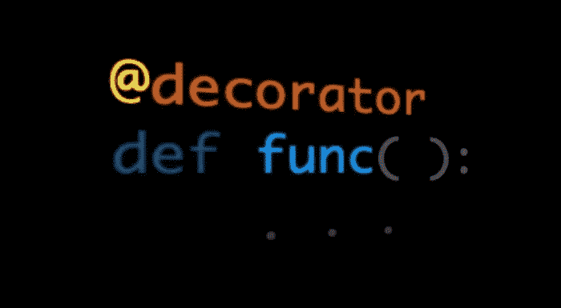

# 数据科学家的装饰技巧

> 原文：<https://towardsdatascience.com/decorator-tricks-for-data-scientists-87911eea41ca>

## 如果您还没有使用 Python decorators，那么您应该使用。纯句法糖。

图片作者。

我记得我第一次在 Python 代码中看到函数顶部有一个“@”符号。我觉得有必要研究一下这个奇怪的语法。它前后都标了 a，这是肯定的。函数顶部的“@”符号称为装饰器，它装饰的函数的一个函数。

你可以花几年时间做数据科学家，而不用装饰者。或者也许你已经使用过它们，但是还没有学会如何编写自己的代码。这个故事旨在构建在许多数据科学任务中有用的具体 decorator 示例，并且在这个过程中，学习如何一步一步地编写 decorator。

装饰者的主要目的是:

*   向现有函数和类添加功能
*   当做一些可能不会通过代码审查的事情时，作为代码中的一个注释

这个故事将关注前者，向现有的函数和类添加功能。

为了说明这一点，假设您有许多查询数据库的函数。在编写了从数据库中查询所需的所有内容的函数之后，您意识到每十次尝试中就有一次会由于一些随机的连接错误而失败。我们都知道如何使用数据库。

您需要为所有函数添加一些重试逻辑。所述逻辑将形成为多次尝试的循环，其间可能有一些等待时间——样板代码。然而，基本的逻辑已经编码在函数中。

所以你有两个选择:

*   向所有函数添加样板文件；这将需要工业规模的复制粘贴，并改变每个功能的逻辑以适应重试。又乱又臭的代码。
*   编写一个重试装饰器，并将其添加到数据库函数之上(一行代码)；否则，保持函数的逻辑不变。干净优雅的代码。

我当然知道我会选择哪个选项。

故事结构如下:

*   装饰基础
*   重试装饰器
*   类注册表装饰器
*   周期性执行装饰器
*   最后的话

## 装饰基础

最简单的装饰器是一个函数，它将它所装饰的函数作为参数，并返回另一个函数，该函数反过来返回被装饰的函数应该返回的任何内容。绕口令。

通过例子更容易学习:

*decorator_no_info* 实际返回的是 *_wrapper* 函数。那是装饰者的本质；一个功能换一个功能。 *_wrapper* 函数接受修饰函数( *func* )接受的任何参数和关键字参数，并返回 *func* 返回的任何参数。在 *_wrapper* 中的一个附加打印显示代码块已经运行。

关于类型提示，RT(返回类型)的目的是表明无论装饰函数返回什么，装饰器都会返回。

让我们来看一个装饰者的例子:

*打印:*

> 这是装饰包装纸
> 
> 2.0
> 
> _ 包装

这里我们看到 *_wrapper* 运行并返回了 *test_deco* 应该返回的内容。到目前为止，一切顺利。然而，修饰函数的名字已经改变了！是 *_wrapper* 而不是 *test_deco* ！

为了解决这个问题，我们使用了来自 *functools* 模块的*包装*装饰器。它将复制原始函数的信息，并将其传递给 *_wrapper* 函数:

现在，如果我们运行示例，我们会看到名称是正确的，修饰函数的参数被传递给了 *_wrapper* 函数。

*打印:*

> 这是装饰包装纸
> 
> 2.0
> 
> 测试 _ 装饰
> 
> 这是装饰包装纸
> 
> 5.0
> 
> 测试 _ 装饰 _ 添加

接下来是一个可以接受参数的装饰器。在这种情况下，我们创建一个外部函数，它接受装饰器参数，并返回与没有参数的情况相同的装饰器:

例如:

*版画:*

> 这是 decorator _wrapper，deco_arg_str='foo '
> 
> 5.0
> 
> 测试 _ 装饰 _ 添加

按照预期工作，装饰器参数被传递给 *_wrapper* 函数。

## 重试装饰器

最后，第一个例子。这里我们实现了引言中讨论的重试修饰器。装饰器逻辑与上一节中更简单的例子相同。然而，这里我们将重试逻辑引入装饰器。

这个装饰器执行被装饰的函数，并返回它应该返回的任何东西，但是捕捉到一个定制的异常并重试 *n_retry* 次。每次重试，睡眠时间都会增加。

我们使用日志记录器来了解是否有重试尝试。记录器可以作为参数提供，如果没有提供，将创建一个新的记录器。

在这个例子中，我们想要捕捉*值错误*。它尝试了两次并记录了异常，但是没有崩溃；第二次之后，程序崩溃，因为异常被引发。

在本例中，该函数第一次引发了 *ValueError* (崩溃)，因为我们想要捕获 *RunTimeError* 。

要捕捉所有异常(不包括系统退出的异常)，使用*异常*作为*异常重试*，因为所有非系统退出的异常都是子类。

## 类注册表装饰器

第二个例子是类装饰器。是的，类也可以被修饰，不仅仅是函数。为了装饰一个类，装饰器返回一个函数，但是这个函数(在我们的例子中是 *_wrapper* )返回一个未实例化的类。

这个特殊的例子实现了一个类注册表。对于插件或者[接口](/python-interfaces-why-should-a-data-scientist-care-2ed7ff80f225)实现很有帮助。有时，我们直到运行时才知道对象的存在。

想想一个插件对象；该对象遵循一个[接口](/python-interfaces-why-should-a-data-scientist-care-2ed7ff80f225)，但是主程序不知道这些插件，也不需要它们运行。主程序加载任何可用的插件。因此，我们可以在不改变主代码的情况下添加任意数量的插件。

事不宜迟，下面是类注册装饰器的例子:

装饰器只接受注册表的名称作为参数。为了避免重复，注册表由注册表名和类名的元组索引。

此外，还有一个查询注册表的功能(这是主程序了解插件的方式)。

例如，让我们将这些类添加到注册表中:

我们查询注册表:

*版画:*

> 富（中国姓氏）
> 
> {'Foo': <class>，'巴兹': <class>}</class></class>

班级在那里。我们是黄金。

## 周期性执行装饰器

最后一个例子是周期函数装饰器。有时我们想在应用程序中的函数中添加一些调度逻辑。例如，HTTP 请求每隔 *n* 分钟获取一些数据。

因为这是重试修饰器的动机，我们不想通过添加调度逻辑来扰乱实际函数的逻辑。因此，我们创建了一个装饰器来为我们做这件事。更干净。

我们要求的唯一要求是装饰函数是 void，也就是说，它不返回任何值。我们将执行其中的代码，不关心函数的返回。

如您所见，我们使用线程模块在一个单独的线程中运行预定的功能，而不会阻塞主线程。这样，您可以运行该函数，并且调度循环不会阻塞:

*打印:*

> 在周期性的
> foo 1656078663 . 629107
> foo 1656078664 . 6331909
> foo 165607865 . 6351948
> foo 165607866 . 635

正如您所看到的，“after periodic”在其余的函数定期执行(即非阻塞执行)之前打印。

## 最后的话

这个故事是对装饰者和数据科学项目中的一些应用的快速浏览。希望您能编写更多自己的装饰器，并在代码中使用它们。我强烈建议您开始使用它们，直到您有信心在产品代码中使用它们。

喜欢这个故事吗？通过我下面的推荐链接成为一个媒体成员来支持我的写作。无限制地访问我的故事和许多其他内容。

  

我希望这个故事对你有用。如果你想知道更多类似的故事，请订阅。

 