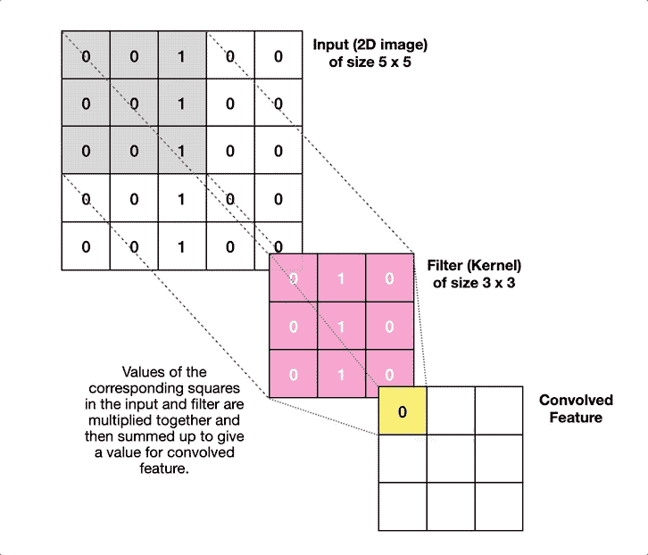
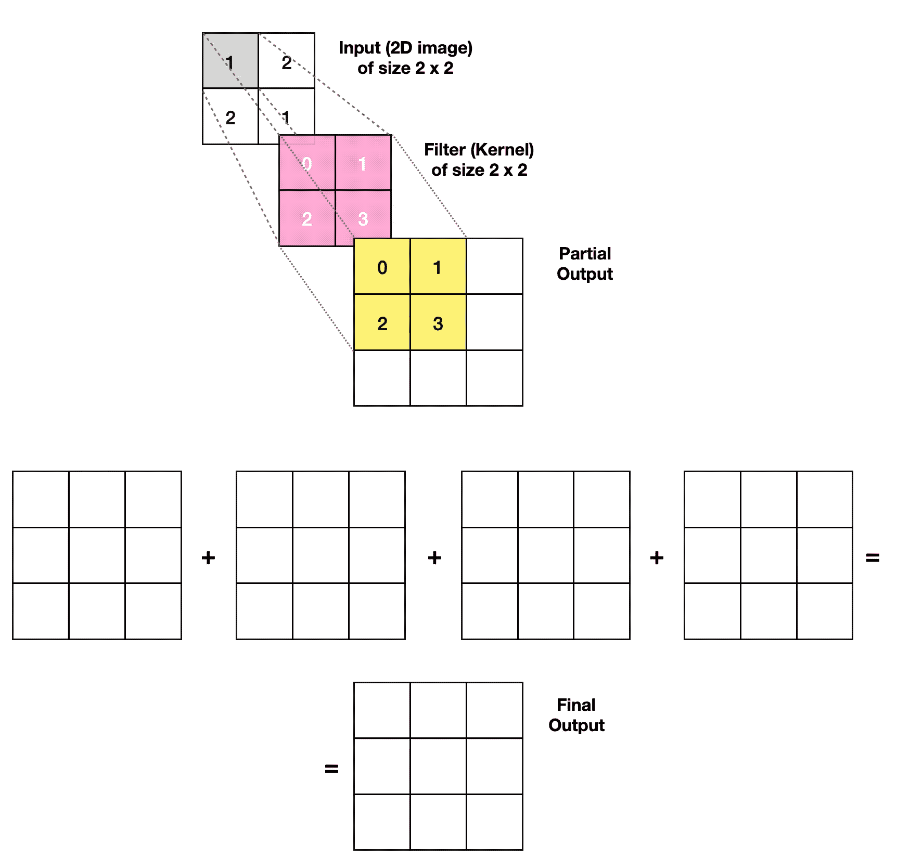
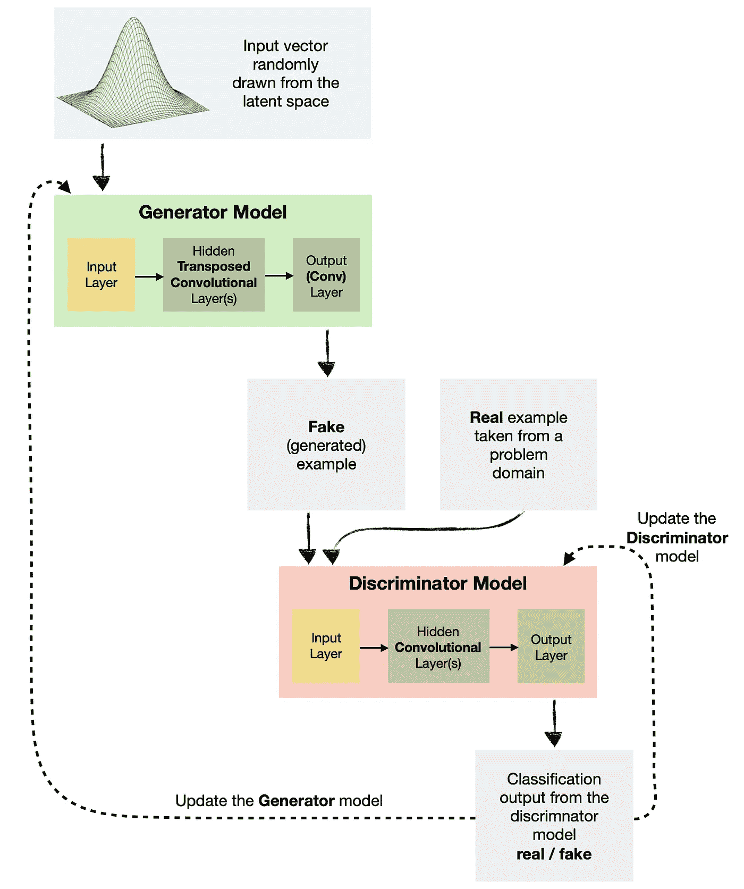
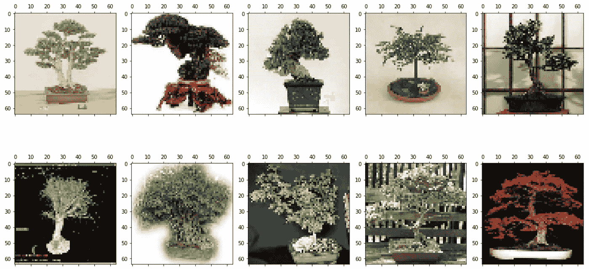
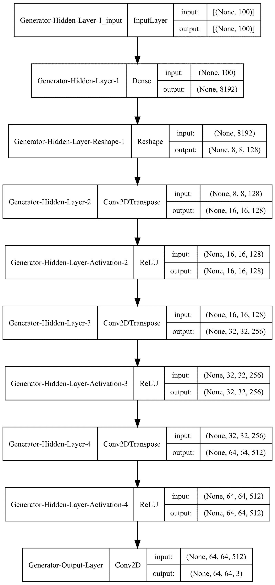
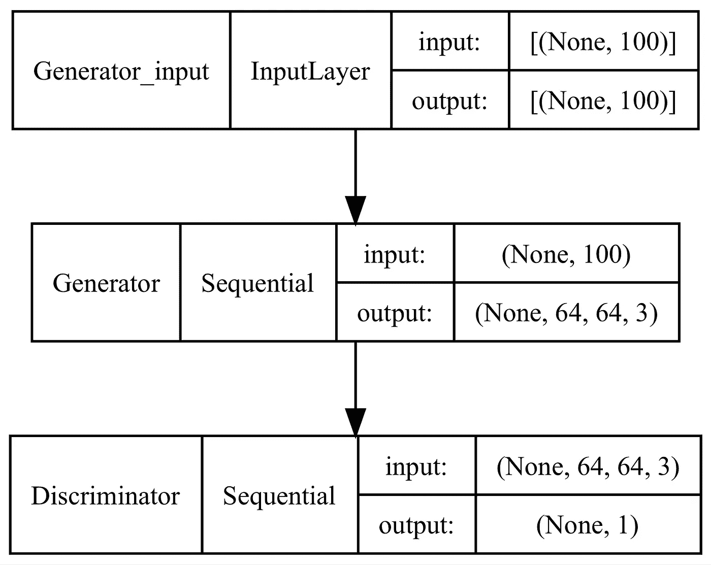
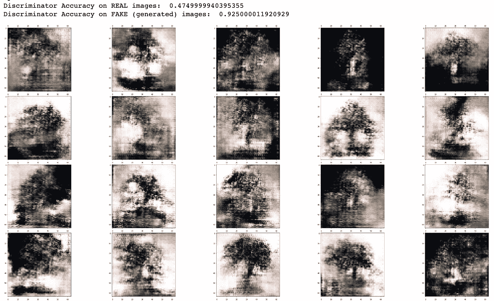
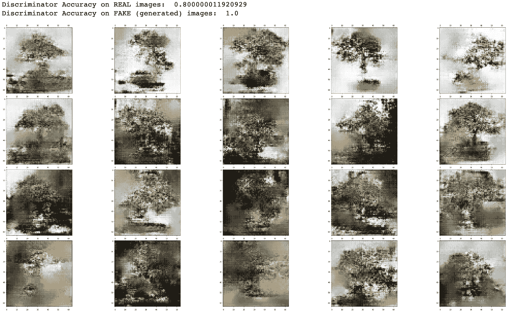

# 深度卷积 GAN——如何使用 DCGAN 在 Python 中生成图像

> 原文：<https://towardsdatascience.com/deep-convolutional-gan-how-to-use-a-dcgan-to-generate-images-in-python-b08afd4d124e>

## 神经网络

## DCGAN 架构概述，以及使用 Keras / Tensorflow 构建该架构的分步指南


图片由[52 赫兹](https://pixabay.com/users/52hertz-2683291/?utm_source=link-attribution&utm_medium=referral&utm_campaign=image&utm_content=1431760)发自 [Pixabay](https://pixabay.com/?utm_source=link-attribution&utm_medium=referral&utm_campaign=image&utm_content=1431760)

# 介绍

数据科学家将生成性对抗网络(GANs)用于广泛的任务，图像生成是最常见的任务之一。一种称为 DCGAN(深度卷积 GAN)的特定类型的 GAN 就是为此而专门开发的。

在本文中，我将解释 DCGANs，并向您展示如何使用 Keras/Tensorflow 库在 Python 中构建一个。然后，我们将使用它来生成盆景树的图像。

# 内容

*   机器学习算法领域中的 DCGANs
*   DCGAN 架构及其组件概述
*   Python 示例向您展示了如何从头开始构建 DCGAN

# 机器学习算法领域中的 DCGANs

机器学习算法之间存在相似之处，这使我们能够根据架构和用例对它们进行分类。因此，我创造了下面的观想，帮助我们看到整个 ML 宇宙。

这张旭日图是交互式的，所以请**点击探索 ML 类别👇在不同区域**展示更多内容。

你会在**神经网络分支**的**生成对抗网络子类**下找到 DCGANs。

机器学习算法分类。由[作者](https://solclover.com/)创建的互动图表。

***如果你喜欢数据科学和机器学习*** *，请* [*订阅*](https://bit.ly/3sItbfx) *获取我的新文章的电子邮件。如果你不是中等会员，可以在这里加入*[](https://bit.ly/36Mozgu)**。**

# *DCGAN 架构及其组件概述*

*首先让我强调一下，DCGAN 利用了**卷积**和**转置卷积**层，并战略性地将其嵌入到 **GAN 架构**中。*

*我们将在下面的章节中熟悉这三个项目。然而，如果你希望看到更多的解释和例子，你也可以阅读我关于[卷积神经网络](/convolutional-neural-networks-explained-how-to-successfully-classify-images-in-python-df829d4ba761)、[转置卷积](/transposed-convolutional-neural-networks-how-to-increase-the-resolution-of-your-image-d1ec27700c6a)和 [GANs](/gans-generative-adversarial-networks-an-advanced-solution-for-data-generation-2ac9756a8a99) 的深入文章。*

## *卷积层*

*卷积是从数据中提取有意义信息的一种方式。它们特别适合处理图像，使网络能够有效地学习关键特征。*

*卷积有三个部分:输入(如 2D 图像)、滤波器(又称内核)和输出(又称卷积特征)。下面的 gif 展示了我们如何在一个 5 x 5 的图像上应用一个 3 x 3 的过滤器来创建一个 3 x 3 的卷积特征。*

**

*卷积在起作用。Gif 图片由[作者](https://medium.com/@solclover)提供。*

*神经网络可以包含多个卷积层和附加池层，以减小卷积特征的大小。*

*我们将在**鉴别器模型**和**生成器模型**的最后一层中使用卷积层(在 GAN 部分有更多相关信息)。*

## *转置卷积层*

*转置卷积也使用过滤器来处理数据，但它们的目标与常规卷积相反。也就是说，我们使用它们来**上采样**数据到更大的输出特征图，而常规卷积**下采样**。*

*下面的 gif 说明了转置卷积是如何工作的。该示例使用步长 1，通过 2 x 2 滤波器从 2 x 2 输入移动到 3 x 3 输出。*

**

*转置卷积的作用。Gif 图片由[作者](https://solclover.com/)提供。*

*我们将只使用**发生器模型**内的转置卷积(见下一节)。*

## *DCGAN 架构*

*现在我们知道了什么是卷积和转置卷积，让我们看看它们如何适合 GAN 设置。*

*一个生成式对抗网络(GAN)将**生成器**和**鉴别器**模型结合在一起，它们在零和游戏中**相互竞争**，使它们成为对手。*

***发生器制造假图像**试图欺骗鉴别者相信它们是真的。同时，**鉴别器学习图片的本质特征**，以便**区分**真假样本。*

*下图说明了这两种模型在 DCGAN 架构中的交互方式。*

**

*深度卷积生成对抗网络。图片由[作者](https://solclover.com/)提供。*

*如您所见，鉴别器模型只是一个卷积分类模型。相比之下，生成器模型更复杂，因为它学习在转置和规则卷积的帮助下将潜在输入转换为实际图像。*

*[](https://solclover.com/membership)**[](https://www.linkedin.com/in/saulius-dobilas/)*

# *Python 示例向您展示了如何从头开始构建 DCGAN*

*理解 DCGAN 模型如何工作的最好方法是自己创建一个。在本例中，我们将训练一个 DCGAN 模型来生成盆景树的低分辨率(64 x 64 像素)图像。*

*请注意，该示例也适用于生成更高分辨率的图像。但是，分辨率越高，模型需要学习的参数(权重)就越多。因此，生成高分辨率图像所需的计算能力将显著增加。*

## *设置*

*我们需要获得以下数据和库:*

*   *加州理工学院 101 图像数据集([来源](https://data.caltech.edu/records/20086))*

> ****数据许可:*** [*归属 4.0 国际(CC BY 4.0)*](https://creativecommons.org/licenses/by/4.0/)*
> 
> ****参考*** *:李，f-f，安德烈托，m，兰扎托，m . a .&，，P. (2022)。加州理工 101(版本 1.0)[数据集]。CaltechDATA。*[*https://doi.org/10.22002/D1.20086*](https://doi.org/10.22002/D1.20086)*

*   *[Numpy](https://numpy.org/) 用于数据操作*
*   *[Open-CV](https://pypi.org/project/opencv-python/) 、 [Matplotlib](https://matplotlib.org/stable/index.html) 和 [Graphviz](https://graphviz.org/) 用于摄取和显示图像并显示模型图*
*   *[Tensorflow/Keras](https://www.tensorflow.org/api_docs/python/tf) 用于构建神经网络*
*   *[Scikit-学习库](https://scikit-learn.org/stable/index.html)用于特征缩放([最小最大缩放器](https://scikit-learn.org/stable/modules/generated/sklearn.preprocessing.MinMaxScaler.html)*

*让我们导入库:*

*上面的代码打印了本例中使用的包版本:*

```
*Tensorflow/Keras: 2.7.0
numpy: 1.21.4
sklearn: 1.0.1
OpenCV: 4.5.5
matplotlib: 3.5.1
graphviz: 0.19.1*
```

*接下来，我们下载、保存和摄取加州理工学院 101 图像数据集。我们将只使用盆景树的图像(类别=“盆景”)，而不是 101 个类别的完整列表。此外，我们将设置分辨率为(64 x 64)像素。*

*上面的代码打印出我们数据的形状，是**【样本，行，列，通道】**。*

```
*Shape of data_lowres:  (128, 64, 64, 3)*
```

*让我们展示一些低分辨率图像，看看我们将在哪些方面训练我们的模型。*

**

*训练数据中的低分辨率图像。来自[加州理工学院 101](https://data.caltech.edu/records/20086) 的原始图像数据。组合图片由[作者](https://solclover.com/)提供。*

*最后，让我们将当前范围为[0，1]的图像输入数据缩放到范围[-1，1]。我们这样做，所以我们可以在发生器输出中使用 **tanh 激活函数**，因为它通常会产生更好的结果。*

*然而，在发生器输出中使用 **sigmoid 激活函数**也很常见，这不需要您进一步缩放图像。*

## *创建 DCGAN 模型*

*完成数据准备后，让我们定义和组装我们的模型。我们将从发电机开始:*

**

*发电机模型图。图片由[作者](https://solclover.com/)提供。*

*我们从一个 100 节点的潜在向量开始，在将其重新整形为 8 x 8 x 128 之前，我们将其连接到 8192 节点的密集层。然后，我们通过转置卷积将数据上采样为 64 x 64 的输出。*

*请注意，我们还在输出层使用常规卷积，因为我们将过滤器从 512 个减少到只有 3 个，代表不同的颜色通道。*

*接下来，让我们定义一个鉴别器模型:*

**

*鉴别器模型图。图片由[作者](https://solclover.com/)提供。*

*如果您将它与生成器模型进行比较，您会注意到鉴别器模型做的正好相反。即，它获取 64×64 的图像，并将其通过多个卷积层，以将其简化为真/假的二进制分类输出。*

*接下来，我们将这两个模型结合起来创建一个 DCGAN。下面代码中的一个关键细节是我们**使鉴别器模型不可训练**。我们这样做是因为我们希望使用真实和虚假(生成)数据的组合来分别训练鉴别器。稍后您将看到我们是如何做到这一点的。*

**

*DCGAN 模型图。图片由[作者](https://solclover.com/)提供。*

## *为发生器和鉴频器准备输入*

*我们将创建三个简单的函数来帮助我们为这两个模型采样/生成数据。*

*第一种方法从训练数据中抽取真实图像，第二种方法从潜在空间中抽取随机向量，第三种方法将潜在变量传递到生成器模型中以生成假样本。*

## *模型训练和评估*

*最后两个函数将帮助我们训练模型，并在指定的时间间隔评估结果。*

*让我们首先创建模型性能评估函数:*

*正如您所看到的，上面的函数分别在真实和虚假(生成)点上评估鉴别器。此外，它还展示了一些模型生成的图像。*

*注意，为了显示假的(生成的)图像，我们需要**将底层数据从[-1，1]范围逆变换到[0，1]范围。***

*最后，培训功能:*

*如前所述，我们通过传递一批 50%真实和 50%虚假(生成)的样本来分别训练鉴别器。同时，发电机训练通过组合的 DCGAN 模型进行。*

## *结果*

*让我们调用训练函数来训练模型并显示一些结果。*

```
*# Train DCGAN model
train(gen_model, dis_model, gan_model, data, latent_dim)*
```

*以下是在对模型进行 2000 个纪元的训练后生成的一些假图像:*

**

*DCGAN 在 2000 个训练时期后生成盆景树图像。图片由[作者](https://solclover.com/)提供。*

*3000 年后又多了一些:*

**

*DCGAN 在 3000 个训练时期后生成盆景树图像。图片由[作者](https://solclover.com/)提供。*

*正如你所看到的，一些图像很糟糕，而另一些看起来很艺术。然而，很明显需要更多的训练。*

# *结束语*

*我鼓励你用我的例子做进一步的实验，并分享你的结果。我敢肯定，通过一些额外的培训或替代模型参数，您可以获得更好的结果。*

***如果你想收到我即将发表的关于其他类型 gan 的文章**，请用你的电子邮件订阅[，我一发表这些文章，它们就会马上到达你的收件箱。或者，请随意浏览我已经在 Medium](https://bit.ly/3uJnQFT) 上发布的关于机器学习的 40 多篇文章。*

*最后，你可以在我的 [**GitHub 库**](https://github.com/SolClover/Art053_NN_DCGAN) 上找到本文使用的完整 Python 代码作为 Jupyter 笔记本。*

*干杯！🤓
**索尔·多比拉斯***

****如果你已经花光了这个月的学习预算，下次请记得我。*** *我的个性化加盟链接媒介:**

*[](https://bit.ly/3J6StZI) *