# 使用随机森林深入 HPLBs 进行 A/B 测试

> 原文：<https://towardsdatascience.com/deep-dive-into-hplbs-for-a-b-testing-using-random-forest-11f0fdd73044>

## 测试中 *p* 的替代值


由[叶戈尔·迈兹尼克](https://unsplash.com/@vonshnauzer?utm_source=medium&utm_medium=referral)在 [Unsplash](https://unsplash.com?utm_source=medium&utm_medium=referral) 上拍摄的照片

在最近的一篇文章中，我们基于我们关于 arXiv 的文章介绍了电视距离的高概率下限(HPLB)的概念:

[https://arxiv.org/abs/2005.06006](https://arxiv.org/abs/2005.06006)，

与[洛里斯·米歇尔](https://medium.com/u/f562dceaeb63?source=post_page-----11f0fdd73044--------------------------------)的合作。

在当前的文章中，我们深入到这个主题的详细处理，并且顺便触及一些非常有用的(并且漂亮的)统计概念。特别是，我们需要从一个装有 m 个球和 n 个方块的瓮中抽取球，而不需要更换。非常感谢 [Maybritt Schillinger](https://medium.com/u/dba4029558b7?source=post_page-----11f0fdd73044--------------------------------) 的大量建设性意见！

## **大纲**

一段时间以来，人们已经知道强大的分类器(如随机森林分类器)可以用于双样本或 A/B 测试，如这里的[所解释的](https://medium.com/towards-data-science/an-alternative-to-p-values-in-a-b-testing-44f1406d3f91):我们观察两组独立的样本，一组来自分布 *P* (如治疗前的血压)，另一组来自分布 *Q* (如治疗后独立人群的血压)，我们想要测试的是*H _ 0:P = Q*给定这两组数据，我们给一组 0 的标签，给另一组 1 的标签，训练一个分类器，然后在一些独立的数据上评估这个分类器。那么很直观的是，分类器越能区分这两个组，就有越多的证据反对零。这可以是正式的，当 p 值小于预先指定的*α时，导致有效的 p 值和拒绝决定。*

这很好，因为今天的分类器是强大的，因此这种方法导致强大的双样本测试，可以潜在地检测出 *P* 和 *Q* 之间的任何差异。另一方面，我们都听说过 p 值和经典测试的问题。特别是，显著的 P 值不会告诉一个*P 和 Q 有多不同*(这与医学中的*效应大小*有关)。下图展示了一个例子，其中 *P* 和 *Q* 的差异越来越大。在每种情况下，即使强有力的双样本测试也只会给出二元拒绝决定。

因此，如果我们能够以某种方式有意义地计算出 P 与 Q 的不同程度，这将会更加有趣，理想的情况是在这个过程中仍然使用一个强大的分类器。这里，我们基于对 *P* 和 *Q* 之间的电视距离的估计来构建一个有意义的方法。

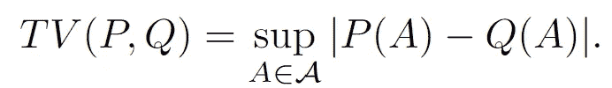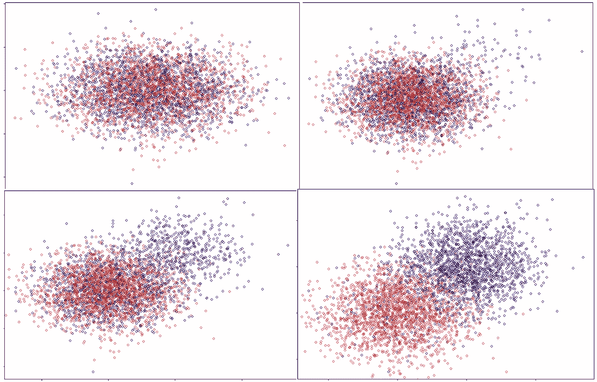

p(红色)和 Q(蓝色)的差异越来越大。一个测试，无论多么强大，都只是拒绝而没有给出额外的信息。来源:作者。

在下文中，我们假设观察来自 *P* 的内径样本 *X_1，…，X_m* 和来自 *Q* 的独立内径样本 *Y_1，…，Y_n* 。然后，我们使用分类器的概率估计值(例如，属于类别 1 的概率)作为“投影”,该“投影”采用数据向量并将它们作为概率估计值映射到真实线上。使用这些值构建单变量顺序统计量，并找到与 *TV(P，Q)* 的联系，然后我们将能够构建我们的下界。在下文中，我们有时也会将 *TV(P，Q)* 写成*λ*。

## 使用(强大的)分类器得到单变量问题

> 本节中的概念:用 m 个圆和 n 个正方形从瓮中画出没有替换的圆:使用超几何分布进行双样本测试。

一般来说，来自 *P* 、 *Q* 的样本是 *d* 维随机向量。这里，分类器已经开始发挥作用:由于大多数分类器可以获取这些 *m+n* 个样本点，并将它们转换成一个实数序列，所以对观察值 *i* 具有标签 1 的概率的预测。因此，我们可以只关注 0 和 1 之间的实数来构造我们的估计量。当然，我们真正的下限是概率估计的电视距离。因此，重要的是分类器要强大，以确保我们不会丢失太多信息。

所以，让我们假设我们有一个 *N=m+n* 实数的样本，并且我们知道这些实数中的每一个的原始观察值是来自 *P* 还是 *Q* 。然后我们就可以构建这个神奇的东西叫做*顺序统计量。*也就是说，我们取 *N* 个数字，从最小到最大排序。为了说明这一点，让我们将来自 *P* 的样本表示为圆形，将来自 *Q* 的样本表示为方形。那么订单统计可能如下所示:

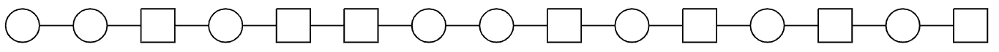

现在这里是重要的一点:*分类器试图尽可能精确地估计一个观察值属于第 1 类，或者来自 Q，或者是正方形的概率。因此，如果分类器是好的，我们应该期望在右边看到更多的正方形，因为正方形的估计概率应该比圆形大！因此，顺序统计就像一个*离心机*:如果在 *P* 和 *Q* 之间有一个可辨别的差异，并且分类器能够检测到它，概率的顺序统计将圆圈推向左边，将方块推向右边。由于仍然存在随机性和估计误差，这通常看起来并不完美。然而，我们希望它“充分不同于随机性”。*

量化这一点的一个非常优雅的方式是我们称之为 *V_z、*z 下面的圆的数量的统计。这个统计量已经被用于(单变量)测试很长时间了。也就是说，在任意一点 *z=1，…，N* ，我们简单地数一数 z 下面有多少个圆:

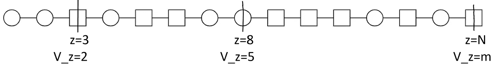

如果 *P* 和 *Q* 相同，我们应该期待什么？在这种情况下，我们只需从单个分布中提取 *N* 个独立同分布。因此，在顺序统计中，应该只有圆形和方形的随机排列，没有模式。在这种情况下， *V_z* 实际上是以均匀的概率从一个有 m 个圆和 n 个正方形的瓮中画出没有替换的圆。因此，这又回到了概率的基础。数学上:

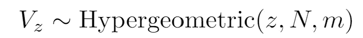

参见例如[这篇好看的文章](/hypergeometric-distribution-explained-with-python-2c80bc613bf4)。

> 在 H_0: P=Q 下， *V_z* 是超几何的:它是你从一个有 m 个圆和 n 个正方形的骨灰盒中画出 *z* 乘以*而没有替换*的次数。

很酷的是，我们现在甚至能够在 *z* ， *q(z，alpha)，*中找到任何 *alpha，*的函数，这样当 *P=Q* 时:

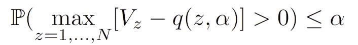

找到这个 *q(z，alpha)* 可以通过使用渐近理论(例如参见[我们的论文](https://arxiv.org/abs/2005.06006)和其中的参考文献)或者简单地通过模拟来完成。主要的一点是，我们知道 *V_z* 的分布，并且它总是相同的，不管 *P* 和 *Q* 到底是什么。因此，即使我们没有最大值的封闭分布，我们仍然可以很容易地逼近 *q(z，alpha)* 。这个可以直接用于一个(单变量)双样本检验！如果 *max_z V_z-q(z，alpha)* 过零，我们可以拒绝 *P=Q* 。

好的，这很好，但是这篇文章的要点是，我们想要摆脱简单的拒绝决策，而是得到总变化距离的下限。不幸的是，在 *P* 和 *Q* 不同的一般情况下(即 *TV(P，Q) > 0* )，不再知道 *V_z* 的分布！现在的目标是找到另一个更容易分析的过程 *B_z* ，并且对于所有的 *z=1，…，N，* *B_z ≥ V_z* 。如果我们能够正确地限制这个过程，那么这个限制也适用于 *V_z* 。

## 玩电视(P，Q)

> 本节中的概念:使用 TV 的抽样解释来引入分布见证的概念，并使用它来确定 P=Q 成立的区域，即使 P 通常不等于 Q。

通过在上一节中找到 *q(z，alpha)* ，我们基本上找到了当 *TV(P，Q)=0* 时，即如果 *P* 和 *Q* 之间没有差异，则构造下界的第一步。我们现在通过联系我们的第一篇文章来扩展这一点，并摆弄一下 *P* 和 *Q* 之间的电视距离的定义。一般来说，这是给定的


因此，我们从所有可能的集合中寻找集合 *A* ，使得 *P(A)* 和 *Q(A)* 之间的差异最大。让我们做得更具体一些:让 *p* 和 *q* 是 *P* 和 *Q* 的密度(作为一个技术细节，数据不需要通常意义上的连续，我们可以*总是*这样做)。那么最大值 *A* 被给定为

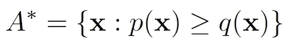

以便

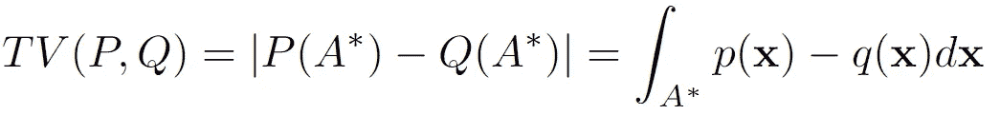

让下面的 *X* 有分配 *P* 和 *Y* 分配 *Q* 。现在关键的部分来了:我们可以用这个来定义一个新的密度

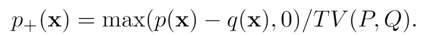

那么这是一个有效的密度(积分为 1)，我们可以类似地定义一个密度 *q_+* 。这意味着什么是最好的图形:

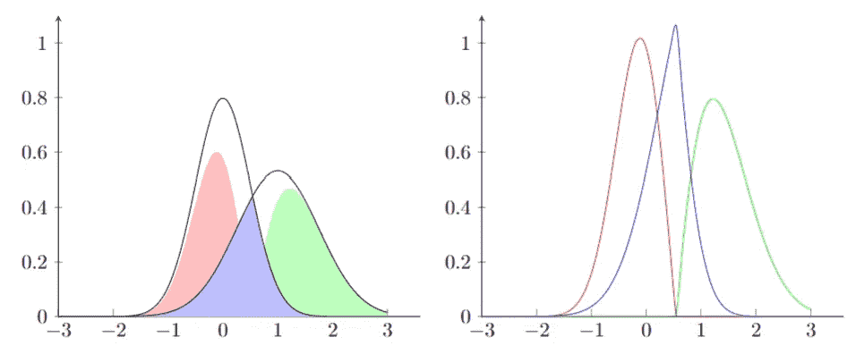

电视概念的图解。左图:两个原始密度 p 和 q，红色的 p_+右图:密度 p_+为红色，h 为蓝色，q_+为绿色。来源:作者

该图显示，密度 *p* 、 *q* 可以分解为密度 *p_+* 、 *q_+、*和一些中间部分，这对应于两个密度的最小值，如果我们用 *1-TV(P，Q)* 将其标准化，则正好积分为 1:

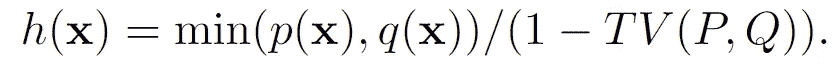

我们现在可以看到从混合物中提取的 *X* ，而不是直接从 *P* 和 *Y* 中提取的 *X*

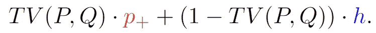

这意味着以下内容:在我们画出 *X* 之前，我们抛硬币，用概率 *TV(P，Q)* ，我们从红色密度 *p_+* 中画出 *X* ，用概率( *1-TV(P，Q)* 中画出 *h* 。对于 *X* 的分布，我们如何看待它并不重要，最终， *X* 将具有分布 *P.* 但是很明显， *X* 实际上是来自于 *p_+* 还是来自于 *h* ，因为前者对应于 p 的“唯一”部分。实际上，无论是从图形还是密度本身来看，我们都会看到*p _+*所以 *X* 要么来自 *p_+* 要么来自 *h* ，同样， *Y* 要么来自 *q_+* 要么来自 *h* 。最关键的是，如果 *Y* 和 *X* 都是从密度 *h* 中抽取的，那么它们显然来自同一个分布，没有办法区分它们，*这就好像我们在零下面。*

因此，对于 i.i.d .观察值 *X_1、…、X_m* 和 *Y_1、…、Y_n、*而言，每个观察值要么来自特定部分( *p_+* 或 *q_+* )，要么来自联合部分 *h* 。我们把从特定部分 *p_+(q_+)* *得出的观察结果称为 P (Q)的见证。*

> 从特定部分 p_+得出的观察称为见证(对于 P)。从 h 得出的观测值不能微分，所以这对应于 P 和 Q 相同的部分。

好的，如果我们回到订单统计，我们现在可以这样想:

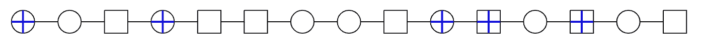

带有蓝色十字的圆圈对应于来自 *P* 的证人，而带有蓝色十字的方块对应于来自 *Q* 的证人。基本上从划掉的观测值中我们可以了解到一些关于 *P，Q* 的差异，而没有划掉的观测值基本上来自零。从某种意义上说，所有这些只是一个思想实验——我们无法知道 *X_i* 是来自 *p_+* 还是 *h* 。所以我们不知道哪些点是证人，其实我们连有几个都不知道。尽管如此，这个思想实验将有助于构建我们的估计量。

下面我们将为 *TV(P，Q)*提出一个*候选者*，比如说 *lambda_c* ，然后检查这个候选者是否符合条件。如果是的话，我们选择一个新的候选值 *lambda_c* 高于旧的候选值，并再次检查条件。我们这样做，直到*λ_ c*违反条件。

## 让我们做些清洁吧

> 本节中的概念:以高概率限制见证的数量，并使用直观的“清理操作”来获得行为更好的进程 B_z，它总是大于或等于 V_z。

我们现在要用这个思路，一些点是见证点，另一些点来自于 *P=Q* 的部分对于上面提到的统计 *V_z.* ，我们其实并不知道哪些点是见证点！那没问题，我们需要的实际上只是见证人的数量，尽管我们甚至不知道。但是，我们可以为这个数找到一个*上界*。

回想一下，我们假设 *X_1，…，X_m* 是通过从 *p_+* 中以概率 TV(P，Q)和从 *h* 中以概率 *1-TV(P，Q)* 抽取的进行采样的。所以在 *m* 观察值中的见证人数量，表示为 *w_p* ，实际上遵循一个成功概率 *TV(P，Q)* 的二项分布。因此，如果我们有一个候选人 *lambda_c* ，我们怀疑这应该是真实的电视距离，证人的数量应该遵循分布

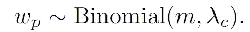

这仍然是随机的，因此我们不知道给定样本的确切结果。但是因为我们知道分布，我们可以找到一个更高的分位数 *W_p* ，这样 *w_p* 以小于*α/3*的概率超过这个分位数。例如，对于 *m=10* 和 *lambda_c=0.1* ，这可以被发现为

```
lambda_c<-0.1
m<-10
alpha<-0.05

W_p<-qbinom(p=alpha/3, size=m, prob=lambda_c, lower.tail=F)

# test
w_p<-rbinom(n=3000, size=m, prob=lambda_c)
hist(wp,main="")
abline(v=W_p, col="darkred")
```

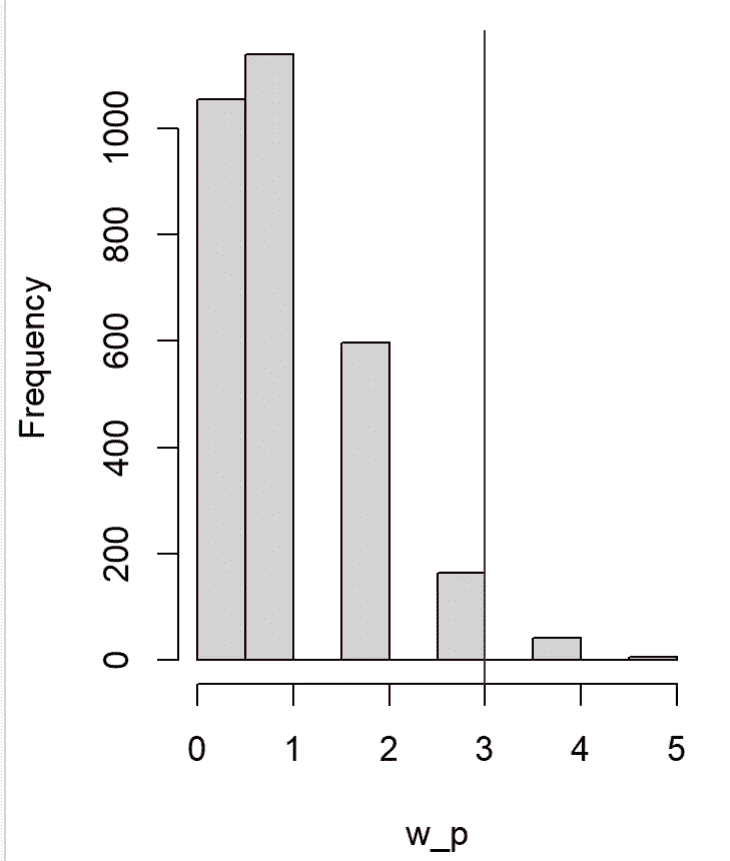

我们可以为证人做同样的事情。

所以我们有了一个候选者 *lambda_c* ，基于这个候选者，两个值 *W_p* 和 *W_q* 以高概率绑定 *w_p* 和 *w_q* 。特别是， *W_p* 和 *W_q* 直接依赖于 *lambda_c，*所以实际上最好是写 *W_p(lambda_c)* 和 *W_q(lambda_c)，*但是那样会过分夸大符号。

为了获得新的进程 *B_z* ，我们首先按照上面的顺序统计组成新的见证:

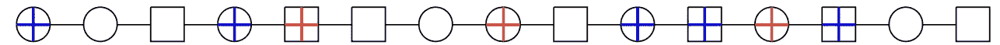

红色方块现在表示我们指定为见证的随机点。这样做是为了使见证人的数量与上限 *W_p* 和 *W_q* 相匹配。这在我们的上下文中是可以的，因为它实际上并没有改变 V_z。

现在我们执行我们的*清洁操作*。这将使我们从 *V_z* 到 *B_z* ，保证 *B_z* 至少与 *V_z* 一样大。我们从左到右和从右到左查看订单统计数据。一、从左到右，每次看到一个没有十字的圆，从右边的 *P* (有十字的圆)中随机选择一个见证人，放在空圆之前。我们这样做并没有改变没有十字的正方形和圆形的顺序，就像这样:

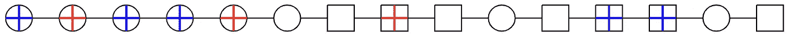

第一个圈子已经是一个见证，所以我们让它保持原样。第二个圈是非等待圈，所以我们随机将一个见证圈从更远的地方移到之前的位置。接下来是一个没有见证的正方形，所以我们从它的右边移动了一个圆形见证，以此类推。整个想法就是简单地将所有见证人从 *P* 移动到左边，将所有见证人从 *Q* 移动到右边，而不改变非见证人自身的顺序:

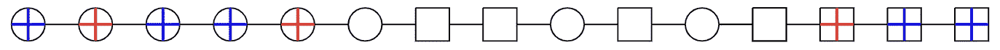

现在 *B_z* 正在计算在这个新的排序中属于 *P* 的低于 *z=1，…，N* 的观测值的数量！注意，对于第一组观察值*来说，B_z* 只是线性增加 1。然后是中间部分，其中 B_z 的行为类似于超几何过程:

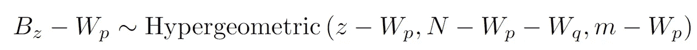

最后，最后几个观测值只是平方，所以 *B_z* 的值刚好达到 *m* 并停留在那里。

```
## Using the function defineB_z below

## Define n + m and confidence alpha
n<-50
m<-100
alpha<-0.05

# Define the candidate
lambda_c <- 0.4

plot(1:(m+n),defineB_z(m,n,alpha,lambda_c), type="l", cex=0.5, col="darkblue")

for (b in (1:100)){

  lines(defineB_z(m,n,alpha,lambda_c), col="darkblue")

} 
```

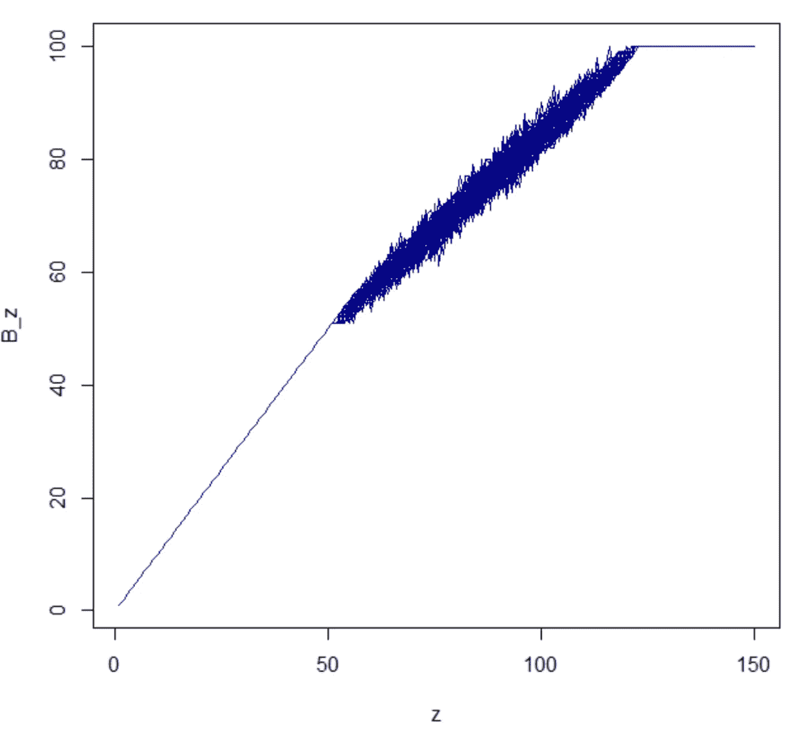

关键是我们把所有的圆圈都比以前更向左移动了！这就是为什么 *B_z* 总是大于(或等于)V _ z。特别是，对于*λ= 0*，我们期望 *W_p=0* ，因此*B _ z = V _ z。*

```
library(stats)

defineB_z <- function(m,n,alpha,lambda_c){

## Upper bound witesses for the given m, n, alpha and lamba_c

W_p<-qbinom(p=alpha/3, size=m, prob=lambda_c, lower.tail=F)
W_q<-qbinom(p=alpha/3, size=n, prob=lambda_c, lower.tail=F)

B_z<-matrix(0, nrow=n+m)

# First part: B_z=z
B_z[1:W_p,] <- 1:W_p

# Last part: B_z=m
B_z[(m+n-W_q):(m+n),] <- m

# Middle part: Hypergeometric
for (z in (W_p+1):(m+n-W_q-1) ){

  B_z[z,]<-rhyper(1, m-W_p, n-W_q, z-W_p)+W_p

}

return(B_z)
}
```

## 把所有的放在一起

> 本节中的概念:使用上面的方法得到 B_z 上的一个边界，从而得到 V_z 上的一个边界，并得到我们可以使用的 HPLBλ。它是通过一个下确界定义的，为了找到它，我们需要遍历几个候选项。

接下来，给定**真*λ= TV(P，Q)*** ，我们要找到一个 *Q(z，α，λ)*它具有

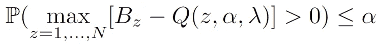

这将用于在一秒钟内定义最终估计值。至关重要的是， *Q(z，alpha，lambda_c)* 需要为任何 *lambda_c* 定义，但概率语句只需要在真候选 *lambda_c=lambda* 处为真。所以这是我目前关注的“候选人”。

从上面我们知道，对于第一个 *W_p* 值， *B_z* 只是线性增加。所以 *B_z=z* 我们也可以设置 *Q(z，alpha，lambda)=z* ，对于 *z=1，…，W_p* 。类似地，另一方面，当所有 m 个圆都被计数时，我们知道 *B_z=m* ，因此我们可以为所有的 *z=m+n-W_q，…m +n* 设置 *Q(z，alpha，lambda)=m* 。(记住，在每种情况下，*λ= TV(P，Q)* 通过 *W_p* 和 *W_q* 进入。)

剩下的是中间的部分，其行为就像在空值下一样。对于 *z=W_p+1，…，m+n-W_q* 也是如此。但是由于这里的 *B_z* 又是超几何的，我们可以使用与上面相同的 *q* 函数来得到


我们需要的 *alpha/3* ，因为我们可能会对 *W_p* 和 *W_q* 犯错误，也就是说，有一个 *alpha/3* 的机会我们没有高估。

所以我们考虑了所有情况！对于 *z=1，…，W_p，B_z-Q(z，alpha，lambda)=0* ，同样适用于最后的*W _ Q z*s，中间部分最终被上述等式覆盖。但是由于 *B_z* 大于 *V_z* ，我们也有

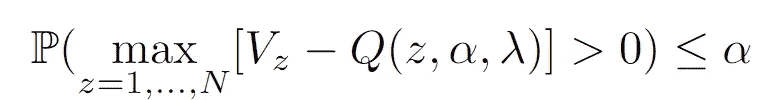

使用这个 *Q* 函数，我们可以将最终估计量定义为

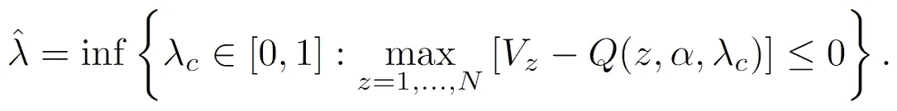

这看起来很恐怖，但它的意思只是从 *lambda_c=0* 开始，你(1)计算 *W_p(lambda_c)，W_q(lambda_c)* ，从而 *Q(z，alpha，lambda_c)* ，并且(2)检查是否

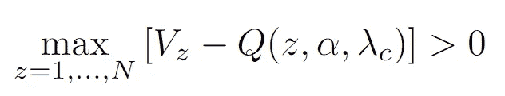

是真的。如果是，可以增加 *lambda_c* 一点点，重复步骤(1)和(2)。如果不是真的，你停下来把估计器设置为 *lambda_c* 。

从数学上讲，为什么估计量的 inf 定义有效？这仅仅意味着*λhat*是最小的*λc*这样


是真的。所以如果真的*λ(= TV(P，Q))* 小于那个最小值(我们的估计量)，这个条件就不成立，反而上面的> 0 条件成立。但是上面我们刚刚看到，这个> 0 条件有一个发生的概率≤α，所以我们没事。

所有这些都可以在克兰的 HPLB 计划中找到。下一节给出两个例子。

**一些例子**

这里，我们在两个例子中使用上一节中得到的估计量。在第一个例子中，我们使用属于类别 1 的概率的随机森林诱导估计，如上所述。在第二个例子中，我们实际上使用了一个回归函数，表明我们可以概括这里讨论的概念。

在第一篇文章中，我们已经研究了下面的例子

```
library(mvtnorm)
library(HPLB)set.seed(1)
n<-2000
p<-2#Larger delta -> more difference between P and Q
#Smaller delta -> Less difference between P and Q
delta<-0# Simulate X~P and Y~Q for given delta
U<-runif(n)
X<-rmvnorm(n=n, sig=diag(p))
Y<- (U <=delta)*rmvnorm(n=n, mean=rep(2,p), sig=diag(p))+ (1-(U <=delta))*rmvnorm(n=n, sig=diag(p))plot(Y, cex=0.8, col="darkblue")
points(X, cex=0.8, col="red")
```


在上面的模拟中， *delta* 参数决定了 *P* 和 *Q* 的差异程度，从 *delta=0* ，其中 *P=Q* ，到 *delta=1* ，其中 *P* 是一个均值为(0，0)的二元正态，而 *Q* 是一个均值为(2，2)的二元正态。即使是强有力的双样本测试也会简单地拒绝所有这些情况。通过我们的方法，使用随机森林概率估计，我们得到

```
#Estimate HPLB for each case (vary delta and rerun the code)
t.train<- c(rep(0,n/2), rep(1,n/2) )
xy.train <-rbind(X[1:(n/2),], Y[1:(n/2),])
t.test<- c(rep(0,n/2), rep(1,n/2) )
xy.test <-rbind(X[(n/2+1):n,], Y[(n/2+1):n,])
rf <- ranger::ranger(t~., data.frame(t=t.train,x=xy.train))
rho <- predict(rf, data.frame(t=t.test,x=xy.test))$predictions
tvhat <- HPLB(t = t.test, rho = rho, estimator.type = "adapt")
tvhat
```

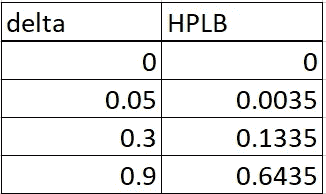

正如我们所希望的:当分布相同时，下限为零(即隐式测试不能拒绝)，并且随着 *P* 和 *Q* 变得更加不同而逐渐增加(即 *delta* 增加)。

我们还可以看一个更一般的例子。假设我们观察到一个(或多或少)独立的样本，但是在中间有一个均值偏移:

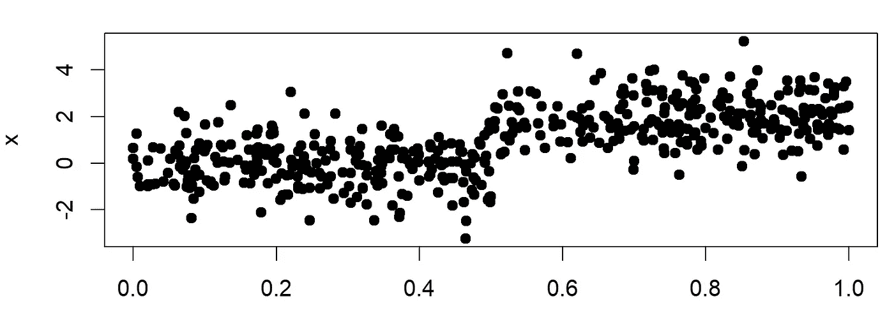

在本例中，让我们将观察值的索引视为时间 t，从左到右，我们从时间 *t=1* 移动到 *t=1000* 。代码如下。我们现在可以在每个感兴趣的点(例如每个采样点)检查左侧的*P*=点和右侧的*Q*=点之间的电视距离有多大。这可以通过再次使用每个 *t* 的概率估计来完成，但是为了加快速度，我们改为对观测值 *z_t.* 使用时间 *t* 的回归，也就是说，我们检查观测值是否给我们一个指示，即它是更偏向左边还是右边。

下图显示了红色的 true TV 和黑色的 HPLB:

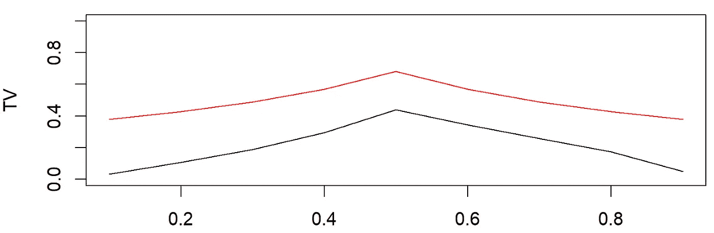

可以看出，当我们在图中从左向右移动时，该方法很好地检测到电视距离的增加。然后在分布发生变化的点达到峰值，表明主要变化发生在那里。当然，从下面的代码中可以看出，我在这里作弊了一点；我将整个过程生成了两次，一次用于训练，一次用于测试。一般来说，在这个例子中，人们必须更加小心地选择训练集和测试集。

重要的是，在我们计算电视距离的每一点，我们隐式地计算一个双样本测试。

```
library(HPLB)
library(ranger)
library(distrEx)

n <- 500
mean.shift <- 2
t.train <- runif(n, 0 ,1)
x.train <- ifelse(t.train>0.5, stats::rnorm(n, mean.shift), stats::rnorm(n))
rf <- ranger::ranger(t~x, data.frame(t=t.train,x=x.train))

n <- 500
t.test <- runif(n, 0 ,1)
x.test <- ifelse(t.test>0.5, stats::rnorm(n, mean.shift), stats::rnorm(n))
rho <- predict(rf, data.frame(t=t.test,x=x.test))$predictions

## out-of-sample
tv.oos <- HPLB(t = t.test, rho = rho, s = seq(0.1,0.9,0.1), estimator.type = "adapt")

## total variation values
tv <- c()
for (s in seq(0.1,0.9,0.1)) {

  if (s<=0.5) {

    D.left <- Norm(0,1)
  } else {

    D.left <- UnivarMixingDistribution(Dlist = list(Norm(0,1),Norm(mean.shift,1)),
                                       mixCoeff = c(ifelse(s<=0.5, 1, 0.5/s), ifelse(s<=0.5, 0, (s-0.5)/s)))
  }
  if (s < 0.5) {

    D.right <- UnivarMixingDistribution(Dlist = list(Norm(0,1),Norm(mean.shift,1)),
                                        mixCoeff = c(ifelse(s<=0.5, (0.5-s)/(1-s), 0), ifelse(s<=0.5, (0.5/(1-s)), 1)))
  } else {

    D.right <- Norm(mean.shift,1)
  }
  tv <- c(tv, TotalVarDist(e1 = D.left, e2 = D.right))
}

## plot
oldpar <- par(no.readonly =TRUE)
par(mfrow=c(2,1))
plot(t.test,x.test,pch=19,xlab="t",ylab="x")
plot(seq(0.1,0.9,0.1), tv.oos$tvhat,type="l",ylim=c(0,1),xlab="t", ylab="TV")
lines(seq(0.1,0.9,0.1), tv, col="red",type="l")
par(oldpar) 
```

## 结论

在本文中，我们深入探讨了电视远程 HPLB 的构建。当然，我们真正的下限是概率估计的电视距离。事实上，面临的挑战是找到一个足够强大的“投影”或分类器，仍然可以找到信号。像我们在这里使用的随机森林算法就是这种强大方法的例子，而且不需要任何调整。

我们希望通过这里提供的代码和 HPLB 软件包中的 CRAN，我们在这里做的这些基本概率考虑实际上可以用于一些现实世界的问题。