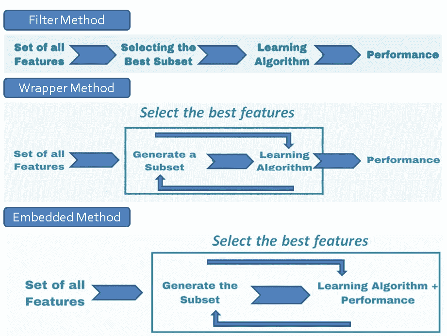
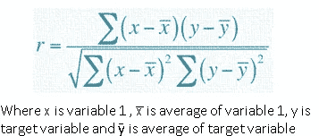
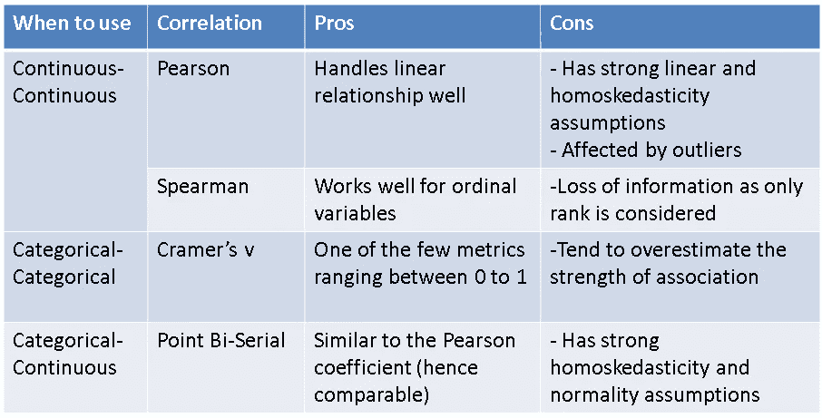
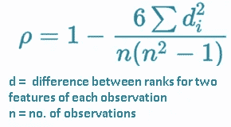
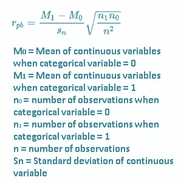
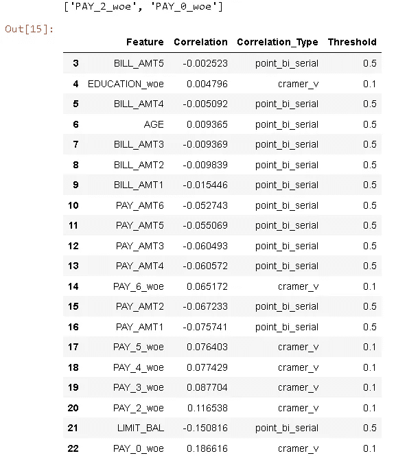
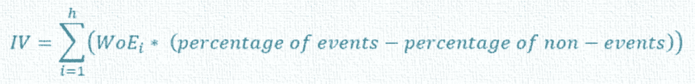
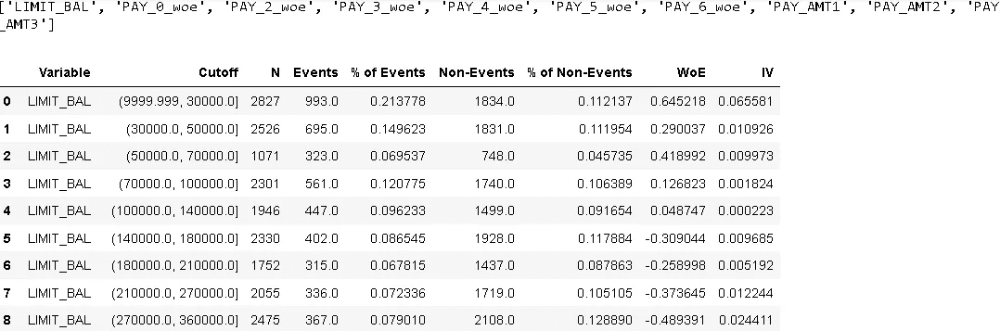
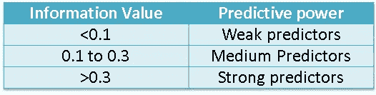

# 深入探讨 Python 中特性选择的 ML 技术——第 1 部分

> 原文：<https://towardsdatascience.com/deep-dive-on-ml-techniques-for-feature-selection-in-python-part-1-3574269d5c69>

## Python 中 AI 驱动的特征选择！

## 基于最大似然的特征选择系列的第一部分，其中我们讨论了流行的过滤方法，如皮尔逊、斯皮尔曼、点双序列相关、克莱姆 v 和信息值


照片由 [**Edu 格兰德**](https://unsplash.com/@edgr) 上 [Unsplash](https://unsplash.com/photos/0vY082Un2pk)

> “垃圾进，垃圾出！”

这是一个任何建立机器学习模型的人都可以尽早使用的短语。简单地说，如果模型的输入数据有很多噪声，那么输出数据也会有噪声。

如今，数据集拥有数百万行和数千个要素，我们需要工具来有效地识别为我们的模型选择哪些要素。这就是特征选择算法适合模型开发旅程的地方。这里有一个它的好处的快速总结—

*   随着过度拟合和[虚假关系](https://www.sciencedirect.com/topics/mathematics/spurious-correlation)的机会减少，模型精度提高
*   可以解决[多重共线性](https://en.wikipedia.org/wiki/Multicollinearity)的问题
*   减少数据量，有助于模型训练更快
*   具有少量相关特征的模型更容易解释

我已经在不同的公司建立数据科学模型 5 年多了，我发现特征选择算法和用于预测的实际模型一样重要。在机器学习建模的这个关键方面，最近已经有了很多改进。将所有最新和最流行的要素选择方法连同它们的 python 实现一起放在一个地方不是很好吗？嗯，这是这个博客的灵感！

# 博客系列部分

*   特征选择方法的类型(上)
*   相关性:皮尔逊，点双序列，克莱姆的 V(第一部分)
*   证据权重和信息价值(上)
*   贝塔系数(第二部分)
*   套索回归(下)
*   递归特征选择和顺序特征选择器(第二部分)
*   博鲁塔:博鲁塔比，博鲁塔沙普(第三部分)
*   将所有内容整合在一起(第 3 部分)

## a)特征选择方法的类型

关于特征选择算法，首先要注意的是，它们分为 3 类:

1.  **过滤方法**:根据单变量统计指标对每个特征进行排名，并挑选排名最高的特征。

    **优点** : *它们是模型不可知的，最容易计算和解释* **缺点** : *最大的缺点是它们不能识别本身是弱预测器但当与其他特征组合时是重要预测器的特征* **示例:**相关性，信息值
2.  **包装方法**:使用特征子集，然后使用它们训练用户定义的模型。根据模型的性能，它会添加或删除子集中的特征，并训练另一个模型。这个过程一直持续到达到期望的特征数量或者性能度量达到期望的阈值。

3.  **嵌入方法:**像 Lasso 回归这样的模型有它们自己的内置特征选择方法，它们在回归方程中添加一个惩罚项以减少过度拟合

    **优点** : *比过滤方法更快的计算和更好的准确性*
    **缺点** : *具有内置特征选择方法的有限模型* **示例:** Lasso 回归

下面是这些方法的简要总结:



作者图片

对于这个博客系列，我们使用来自 UCI 机器学习资源库的信用卡客户数据 Se 的" [***默认值***](https://archive.ics.uci.edu/ml/datasets/default+of+credit+card+clients)**"**。它很好地结合了记录(30K)和特征数(24)。每个特性的具体细节可以在[网站](https://archive.ics.uci.edu/ml/datasets/default+of+credit+card+clients)上找到。我已经完成了数据集的一些基本准备工作(分配列类型、分类变量的编码等)。)并且代码可以在[这里](https://github.com/IDB-FOR-DATASCIENCE/ML-based-feature-selection.git)找到。

## b)相关性:皮尔逊、点双序列、克拉默 V

相关性是两个变量之间关系的强度和方向的量化(在我们的例子中，是特征和目标变量之间的量化)。最常见的相关类型是皮尔逊相关，使用以下公式计算:



作者图片

但是皮尔逊相关只能计算两个连续变量之间的关系，这是一个主要的限制(特别是对于目标变量是分类变量的分类问题)。没有一个相关性度量可以单独量化所有分类变量对和连续变量对之间的关系。因此，我们需要根据变量类型使用不同的指标。我们还需要记住，出于特性选择的目的，指标应该是可比较的。考虑到这些因素，我倾向于以下组合:



作者图片

我们已经查看了人员关联公式，让我们快速浏览一下表格中提到的其他内容:

我)斯皮尔曼:

第一步是分别计算每列的每个观察值的等级(最高值为等级 1)。然后使用以下公式:



作者图片

计算斯皮尔曼相关的例子可以在[这里](https://statistics.laerd.com/statistical-guides/spearmans-rank-order-correlation-statistical-guide-2.php#:~:text=The%20Spearman%20correlation%20coefficient%2C%20rs%2C%20can%20take%20values%20from,the%20association%20between%20the%20ranks.)找到。

**ii)点双连载:**

点双序列相关假设分类变量有两个值 0 和 1。我们首先将数据分为两组:

*组 0:其中分类变量= 0
组 1:其中分类变量= 1*

然后我们使用下面的公式



作者图片

计算点双序列相关性的例子可以在[这里](https://statistics.laerd.com/spss-tutorials/point-biserial-correlation-using-spss-statistics.php#:~:text=For%20example%2C%20you%20could%20use,%22%20and%20%22females%22).)找到。

**三)克莱姆氏 V:**

其计算方法为: **√(X2/n) / min(c-1，r-1)**

其中:

*   **n:** 观察次数
*   **c:** 列数
*   行数
*   **X2:** 卡方统计

计算克莱姆 V 的例子可以在[这里](https://www.statology.org/cramers-v-in-excel/)找到。

*根据优缺点，可以考虑各种其他相关性指标(有关更多详细信息，请参考此处的*<https://medium.com/@outside2SDs/an-overview-of-correlation-measures-between-categorical-and-continuous-variables-4c7f85610365>**),但是上述指标是可比的，并且具有相同的范围。**

****这里是一个 python 函数，用于实现所有的相关性指标:****

*为了计算皮尔逊和双序列相关性，`scipy`包有函数`corr`和`pointbiserialr`。python 中没有计算 Cramer 的 V 的直接函数，因此我在下面的代码片段中添加了一个函数。功能`corr_feature_selection`基于用户指定的相关性类型计算相关性，并且还基于用户提供的阈值选择特征。例如，如果`pearson_threshold`是. 5，它将选择绝对皮尔逊相关超过 50%的特征。*

```
*#1.Select the top n features based on absolute correlation with train_target variable# Correlationpearson_list = []
point_bi_serial_list = ['LIMIT_BAL', 'AGE', 'BILL_AMT1', 
                        'BILL_AMT2', 'BILL_AMT3', 'BILL_AMT4',
                        'BILL_AMT5', 'BILL_AMT6', 'PAY_AMT1', 
                        'PAY_AMT2', 'PAY_AMT3','PAY_AMT4', 
                        'PAY_AMT5', 'PAY_AMT6']cramer_list = ['SEX_woe', 'EDUCATION_woe',
               'MARRIAGE_woe', 'PAY_0_woe', 
               'PAY_2_woe', 'PAY_3_woe', 'PAY_4_woe',
               'PAY_5_woe', 'PAY_6_woe']pearson_threshold = .5
point_bi_serial_threshold = .5
cramer_threshold = .1################################ Functions ############################################################## Function to calculate Cramer's V
def cramers_V(var1,var2) :
  crosstab=np.array(pd.crosstab(var1,var2, 
                                 rownames=None, colnames=None))
  stat = chi2_contingency(crosstab)[0]
  obs = np.sum(crosstab) 
  mini = min(crosstab.shape)-1 
  return (stat/(obs*mini))# Overall Correlation Function
def corr_feature_selection(data,target,pearson_list,
                           point_bi_serial_list,cramer_list,
                           pearson_threshold,
                           point_bi_serial_threshold,
                           cramer_threshold):

    #Inputs
    # data - Input feature data
    # target - Target Variable
    # pearson_list - list of continuous features (if target is continuous)
    # point_bi_serial_list - list of continuous features (if target is categorical)/
    #                        list of categorical features (if target is continuous)   
    # cramer_list - list of categorical features (if target is categorical)
    # pearson_threshold - select features if pearson corrrelation is above this
    # point_bi_serial_threshold - select features if biserial corrrelation is above this
    # cramer_threshold - select features if cramer's v is above this  

    corr_data = pd.DataFrame()# Calculate point bi-serial
    for i in point_bi_serial_list:
        # Manual Change in Parameters - Point Bi-Serial
        # Link to function parameters - [https://docs.scipy.org/doc/scipy-0.14.0/reference/generated/scipy.stats.pointbiserialr.html](https://docs.scipy.org/doc/scipy-0.14.0/reference/generated/scipy.stats.pointbiserialr.html)
        pbc = pointbiserialr(target, data[i])   
        corr_temp_data = [[i,pbc.correlation,"point_bi_serial"]]
        corr_temp_df = pd.DataFrame(corr_temp_data, 
                                    columns = ['Feature', 
                                               'Correlation',
                                               'Correlation_Type'])
        corr_data = corr_data.append(corr_temp_df)# Calculate cramer's v
    for i in cramer_list:
        cramer = cramers_V(target, data[i])
        corr_temp_data = [[i,cramer,"cramer_v"]]
        corr_temp_df = pd.DataFrame(corr_temp_data,
                                    columns = ['Feature',
                                               'Correlation',
                                               'Correlation_Type'])
        corr_data = corr_data.append(corr_temp_df)# Calculate pearson correlation
    for i in pearson_list:
        # Manual Change in Parameters - Perason
        # Link to function parameters - [https://pandas.pydata.org/docs/reference/api/pandas.DataFrame.corr.html](https://pandas.pydata.org/docs/reference/api/pandas.DataFrame.corr.html)
        pearson = target.corr(data[i])
        corr_temp_data = [[i,pearson,"pearson"]]
        corr_temp_df = pd.DataFrame(corr_temp_data,
                                    columns = ['Feature',
                                               'Correlation',
                                               'Correlation_Type'])
        corr_data = corr_data.append(corr_temp_df)# Filter NA and sort based on absolute correlation
    corr_data = corr_data.iloc[corr_data.Correlation.abs().argsort()] 
    corr_data = corr_data[corr_data['Correlation'].notna()]
    corr_data = corr_data.loc[corr_data['Correlation'] != 1]

    # Add thresholds

    # initialize list of lists
    data = [['pearson', pearson_threshold],
            ['point_bi_serial', point_bi_serial_threshold],
            ['cramer_v', cramer_threshold]] threshold_df = pd.DataFrame(data,
                                columns=['Correlation_Type',
                                         'Threshold'])
    corr_data = pd.merge(corr_data,threshold_df,
                         on=['Correlation_Type'],how = 'left')# Select Features with greater than user dfined absolute correlation
    corr_data2 = corr_data.loc[corr_data['Correlation'].abs() > corr_data['Threshold']]
    corr_top_features = corr_data2['Feature'].tolist()
    print(corr_top_features)
    corr_top_features_df = pd.DataFrame(corr_top_features,columns = ['Feature'])
    corr_top_features_df['Method'] = 'Correlation'
    return corr_data,corr_top_features_df################################ Calculate Correlation #############################################################corr_data,corr_top_features_df = corr_feature_selection(train_features_v2,train_target,
                                   pearson_list,point_bi_serial_list,
                                   cramer_list,pearson_threshold,
                                   point_bi_serial_threshold,cramer_threshold)

corr_data.tail(30)*
```

**

*作者图片*

# *c)证据权重和信息价值*

*这两个术语已经广泛用于多个领域的特征选择(尤其是信用评分模型)。WOE 表示一个特征的预测能力的程度。它假设模型中的目标变量是二分法的(即有两个值，如事件和非事件)。使用以下步骤进行计算:*

1.  *对于连续特征，将数据分割成箱*
2.  *对于每个箱，计算事件下的观察百分比和非事件下的观察百分比。*
3.  *使用以下公式计算每个箱的权重*

**

*作者图片*

*如上所示，WOE 计算特征中每个条柱的预测能力。然后，我们可以使用 IV 来聚合 WOE，以获得该特征作为一个整体的预测能力。其计算方法如下:*

**

*作者图片*

*其中 h 是仓的数量。*

****下面是一个计算 WOE 和 IV 的 python 函数:****

*类似于函数`corr_feature_selection`，`iv_woe`计算 WOE 和 IV，并基于用户提供的阈值选择特征。例如，如果`iv_threshold`是. 1，它将选择 IV 大于. 1 的特征。用户还可以选择连续变量需要多少个箱。*

```
*#2\. Select top features based on information value# Information valueshow_woe = True
iv_bins = 10
iv_threshold = .1################################ Functions #############################################################def iv_woe(data, target, iv_bins,iv_threshold, show_woe):

    #Inputs
    # data - Input Data including target variable
    # target - Target Variable name
    # iv_bins - Number of iv_bins
    # show_woe - show all the iv_bins and features
    # iv_threshold - select features with IV greater than this

    #Empty Dataframe
    newDF,woeDF = pd.DataFrame(), pd.DataFrame()

    #Extract Column Names
    cols = data.columns

    #Run WOE and IV on all the independent variables
    for ivars in cols[~cols.isin([target])]:
        if (data[ivars].dtype.kind in 'bifc') and (len(np.unique(data[ivars]))>10):
            binned_x = pd.qcut(data[ivars], iv_bins,  duplicates='drop')
            d0 = pd.DataFrame({'x': binned_x, 'y': data[target]})
        else:
            d0 = pd.DataFrame({'x': data[ivars], 'y': data[target]})# Calculate the number of events in each group (bin)
        d = d0.groupby("x", as_index=False).agg({"y": ["count", "sum"]})
        d.columns = ['Cutoff', 'N', 'Events']

        # Calculate % of events in each group.
        d['% of Events'] = np.maximum(d['Events'], 0.5) / d['Events'].sum()# Calculate the non events in each group.
        d['Non-Events'] = d['N'] - d['Events']
        # Calculate % of non events in each group.
        d['% of Non-Events'] = np.maximum(d['Non-Events'], 0.5) / d['Non-Events'].sum()# Calculate WOE by taking natural log of division of % 
        # of non-events and % of events
        d['WoE'] = np.log(d['% of Events']/d['% of Non-Events'])
        d['IV'] = d['WoE'] * (d['% of Events'] - d['% of Non-Events'])
        d.insert(loc=0, column='Variable', value=ivars)
        print("Information value of " + ivars + " is " + 
              str(round(d['IV'].sum(),6)))
        temp =pd.DataFrame({"Variable" : [ivars],
                            "IV" : [d['IV'].sum()]},
                           columns = ["Variable", "IV"])
        newDF=pd.concat([newDF,temp], axis=0)
        woeDF=pd.concat([woeDF,d], axis=0)#Show WOE Table
        if show_woe == True:
            print(d)

    # Aggregate IV at feature level
    woeDF_v2 = pd.DataFrame(woeDF.groupby('Variable')['IV'].agg('sum'),
                            columns= ['IV']).reset_index()
    woeDF_v3 = woeDF_v2.sort_values(['IV'], ascending = False)
    IV_df = woeDF_v2[woeDF_v2['IV']> iv_threshold]
    woe_top_features = IV_df['Variable'].tolist()
    print(woe_top_features)
    woe_top_features_df = pd.DataFrame(woe_top_features,columns = ['Feature'])
    woe_top_features_df['Method'] = 'Information_value'
    return newDF, woeDF,IV_df, woe_top_features_df################################ Calculate IV #############################################################train_features_v3_temp = pd.concat([train_target, train_features_v2],
                                   axis =1)newDF, woeDF,IV_df, woe_top_features_df = iv_woe(train_features_v3_temp, 
                                              target,iv_bins,iv_threshold, 
                                              show_woe)
woeDF.head(n=50)*
```

**

*作者图片*

*以下是基于 IV 的常见特征分类:*

**

*作者图片*

*鉴于 WoE 和 IV 善于解释线性关系，记住使用 IV 选择的特征可能不是非线性模型的最佳特征集是很重要的。此外，这种特征选择方法应该仅用于分类问题。*

# *最后的话*

*我希望这个博客系列能够帮助其他数据科学家使用最大似然法提供的最佳方法来识别他们数据集中真正的瑰宝。整个端到端的分析可以在[这里](https://github.com/IDB-FOR-DATASCIENCE/ML-based-feature-selection.git)找到。在第一部分中，我们讨论了以下内容:*

*   **各类特征选择方法概述**
*   **用于特征选择的相关性指标类型——理论和 python 实现**
*   **什么是 WOE 和 IV，如何计算？和他们的 python 实现**

*尽管我们在博客中讨论的过滤方法易于计算和理解，但它们并不是多变量建模(具有多个特征的模型)的最佳选择。这就是为什么我会敦促读者去看看下一个[博客](https://indraneeldb1993ds.medium.com/deep-dive-on-ml-techniques-for-feature-selection-in-python-part-2-c258f8a2ac43)，它关注一些有趣的包装器和嵌入式方法，比如套索回归、Beta 系数、递归特征选择等等..*

*你对这个博客有什么问题或建议吗？请随时留言。*

# *参考材料*

*   *[*分类变量和连续变量之间相关性度量的概述*](https://medium.com/@outside2SDs/an-overview-of-correlation-measures-between-categorical-and-continuous-variables-4c7f85610365)*
*   *[*如何在 Excel 中计算克莱姆的 V*](https://www.statology.org/cramers-v-in-excel/)*
*   *[*点-双列相关采用 SPSS 统计*](https://statistics.laerd.com/spss-tutorials/point-biserial-correlation-using-spss-statistics.php#:~:text=For%20example,%20you%20could%20use,%22%20and%20%22females%22).)*

# *我们连线吧！*

*如果你和我一样，对 AI、数据科学或经济学充满热情，请随时在 [LinkedIn](http://www.linkedin.com/in/indraneel-dutta-baruah-ds) 、 [Github](https://github.com/IDB-FOR-DATASCIENCE) 和 [Medium](https://medium.com/@indraneeldb1993ds) 上添加/关注我。*

**

*皮特·佩德罗萨在 [Unsplash](https://unsplash.com/photos/VyC0YSFRDTU) 上的照片*