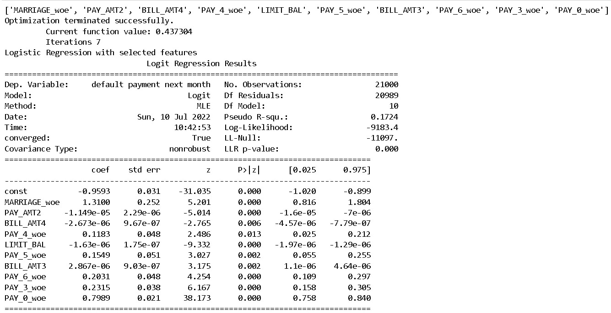
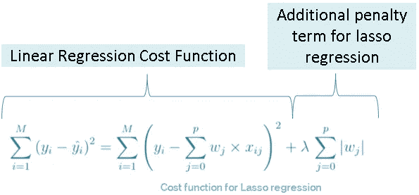
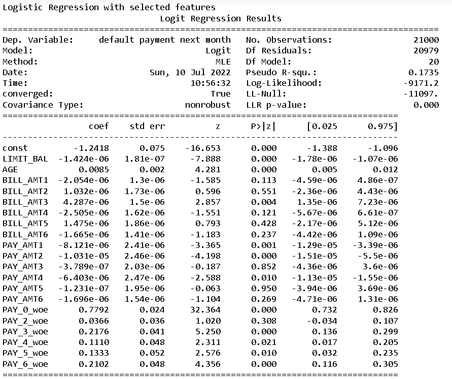
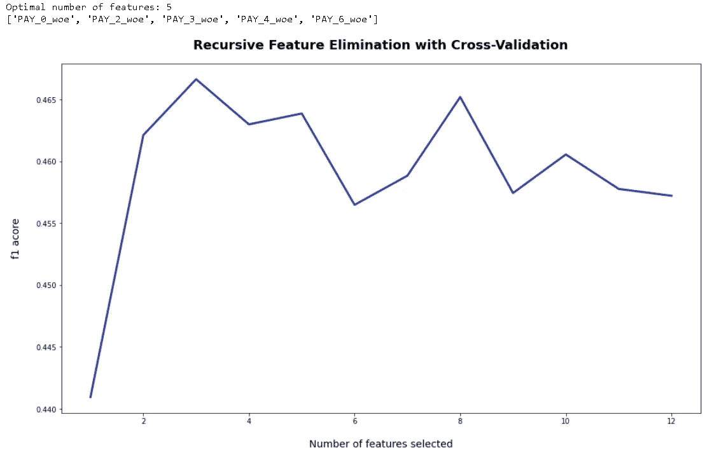
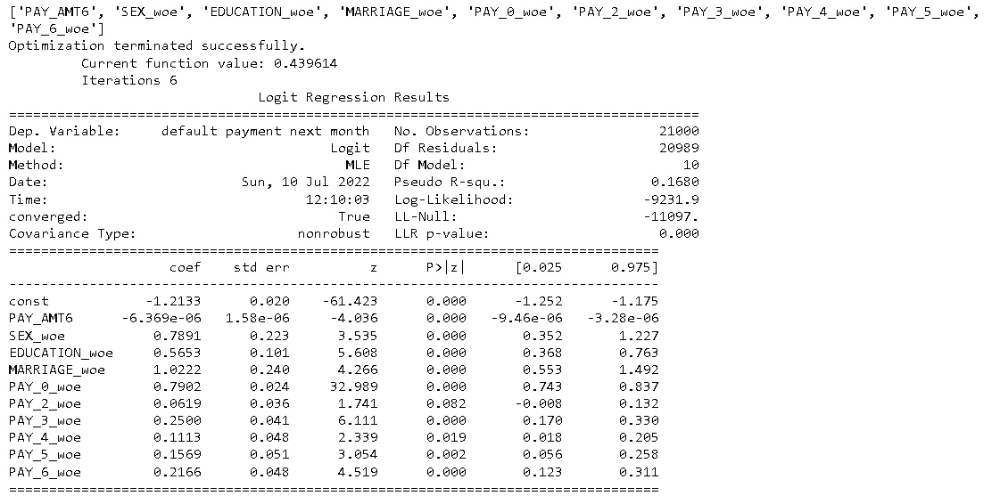

# 深入探讨 Python 中特性选择的 ML 技术—第 2 部分

> 原文：<https://towardsdatascience.com/deep-dive-on-ml-techniques-for-feature-selection-in-python-part-2-c258f8a2ac43>

## Python 中 AI 驱动的特征选择！

## 基于最大似然的特征选择系列的第二部分，我们将讨论流行的嵌入和包装方法，如套索回归、贝塔系数、递归特征选择等。


照片由 [**凯文 Ku**](https://unsplash.com/@ikukevk) 上[的 Unsplash](https://unsplash.com/photos/w7ZyuGYNpRQ)

欢迎来到我关于基于 ML 的特征选择的博客系列的第二部分！我们都知道大数据时代已经到来，但有时很难理解大数据到底有多“大”。我最近读了一篇有趣的博客,这篇博客很好地诠释了这一点:

1.  2020 年，每天会产生 2.5 万亿个数据字节
2.  2020 年，平均每个人每秒至少产生 1.7 MB 的数据
3.  到 2025 年，云数据存储将达到 200+ Zettabytes

似乎有点令人生畏，对吧？我从数据量的快速增长中得出的一个结论是，我们不能再使用“厨房水槽”的方法来建模。这种方法仅仅意味着我们把“除了厨房水槽以外的所有东西”都扔进模型，希望找到某种模式。用这种方法，我们的模型根本无法理解大数据集。这就是使用特征选择方法首先剔除数据中的噪声，然后继续开发模型的关键所在。

在第一篇[博客](https://indraneeldb1993ds.medium.com/deep-dive-on-ml-techniques-for-feature-selection-in-python-part-1-3574269d5c69)中，我们概述了不同类型的特征选择方法，并讨论了一些过滤方法，如信息值。在第二部分，我们将深入探讨以下有趣的方法:

a)贝塔系数
B)套索回归
C)递归特征选择
D)顺序特征选择器

关于数据集的细节和整个代码(包括数据准备)可以在这个 [Github repo](https://github.com/IDB-FOR-DATASCIENCE/ML-based-feature-selection.git) 中找到。所以事不宜迟，让我们开始吧！

# **A)贝塔系数**

关于贝塔系数，首先要理解的是，它是基于回归模型的。最简单的回归模型是线性回归，它试图拟合一个方程，该方程线性地解释目标变量和特征之间的关系。它表示为:

*Y = b0 + b1*X1 + b2*X2 + b3*X3 + …。bn*Xn + u*

其中 Y 是目标变量，X1…Xn 是特征，b1…bn 是系数，u 是误差项。系数告诉我们，如果特性增加 1 个单位，那么对目标变量的边际(保持所有其他特性不变)影响是什么。深入回归模型(如假设、诊断检查等。)，我会建议通过以下方式:

1.  [回归分析回顾](https://hbr.org/2015/11/a-refresher-on-regression-analysis)
2.  [线性回归假设](https://dss.princeton.edu/online_help/analysis/regression_intro.htm)
3.  [多元回归分析简介](https://www.ncbi.nlm.nih.gov/pmc/articles/PMC3049417/)
4.  [基础计量经济学(第 2-13 章)](https://www.amazon.in/Basic-Econometrics-Damodar-Gujarati/dp/0071333452)(深入涵盖所有回归相关主题)

***我们为什么要标准化特征？*** 关于系数，需要注意的一件有趣的事情是，它们受特征比例的影响。例如，如果我们的目标是 GDP，而特征是以百万卢比为单位的预算赤字和以%为单位的中央银行回购利率，我们无法比较系数来判断哪个特征对 GDP 的影响更大。为了使系数具有可比性，我们需要将特征标准化。标准化特征包括以下步骤:

1.  *计算特征的平均值*
2.  *计算特征的标准偏差*
3.  *对于每个观察值，减去平均值，然后除以标准偏差*

标准化后，每个特征的平均值为 0，标准偏差为 1，因此具有可比性。**这种标准化特征的系数称为β系数。**我们可以根据 beta 系数的绝对值对特性进行排序，并挑选出前 n 个特性(n 可以由开发人员根据业务上下文和[自由度](https://en.wikipedia.org/wiki/Degrees_of_freedom_(statistics))来决定)。

***logistic 回归的贝塔系数:*** 我们前面说的回归模型是一种线性回归模型，只能预测连续变量。为了计算分类问题的贝塔系数，我们需要使用逻辑回归。它可以表示为:

ln(pi/(1-pi))=*B0+B1 * X1+B2 * X2+B3 * X3+…。bn*Xn + u*

其中一切都保持不变，除了不是预测目标变量(它将有不同的类别，如事件和非事件)，系数告诉我们，如果特征增加 1 个单位，那么对目标变量的概率对数的边际影响是什么。

例如，假设我们的目标是政府是否会违约，特征是以百万卢比为单位的预算赤字和以%为单位的中央银行回购利率。预算赤字系数告诉我们，如果赤字增加 100 万卢比，那么对政府违约概率的对数，即 log(违约概率/未违约概率)的边际影响是什么。

尽管逻辑回归和线性回归之间存在许多其他差异(如使用 OLS 计算线性回归，而逻辑回归使用最大似然估计，因为后者是非线性的)，但我们在这里不会深入探讨这些差异。关于逻辑回归的更多细节，我建议浏览以下内容:

1.  [什么是逻辑回归？](https://www.ibm.com/in-en/topics/logistic-regression#:~:text=Logistic%20regression%20estimates%20the%20probability,bounded%20between%200%20and%201.)
2.  [逻辑回归的最大似然估计](https://machinelearningmastery.com/logistic-regression-with-maximum-likelihood-estimation/)
3.  [详细概述](/logistic-regression-detailed-overview-46c4da4303bc)
4.  [基础计量经济学(第十五章)](https://www.amazon.in/Basic-Econometrics-Damodar-Gujarati/dp/0071333452)
5.  [逻辑的贝塔系数](https://francish.netlify.app/post/comparing-coefficients-across-logistic-regression-models/)

***计算逻辑回归贝塔系数的 Python 函数:***

为了使用逻辑回归计算β系数，我们首先使用`StandardScaler`函数来标准化数据集，然后使用 scikit-learn 包中的`LogisticRegression`函数来拟合没有惩罚项和截距的逻辑回归。函数`beta_coeff`计算每个特征的贝塔系数，并根据贝塔系数的绝对值选择前 n 个(n 由用户作为参数`beta_threshold`提供)特征。然后，它将另一个套索回归与所选要素进行拟合，以允许开发人员查看所选要素的回归行为(如要素的符号和重要性)。

```
#3\. Select  the top n features based on absolute value of beta coefficient of features# Beta Coefficientsbeta_threshold = 10################################ Functions #############################################################def beta_coeff(data, train_target,beta_threshold):

    #Inputs
    # data - Input feature data 
    # train_target - Target variable training data
    # beta_threshold - select n features with highest absolute beta coeficient value

    # Standardise dataset scaler = StandardScaler()
    data_v2 = pd.DataFrame(scaler.fit_transform(data))
    data_v2.columns = data.columns# Fit Logistic on Standardised dataset
    # Manual Change in Parameters - Logistic Regression
    # Link to function parameters - [https://scikit-learn.org/stable/modules/generated/sklearn.linear_model.LogisticRegression.html](https://scikit-learn.org/stable/modules/generated/sklearn.linear_model.LogisticRegression.html)       
    log = LogisticRegression(fit_intercept = False, penalty = 'none')
    log.fit(data_v2, train_target)
    coef_table = pd.DataFrame(list(data_v2.columns)).copy()
    coef_table.insert(len(coef_table.columns), "Coefs",    log.coef_.transpose())
    coef_table = coef_table.iloc[coef_table.Coefs.abs().argsort()]
    sr_data2 = coef_table.tail(beta_threshold)
    beta_top_features = sr_data2.iloc[:,0].tolist()
    print(beta_top_features)

    beta_top_features_df = pd.DataFrame(beta_top_features,columns = ['Feature'])
    beta_top_features_df['Method'] = 'Beta_coefficients' log_v2 = sm.Logit(train_target,\
                     sm.add_constant(data[beta_top_features])).fit()
    print('Logistic Regression with selected features')
    print(log_v2.summary())

    return log,log_v2,beta_top_features_df################################ Calculate Beta Coeff ################################################standardised_logistic,logistic_beta_features,beta_top_features_df = beta_coeff(train_features_v2,train_target,beta_threshold)beta_top_features_df.head(n=20)
```



作者图片

计算线性回归贝塔系数的代码可以在[这里](https://medium.com/analytics-vidhya/demystifying-feature-engineering-and-selection-for-driver-based-forecasting-50ba9b5a0fbc)找到。

# 拉索回归

套索回归是可用于特征选择的少数嵌入式方法之一。这是线性/逻辑回归的自然延伸，其中使用惩罚项来选择特征。lasso 回归的[成本函数](https://www.analyticsvidhya.com/blog/2021/03/data-science-101-introduction-to-cost-function/)(需要最小化以获得最佳系数值的函数)可以表示为:



作者图片

附加罚项本质上是系数的绝对和乘以一个因子(称为调谐参数，我们将很快讨论)，这个过程称为 L1 正则化。因此，随着我们不断增加功能，我们会不断将功能的系数添加到惩罚项中，这将增加成本。这种类型的正则化(L1)导致一些最不重要的特征的系数为零，因此，我们可以使用这种模型来选择特征(要了解更多关于正则化的信息，请查看此[博客](/intuitions-on-l1-and-l2-regularisation-235f2db4c261))。同样，可以将相同的惩罚项应用于逻辑回归成本函数来选择特征。

***设置调整参数*** 使用 L1 正则化时要考虑的主要问题是调整参数λ的值，因为它控制惩罚的强度。从等式中可以看出，将其设置为 0 相当于线性回归。设置调节参数的一种方法是尝试一系列值，为每个值建立回归，并选择 AIC 分数最低的一个值。可以从测试 0.01 和 1.0 之间的值开始，网格间距为 0.01。

关于 lasso 回归的更多细节，可以浏览下面的讲座[幻灯片](https://www.stat.cmu.edu/~ryantibs/datamining/lectures/17-modr2.pdf)。

***向逻辑回归添加 L1 正则化的 Python 函数(带逻辑回归的 Lasso):***

函数`lasso`用用户提供的调整参数值作为参数`lasso_param`拟合带有 l1 惩罚项的逻辑回归。与上一个函数类似，它随后会用所选要素拟合另一个套索回归。

```
#4\. Select the features identified by Lasso regression# Lassolasso_param = .01################################ Functions #############################################################def lasso(data, train_target,lasso_param):

    #Inputs
    # data - Input feature data 
    # train_target - Target variable training data
    # lasso_param - Lasso l1 penalty term

    #Fit Logistic
    # Manual Change in Parameters - Logistic Regression
    # Link to function parameters - [https://scikit-learn.org/stable/modules/generated/sklearn.linear_model.LogisticRegression.html](https://scikit-learn.org/stable/modules/generated/sklearn.linear_model.LogisticRegression.html)       
    log = LogisticRegression(penalty ='l1', solver = 'liblinear',\
                             C = lasso_param)
    log.fit(data, train_target)

    #Select Features
    lasso_df = pd.DataFrame(columns = ['Feature', 'Lasso_Coef'])
    lasso_df['Feature'] = data.columns
    lasso_df['Lasso_Coef'] = log.coef_.squeeze().tolist()
    lasso_df_v2 = lasso_df[lasso_df['Lasso_Coef'] !=0]
    lasso_top_features = lasso_df_v2['Feature'].tolist()

    lasso_top_features_df = pd.DataFrame(lasso_top_features,\
                                         columns = ['Feature'])
    lasso_top_features_df['Method'] = 'Lasso'# Logistic Regression with selected features
    log_v2 = sm.Logit(train_target,\
                   sm.add_constant(data[lasso_top_features])).fit()    
    print('Logistic Regression with selected features')
    print(log_v2.summary())

    return log_v2,lasso_top_features_df################################ Calculate Lasso ################################################logistic_lasso_features,lasso_top_features_df = lasso(train_features_v2,train_target,lasso_param)lasso_top_features_df.head(n=20)
```



作者图片

通过用`LinearRegression`改变`LogicticRegression`函数，用`OLS`改变`Logit`，同样的函数可以很容易地用于线性回归

# c)递归特征消除(RFE)

这是 python 的`Scikit-learn`包为特征选择提供的两种流行的特征选择方法之一。虽然 RFE 在技术上是一个包装器风格的方法，但它是基于基于过滤器的方法所使用的过程的。让我们看看怎么做。

***RFE 是如何工作的？***

1.  RFE 首先在整个特征集上训练用户定义的模型。用户定义的模型可以是任何具有`fit`方法的监督学习估计器，该方法提供关于特征重要性的信息。
2.  然后，它根据训练好的模型计算每个特征的重要性。重要性可以通过任何特定于模型的属性(如`coef_`、`feature_importances_`)或可以为每个特性计算的用户定义的指标来获得。
3.  然后，它会丢弃最不重要的特征，并使用数量减少的特征重复步骤 1 和 2
4.  重复步骤 3，直到剩余用户定义的特征数量

RFE 被认为是一种包装方法，因为它“包装”在外部估计量周围。但是它也是基于基于过滤器的方法的原理，这是由于基于重要性的度量对特征进行排序。

***如何使用 RFE 自动拾取特征的数量？*** 挑选特性的数量并不简单，值得庆幸的是`Scikit-learn`软件包有一个新的功能叫做`[**RFECV**](https://scikit-learn.org/stable/modules/generated/sklearn.feature_selection.RFECV.html#sklearn.feature_selection.RFECV)`(带交叉验证的递归特性消除)，它把我们从这个负担中解放了出来。交叉验证是一种模型性能测试策略，最流行的版本是 k-fold 交叉验证。我们首先将数据分成 k 个随机部分，然后在除了一个(k-1)部分之外的所有部分上训练模型，最后，在不用于训练的部分上评估模型。这被重复 k 次，每次保留不同的部分用于评估。

如果我们有 n 个特性，`[**RFECV**](https://scikit-learn.org/stable/modules/generated/sklearn.feature_selection.RFECV.html#sklearn.feature_selection.RFECV)`实际上执行 n-1 次 RFE 和交叉验证(在每次迭代中丢弃最不重要的特性)。然后，它挑选交叉验证分数最大化的特征的数量。

***Python 函数用于实现***`[**RFECV**](https://scikit-learn.org/stable/modules/generated/sklearn.feature_selection.RFECV.html#sklearn.feature_selection.RFECV)`***:***

我们在这里使用 scikit-learn 的`RFECV`函数，关于算法的选择，它的配置就像 RFE 类一样。功能`rfecv_feature_selection`允许用户从 5 种流行的基于树的算法中进行选择:XG Boost、Random Forest、Catboost、Light GBM 和决策树。我将很快就每种方法写一个新的博客系列。该函数从用户使用`rfe_estimator`参数指定的列表中设置任何估计值。如果没有提到，默认情况下决策树是合适的。他们还可以更改许多其他功能，如评分标准，以选择最佳数量的功能(参见下面代码中函数的输入部分)。

```
#5\. Select features based on Recursive Feature Selection method# RFECVrfe_estimator = "XGBoost"
rfe_step = 2
rfe_cv = 5
rfe_scoring = 'f1'################################ Functions #############################################################def rfecv_feature_selection(data, train_target,rfe_estimator,rfe_step,rfe_cv,rfe_scoring):

    #Inputs
    # data - Input feature data 
    # train_target - Target variable training data
    # rfe_estimator - base model (default: Decision Tree)
    # rfe_step -  number of features to remove at each iteration
    # rfe_cv - cross-validation splitting strategy
    # rfe_scoring - CV performance scoring metric## Initialize RFE if rfe_estimator == "XGBoost":
        # Manual Change in Parameters - XGBoost
        # Link to function parameters - [https://xgboost.readthedocs.io/en/stable/parameter.html](https://xgboost.readthedocs.io/en/stable/parameter.html)       
        estimator_rfe = XGBClassifier(n_jobs = -1, random_state=101)
    elif rfe_estimator == "RandomForest":
        # Manual Change in Parameters - RandomForest
        # Link to function parameters - [https://scikit-learn.org/stable/modules/generated/sklearn.ensemble.RandomForestClassifier.html](https://scikit-learn.org/stable/modules/generated/sklearn.ensemble.RandomForestClassifier.html)
        estimator_rfe = RandomForestClassifier(n_jobs = -1, random_state=101)
    elif rfe_estimator == "CatBoost":
        # Manual Change in Parameters - CatBoost
        # Link to function parameters - [https://catboost.ai/en/docs/concepts/python-reference_catboostclassifier](https://catboost.ai/en/docs/concepts/python-reference_catboostclassifier)
        estimator_rfe = CatBoostClassifier(iterations=50,verbose=0,random_state=101)
    elif rfe_estimator == "LightGBM":
        # Manual Change in Parameters - LightGBM
        # Link to function parameters - [https://lightgbm.readthedocs.io/en/latest/pythonapi/lightgbm.LGBMClassifier.html](https://lightgbm.readthedocs.io/en/latest/pythonapi/lightgbm.LGBMClassifier.html)
        estimator_rfe = lgb.LGBMClassifier(n_jobs = -1, random_state=101)
    else:
        # Manual Change in Parameters - DecisionTree
        # Link to function parameters - [https://scikit-learn.org/stable/modules/generated/sklearn.tree.DecisionTreeClassifier.html](https://scikit-learn.org/stable/modules/generated/sklearn.tree.DecisionTreeClassifier.html)
        estimator_rfe = DecisionTreeClassifier(random_state=101)# Fit RFECV
    # Manual Change in Parameters - RFECV
    # Link to function parameters - [https://scikit-learn.org/stable/modules/generated/sklearn.feature_selection.RFECV.html](https://scikit-learn.org/stable/modules/generated/sklearn.feature_selection.RFECV.html)
    # Scoring metrics - [https://scikit-learn.org/stable/modules/model_evaluation.html](https://scikit-learn.org/stable/modules/model_evaluation.html)
    rfecv = RFECV(estimator = estimator_rfe, step = rfe_step, cv = rfe_cv, scoring = rfe_scoring)
    rfecv.fit(data, train_target)# Select feature based on RFE
    print('Optimal number of features: {}'.format(rfecv.n_features_))
    rfe_df = pd.DataFrame(columns = ['Feature', 'rfe_filter'])
    rfe_df['Feature'] = data.columns
    rfe_df['rfe_filter'] = rfecv.support_.tolist()
    rfe_df_v2 = rfe_df[rfe_df['rfe_filter']==True]
    rfe_top_features = rfe_df_v2['Feature'].tolist()
    print(rfe_top_features)

    rfe_top_features_df = pd.DataFrame(rfe_top_features,columns = ['Feature'])
    rfe_top_features_df['Method'] = 'RFECV'# Plot CV results
    %matplotlib inline
    plt.figure(figsize=(16, 9))
    plt.title('Recursive Feature Elimination with Cross-Validation', fontsize=18, fontweight='bold', pad=20)
    plt.xlabel('Number of features selected', fontsize=14, labelpad=20)
    plt.ylabel('f1 acore', fontsize=14, labelpad=20)
    plt.plot(range(1, len(rfecv.grid_scores_) + 1), rfecv.grid_scores_, color='#303F9F', linewidth=3) plt.show()

    return rfe_top_features_df,rfecv################################ Calculate RFECV #############################################################rfe_top_features_df,rfecv = rfecv_feature_selection(train_features_v2,train_target,rfe_estimator,rfe_step,rfe_cv,rfe_scoring)
rfe_top_features_df.head(n=20)
```



作者图片

我个人不使用`[**RFECV**](https://scikit-learn.org/stable/modules/generated/sklearn.feature_selection.RFECV.html#sklearn.feature_selection.RFECV)` 带回归模型作为基于系数值的排序特征，如果特征不在同一尺度上是不可取的。

# d)顺序特征选择(SFS)

顺序特征选择(SFS)是`Scikit-learn`包提供的另一种包装器类型的特征选择方法。RFE 和 SFS 的区别在于，它不需要底层模型来计算特征重要性分数。它还可以灵活地进行向前(从 1 个特征开始，随后向模型添加特征)或向后(从所有特征开始，随后向模型移除特征)特征选择，而 RFE 只能进行向后选择。

此外，SFS 通常比 RFECV 慢。例如，在后向选择中，使用 k 重交叉验证从 n 个特征到 n-1 个特征的迭代需要拟合 n*k 个模型，而 RFECV 将只需要 k 次拟合。

***SFS 是如何工作的？***

*前向 SFS:*

1.  SFS 最初从没有特征开始，并找到使交叉验证分数最大化的特征
2.  一旦选择了第一个特征，SFS 通过向现有的所选特征添加新特征来重复该过程。
3.  程序继续进行，直到达到由`n_features_to_select`参数确定的所选特征的所需数量。如果用户没有指定要选择的功能的确切数量或性能改善的阈值，该算法会自动选择现有功能列表的一半。

*向后 SFS:*

它具有相同的过程，但工作方向相反:它从所有特征开始，然后开始从集合中删除特征。

***如何选择方向(向后 vs 向前)？***

`direction`参数控制使用前向还是后向 SFS。同样重要的是要注意向前和向后选择通常不会产生相同的结果。我们应该根据我们希望在模型中保留多少特征来选择方向。如果我们想保留大多数特征，我们应该选择“向后”，反之亦然。

***Python 函数用于实现***`[SequentialFeatureSelector](https://scikit-learn.org/stable/modules/generated/sklearn.feature_selection.SequentialFeatureSelector.html#sklearn.feature_selection.SequentialFeatureSelector)`***:***

我们正在使用 scikit 的`SequentialFeatureSelector`功能——点击此处了解。函数`sfs_feature_selection`符合逻辑回归。我在这里使用逻辑回归，因为我们可以根据它们对 [r 平方](https://blog.minitab.com/en/adventures-in-statistics-2/regression-analysis-how-do-i-interpret-r-squared-and-assess-the-goodness-of-fit)的影响来选择特征，并且我们已经在前面的方法中拟合了基于树的模型。用户还可以更改许多特性，例如要保留的特性数量(参见下面代码中函数的输入部分)。

```
#6\. Select features based on Sequential Feature Selector# Sequential Feature Selectorsfs_feature = 10
sfs_direction = 'backward'
sfs_cv = 2
sfs_scoring = 'r2'################################ Functions #############################################################def sfs_feature_selection(data, train_target,sfs_feature,sfs_direction,sfs_cv,sfs_scoring):

    #Inputs
    # data - Input feature data 
    # train_target - Target variable training data
    # sfs_feature - no. of features to select
    # sfs_direction -  forward and backward selection
    # sfs_cv - cross-validation splitting strategy
    # sfs_scoring - CV performance scoring metric logistic = LogisticRegression(penalty = None) sfs=SequentialFeatureSelector(estimator = logistic,
                                  n_features_to_select=sfs_feature,   
                                  direction = sfs_direction,
                                  cv = sfs_cv,
                                  scoring = sfs_scoring)
    sfs.fit(train_features_v2, train_target)
    sfs.get_support() sfs_df = pd.DataFrame(columns = ['Feature', 'SFS_filter'])
    sfs_df['Feature'] = train_features_v2.columns
    sfs_df['SFS_filter'] = sfs.get_support().tolist() sfs_df_v2 = sfs_df[sfs_df['SFS_filter']==True]
    sfs_top_features = sfs_df_v2['Feature'].tolist()
    print(sfs_top_features) x_temp = sm.add_constant(train_features_v2[sfs_top_features]) log_v2=sm.Logit(train_target,x_temp).fit() print(log_v2.summary())

    sfs_top_features_df=pd.DataFrame(sfs_top_features\
                                     ,columns = ['Feature'])
    sfs_top_features_df['Method']='Sequential_feature_selector' return sfs_top_features_df,sfs################################ Calculate RFECV #############################################################sfs_top_features_df,sfs = sfs_feature_selection(train_features_v2,train_target,sfs_feature,sfs_direction,sfs_cv,sfs_scoring)
sfs_top_features_df.head(n=20)
```



作者图片

如前所述，用户可以通过更改代码的这一部分来适应任何其他方法:

```
sfs=SequentialFeatureSelector(estimator = #add model here#
                                  ,n_features_to_select=sfs_feature,   
                                  direction = sfs_direction,
                                  cv = sfs_cv,
                                  scoring = sfs_scoring)
```

# 最后的话

我们现在已经到了 3 部分博客系列的第 2 部分的结尾。读者现在应该熟悉 6 种不同的特征选择技术。他们还应该了解与其 python 实现相关的最佳实践。我想在这里强调的是，特征选择是艺术和科学的结合。虽然我们已经详细讨论了它背后的科学，但是随着经验的积累，人们会变得更好。

请务必阅读本系列的最后一篇[部分](https://indraneeldb1993ds.medium.com/deep-dive-on-ml-techniques-for-feature-selection-in-python-part-3-de2a7593247f),在那里我们讨论了我们可以使用的最先进的技术(Borutapy，Borutashap ),并讨论了如何结合所有这些方法。最后，分析的全部代码可以在[这里](https://github.com/IDB-FOR-DATASCIENCE/ML-based-feature-selection.git)找到。

你对这个博客有什么问题或建议吗？请随时留言。

# 参考材料

1.  [回归分析的复习课](https://hbr.org/2015/11/a-refresher-on-regression-analysis)
2.  [线性回归假设](https://dss.princeton.edu/online_help/analysis/regression_intro.htm)
3.  [多元回归分析简介](https://www.ncbi.nlm.nih.gov/pmc/articles/PMC3049417/)
4.  [基础计量经济学(第 2-13 章)](https://www.amazon.in/Basic-Econometrics-Damodar-Gujarati/dp/0071333452)(深入涵盖所有回归相关主题)
5.  [什么是逻辑回归？](https://www.ibm.com/in-en/topics/logistic-regression#:~:text=Logistic%20regression%20estimates%20the%20probability,bounded%20between%200%20and%201.)
6.  [逻辑回归的最大似然估计](https://machinelearningmastery.com/logistic-regression-with-maximum-likelihood-estimation/)
7.  [详细概述](/logistic-regression-detailed-overview-46c4da4303bc)
8.  [基础计量经济学(第十五章)](https://www.amazon.in/Basic-Econometrics-Damodar-Gujarati/dp/0071333452)
9.  [逻辑斯谛的贝塔系数](https://francish.netlify.app/post/comparing-coefficients-across-logistic-regression-models/)

# 我们连线吧！

如果你和我一样，对人工智能、数据科学或经济学充满热情，请随时在 [LinkedIn](http://www.linkedin.com/in/indraneel-dutta-baruah-ds) 、 [Github](https://github.com/IDB-FOR-DATASCIENCE) 和 [Medium](https://medium.com/@indraneeldb1993ds) 上添加/关注我。


照片由 [Howie R](https://unsplash.com/@howier) 在 [Unsplash](https://unsplash.com/photos/CjI_2QX7hvU) 上拍摄